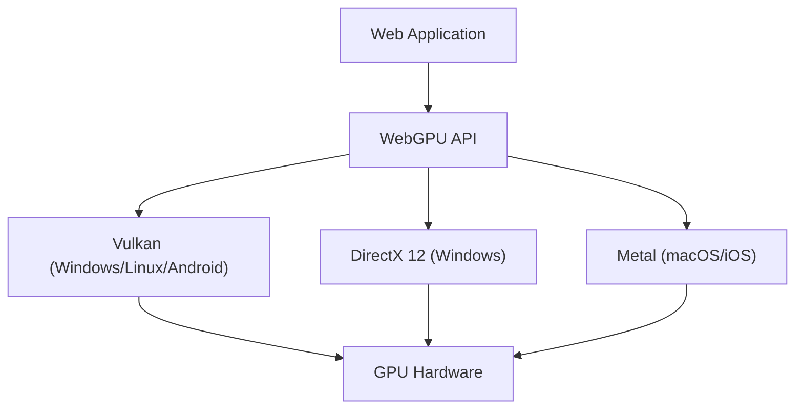

在过去的十几年里，在Web浏览器上实现丰富的3D图形和高级并行计算的技术取得了显著的发展。其核心一直是WebGL，但现在我们正处于一场巨大的范式转变之中。这就是“WebGPU”的出现。在本文中，我们将从架构和设计理念的角度，深入探讨WebGL的历史与局限性，以及WebGPU将如何释放现代GPU在浏览器中的真正力量。

## 1. WebGL的成就与暴露出的局限性

2011年发布的WebGL引发了一场革命，它无需插件即可在浏览器中利用硬件加速呈现3D图形。其基础是专为移动和嵌入式设备设计的“OpenGL ES”。

### 巨大状态机带来的开销
WebGL（以及OpenGL）面临的最大挑战在于其架构被设计为“巨大的全局状态机”。在进行渲染时，开发者需要逐一改变当前的状态（绑定的纹理、着色器程序、混合模式等），然后发出绘制调用（Draw Call）。

```javascript
// WebGL中典型的状态变更与渲染
gl.useProgram(program);
gl.bindBuffer(gl.ARRAY_BUFFER, positionBuffer);
gl.enableVertexAttribArray(positionLocation);
gl.vertexAttribPointer(positionLocation, 3, gl.FLOAT, false, 0, 0);
gl.drawArrays(gl.TRIANGLES, 0, 3);
```

这种方法乍看之下很直观，但在现代多核CPU环境中却造成了致命的性能瓶颈。状态的变更在CPU上伴随着繁重的验证（Validation）工作，因此绘制调用越多，CPU在图形驱动处理上的瓶颈就越严重，导致GPU处于空闲（等待）状态。这被称为“CPU限制（CPU Bound）”。

### 单线程模型的局限
此外，WebGL本质上是单线程运行的。虽然之后加入了使用Web Worker在另一个线程中进行处理的方案（如OffscreenCanvas等），但由于API本身的设计并不以多线程构建命令为前提，因此很难将复杂场景的渲染准备工作分散到多个CPU核心上。

## 2. 现代GPU架构与WebGPU的诞生

在2010年代中期，为了弥合硬件发展与API之间的差距，原生世界中不断涌现出新的图形API。例如Apple的“Metal”、Microsoft的“DirectX 12”以及Khronos Group的“Vulkan”。这些被称为“现代图形API”，旨在极大地减少驱动开销，并从多核CPU高效地向GPU发送命令。

WebGPU的设计正是为了将这些现代API的理念引入Web的安全沙盒环境中。它并不是特定原生API的简单封装，而是在提取Vulkan、Metal和DirectX 12的最大公约数功能的同时，针对Web进行了标准化。



## 3. WebGPU的革新：管线对象与命令缓冲区

让我们来看一下WebGPU解决WebGL开销的具体机制。

### 渲染管线（Render Pipeline）的预编译
在WebGPU中，并不是像WebGL那样在渲染前细碎地改变状态，而是将其作为“管线状态对象（Pipeline State Object: PSO）”进行预先定义。将着色器代码、顶点布局、混合设置等组合成一个不可变的对象。

```javascript
// WebGPU的管线创建（伪代码）
const pipeline = device.createRenderPipeline({
  layout: 'auto',
  vertex: {
    module: vertexShaderModule,
    entryPoint: 'main',
    buffers: [vertexLayout]
  },
  fragment: {
    module: fragmentShaderModule,
    entryPoint: 'main',
    targets: [{ format: presentationFormat }]
  }
});
```

由此，GPU驱动可以在渲染循环开始之前完成着色器的编译和状态的有效性验证。在渲染循环内，只需绑定预先创建的管线，极大地降低了CPU的负载。

### 命令缓冲区与多线程
WebGPU采用了“命令缓冲区（Command Buffer）”的概念。它不会直接将渲染命令发送给GPU，而是先将命令记录（编码）到内存中的缓冲区，最后一次性提交给GPU队列。

这种机制的最大优势在于可以在多个Web Worker线程中并行记录命令。即使是像广阔的开放世界游戏这样复杂的场景，也可以在不同的核心上并行构建地形、角色、特效的渲染命令，最终在主线程中合并并发送给GPU。

## 4. 计算管线（Compute Pipeline）与GPGPU的解放

WebGPU带来的最大变革是引入了独立于图形（渲染）的“计算管线（Compute Pipeline）”。

在WebGL中，GPGPU（GPU通用计算）是通过将数据写入纹理并使用片段着色器进行计算这种取巧的方式来实现的。然而，这只是勉强将图形管线用于计算，数据的输入输出效率低下，且无法访问GPU的共享内存（Shared Memory）等高级功能。

### 浏览器中的机器学习与物理模拟
WebGPU的计算着色器专为在GPU的数千个核心上超并行执行纯计算任务而设计。

* **加速机器学习推理**：诸如TensorFlow.js之类的库已经支持WebGPU后端，与WebGL后端相比，实现了几倍到几十倍的性能提升。在浏览器中运行LLM（大型语言模型）和实时视频分析达到了实用的水平。
* **复杂的粒子与物理演算**：可以在GPU上完整运行CPU无法处理的数十万粒子模拟、流体力学、布料模拟等，并将结果直接传递给渲染管线进行绘制。由于不发生CPU与GPU之间的数据传输（从VRAM回读到系统内存），因此展现出惊人的性能。

## 5. WGSL：专为Web打造的全新着色器语言

随着WebGPU的引入，着色器语言也从GLSL升级为“WGSL (WebGPU Shading Language)”。WGSL具有类似Rust的现代语法，并具备更严格的类型系统和安全性。

```wgsl
// 使用WGSL的简单计算着色器示例
@group(0) @binding(0) var<storage, read_write> data: array<f32>;

@compute @workgroup_size(64)
fn main(@builtin(global_invocation_id) global_id: vec3<u32>) {
    let index = global_id.x;
    data[index] = data[index] * 2.0; // 将数组每个元素乘以2的并行计算
}
```

在浏览器实现中，WGSL被设计为能够安全、快速地转换为Vulkan的SPIR-V、Metal的MSL、DirectX的HLSL等后端原生API所要求的着色器语言。

## 总结：Web平台的新视野

从WebGL向WebGPU的过渡不仅是API的更新，更意味着Web这一平台获得了不亚于原生应用的计算能力。摆脱了巨大状态机的束缚，获得了现代管线管理和通用计算能力，未来的Web浏览器将承担起更高级的3D游戏、专业的创意工具以及边缘AI执行环境的角色。

对开发者而言，其学习曲线可能比WebGL更陡峭，但其带来的性能收益是不可估量的。WebGPU的时代才刚刚开始。
