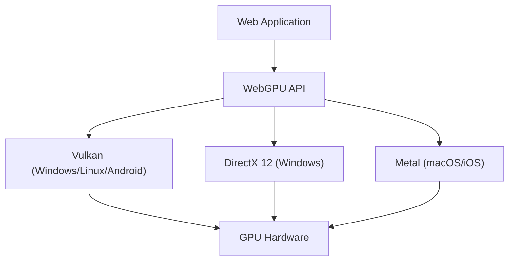

過去十幾年來，在網頁瀏覽器上實現豐富 3D 圖形與進階平行運算的技術，經歷了驚人的進化。雖然 WebGL 一直處於核心地位，但現在我們正處於一個重大的典範轉移之中，也就是「WebGPU」的誕生。本文將從架構與設計理念的角度，深入探討 WebGL 的歷史與限制，以及 WebGPU 如何將現代 GPU 的真正威力釋放至瀏覽器中。

## 1. WebGL 的貢獻與顯露出的限制

2011 年問世的 WebGL 引發了一場革命，在不需要外掛程式的情況下，為瀏覽器帶來了硬體加速的 3D 圖形。其基礎是專為行動裝置和嵌入式設備設計的「OpenGL ES」。

### 巨大狀態機所帶來的負擔（Overhead）

WebGL（以及 OpenGL）最大的挑戰在於其架構被設計為一個「巨大的全局狀態機」。在進行渲染時，開發者必須逐一更改目前的狀態（如綁定的紋理、著色器程式、混合模式等），同時發出繪製呼叫（Draw Call，繪製指令）。

```javascript
// WebGL 典型的狀態變更與繪製
gl.useProgram(program);
gl.bindBuffer(gl.ARRAY_BUFFER, positionBuffer);
gl.enableVertexAttribArray(positionLocation);
gl.vertexAttribPointer(positionLocation, 3, gl.FLOAT, false, 0, 0);
gl.drawArrays(gl.TRIANGLES, 0, 3);
```

這種方法乍看之下很直觀，但在現代的多核心 CPU 環境中卻產生了致命的效能瓶頸。狀態變更伴隨著 CPU 上繁重的驗證（Validation），因此隨著繪製呼叫的增加，CPU 在圖形驅動程式的處理上會成為瓶頸，導致 GPU 陷入閒置狀態（等待狀態）。這被稱為「CPU Bound」。

### 單執行緒模型的限制

此外，WebGL 本質上是單執行緒運作。儘管後來加入了使用 Web Worker 在其他執行緒進行處理的設計（例如 OffscreenCanvas），但 API 本身的設計並非以多執行緒建構指令為前提，這使得將複雜場景的繪製準備工作分散到多個 CPU 核心變得非常困難。

## 2. 現代 GPU 架構與 WebGPU 的誕生

2010 年代中期，為了彌補硬體進化與 API 之間的差距，原生世界中陸續誕生了新的圖形 API。包括 Apple 的「Metal」、Microsoft 的「DirectX 12」以及 Khronos Group 的「Vulkan」。這些被稱為「現代圖形 API」，旨在將驅動程式的負擔降至最低，並有效地將指令從多核心 CPU 傳送至 GPU。

WebGPU 旨在將這些現代 API 的理念引入網頁安全的沙盒環境中。它不僅僅是特定原生 API 的包裝（Wrapper），而是在吸收 Vulkan、Metal、DirectX 12 最大公約數功能的同時，專門為網頁進行了標準化。



## 3. WebGPU 的革新：管線物件與指令緩衝區（Command Buffer）

讓我們來看看 WebGPU 是如何透過具體機制解決 WebGL 負擔的。

### Render Pipeline（渲染管線）的預先編譯

在 WebGPU 中，不再像 WebGL 那樣在繪製前頻繁地更改狀態，而是將其預先定義為「管線狀態（Pipeline State Object: PSO）」。將著色器程式碼、頂點佈局、混合設定等整合為一個不可變的物件。

```javascript
// WebGPU 的管線建立（虛擬碼）
const pipeline = device.createRenderPipeline({
  layout: 'auto',
  vertex: {
    module: vertexShaderModule,
    entryPoint: 'main',
    buffers: [vertexLayout]
  },
  fragment: {
    module: fragmentShaderModule,
    entryPoint: 'main',
    targets: [{ format: presentationFormat }]
  }
});
```

這樣一來，GPU 驅動程式可以在繪製迴圈開始前完成著色器的編譯及狀態驗證。在繪製迴圈中，只需要綁定預先建立的管線即可，從而大幅降低 CPU 的負載。

### 指令緩衝區與多執行緒

WebGPU 採用了「指令緩衝區（Command Buffer）」的概念。它並非將繪製指令直接發送到 GPU，而是先將指令記錄（編碼）到記憶體上的緩衝區中，最後再一次性傳送到 GPU 的佇列中。

這種機制最大的優勢在於，可以在多個 Web Worker 執行緒中平行記錄指令。即使是像廣闊的開放世界遊戲這樣複雜的場景，也能夠在不同的核心上平行建構地形、角色、特效的繪製指令，最終在主執行緒中合併並傳送至 GPU。

## 4. Compute Pipeline 與 GPGPU 的解放

WebGPU 帶來的最大顛覆性改變，是引入了獨立於圖形（繪製）之外的「Compute Pipeline（運算管線）」。

在 WebGL 中，開發者會透過將資料寫入紋理，並利用片段著色器進行計算這種類似駭客的手法來執行 GPGPU（基於 GPU 的通用運算）。然而，這終究只是勉強將圖形管線挪作計算之用，資料的輸入輸出效率低下，且無法存取 GPU 所具備的共享記憶體（Shared Memory）等進階功能。

### 瀏覽器上的機器學習與物理模擬

WebGPU 的運算著色器（Compute Shader）是專為在 GPU 數以千計的核心上超平行執行純粹的計算任務而設計的。

* **機器學習推論的加速**：TensorFlow.js 等函式庫已支援 WebGPU 後端，與 WebGL 後端相比，效能提升了數倍至數十倍。這讓在瀏覽器上運作的 LLM（大型語言模型）與即時影像分析達到了實用的水準。
* **複雜的粒子與物理運算**：可以將 CPU 無法處理的數十萬個粒子模擬、流體力學、布料模擬等完全在 GPU 上完成，並將結果直接傳遞給 Render Pipeline 進行繪製。由於不會發生 CPU 與 GPU 之間的資料傳輸（從 VRAM 讀回系統記憶體），因此能發揮驚人的效能。

## 5. WGSL：專為網頁設計的全新著色器語言

隨著 WebGPU 的引入，著色器語言也從 GLSL 革新為「WGSL (WebGPU Shading Language)」。WGSL 擁有類似 Rust 的現代語法，並具備更嚴格的型別系統與安全性。

```wgsl
// 使用 WGSL 的簡單運算著色器範例
@group(0) @binding(0) var<storage, read_write> data: array<f32>;

@compute @workgroup_size(64)
fn main(@builtin(global_invocation_id) global_id: vec3<u32>) {
    let index = global_id.x;
    data[index] = data[index] * 2.0; // 將陣列的各元素乘以 2 的平行計算
}
```

WGSL 的設計目標是，在瀏覽器實作中，能夠安全且高速地轉換為後端原生 API 所需的著色器語言，例如 Vulkan 的 SPIR-V、Metal 的 MSL，以及 DirectX 的 HLSL。

## 總結：網頁平台的新境界

從 WebGL 轉向 WebGPU 不僅僅是 API 的更新，這意味著網頁平台獲得了不亞於原生應用程式的運算能力。擺脫了巨大狀態機的束縛，並獲得了現代的管線管理與通用運算能力後，未來的網頁瀏覽器將擔負起更進階的 3D 遊戲、專業創意工具，甚至是邊緣 AI 執行環境的角色。

對開發者而言，學習曲線或許比 WebGL 更加陡峭，但隨之而來的效能優勢是難以估量的。WebGPU 的時代，才剛要拉開序幕。
