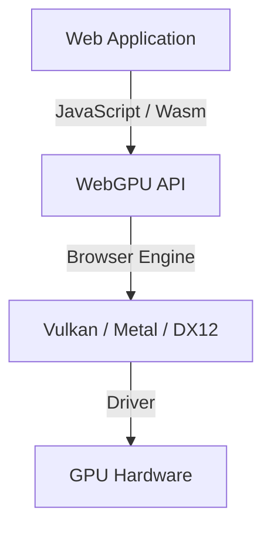

## 1. مقدمة: ما هي تقنية WebGPU؟

تُعدّ WebGPU واجهة برمجة تطبيقات (API) من الجيل التالي للرسومات والحوسبة تعمل داخل متصفحات الويب. وبينما كانت تقنية WebGL السابقة تركز بشكل أساسي على تصيير الرسومات ثلاثية الأبعاد (Rendering)، توفر WebGPU دعماً كاملاً لـ "مظللات الحوسبة" (Compute Shaders) التي تتيح الاستفادة المباشرة من قدرات الحوسبة المتوازية الهائلة لوحدة معالجة الرسومات (GPU)، إلى جانب التصيير الرسومي. ونتيجة لذلك، بات من الممكن تنفيذ معالجة الصور والمحاكاة الفيزيائية واستدلال نماذج تعلم الآلة (مثل النماذج اللغوية الكبيرة LLMs) بسرعة فائقة داخل المتصفح مباشرة.

تواصل رابطة الشبكة العالمية (W3C) تطوير المواصفات القياسية لهذه التقنية، حيث تعمل التحديثات الأخيرة على توحيد معايير الوصول إلى ميزات أكثر تقدماً في الـ GPU. في هذه المقالة، سنستعرض بالتفصيل الخلفية التاريخية لـ WebGPU، والاختلافات المعمارية بينها وبين WebGL، وقواعد لغة التظليل WGSL (WebGPU Shading Language)، بالإضافة إلى أمثلة عملية لاستدلال النماذج اللغوية الكبيرة داخل المتصفح باستخدام WebLLM.

## 2. التطور من WebGL إلى WebGPU والخلفية التاريخية

ظلت WebGL لفترة طويلة حجر الزاوية للرسومات ثلاثية الأبعاد على الويب. استندت WebGL إلى OpenGL ES ولعبت دوراً حيوياً في العديد من تطبيقات الويب لسنوات عديدة. ومع ذلك، ومع تطور العتاد، ظهرت "واجهات برمجة تطبيقات الرسومات الحديثة" مثل Vulkan و Metal (من Apple) و DirectX 12. تعمل هذه الواجهات الحديثة على تقليل الحمل الإضافي لوحدة المعالجة المركزية (CPU Overhead) بشكل كبير، وتتيح إنشاء الأوامر عبر خيوط معالجة متعددة (Multithreading)، مما يستخرج أقصى أداء ممكن من الـ GPU.

لقد أصبح تصميم WebGL قديماً ولم يعد قادراً على مواكبة المعماريات الحديثة لـ GPU. لذلك، صُممت WebGPU كواجهة برمجة تطبيقات جديدة تدمج مفاهيم Vulkan و Metal و DirectX 12، مما يتيح الوصول إلى أحدث إمكانيات الـ GPU مع الحفاظ على معايير الأمان الصارمة للويب.



## 3. معمارية WebGPU والاختلافات بينها وبين WebGL

يكمن الفرق الأكبر بين WebGPU و WebGL في إدارة الحالة (State Management) وطريقة تنفيذ الأوامر.

*   **التخلص من الحالة العامة (Global State)**: تعمل WebGL كآلة حالة ضخمة (State Machine)، حيث تؤثر تغييرات الحالة (مثل الربط أو الـ Binding) على المستوى العام. يتسبب ذلك بسهولة في حدوث أخطاء غير متوقعة ويشكل عنق زجاجة في الأداء. في المقابل، تقوم WebGPU ببناء كائنات خطوط الأنابيب مسبقاً (`RenderPipeline` / `ComputePipeline`) وإدارتها كحالات غير قابلة للتغيير (Immutable)، مما يقلل الحمل الإضافي.
*   **مخزن الأوامر المؤقت (Command Buffer)**: في WebGPU، لا تُنفذ أوامر التصيير أو الحوسبة بشكل فوري، بل تُسجل في مخزن أوامر مؤقت باستخدام مشفر الأوامر (`CommandEncoder`)، ثم تُرسل دفعة واحدة إلى قائمة الانتظار (Queue). يفتح هذا النهج المجال أمام المعالجة متعددة الخيوط لإنشاء الأوامر في خيوط معالجة منفصلة.
*   **دعم أصيل لمظللات الحوسبة (Compute Shaders)**: على الرغم من إمكانية إجراء بعض العمليات الحسابية المحدودة في WebGL2 (مثل Transform Feedback)، إلا أن WebGPU دمجت مظللات الحوسبة المصممة للأغراض العامة (GPGPU) في صميم بنيتها الأساسية منذ البداية.

## 4. أساسيات لغة التظليل WGSL (WebGPU Shading Language)

تعتمد WebGPU على WGSL كلغة للمظللات. تتميز هذه اللغة ببنية حديثة تجمع بين مزيج من GLSL و Rust، وهي عالية الأمان وسهلة التحليل النحوي (Parsing).

### مثال على مظلل الحوسبة (Compute Shader)

فيما يلي مثال بسيط لمظلل حوسبة يقوم بمضاعفة كل عنصر في المصفوفة:

```wgsl
@group(0) @binding(0) var<storage, read_write> data: array<f32>;

@compute @workgroup_size(64)
fn main(@builtin(global_invocation_id) global_id: vec3<u32>) {
    let index = global_id.x;
    if (index >= arrayLength(&data)) {
        return;
    }
    data[index] = data[index] * 2.0;
}
```

في هذا الكود، يصل المظلل إلى مخزن التخزين المؤقت (Storage Buffer) في الـ GPU، ويحسب الفهرس (Index) الخاص بكل خيط معالجة ليضاعف القيمة المقابلة في المصفوفة. يحدد المعامل `@workgroup_size` حجم وحدة التنفيذ المتوازي (Workgroup) في الـ GPU.

## 5. تعلم الآلة في المتصفح وWebLLM

يُعدّ تشغيل نماذج تعلم الآلة داخل المتصفح من أهم الثورات التي أحدثتها قدرات الحوسبة في WebGPU. في السابق، كان استدلال الذكاء الاصطناعي، الذي يتطلب عمليات مصفوفية ضخمة، يعتمد بالكامل على وحدات معالجة الرسومات في الخوادم (Servers). ولكن مع WebGPU، أصبح بالإمكان الاستفادة من الـ GPU الخاص بجهاز العميل (جهاز المستخدم).

### آلية عمل WebLLM

مشروع WebLLM هو مشروع يستخدم تقنيات المترجمات (مثل Apache TVM) لترجمة وتجميع النماذج اللغوية الكبيرة (LLMs) مثل Llama و Vicuna إلى WebGPU (WGSL) لتشغيلها مباشرة داخل المتصفح.

1.  **تكميم النماذج (Quantization)**: للتعامل مع أحجام النماذج التي تتراوح بين عدة غيغابايت وعشرات الغيغابايت داخل المتصفح، يتم تكميم النماذج إلى دقة مثل INT4، مما يوفر نطاق النطاق الترددي للذاكرة (Memory Bandwidth).
2.  **توليد كيرنل WGSL (Kernel Generation)**: توليد مظللات حوسبة WGSL محسنة للجهاز المستهدف لتنفيذ عمليات مثل ضرب المصفوفات (GEMM).
3.  **الاستدلال داخل المتصفح**: يتم توليد النصوص دون أي اتصال بالخادم وبشكل غير متصل بالإنترنت تماماً (Offline). يوفر ذلك حماية تامة للخصوصية ويقلل تكاليف الخوادم بدرجة كبيرة.

## 6. أمثلة عملية لمعالجة الصور والحوسبة المتوازية

تُظهر WebGPU أيضاً كفاءة فائقة في تصفية الصور في الوقت الفعلي (Real-time Filtering) والمحاكاة الفيزيائية. إذ يمكن تفريغ العمليات الحسابية المعقدة التي يصعب على الـ CPU معالجتها إلى الـ GPU، مثل محاكاة ملايين الجسيمات (Particles).


باستخدام مظللات الحوسبة، يمكن معالجة المرشحات المعقدة التي تعتمد على العلاقات المتبادلة بين البكسلات (مثل التمويه الغاوسي متعدد المراحل Multi-pass Gaussian Blur) بسرعات فائقة.

## 7. الآفاق المستقبلية لمواصفات W3C

تتم صياغة وتطوير مواصفات WebGPU من قِبل مجموعة عمل "GPU for the Web" التابعة لـ W3C. وبعد إطلاق الإصدار الأولي (WebGPU 1.0) في المتصفحات الرئيسية، لا تزال النقاشات جارية لإضافة ميزات متقدمة مثل:

*   **المجموعات الفرعية (Subgroups)**: ميزة تتيح مشاركة البيانات وإجراء العمليات الحسابية بسرعة فائقة بين الخيوط داخل مجموعة الخيوط ذاتها، مما يسرع عمليات الاختزال (Reduction) في تعلم الآلة بشكل ملحوظ.
*   **تتبع الأشعة (Ray Tracing)**: دعم واجهات برمجة تطبيقات تتبع الأشعة المسرّعة عتادياً، مما يتيح رسومات أكثر واقعية ودقة.
*   **التكامل مع تعلم الآلة (WebNN)**: التكامل مع واجهة WebNN API لربط مسرعات الذكاء الاصطناعي المخصصة في نظام التشغيل (NPU) مع الـ GPU، مما يوفر بيئة استدلال مثالية ومحسنة.

## 8. الخاتمة

تُمثل WebGPU تقنية ثورية تنقل "القوة الحقيقية لوحدات معالجة الرسومات الحديثة" إلى عالم متصفحات الويب. فإلى جانب الارتقاء بجودة الرسومات ثلاثية الأبعاد، تفتح الحوسبة المتوازية عبر مظللات الحوسبة ونقل استدلال الذكاء الاصطناعي إلى جانب العميل آفاقاً لا حصر لها لتطبيقات الويب.

على الرغم من أن المطورين بحاجة إلى تعلم مفاهيم جديدة (مثل خطوط الأنابيب، ومخازن الأوامر المؤقتة، ولغة WGSL)، إلا أن المكاسب في الأداء الخارق والقدرات التعبيرية تستحق هذا الجهد التعليمي تماماً. لا شك أن منظومة WebGPU مستمرة في التطور وتعد بمستقبل واعد للغاية.
