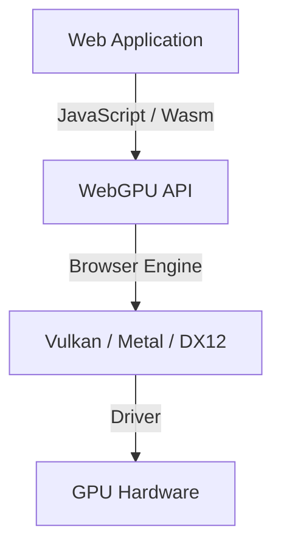

## 1. Einleitung: Was ist WebGPU?

WebGPU ist eine Next-Generation-Grafik- und Compute-API für Webbrowser. Während das traditionelle WebGL hauptsächlich auf das Rendering von 3D-Grafiken spezialisiert war, bietet WebGPU nicht nur Rendering-Funktionen, sondern auch vollständige Unterstützung für „Compute-Shader“, mit denen sich die enorme parallele Rechenleistung von GPUs direkt nutzen lässt. Dadurch wird es möglich, Bildverarbeitung, physikalische Simulationen und die Inferenz von Machine-Learning-Modellen (wie z. B. LLMs) direkt und hochperformant im Browser auszuführen.

Die Spezifikation wird vom W3C vorangetrieben, und in jüngsten Updates wird der Zugriff auf fortgeschrittenere GPU-Funktionen zunehmend standardisiert. In diesem Artikel beleuchten wir ausführlich die historischen Hintergründe von WebGPU, die architektonischen Unterschiede zu WebGL, die grundlegende Syntax von WGSL (WebGPU Shading Language) sowie praktische Beispiele wie die clientseitige Inferenz großer Sprachmodelle (LLMs) mithilfe von WebLLM.

## 2. Evolution von WebGL zu WebGPU und historischer Hintergrund

Für 3D-Grafiken im Web war WebGL lange Zeit der unangefochtene Standard. WebGL basiert auf OpenGL ES und bildete über viele Jahre das Fundament unzähliger Webanwendungen. Mit der Weiterentwicklung der Hardware entstanden jedoch „moderne Grafik-APIs“ wie Vulkan, Metal (Apple) und DirectX 12. Diese modernen APIs reduzieren den CPU-Overhead erheblich und ermöglichen die Command-Erstellung über mehrere Threads hinweg, wodurch die Leistung moderner GPUs voll ausgeschöpft werden kann.

Das Design von WebGL ist in die Jahre gekommen und passt nicht mehr optimal zu modernen GPU-Architekturen. WebGPU wurde daher als neue API konzipiert, die die Kernkonzepte von Vulkan, Metal und DirectX 12 vereint und gleichzeitig die Sicherheitsanforderungen des Webs wahrt, um Zugriff auf moderne GPU-Funktionalitäten zu gewähren.



## 3. WebGPU-Architektur und Unterschiede zu WebGL

Der größte Unterschied zwischen WebGPU und WebGL liegt im State Management (Zustandsverwaltung) und in der Art und Weise, wie Befehle ausgeführt werden.

*   **Beseitigung globaler Zustände**: WebGL fungiert als gigantische State Machine, bei der Zustandsänderungen (wie Bindings) globale Auswirkungen haben. Dies führt leicht zu unvorhersehbaren Fehlern und stellt einen Leistungsengpass dar. WebGPU hingegen erstellt Pipeline-Objekte (`RenderPipeline` / `ComputePipeline`) im Voraus und verwaltet sie als unveränderliche (immutable) Zustände, was den Overhead drastisch reduziert.
*   **Befehlspuffer (Command Buffer)**: Anstatt Zeichen- oder Rechenbefehle sofort auszuführen, werden diese in WebGPU mittels eines Command Encoders in einem Command Buffer aufgezeichnet und anschließend gesammelt an eine Queue übermittelt. Dies ebnet den Weg für Multithreading, bei dem Befehle parallel auf separaten Threads zusammengestellt werden können.
*   **Native Unterstützung für Compute-Shader**: Zwar bot bereits WebGL2 begrenzte Möglichkeiten für Berechnungen (z. B. über Transform Feedback), doch WebGPU integriert Compute-Shader für universelle Berechnungen (GPGPU) von Grund auf direkt in sein Design.

## 4. Grundlagen von WGSL (WebGPU Shading Language)

Als Shader-Sprache setzt WebGPU auf WGSL. Sie zeichnet sich durch eine moderne Syntax aus, die an eine Mischung aus GLSL und Rust erinnert, hohe Sicherheit bietet und einfach zu parsen ist.

### Beispiel für einen Compute-Shader

Hier ist ein einfaches Beispiel für einen Compute-Shader, der jedes Element eines Arrays verdoppelt:

```wgsl
@group(0) @binding(0) var<storage, read_write> data: array<f32>;

@compute @workgroup_size(64)
fn main(@builtin(global_invocation_id) global_id: vec3<u32>) {
    let index = global_id.x;
    if (index >= arrayLength(&data)) {
        return;
    }
    data[index] = data[index] * 2.0;
}
```

In diesem Code greift die GPU auf einen Storage Buffer zu, berechnet pro Thread den entsprechenden Array-Index und verdoppelt den Wert. `@workgroup_size` definiert die Größe der parallelen Ausführungseinheit (Workgroup) auf der GPU.

## 5. Maschinelles Lernen im Browser und WebLLM

Eine der größten Revolutionen, die die Compute-Funktionen von WebGPU ermöglichen, ist die Ausführung von Machine-Learning-Modellen direkt im Browser. Bislang war die KI-Inferenz, die riesige Matrixoperationen erfordert, auf serverseitige GPUs angewiesen. Dank WebGPU kann nun die GPU des Clients (des Endgeräts des Nutzers) direkt beansprucht werden.

### Funktionsweise von WebLLM

WebLLM ist ein Projekt, das Compiler-Technologien wie Apache TVM nutzt, um große Sprachmodelle (LLMs) wie Llama oder Vicuna für WebGPU (WGSL) zu kompilieren und direkt im Browser auszuführen.

1.  **Quantisierung des Modells**: Um Modellgrößen von mehreren Gigabyte bis hin zu Dutzenden von Gigabyte im Browser handhaben zu können, werden die Modelle z. B. auf INT4 quantisiert, was die erforderliche Speicherbandbreite erheblich reduziert.
2.  **Generierung von WGSL-Kernels**: Operationen wie Matrixmultiplikationen (GEMM) werden als optimierte WGSL-Compute-Shader für das jeweilige Zielgerät generiert.
3.  **Inferenz im Browser**: Die Textgenerierung erfolgt vollständig offline und ohne Kommunikation mit einem Server. Dadurch bleibt die Privatsphäre gewahrt und Serverkosten werden eliminiert.

## 6. Praxisbeispiele für Bildverarbeitung und parallele Berechnungen

WebGPU spielt seine Stärken auch bei Echtzeit-Bildfiltern und physikalischen Simulationen voll aus. Rechenintensive Aufgaben, die eine CPU überfordern würden – wie etwa Simulationen mit Millionen von Partikeln –, können problemlos auf die GPU ausgelagert werden.


Durch den Einsatz von Compute-Shadern lassen sich auch komplexe Filter mit Abhängigkeiten zwischen Pixeln (wie z. B. ein mehrstufiger Gaußscher Weichzeichner / Multi-Pass Gaussian Blur) extrem performant verarbeiten.

## 7. Zukunftsaussichten der W3C-Spezifikation

Die WebGPU-Spezifikation wird von der W3C-Arbeitsgruppe „GPU for the Web“ vorangetrieben. Nach dem Release der ersten Version (WebGPU 1.0) in den gängigen Browsern stehen bereits Erweiterungen und neue Features zur Diskussion:

*   **Subgroups**: Ermöglicht den schnellen Datenaustausch und gemeinsame Operationen zwischen Threads innerhalb einer Thread-Gruppe. Dadurch werden beispielsweise Reduktionsoperationen (Reduction) im maschinellen Lernen drastisch beschleunigt.
*   **Raytracing**: Unterstützung für hardwarebeschleunigte Raytracing-APIs, um noch realistischere Grafiken zu ermöglichen.
*   **Integration mit Machine Learning (WebNN)**: In Kombination mit der WebNN-API lässt sich eine optimale Ausführungsumgebung schaffen, die dedizierte KI-Beschleuniger des Betriebssystems (NPUs) nahtlos mit GPUs verbindet.

## 8. Fazit

WebGPU ist eine revolutionäre Technologie, die die wahre Leistungsfähigkeit moderner GPUs in die Web-Welt bringt. Neben der gesteigerten Qualität von 3D-Grafiken eröffnen parallele Berechnungen mittels Compute-Shadern und die Verlagerung von KI-Inferenz auf die Client-Seite grenzenlose Möglichkeiten für moderne Webanwendungen.

Auch wenn Entwickler neue Konzepte wie Pipelines, Command Buffer und WGSL erlernen müssen, wird dieser Lernaufwand durch eine überwältigende Performance und enorme Ausdruckskraft belohnt. Das WebGPU-Ökosystem entwickelt sich rasant weiter und bleibt eines der spannendsten Technologiefelder der kommenden Jahre.
