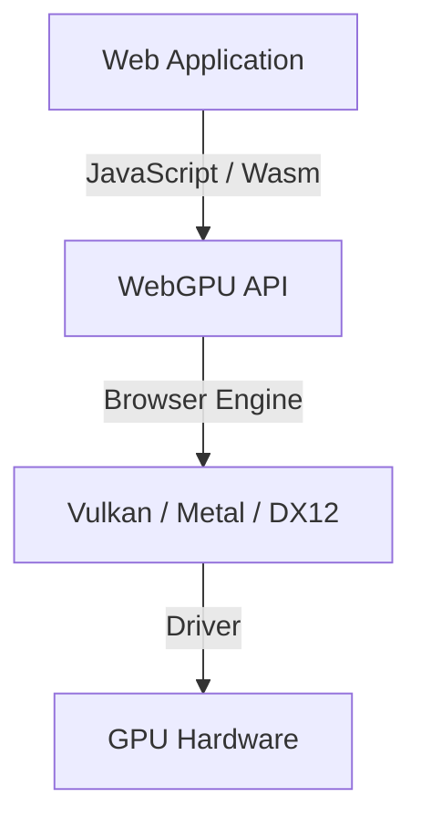
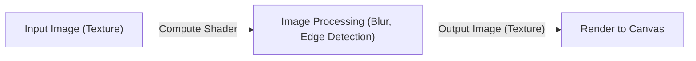

## 1. Introduction: What is WebGPU?

WebGPU is the next-generation graphics and compute API that runs within web browsers. While traditional WebGL was primarily specialized in 3D graphics rendering, WebGPU provides full support not only for rendering, but also for "compute shaders" that directly leverage the powerful parallel computing capabilities of the GPU. This makes it possible to execute image processing, physics simulations, and machine learning model (such as LLMs) inference at high speeds directly in the browser.

Specification work is being advanced by the W3C, with recent updates standardizing access to more advanced GPU features. In this article, we will explain in detail everything from the historical background of WebGPU and its architectural differences from WebGL, to the basic syntax of WGSL (WebGPU Shading Language), and practical examples of running large language model (LLM) inference in the browser using WebLLM.

## 2. Evolution from WebGL to WebGPU and Historical Background

For a long time, WebGL was the leading technology for 3D graphics on the web. Based on OpenGL ES, WebGL served many web applications over the years. However, alongside advancements in hardware, "modern graphics APIs" such as Vulkan, Metal (Apple), and DirectX 12 emerged. These modern APIs draw out maximum performance from the GPU by dramatically reducing CPU overhead and enabling multithreaded command recording.

The design of WebGL was legacy and struggled to adapt to modern GPU architectures. Consequently, WebGPU was designed as a new API that unifies concepts from Vulkan, Metal, and DirectX 12, providing access to modern GPU capabilities while maintaining web safety and security.



## 3. WebGPU Architecture and Differences from WebGL

The biggest differences between WebGPU and WebGL lie in state management and command execution methods.

*   **Elimination of Global State**: WebGL is a massive state machine where state changes (such as binding) have global effects. This can easily lead to unpredictable bugs and performance bottlenecks. In contrast, WebGPU creates pipeline objects (`RenderPipeline` / `ComputePipeline`) in advance and manages them as immutable state, thereby reducing overhead.
*   **Command Buffers**: In WebGPU, draw and compute commands are not executed immediately. Instead, they are recorded into a command buffer using a command encoder and then submitted in batch to the queue. This opens the path to multithreaded processing, where commands can be constructed across separate threads.
*   **Native Support for Compute Shaders**: Although WebGL 2 offered limited computation capabilities (such as Transform Feedback), WebGPU was designed from the ground up to support compute shaders for general-purpose computing.

## 4. Fundamentals of WGSL (WebGPU Shading Language)

WebGPU adopts WGSL as its shading language. Featuring modern syntax that feels like a blend of GLSL and Rust, it is characterized by high safety and ease of parsing.

### Compute Shader Example

Below is a simple example of a compute shader that doubles each element of an array:

```wgsl
@group(0) @binding(0) var<storage, read_write> data: array<f32>;

@compute @workgroup_size(64)
fn main(@builtin(global_invocation_id) global_id: vec3<u32>) {
    let index = global_id.x;
    if (index >= arrayLength(&data)) {
        return;
    }
    data[index] = data[index] * 2.0;
}
```

In this code, the shader accesses the GPU storage buffer, calculates the array index per thread, and doubles the value. `@workgroup_size` defines the size of the GPU's unit of parallel execution (workgroup).

## 5. Machine Learning in the Browser and WebLLM

One of the most revolutionary transformations brought about by WebGPU's compute capabilities is running machine learning models in the browser. Traditionally, AI inference requiring massive matrix operations depended on server-side GPUs. WebGPU enables these computations to leverage the client's (the user's device) GPU instead.

### How WebLLM Works

WebLLM is a project that compiles large language models (LLMs) such as Llama and Vicuna into WebGPU (WGSL) using compiler technologies like Apache TVM, allowing them to run directly in the browser.

1.  **Model Quantization**: To handle model sizes ranging from several gigabytes to tens of gigabytes in the browser, models are quantized to formats like INT4 to conserve memory bandwidth.
2.  **WGSL Kernel Generation**: Operations such as General Matrix Multiply (GEMM) are generated as WGSL compute shaders optimized for the target device.
3.  **In-Browser Inference**: Text generation is executed completely offline without communicating with a server. This protects user privacy and reduces server operational costs.

## 6. Practical Examples: Image Processing and Parallel Computation

WebGPU also demonstrates its power in real-time image filtering and physics simulations. Intensive computations that cannot be handled by the CPU—such as simulations moving millions of particles—can be offloaded to the GPU.



By using compute shaders, complex filters that take inter-pixel dependencies into account (such as multi-pass Gaussian blur) can be processed at high speed.

## 7. Future Outlook for the W3C Specification

WebGPU specification development is being led by the W3C "GPU for the Web" Working Group. Even after the initial release (WebGPU 1.0) across major browsers, additions of new features such as the following continue to be discussed:

*   **Subgroups**: A feature that enables threads within a threadgroup to quickly share data and perform operations without passing through shared memory. This significantly accelerates operations like reductions in machine learning.
*   **Ray Tracing**: Support for hardware-accelerated ray tracing APIs, enabling even more realistic graphics rendering.
*   **Integration with Machine Learning (WebNN)**: Combining with the WebNN API to build an optimal inference execution environment that coordinates dedicated AI accelerators (NPUs) and GPUs provided by the OS.

## 8. Conclusion

WebGPU is a revolutionary technology bringing the true power of modern GPUs to the web browser. Beyond elevating 3D graphics quality, parallel computation with compute shaders and transitioning AI inference to the client side vastly expand the horizons of web applications.

While developers need to learn new concepts—such as pipelines, command buffers, and WGSL—the investment is well rewarded with overwhelming performance and expressive power. The continuously evolving WebGPU ecosystem is definitely something to keep a close eye on.
