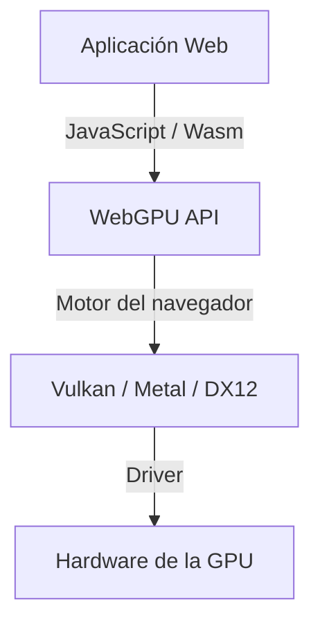
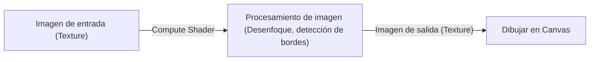

## 1. Introducción: ¿Qué es WebGPU?

WebGPU es la API de gráficos y cómputo de próxima generación que opera en los navegadores web. Mientras que el tradicional WebGL se enfocaba principalmente en el renderizado de gráficos 3D, WebGPU no solo permite el renderizado, sino que ofrece compatibilidad total con "compute shaders" (shaders de cómputo), los cuales aprovechan directamente la potente capacidad de cálculo en paralelo de las GPUs. Gracias a esto, ahora es posible ejecutar procesamiento de imágenes, simulaciones físicas e inferencia de modelos de machine learning (como LLMs) a alta velocidad dentro del navegador.

El W3C está llevando a cabo el desarrollo de sus especificaciones, y en las actualizaciones recientes se están estandarizando accesos a funciones de GPU más avanzadas. En este artículo, explicaremos en detalle desde el trasfondo histórico de WebGPU y sus diferencias arquitectónicas con WebGL, hasta la sintaxis básica de WGSL (WebGPU Shading Language) y ejemplos prácticos de inferencia de modelos de lenguaje grandes (LLM) en el navegador usando WebLLM.

## 2. Evolución y trasfondo histórico: De WebGL a WebGPU

Durante mucho tiempo, WebGL fue el protagonista indiscutible de los gráficos 3D en la web. Basado en OpenGL ES, prestó servicio a una gran cantidad de aplicaciones web a lo largo de los años. Sin embargo, con la evolución del hardware, surgieron "APIs gráficas modernas" como Vulkan, Metal (Apple) y DirectX 12. Estas APIs modernas reducen drásticamente la sobrecarga de la CPU (CPU overhead) y permiten la construcción multihilo de comandos, exprimiendo al máximo el rendimiento de la GPU.

El diseño de WebGL ha quedado desfasado y ya no encaja de forma óptima con la arquitectura de estas GPUs modernas. Por ello, se diseñó WebGPU como una nueva API que unifica los conceptos de Vulkan, Metal y DirectX 12, permitiendo el acceso a las funciones más avanzadas de la GPU manteniendo la seguridad de la web.



## 3. Arquitectura de WebGPU y diferencias con WebGL

La principal diferencia entre WebGPU y WebGL radica en la gestión del estado y la forma en que se ejecutan los comandos.

*   **Eliminación del estado global**: WebGL funciona como una gigantesca máquina de estados, donde cualquier cambio de estado (como los enlaces o bindings) tiene un impacto global. Esto suele generar errores impredecibles y convertirse en un cuello de botella de rendimiento. En cambio, WebGPU preconstruye objetos de pipeline (`RenderPipeline` / `ComputePipeline`) y los gestiona como estados inmutables, lo que reduce la sobrecarga.
*   **Búferes de comandos**: En WebGPU, los comandos de renderizado o cómputo no se ejecutan de inmediato; en su lugar, se graban en un búfer de comandos mediante un codificador de comandos (command encoder) y finalmente se envían juntos a la cola. Esto abre el camino al procesamiento multihilo, permitiendo construir comandos en hilos independientes.
*   **Soporte nativo para shaders de cómputo**: Aunque en WebGL2 era posible realizar cálculos limitados (mediante Transform Feedback, etc.), WebGPU integra desde su diseño inicial los shaders de cómputo orientados a propósitos de cómputo general (GPGPU).

## 4. Fundamentos de WGSL (WebGPU Shading Language)

WebGPU adopta WGSL como su lenguaje de sombreado (shader language). Cuenta con una sintaxis moderna que recuerda a una mezcla entre GLSL y Rust, y destaca por su alta seguridad y facilidad de parseo.

### Ejemplo de un shader de cómputo

A continuación, se muestra un ejemplo simple de un compute shader que duplica cada elemento de un array.

```wgsl
@group(0) @binding(0) var<storage, read_write> data: array<f32>;

@compute @workgroup_size(64)
fn main(@builtin(global_invocation_id) global_id: vec3<u32>) {
    let index = global_id.x;
    if (index >= arrayLength(&data)) {
        return;
    }
    data[index] = data[index] * 2.0;
}
```

En este código, se accede al storage buffer de la GPU, se calcula el índice del array para cada hilo y se duplica su valor. `@workgroup_size` define el tamaño de la unidad de ejecución en paralelo de la GPU (el grupo de trabajo o workgroup).

## 5. Machine Learning en el navegador y WebLLM

Una de las mayores revoluciones que aportan las funciones de cómputo de WebGPU es la ejecución de modelos de machine learning directamente en el navegador. Tradicionalmente, la inferencia de IA que requería operaciones matriciales masivas dependía de las GPUs en el servidor; sin embargo, WebGPU permite aprovechar la GPU del cliente (el dispositivo del usuario).

### Cómo funciona WebLLM

WebLLM es un proyecto que utiliza tecnologías de compilación como Apache TVM para compilar modelos de lenguaje grandes (LLMs) como Llama o Vicuna a WebGPU (WGSL) y ejecutarlos en el navegador.

1.  **Cuantización del modelo**: Para manejar en el navegador modelos con tamaños de varios gigabytes o decenas de gigabytes, se realiza una cuantización a formatos como INT4, ahorrando ancho de banda de memoria.
2.  **Generación de kernels WGSL**: Las operaciones como la multiplicación de matrices (GEMM) se generan como compute shaders en WGSL optimizados para el dispositivo de destino.
3.  **Inferencia dentro del navegador**: La generación de texto se lleva a cabo de forma totalmente offline, sin comunicarse con ningún servidor. Esto protege la privacidad y reduce los costes del servidor.

## 6. Casos prácticos de procesamiento de imágenes y cálculo en paralelo

WebGPU también demuestra su potencia en el filtrado de imágenes en tiempo real y en simulaciones físicas. Es posible descargar a la GPU cálculos que la CPU no puede procesar con soltura, como simulaciones con millones de partículas.



Al utilizar compute shaders, también es posible procesar a gran velocidad filtros complejos que tienen en cuenta dependencias entre píxeles (por ejemplo, un desenfoque gaussiano de múltiples pasadas).

## 7. Perspectivas futuras de la especificación del W3C

El desarrollo de las especificaciones de WebGPU corre a cargo del grupo de trabajo "GPU for the Web" del W3C. Incluso tras el lanzamiento de la versión inicial (WebGPU 1.0) en los principales navegadores, se siguen debatiendo nuevas características como las siguientes:

*   **Subgroups**: Función para compartir y calcular datos a alta velocidad entre hilos dentro de un mismo grupo de hilos. Esto acelera notablemente operaciones como la reducción (reduction) en machine learning.
*   **Ray Tracing**: Soporte para APIs de trazado de rayos (ray tracing) acelerado por hardware, lo que permite lograr gráficos aún más realistas.
*   **Integración con Machine Learning (WebNN)**: Al combinarse con la API WebNN, se busca construir un entorno óptimo de ejecución para inferencia, coordinando la GPU con aceleradores de IA dedicados del sistema operativo (NPU).

## 8. Conclusión

WebGPU es una tecnología revolucionaria que lleva el "verdadero poder de las GPUs modernas" al mundo del navegador. Más allá de la mejora en la calidad de los gráficos 3D, el cálculo en paralelo mediante compute shaders y el traslado de la inferencia de IA al lado del cliente expanden infinitamente las posibilidades de las aplicaciones web.

Aunque los desarrolladores deben familiarizarse con nuevos conceptos (pipelines, búferes de comandos, WGSL), el costo de aprendizaje se ve ampliamente recompensado con un rendimiento y una expresividad visual impresionantes. Sin duda, habrá que seguir muy de cerca la continua evolución del ecosistema de WebGPU.
