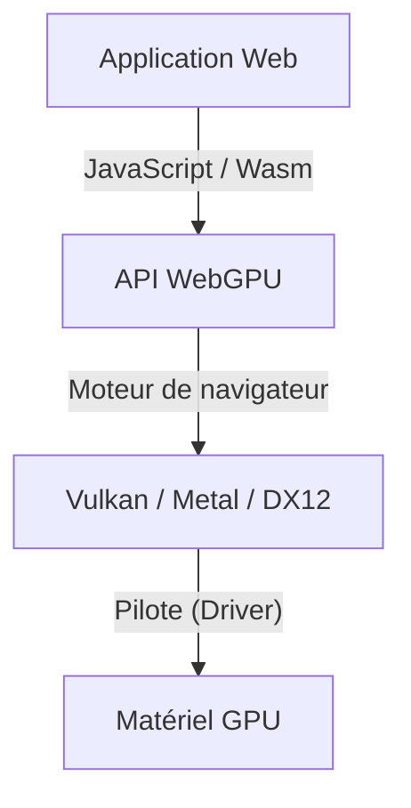
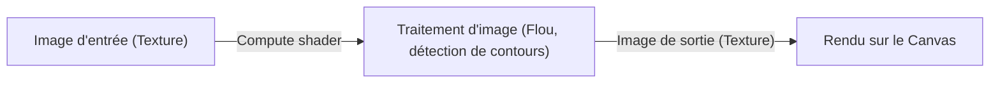

## 1. Introduction : Qu'est-ce que WebGPU ?

WebGPU est une API graphique et de calcul de nouvelle génération conçue pour le web. Alors que WebGL se concentrait principalement sur le rendu de graphismes 3D, WebGPU va bien au-delà : il offre une prise en charge complète des « compute shaders » (shaders de calcul), permettant d'exploiter directement la puissante capacité de calcul parallèle des GPU. Cela permet d'exécuter à grande vitesse dans le navigateur des tâches telles que le traitement d'images, les simulations physiques ou encore l'inférence de modèles d'apprentissage automatique (comme les LLM).

Sous l'égide du W3C, la rédaction des spécifications progresse continuellement, et les mises à jour récentes standardisent l'accès à des fonctionnalités GPU toujours plus avancées. Dans cet article, nous explorerons le contexte historique de WebGPU, ses différences architecturales avec WebGL, la syntaxe de base de WGSL (WebGPU Shading Language), ainsi qu'un cas pratique d'inférence de grands modèles de langage (LLM) dans le navigateur à l'aide de WebLLM.

## 2. De WebGL à WebGPU : évolution et contexte historique

Pendant de nombreuses années, WebGL a régné en maître sur les graphismes 3D sur le web. Basé sur OpenGL ES, il a alimenté d'innombrables applications web au fil du temps. Cependant, avec l'évolution du matériel, des « API graphiques modernes » telles que Vulkan, Metal (Apple) et DirectX 12 ont vu le jour. Ces API modernes réduisent considérablement la charge CPU (overhead) et permettent la création de commandes en multithread, libérant ainsi tout le potentiel des GPU.

L'architecture vieillissante de WebGL ne correspond plus aux architectures GPU contemporaines. C'est dans ce contexte que WebGPU a été conçu : une nouvelle API unifiant les concepts de Vulkan, Metal et DirectX 12, offrant un accès aux fonctionnalités GPU modernes tout en garantissant la sécurité inhérente au web.



## 3. Architecture de WebGPU et différences avec WebGL

La différence majeure entre WebGPU et WebGL réside dans la gestion de l'état et le modèle d'exécution des commandes.

*   **Élimination de l'état global** : WebGL est une vaste machine à états où chaque modification (telle qu'une liaison de ressource) a un impact global. Cette approche est source de bugs imprévisibles et constitue un goulot d'étranglement pour les performances. À l'inverse, WebGPU préconstruit des objets de pipeline (`RenderPipeline` / `ComputePipeline`) et les gère sous forme d'états immuables, ce qui réduit considérablement l'overhead.
*   **Tampons de commandes (Command Buffers)** : Au lieu d'exécuter immédiatement les commandes de rendu ou de calcul, WebGPU utilise des encodeurs de commandes pour les enregistrer dans un tampon de commandes (command buffer), avant de les soumettre collectivement à une file d'attente (queue). Cette séparation ouvre la voie à la construction de commandes sur plusieurs threads.
*   **Prise en charge native des compute shaders** : Bien que WebGL 2 autorisait des calculs limités (via les *Transform Feedbacks*, par exemple), WebGPU intègre dès sa conception les shaders de calcul destinés aux calculs généralistes (GPGPU).

## 4. Les fondamentaux de WGSL (WebGPU Shading Language)

WebGPU utilise WGSL comme langage de shading dédié. Doté d'une syntaxe moderne rappelant un mélange entre GLSL et Rust, il se distingue par sa sécurité élevée et sa facilité d'analyse (parsing).

### Exemple de compute shader

Voici un exemple simple de compute shader qui multiplie chaque élément d'un tableau par deux :

```wgsl
@group(0) @binding(0) var<storage, read_write> data: array<f32>;

@compute @workgroup_size(64)
fn main(@builtin(global_invocation_id) global_id: vec3<u32>) {
    let index = global_id.x;
    if (index >= arrayLength(&data)) {
        return;
    }
    data[index] = data[index] * 2.0;
}
```

Ce code accède à un tampon de stockage (storage buffer) sur le GPU, calcule l'index du tableau pour chaque thread et en double la valeur. L'attribut `@workgroup_size` définit la taille de l'unité d'exécution parallèle (le groupe de travail ou workgroup) sur le GPU.

## 5. Apprentissage automatique dans le navigateur et WebLLM

L'une des plus grandes révolutions apportées par les capacités de calcul de WebGPU est l'exécution de modèles de machine learning directement dans le navigateur. Jusqu'à présent, l'inférence IA nécessitant d'importantes opérations matricielles dépendait de GPU côté serveur ; avec WebGPU, il devient possible d'exploiter pleinement le GPU client (l'appareil de l'utilisateur).

### Fonctionnement de WebLLM

WebLLM est un projet qui utilise des technologies de compilation telles qu'Apache TVM pour compiler de grands modèles de langage (LLM) comme Llama ou Vicuna vers WebGPU (WGSL) afin de les exécuter dans le navigateur.

1.  **Quantification des modèles** : Pour manipuler dans le navigateur des modèles dont la taille varie de plusieurs gigaoctets à plusieurs dizaines de gigaoctets, les poids sont quantifiés (par exemple en INT4), ce qui économise de la bande passante mémoire.
2.  **Génération de kernels WGSL** : Les opérations telles que les multiplications matricielles (GEMM) sont compilées sous forme de compute shaders WGSL optimisés pour le matériel cible.
3.  **Inférence dans le navigateur** : La génération de texte s'effectue entièrement hors ligne, sans communication avec un serveur. Cela garantit le respect de la confidentialité des données et élimine les coûts d'infrastructure serveur.

## 6. Cas d'usage : traitement d'images et calcul parallèle

WebGPU démontre également toute sa puissance dans le filtrage d'images en temps réel et les simulations physiques. Des calculs impossibles à traiter efficacement sur CPU, comme l'animation de millions de particules, peuvent être déchargés sur le GPU.



Grâce aux compute shaders, même des filtres complexes prenant en compte les dépendances entre pixels (par exemple, un flou gaussien multipasse) peuvent être traités à très grande vitesse.

## 7. Perspectives futures des spécifications du W3C

Les spécifications de WebGPU sont élaborées par le groupe de travail « GPU for the Web » du W3C. Après le déploiement de la version initiale (WebGPU 1.0) dans les principaux navigateurs, plusieurs fonctionnalités majeures sont déjà en cours de discussion et de développement :

*   **Subgroups (Sous-groupes)** : Partage et calcul ultra-rapides de données entre les threads au sein d'un même groupe d'exécution. Cela accélère considérablement des opérations telles que les réductions en apprentissage automatique.
*   **Ray Tracing (Lancer de rayons)** : Prise en charge des API de lancer de rayons avec accélération matérielle, pour des graphismes encore plus photoréalistes.
*   **Intégration avec le machine learning (WebNN)** : En combinaison avec l'API WebNN, création d'un environnement d'inférence optimal articulant les accélérateurs d'IA dédiés (NPU) de l'OS et les GPU.

## 8. Conclusion

WebGPU est une technologie révolutionnaire qui apporte la véritable puissance des GPU modernes à l'écosystème web. Au-delà du saut qualitatif pour les graphismes 3D, le calcul parallèle via les compute shaders et le déploiement de l'inférence IA côté client ouvrent des perspectives infinies pour les applications web.

Bien que les développeurs doivent appréhender de nouveaux concepts (pipelines, tampons de commandes, WGSL), cet investissement d'apprentissage est largement récompensé par des gains de performance et une expressivité remarquables. L'écosystème WebGPU n'en est qu'à ses débuts, et son avenir s'annonce prometteur.
