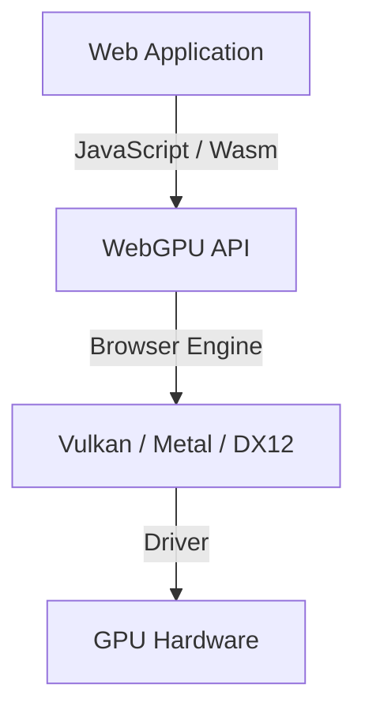
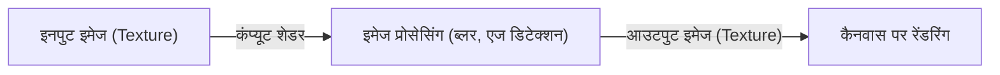

## 1. प्रस्तावना: WebGPU क्या है?

WebGPU वेब ब्राउज़र पर चलने वाला अगली पीढ़ी (next-generation) का ग्राफिक्स और कंप्यूट API है। पारंपरिक WebGL मुख्य रूप से 3D ग्राफिक्स के रेंडरिंग (rendering) पर केंद्रित था, जबकि WebGPU केवल रेंडरिंग तक ही सीमित नहीं है, बल्कि यह GPU की शक्तिशाली समानांतर गणना (parallel computing) क्षमताओं का सीधे लाभ उठाने वाले "कंप्यूट शेडर्स" (compute shaders) का पूर्ण समर्थन करता है। इसके द्वारा छवि प्रसंस्करण (image processing), भौतिकी सिमुलेशन (physics simulation), और मशीन लर्निंग मॉडल (जैसे कि LLM) के इनफरेंस (inference) को ब्राउज़र में उच्च गति से निष्पादित (execute) करना संभव हो गया है।

W3C द्वारा इसके विनिर्देश (specification) का मानकीकरण किया जा रहा है, और हालिया अपडेट्स में उन्नत GPU सुविधाओं तक पहुंच को मानकीकृत किया जा रहा है। इस लेख में, हम WebGPU की ऐतिहासिक पृष्ठभूमि से लेकर WebGL के साथ इसके आर्किटेक्चरल अंतर, WGSL (WebGPU Shading Language) के बुनियादी सिंटैक्स, और WebLLM का उपयोग करके ब्राउज़र में लार्ज लैंग्वेज मॉडल (LLM) इनफरेंस के व्यावहारिक उदाहरणों तक विस्तार से चर्चा करेंगे।

## 2. WebGL से WebGPU का विकास और ऐतिहासिक पृष्ठभूमि

वेब पर 3D ग्राफिक्स के क्षेत्र में लंबे समय तक WebGL का दबदबा रहा है। WebGL, OpenGL ES पर आधारित है और इसने कई वर्षों तक विभिन्न वेब अनुप्रयोगों (web applications) में महत्वपूर्ण भूमिका निभाई है। हालाँकि, जैसे-जैसे हार्डवेयर का विकास हुआ, Vulkan, Metal (Apple), और DirectX 12 जैसे "आधुनिक ग्राफिक्स API" सामने आए। ये आधुनिक API CPU ओवरहेड को काफी कम करते हैं और मल्टी-थ्रेडेड कमांड निर्माण को सक्षम बनाकर GPU के प्रदर्शन को उसकी चरम सीमा तक पहुँचाते हैं।

WebGL का डिज़ाइन पुराना होने के कारण, यह आधुनिक GPU आर्किटेक्चर के साथ पूरी तरह तालमेल नहीं बिठा पा रहा था। इसलिए, Vulkan, Metal और DirectX 12 की अवधारणाओं को एकीकृत करते हुए, वेब की सुरक्षा बनाए रखने के साथ-साथ आधुनिक GPU सुविधाओं तक सीधी पहुंच प्रदान करने के लिए एक नए API के रूप में WebGPU को डिज़ाइन किया गया।



## 3. WebGPU का आर्किटेक्चर और WebGL से अंतर

WebGPU और WebGL के बीच सबसे बड़ा अंतर स्टेट प्रबंधन (state management) और कमांड निष्पादन (command execution) के तरीके में निहित है।

*   **ग्लोबल स्टेट को हटाना (Elimination of Global State)**: WebGL एक विशाल स्टेट मशीन (state machine) है, जहाँ स्टेट में बदलाव (जैसे कि बाइंडिंग) वैश्विक स्तर पर (globally) प्रभावित होते हैं। इससे अप्रत्याशित बग पैदा होने की संभावना रहती है और यह प्रदर्शन में बाधा (bottleneck) भी बनता है। WebGPU में, पाइपलाइन ऑब्जेक्ट्स (RenderPipeline / ComputePipeline) पहले से बनाए जाते हैं और अपरिवर्तनीय (immutable) स्थिति में प्रबंधित होते हैं, जिससे ओवरहेड कम होता है।
*   **कमांड बफ़र (Command Buffer)**: WebGPU में, रेंडरिंग या कंप्यूट कमांड को तुरंत निष्पादित करने के बजाय, कमांड एनकोडर (command encoder) का उपयोग करके उन्हें कमांड बफ़र में रिकॉर्ड किया जाता है और अंत में एक साथ कतार (queue) में सबमिट किया जाता है। यह अलग-अलग थ्रेड्स पर कमांड बनाने की मल्टी-थ्रेडेड प्रोसेसिंग का मार्ग प्रशस्त करता है।
*   **कंप्यूट शेडर्स का नेटिव समर्थन (Native Support for Compute Shaders)**: यद्यपि WebGL2 में भी सीमित गणनाएँ संभव थीं (जैसे कि Transform Feedback), WebGPU ने शुरुआत से ही सामान्य प्रयोजन गणना (general-purpose computing) के उद्देश्य से कंप्यूट शेडर्स को अपने डिज़ाइन में शामिल किया है।

## 4. WGSL (WebGPU Shading Language) की मूल बातें

WebGPU में शेडर भाषा के रूप में WGSL को अपनाया गया है। यह GLSL और Rust के मिश्रण जैसा एक आधुनिक सिंटैक्स रखता है, और यह अत्यधिक सुरक्षित और पार्स करने में आसान होने की विशेषता रखता है।

### कंप्यूट शेडर का उदाहरण

यहाँ एक ऐरे (array) के प्रत्येक तत्व (element) को दोगुना करने वाले एक सरल कंप्यूट शेडर का उदाहरण दिया गया है:

```wgsl
@group(0) @binding(0) var<storage, read_write> data: array<f32>;

@compute @workgroup_size(64)
fn main(@builtin(global_invocation_id) global_id: vec3<u32>) {
    let index = global_id.x;
    if (index >= arrayLength(&data)) {
        return;
    }
    data[index] = data[index] * 2.0;
}
```

इस कोड में, GPU के स्टोरेज बफ़र को एक्सेस किया जाता है, प्रत्येक थ्रेड के लिए ऐरे इंडेक्स की गणना की जाती है और मान को 2 से गुणा किया जाता है। `@workgroup_size` GPU के समानांतर निष्पादन की इकाई (वर्कग्रुप / workgroup) के आकार को परिभाषित करता है।

## 5. ब्राउज़र में मशीन लर्निंग और WebLLM

WebGPU की कंप्यूट क्षमताओं द्वारा लाया गया सबसे बड़ा क्रांतिकारी बदलाव ब्राउज़र में मशीन लर्निंग मॉडल का निष्पादन (execution) है। परंपरागत रूप से, बड़े पैमाने पर मैट्रिक्स गणना की आवश्यकता वाले AI इनफरेंस सर्वर-साइड GPU पर निर्भर थे, लेकिन WebGPU के साथ क्लाइंट (उपयोगकर्ता के डिवाइस) के GPU का उपयोग करना संभव हो गया है।

### WebLLM कैसे काम करता है

WebLLM एक ऐसा प्रोजेक्ट है जो Apache TVM जैसी कंपाइलर तकनीकों का उपयोग करके Llama और Vicuna जैसे बड़े भाषा मॉडल (LLM) को WebGPU (WGSL) में संकलित (compile) करता है और उन्हें ब्राउज़र में चलाता है।

1.  **मॉडल का परिमाणीकरण (Model Quantization)**: कुछ GB से लेकर दर्जनों GB तक के मॉडल आकारों को ब्राउज़र में संभालने के लिए, मेमोरी बैंडविड्थ की बचत करते हुए उन्हें INT4 आदि में क्वांटाइज़ (quantize) किया जाता है।
2.  **WGSL कर्नेल का निर्माण (Generation of WGSL Kernels)**: मैट्रिक्स गुणन (GEMM) जैसे ऑपरेशनों के लिए लक्षित डिवाइस के अनुकूलित WGSL कंप्यूट शेडर्स उत्पन्न किए जाते हैं।
3.  **ब्राउज़र के भीतर इनफरेंस (In-browser Inference)**: सर्वर के साथ संवाद किए बिना पूरी तरह से ऑफ़लाइन टेक्स्ट जनरेशन किया जाता है। इससे गोपनीयता (privacy) सुरक्षित रहती है और सर्वर की लागत भी कम होती है।

## 6. छवि प्रसंस्करण और समानांतर गणना के व्यावहारिक उदाहरण

WebGPU रियल-टाइम इमेज फ़िल्टरिंग और भौतिकी सिमुलेशन में भी उत्कृष्ट प्रदर्शन दिखाता है। लाखों कणों (particles) को हिलाने वाले सिमुलेशन जैसी गणनाएँ, जिन्हें अकेले CPU संभाल नहीं सकता, उन्हें GPU पर ऑफ़लोड किया जा सकता है।



कंप्यूट शेडर का उपयोग करके, पिक्सेल के बीच निर्भरता पर विचार करने वाले जटिल फ़िल्टर (उदाहरण के लिए, मल्टी-पास गॉसियन ब्लर) को भी उच्च गति से संसाधित किया जा सकता है।

## 7. W3C विनिर्देश का भविष्य और संभावनाएं

WebGPU का विनिर्देश W3C के "GPU for the Web" वर्किंग ग्रुप द्वारा विकसित किया जा रहा है। प्रमुख ब्राउज़रों में इसके प्रारंभिक संस्करण (WebGPU 1.0) के रिलीज़ होने के बाद भी, निम्नलिखित नई सुविधाओं को जोड़ने पर चर्चा चल रही है:

*   **Subgroups**: थ्रेड ग्रुप के भीतर थ्रेड्स के बीच डेटा को उच्च गति से साझा और गणना करने की सुविधा। यह मशीन लर्निंग के रिडक्शन (Reduction) संचालन आदि को काफी गति प्रदान करता है।
*   **रे ट्रेसिंग (Ray Tracing)**: हार्डवेयर त्वरण (hardware acceleration) द्वारा समर्थित रे ट्रेसिंग API। अधिक यथार्थवादी और सजीव ग्राफिक्स का निर्माण।
*   **मशीन लर्निंग (WebNN) के साथ एकीकरण (Integration)**: WebNN API के साथ संयोजन करके, ऑपरेटिंग सिस्टम के समर्पित AI एक्सेलेरेटर (NPU) और GPU को जोड़कर एक इष्टतम इनफरेंस निष्पादन वातावरण तैयार करना।

## 8. निष्कर्ष

WebGPU ब्राउज़र की दुनिया में "आधुनिक GPU की वास्तविक शक्ति" लाने वाली एक क्रांतिकारी तकनीक है। 3D ग्राफिक्स की गुणवत्ता में सुधार के साथ-साथ, कंप्यूट शेडर्स द्वारा समानांतर गणना और क्लाइंट-साइड पर AI इनफरेंस का स्थानांतरण वेब अनुप्रयोगों की संभावनाओं को असीम रूप से बढ़ाता है।

डेवलपर्स को नई अवधारणाओं (पाइपलाइन, कमांड बफ़र, WGSL) को सीखने की आवश्यकता होगी, लेकिन सीखने की इस लागत के बदले उन्हें अभूतपूर्व प्रदर्शन और अभिव्यक्ति की क्षमता प्राप्त होती है। निरंतर विकसित हो रहे WebGPU इकोसिस्टम पर नजर रखना बेहद रोमांचक है।
