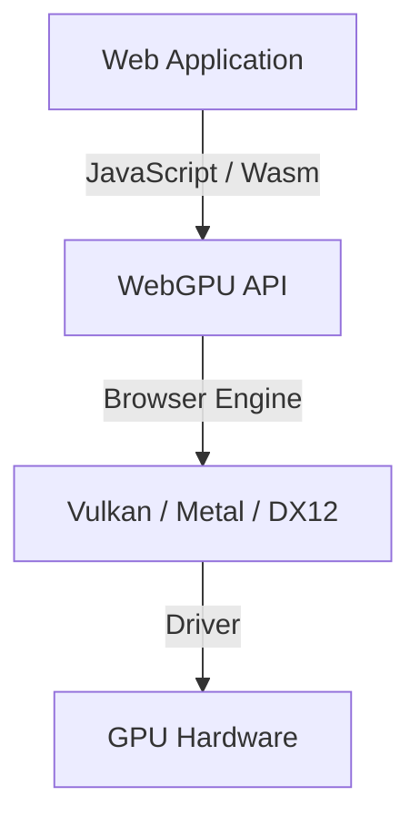
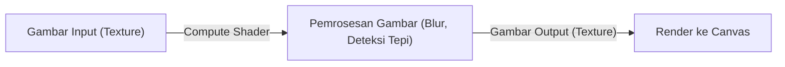

## 1. Pendahuluan: Apa Itu WebGPU?

WebGPU adalah API grafis dan komputasi generasi berikutnya yang berjalan di peramban web (browser). Sementara WebGL tradisional utamanya berfokus pada rendering grafis 3D, WebGPU tidak hanya mendukung penggambaran grafis, melainkan juga mendukung penuh "compute shader" yang dapat memanfaatkan daya komputasi paralel GPU yang kuat secara langsung. Berkat kemampuan ini, tugas-tugas seperti pemrosesan gambar, simulasi fisika, hingga inferensi model machine learning (seperti LLM) kini dapat dijalankan dengan kecepatan tinggi langsung di dalam browser.

Spesifikasinya tengah dikembangkan oleh W3C, dan pembaruan terkini mulai menstandarisasi akses ke fitur-fitur GPU yang lebih canggih. Dalam artikel ini, kita akan mengulas secara mendalam mulai dari latar belakang historis WebGPU, perbedaan arsitektur dibanding WebGL, sintaksis dasar WGSL (WebGPU Shading Language), hingga contoh praktis inferensi Large Language Model (LLM) di dalam browser menggunakan WebLLM.

## 2. Evolusi dari WebGL ke WebGPU dan Latar Belakang Historisnya

Untuk waktu yang lama, WebGL menjadi pemeran utama dalam grafis 3D di web. Berbasiskan OpenGL ES, WebGL telah berperan aktif dalam banyak aplikasi web selama bertahun-tahun. Namun, seiring dengan kemajuan perangkat keras, "API grafis modern" seperti Vulkan, Metal (Apple), dan DirectX 12 mulai bermunculan. API modern ini secara signifikan mengurangi overhead CPU dan memungkinkan pembuatan perintah (command building) secara multi-threading, sehingga memaksimalkan potensi performa GPU hingga batas optimal.

Arsitektur WebGL yang sudah usang tidak lagi selaras dengan arsitektur GPU modern tersebut. Oleh karena itu, WebGPU dirancang sebagai API baru yang memadukan konsep-konsep dari Vulkan, Metal, dan DirectX 12, memungkinkan akses ke kapabilitas GPU mutakhir dengan tetap menjaga keamanan lingkungan web.



## 3. Arsitektur WebGPU dan Perbedaannya dengan WebGL

Perbedaan terbesar antara WebGPU dan WebGL terletak pada manajemen state (keadaan) dan cara eksekusi perintahnya.

*   **Penghapusan Global State**: WebGL merupakan mesin state (state machine) yang sangat besar, di mana perubahan state (seperti operasi binding) memengaruhi konteks secara global. Hal ini rentan menimbulkan bug yang sulit diprediksi serta menjadi bottleneck performa. Sebaliknya, WebGPU membuat objek pipeline (RenderPipeline / ComputePipeline) terlebih dahulu dan mengelolanya dalam kondisi immutable (tidak dapat diubah), sehingga memangkas overhead secara drastis.
*   **Command Buffer**: Pada WebGPU, perintah rendering maupun komputasi tidak dieksekusi secara instan. Alih-alih demikian, perintah direkam ke dalam command buffer menggunakan command encoder, lalu dikirimkan ke antrean (queue) secara bersamaan di akhir proses. Pendekatan ini membuka jalan bagi pemrosesan multi-threading, di mana pembuatan perintah dapat dilakukan di thread terpisah.
*   **Dukungan Native untuk Compute Shader**: Meskipun WebGL2 mendukung komputasi terbatas (seperti Transform Feedback), WebGPU sejak awal telah dirancang dengan dukungan bawaan untuk compute shader yang ditujukan untuk komputasi tujuan umum (GPGPU).

## 4. Dasar-dasar WGSL (WebGPU Shading Language)

WebGPU mengadopsi WGSL sebagai bahasa shader-nya. Dengan sintaks modern yang menyerupai perpaduan antara GLSL dan Rust, WGSL menawarkan tingkat keamanan yang tinggi serta kemudahan dalam parsing.

### Contoh Compute Shader

Berikut adalah contoh compute shader sederhana yang melipatgandakan nilai setiap elemen dalam sebuah array menjadi dua kali lipat:

```wgsl
@group(0) @binding(0) var<storage, read_write> data: array<f32>;

@compute @workgroup_size(64)
fn main(@builtin(global_invocation_id) global_id: vec3<u32>) {
    let index = global_id.x;
    if (index >= arrayLength(&data)) {
        return;
    }
    data[index] = data[index] * 2.0;
}
```

Kode ini mengakses storage buffer GPU, menghitung indeks array untuk setiap thread, dan melipatgandakan nilainya dengan mengalikan 2,0. `@workgroup_size` menentukan ukuran unit eksekusi paralel GPU (workgroup).

## 5. Machine Learning di Browser dan WebLLM

Salah satu revolusi terbesar yang dihadirkan oleh kapabilitas komputasi WebGPU adalah kemampuan menjalankan model machine learning langsung di browser. Sebelumnya, inferensi AI yang menuntut komputasi matriks masif sangat bergantung pada GPU di sisi server. Namun berkat WebGPU, pemanfaatan GPU di sisi klien (perangkat pengguna) kini menjadi sangat memungkinkan.

### Cara Kerja WebLLM

WebLLM adalah proyek yang memanfaatkan teknologi compiler seperti Apache TVM untuk mengompilasi Large Language Model (LLM) seperti Llama atau Vicuna ke dalam WebGPU (WGSL), sehingga model tersebut dapat dijalankan langsung di dalam browser.

1.  **Kuantisasi Model**: Untuk menangani ukuran model yang mencapai gigabita hingga puluhan gigabita di dalam browser, model dikuantisasi ke format presisi rendah seperti INT4 guna menghemat bandwidth memori.
2.  **Pembuatan Kernel WGSL**: Operasi perkalian matriks (GEMM) dan kalkulasi lainnya di-generate menjadi compute shader WGSL yang telah dioptimalkan secara spesifik untuk perangkat target.
3.  **Inferensi dalam Browser**: Pembangkitan teks (text generation) dilakukan secara luring (offline) tanpa perlu berkomunikasi dengan server. Hal ini menjamin privasi data pengguna sekaligus memangkas biaya infrastruktur server.

## 6. Contoh Praktis Pemrosesan Gambar dan Komputasi Paralel

WebGPU juga menunjukkan performa luar biasa dalam penyaringan (filtering) gambar secara real-time dan simulasi fisika. Beban komputasi yang terlalu berat untuk ditangani oleh CPU—seperti simulasi pergerakan jutaan partikel—kini dapat dialihkan (offload) ke GPU.



Dengan memanfaatkan compute shader, filter kompleks yang memperhitungkan dependensi antarpiksel (misalnya Gaussian blur multi-pass) dapat diproses dengan kecepatan tinggi.

## 7. Prospek Masa Depan Spesifikasi W3C

Spesifikasi WebGPU terus dikembangkan oleh kelompok kerja "GPU for the Web" di W3C. Bahkan setelah versi perdana (WebGPU 1.0) dirilis di berbagai browser utama, penambahan fitur-fitur baru berikut ini tengah aktif didiskusikan:

*   **Subgroups**: Fitur untuk berbagi dan mengolah data secara cepat antar-thread di dalam kelompok thread (thread group). Fitur ini mampu mempercepat operasi reduksi (reduction) dalam machine learning secara signifikan.
*   **Ray Tracing**: Dukungan API ray tracing berbasis akselerasi perangkat keras untuk menghasilkan grafis yang jauh lebih fotorealistik.
*   **Integrasi dengan Machine Learning (WebNN)**: Melalui integrasi dengan WebNN API, lingkungan eksekusi inferensi yang optimal dapat dibangun dengan mengolaborasikan akselerator AI khusus (NPU) bawaan OS bersama GPU.

## 8. Kesimpulan

WebGPU adalah teknologi revolusioner yang membawa "kekuatan sejati GPU modern" ke dunia peramban web. Tidak hanya mendongkrak kualitas grafis 3D, komputasi paralel melalui compute shader serta peralihan inferensi AI ke sisi klien turut membuka peluang tak terbatas bagi aplikasi web masa depan.

Meskipun para developer perlu mempelajari paradigma dan konsep baru (seperti pipeline, command buffer, dan WGSL), hasil yang diperoleh sebanding dengan peningkatan performa yang luar biasa serta kebebasan berekspresi secara grafis. Ekosistem WebGPU yang terus berevolusi ini tentu patut untuk terus kita amati ke depannya.
