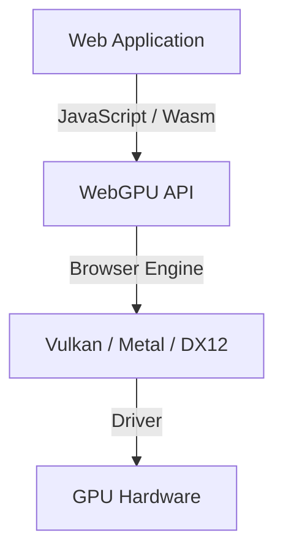

## 1. 시작하며: WebGPU란 무엇인가?

WebGPU는 웹 브라우저에서 동작하는 차세대 그래픽스 및 컴퓨트(Compute) API입니다. 기존의 WebGL이 주로 3D 그래픽스 렌더링에 특화되어 있었던 반면, WebGPU는 렌더링뿐만 아니라 GPU의 강력한 병렬 연산 능력을 직접 활용할 수 있는 '컴퓨트 셰이더(Compute Shader)'를 완벽하게 지원합니다. 이를 통해 이미지 처리, 물리 시뮬레이션, 그리고 대규모 언어 모델(LLM) 등의 머신러닝 추론을 브라우저 상에서 고속으로 실행할 수 있게 되었습니다.

W3C를 중심으로 사양 표준화가 진행되고 있으며, 최근 업데이트를 통해 더욱 고도화된 GPU 기능에 대한 접근이 표준화되고 있습니다. 본 글에서는 WebGPU의 역사적 배경부터 WebGL과의 아키텍처 차이점, WGSL(WebGPU Shading Language)의 기본 문법, 그리고 WebLLM을 활용한 브라우저 내 대규모 언어 모델 추론 실사례까지 자세히 살펴봅니다.

## 2. WebGL에서 WebGPU로의 진화와 역사적 배경

웹 상의 3D 그래픽스는 오랫동안 WebGL이 주도해 왔습니다. WebGL은 OpenGL ES를 기반으로 하여 수많은 웹 애플리케이션에서 활약해 왔습니다. 하지만 하드웨어의 발전에 따라 Vulkan, Metal(Apple), DirectX 12와 같은 '모던 그래픽스 API'가 등장했습니다. 이러한 모던 API는 CPU 오버헤드를 대폭 줄이고 멀티스레드 기반의 커맨드 구축을 가능하게 함으로써 GPU의 성능을 극한까지 끌어올립니다.

WebGL의 설계는 오래되었기 때문에 이러한 현대적인 GPU 아키텍처를 온전히 수용하기 어려웠습니다. 이에 따라 Vulkan, Metal, DirectX 12의 핵심 개념을 통합하고, 웹의 안전성을 유지하면서도 최신 GPU 기능에 접근할 수 있도록 설계된 차세대 API가 바로 WebGPU입니다.



## 3. WebGPU의 아키텍처와 WebGL과의 차이점

WebGPU와 WebGL의 가장 큰 차이점은 상태(State) 관리와 커맨드 실행 방식에 있습니다.

*   **전역 상태(Global State) 제거**: WebGL은 거대한 상태 머신(State Machine) 구조로, 바인딩 등의 상태 변경이 전역적으로 영향을 미칩니다. 이는 예기치 않은 버그를 유발하기 쉽고 성능 병목 현상의 원인이 되기도 합니다. 반면 WebGPU에서는 파이프라인 객체(RenderPipeline / ComputePipeline)를 미리 생성하여 불변(Immutable) 상태로 관리하므로 오버헤드가 크게 줄어듭니다.
*   **커맨드 버퍼(Command Buffer)**: WebGPU에서는 렌더링이나 연산 명령을 즉시 실행하지 않고, 커맨드 인코더를 사용하여 커맨드 버퍼에 기록한 뒤 마지막에 한꺼번에 큐(Queue)로 제출합니다. 이를 통해 다른 스레드에서 커맨드를 사전에 구성할 수 있어 멀티스레드 처리가 가능해집니다.
*   **컴퓨트 셰이더의 네이티브 지원**: WebGL2에서도 제한적인 연산(Transform Feedback 등)은 가능했으나, WebGPU는 범용 연산(GPGPU)을 목적으로 하는 컴퓨트 셰이더를 처음부터 아키텍처의 핵심으로 통합했습니다.

## 4. WGSL (WebGPU Shading Language) 기초

WebGPU는 셰이더 언어로 WGSL을 채택하고 있습니다. GLSL과 Rust의 장점을 결합한 듯한 현대적인 문법을 지니고 있으며, 높은 안전성과 파싱의 용이함이 특징입니다.

### 컴퓨트 셰이더 예제

다음은 배열의 각 원소 값을 2배로 만드는 간단한 컴퓨트 셰이더 예제입니다.

```wgsl
@group(0) @binding(0) var<storage, read_write> data: array<f32>;

@compute @workgroup_size(64)
fn main(@builtin(global_invocation_id) global_id: vec3<u32>) {
    let index = global_id.x;
    if (index >= arrayLength(&data)) {
        return;
    }
    data[index] = data[index] * 2.0;
}
```

이 코드는 GPU 스토리지 버퍼에 접근하여 스레드별로 배열의 인덱스를 계산하고 값을 2배로 증가시킵니다. `@workgroup_size`는 GPU 병렬 실행 단위(워크그룹)의 크기를 정의합니다.

## 5. 브라우저에서의 머신러닝과 WebLLM

WebGPU의 컴퓨트 기능이 가져온 가장 큰 혁신 중 하나는 브라우저 상에서의 머신러닝 모델 구동입니다. 과거에는 막대한 행렬 연산이 필요한 AI 추론을 서버 측 GPU에 전적으로 의존했으나, WebGPU를 통해 클라이언트(사용자 기기)의 GPU를 직접 활용할 수 있게 되었습니다.

### WebLLM의 동작 원리

WebLLM은 Apache TVM과 같은 컴파일러 기술을 활용하여 Llama, Vicuna 등의 대규모 언어 모델(LLM)을 WebGPU(WGSL)로 컴파일하고 브라우저에서 직접 실행하는 오픈소스 프로젝트입니다.

1.  **모델 양자화(Quantization)**: 수 GB에서 수십 GB에 이르는 모델 크기를 브라우저에서 처리할 수 있도록 INT4 등으로 양자화하여 메모리 대역폭을 절약합니다.
2.  **WGSL 커널 생성**: 행렬 곱(GEMM) 등의 핵심 연산을 대상 기기에 최적화된 WGSL 컴퓨트 셰이더로 생성합니다.
3.  **브라우저 내 자체 추론**: 서버와의 추가 통신 없이 완전히 오프라인 상태에서 텍스트를 생성합니다. 이를 통해 사용자 프라이버시가 보호되고 서버 운영 비용도 절감됩니다.

## 6. 이미지 처리와 병렬 연산 활용 예시

WebGPU는 실시간 이미지 필터링이나 물리 시뮬레이션에서도 강력한 성능을 발휘합니다. 수백만 개의 파티클을 다루는 시뮬레이션처럼 CPU만으로는 감당하기 어려운 연산을 GPU로 오프로드(Offload)할 수 있습니다.


컴퓨트 셰이더를 활용하면 픽셀 간의 의존성을 고려해야 하는 복잡한 필터(예: 멀티 패스 가우시안 블러)도 빠르게 처리할 수 있습니다.

## 7. W3C 표준 사양의 향후 전망

WebGPU는 W3C의 'GPU for the Web' 워킹 그룹을 중심으로 표준화가 활발히 진행되고 있습니다. 초기 버전(WebGPU 1.0)이 주요 브라우저에 탑재된 이후에도 다음과 같은 새로운 기능 도입이 논의되고 있습니다.

*   **서브그룹(Subgroups)**: 스레드 그룹 내의 스레드 간 데이터를 초고속으로 공유하고 연산할 수 있는 기능입니다. 이를 통해 머신러닝의 리덕션(Reduction, 축약) 연산 등의 속도가 비약적으로 향상됩니다.
*   **레이 트레이싱(Ray Tracing)**: 하드웨어 가속 레이 트레이싱 API 지원을 통해 더욱 사실적인 그래픽스를 구현할 수 있습니다.
*   **머신러닝(WebNN)과의 통합**: WebNN API와의 연계를 통해 OS의 전용 AI 가속기(NPU) 및 GPU를 유기적으로 결합한 최적의 추론 실행 환경을 구축합니다.

## 8. 결론

WebGPU는 브라우저 생태계에 '모던 GPU의 진정한 잠재력'을 부여하는 혁신적인 기술입니다. 3D 그래픽스의 품질 향상은 물론, 컴퓨트 셰이더를 통한 병렬 연산 및 클라이언트 사이드 AI 추론의 활성화는 웹 애플리케이션의 가능성을 무한히 확장하고 있습니다.

개발자는 파이프라인, 커맨드 버퍼, WGSL과 같은 새로운 개념을 익혀야 하지만, 그러한 학습 비용을 충분히 보상하고도 남을 압도적인 성능과 표현력을 얻을 수 있습니다. 앞으로도 계속해서 진화할 WebGPU 생태계의 발전을 주목할 필요가 있습니다.
