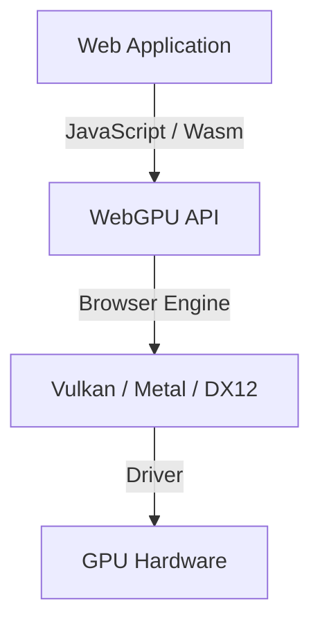

## 1. はじめに：WebGPUとは何か？

WebGPUは、ウェブブラウザ上で動作する次世代のグラフィックスおよびコンピュートAPIです。従来のWebGLが主に3Dグラフィックスの描画（レンダリング）に特化していたのに対し、WebGPUは描画だけでなく、GPUの強力な並列計算能力を直接活用できる「コンピュートシェーダ」をフルサポートしています。これにより、画像処理、物理シミュレーション、そして機械学習モデル（LLMなど）の推論をブラウザ上で高速に実行することが可能になりました。

W3Cによる仕様策定が進められており、最近のアップデートではより高度なGPU機能へのアクセスが標準化されつつあります。本記事では、WebGPUの歴史的背景からWebGLとのアーキテクチャの違い、WGSL（WebGPU Shading Language）の基本文法、そしてWebLLMを用いたブラウザ上での大規模言語モデル推論の実例まで、詳しく解説します。

## 2. WebGLからWebGPUへの進化と歴史的背景

Web上の3Dグラフィックスは、長らくWebGLが主役でした。WebGLはOpenGL ESをベースにしており、長年にわたり多くのウェブアプリケーションで活躍してきました。しかし、ハードウェアの進化に伴い、Vulkan、Metal（Apple）、DirectX 12といった「モダンなグラフィックスAPI」が登場しました。これらのモダンAPIは、CPUのオーバーヘッドを大幅に削減し、マルチスレッドでのコマンド構築を可能にすることで、GPUの性能を極限まで引き出します。

WebGLの設計は古く、こうしたモダンなGPUのアーキテクチャに適合しきれなくなってきました。そこで、Vulkan、Metal、DirectX 12の概念を統合し、ウェブの安全性を保ちながら最新のGPU機能にアクセスできる新しいAPIとして設計されたのがWebGPUです。



## 3. WebGPUのアーキテクチャとWebGLとの違い

WebGPUとWebGLの最大の違いは、ステート管理とコマンドの実行方法にあります。

*   **グローバルステートの排除**: WebGLは巨大なステートマシンであり、状態の変更（バインドなど）がグローバルに影響します。これは予測不可能なバグを生みやすく、パフォーマンスのボトルネックにもなります。WebGPUではパイプラインオブジェクト（RenderPipeline / ComputePipeline）を事前に構築し、不変の状態で管理するため、オーバーヘッドが減少します。
*   **コマンドバッファ**: WebGPUでは、描画や計算のコマンドを直ちに実行するのではなく、コマンドエンコーダを使ってコマンドバッファに記録し、最後にまとめてキューに送信します。これにより、別スレッドでコマンドを構築するマルチスレッド処理への道が開かれます。
*   **コンピュートシェーダのネイティブサポート**: WebGL2でも限定的な計算は可能でしたが（Transform Feedbackなど）、WebGPUは汎用計算を目的としたコンピュートシェーダを最初から設計に組み込んでいます。

## 4. WGSL (WebGPU Shading Language) の基礎

WebGPUでは、シェーダ言語としてWGSLを採用しています。GLSLとRustを足して割ったようなモダンな構文を持ち、安全性が高く、パースしやすいのが特徴です。

### コンピュートシェーダの例

以下は、配列の各要素を2倍にする簡単なコンピュートシェーダの例です。

```wgsl
@group(0) @binding(0) var<storage, read_write> data: array<f32>;

@compute @workgroup_size(64)
fn main(@builtin(global_invocation_id) global_id: vec3<u32>) {
    let index = global_id.x;
    if (index >= arrayLength(&data)) {
        return;
    }
    data[index] = data[index] * 2.0;
}
```

このコードでは、GPUのストレージバッファにアクセスし、スレッドごとに配列のインデックスを計算して値を2倍にしています。`@workgroup_size` はGPUの並列実行の単位（ワークグループ）のサイズを定義します。

## 5. ブラウザでの機械学習とWebLLM

WebGPUのコンピュート機能がもたらす最大の変革の1つが、ブラウザ上での機械学習モデルの実行です。従来、巨大な行列演算を必要とするAI推論はサーバー側のGPUに依存していましたが、WebGPUによりクライアント（ユーザーの端末）のGPUを活用できるようになりました。

### WebLLMの仕組み

WebLLMは、Apache TVMなどのコンパイラ技術を用いて、LlamaやVicunaといった大規模言語モデル（LLM）をWebGPU（WGSL）にコンパイルしてブラウザ上で実行するプロジェクトです。

1.  **モデルの量子化**: 数GBから数十GBに及ぶモデルサイズをブラウザで扱うため、INT4などに量子化し、メモリ帯域幅を節約します。
2.  **WGSLカーネルの生成**: 行列積（GEMM）などの演算を、対象デバイスに最適化されたWGSLのコンピュートシェーダとして生成します。
3.  **ブラウザ内での推論**: サーバーと通信することなく、完全にオフラインでテキスト生成を行います。これにより、プライバシーが保護され、サーバーコストも削減されます。

## 6. 画像処理と並列計算の実用例

WebGPUは、リアルタイムの画像フィルタリングや物理シミュレーションでも威力を発揮します。数百万個のパーティクルを動かすシミュレーションなど、CPUでは処理しきれない計算をGPUにオフロードできます。


コンピュートシェーダを用いることで、ピクセル間の依存関係を考慮した複雑なフィルタ（例えば、複数パスのガウシアンブラー）も高速に処理可能です。

## 7. W3C仕様の今後の展望

WebGPUはW3Cの「GPU for the Web」ワーキンググループによって仕様策定が進められています。初期バージョン（WebGPU 1.0）が主要ブラウザでリリースされた後も、以下のような新機能の追加が議論されています。

*   **Subgroups**: スレッドグループ内のスレッド間でデータを高速に共有・演算する機能。これにより、機械学習の還元演算（Reduction）などが大幅に高速化されます。
*   **Ray Tracing**: ハードウェアアクセラレーションによるレイトレーシングAPIのサポート。よりリアルなグラフィックスの実現。
*   **Machine Learning (WebNN) との統合**: WebNN APIと組み合わせることで、OSの専用AIアクセラレータ（NPU）とGPUを連携させた最適な推論実行環境の構築。

## 8. 結論

WebGPUは、ブラウザの世界に「モダンGPUの真の力」をもたらす革命的なテクノロジーです。3Dグラフィックスの品質向上はもちろんのこと、コンピュートシェーダによる並列計算、そしてAI推論のクライアントサイドへの移行は、ウェブアプリケーションの可能性を無限に広げます。

開発者は新しい概念（パイプライン、コマンドバッファ、WGSL）を学ぶ必要がありますが、その学習コストに見合うだけの圧倒的なパフォーマンスと表現力が手に入ります。今後も進化を続けるWebGPUのエコシステムから目が離せません。
