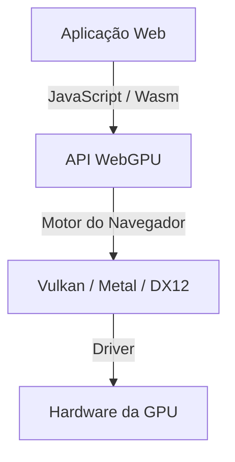
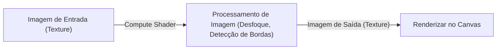

## 1. Introdução: O que é o WebGPU?

O WebGPU é uma API de computação e gráficos de última geração executada em navegadores web. Enquanto o WebGL tradicional era focado principalmente na renderização de gráficos 3D, o WebGPU oferece suporte completo não apenas para renderização, mas também para "compute shaders" (shaders de computação), que aproveitam diretamente o poderoso poder de processamento paralelo da GPU. Isso possibilita executar processamento de imagem, simulações físicas e inferência de modelos de aprendizado de máquina (como LLMs) em alta velocidade diretamente no navegador.

Com a padronização liderada pelo W3C em andamento, atualizações recentes têm padronizado o acesso a recursos de GPU ainda mais avançados. Neste artigo, exploraremos em detalhes desde o contexto histórico do WebGPU e suas diferenças arquiteturais em relação ao WebGL até a sintaxe básica da WGSL (WebGPU Shading Language) e exemplos práticos de inferência de modelos de linguagem de grande porte no navegador usando o WebLLM.

## 2. A Evolução do WebGL para o WebGPU e o Contexto Histórico

Por muito tempo, o WebGL foi o protagonista dos gráficos 3D na web. Baseado no OpenGL ES, ele foi amplamente utilizado em inúmeras aplicações web ao longo dos anos. No entanto, com a evolução do hardware, surgiram "APIs gráficas modernas", como Vulkan, Metal (Apple) e DirectX 12. Essas APIs modernas reduzem significativamente o overhead da CPU e permitem a construção de comandos em múltiplas threads, extraindo a máxima performance da GPU.

A arquitetura do WebGL envelheceu e tornou-se incompatível com as demandas dessas arquiteturas modernas de GPU. Para solucionar isso, o WebGPU foi projetado como uma nova API que unifica conceitos de Vulkan, Metal e DirectX 12, permitindo acesso aos recursos mais recentes de GPU enquanto mantém a segurança na web.



## 3. Arquitetura do WebGPU e Diferenças em Relação ao WebGL

A maior diferença entre o WebGPU e o WebGL reside no gerenciamento de estado e na execução de comandos.

*   **Eliminação do estado global**: O WebGL é uma máquina de estados gigante, onde alterações de estado (como binds) afetam o contexto global. Isso frequentemente gera bugs difíceis de rastrear e gargalos de desempenho. No WebGPU, os objetos de pipeline (RenderPipeline / ComputePipeline) são construídos com antecedência e gerenciados com estados imutáveis, reduzindo o overhead.
*   **Buffer de comandos**: No WebGPU, comandos de desenho ou computação não são executados imediatamente; eles são gravados em buffers de comandos por meio de um codificador de comandos (command encoder) e enviados em lote para a fila no final. Isso abre caminho para o processamento multithread, onde comandos podem ser montados em threads separadas.
*   **Suporte nativo a compute shaders**: Embora o WebGL2 permitisse computações limitadas (como Transform Feedback), o WebGPU inclui suporte a compute shaders voltados para computação de uso geral (GPGPU) desde o início de sua concepção.

## 4. Fundamentos da WGSL (WebGPU Shading Language)

O WebGPU adota a WGSL como sua linguagem de sombreamento (shading language). Apresentando uma sintaxe moderna que lembra uma combinação de GLSL e Rust, ela se destaca por sua alta segurança e facilidade de parsing.

### Exemplo de Compute Shader

Abaixo está um exemplo simples de compute shader que dobra o valor de cada elemento em um array:

```wgsl
@group(0) @binding(0) var<storage, read_write> data: array<f32>;

@compute @workgroup_size(64)
fn main(@builtin(global_invocation_id) global_id: vec3<u32>) {
    let index = global_id.x;
    if (index >= arrayLength(&data)) {
        return;
    }
    data[index] = data[index] * 2.0;
}
```

Neste código, acessa-se o buffer de armazenamento da GPU e, para cada thread, calcula-se o índice do array dobrando o seu valor. `@workgroup_size` define o tamanho da unidade de execução paralela da GPU (workgroup).

## 5. Aprendizado de Máquina no Navegador e o WebLLM

Uma das maiores transformações proporcionadas pelas capacidades de computação do WebGPU é a execução de modelos de machine learning no navegador. Tradicionalmente, inferências de IA que exigem operações matriciais massivas dependiam de GPUs no lado do servidor; com o WebGPU, agora é possível aproveitar a GPU do cliente (dispositivo do usuário).

### Como Funciona o WebLLM

O WebLLM é um projeto que compila modelos de linguagem de grande porte (LLMs), como Llama e Vicuna, para WebGPU (WGSL) por meio de tecnologias de compilador como o Apache TVM, executando-os diretamente no navegador.

1.  **Quantização do modelo**: Para lidar com tamanhos de modelo que variam de vários gigabytes a dezenas de gigabytes no navegador, aplica-se quantização (como INT4) para economizar largura de banda de memória.
2.  **Geração de kernels WGSL**: Operações como multiplicações de matrizes (GEMM) são geradas como compute shaders WGSL otimizados para o dispositivo de destino.
3.  **Inferência no navegador**: A geração de texto ocorre de forma totalmente offline, sem comunicação com servidores. Isso garante privacidade e reduz custos de infraestrutura de servidores.

## 6. Exemplos Práticos de Processamento de Imagem e Computação Paralela

O WebGPU também demonstra seu poder na filtragem de imagens em tempo real e em simulações físicas. Cálculos que seriam inviáveis na CPU, como simulações envolvendo milhões de partículas, podem ser transferidos (offloaded) para a GPU.



Ao utilizar compute shaders, filtros complexos que consideram dependências entre pixels (como um desfoque gaussiano de múltiplos passos) também podem ser processados em alta velocidade.

## 7. Perspectivas Futuras para a Especificação do W3C

A especificação do WebGPU está sendo desenvolvida pelo grupo de trabalho "GPU for the Web" do W3C. Mesmo após o lançamento da versão inicial (WebGPU 1.0) nos principais navegadores, a inclusão de novos recursos continua sendo debatida, tais como:

*   **Subgroups**: Funcionalidade para compartilhamento e operações de dados de alta velocidade entre threads dentro de um grupo de threads. Isso acelera significativamente operações de redução (reductions) em machine learning, entre outras tarefas.
*   **Ray Tracing**: Suporte a APIs de ray tracing aceleradas por hardware, viabilizando gráficos ainda mais realistas.
*   **Integração com Machine Learning (WebNN)**: Em conjunto com a API WebNN, permite construir um ambiente de inferência otimizado, integrando aceleradores dedicados de IA (NPUs) do sistema operacional com a GPU.

## 8. Conclusão

O WebGPU é uma tecnologia revolucionária que traz o "verdadeiro poder das GPUs modernas" para o universo da web. Além de aprimorar a qualidade dos gráficos 3D, a computação paralela por meio de compute shaders e a migração da inferência de IA para o lado do cliente expandem infinitamente as possibilidades das aplicações web.

Embora os desenvolvedores precisem aprender novos conceitos (pipelines, buffers de comando, WGSL), o retorno compensa amplamente esse custo de aprendizado, proporcionando desempenho impressionante e alta expressividade. O ecossistema do WebGPU continuará a evoluir, e vale a pena acompanhar de perto o seu futuro.
