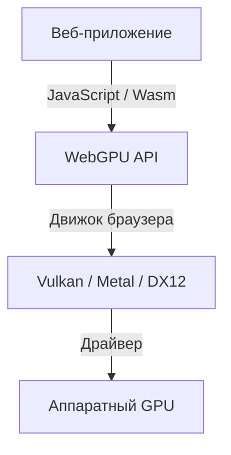
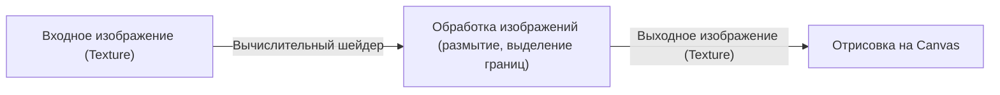

## 1. Введение: Что такое WebGPU?

WebGPU — это графический и вычислительный API нового поколения, работающий в веб-браузере. В то время как традиционный WebGL был ориентирован главным образом на отрисовку (рендеринг) 3D-графики, WebGPU не только выполняет рендеринг, но и полностью поддерживает «вычислительные шейдеры» (compute shaders), позволяющие напрямую задействовать мощный потенциал параллельных вычислений GPU. Благодаря этому в браузере стало возможным с высокой скоростью выполнять обработку изображений, физическое моделирование и инференс моделей машинного обучения (включая LLM).

Разработка спецификации активно ведется консорциумом W3C, и последние обновления стандартизируют доступ к еще более продвинутым возможностям современных GPU. В этой статье мы подробно рассмотрим исторические предпосылки появления WebGPU, архитектурные отличия от WebGL, базовый синтаксис языка WGSL (WebGPU Shading Language), а также практический пример запуска инференса больших языковых моделей прямо в браузере с помощью WebLLM.

## 2. Эволюция от WebGL к WebGPU и исторический контекст

На протяжении долгого времени WebGL оставался главным стандартом для создания 3D-графики в вебе. Основанный на OpenGL ES, он успешно применялся во множестве веб-приложений. Однако параллельно с развитием аппаратного обеспечения появились современные низкоуровневые графические API: Vulkan, Metal (Apple) и DirectX 12. Эти современные API значительно снижают накладные расходы процессора (CPU overhead) и поддерживают многопоточное формирование команд, позволяя выжимать максимум производительности из GPU.

Архитектура WebGL со временем устарела и перестала соответствовать особенностям современного графического оборудования. В ответ на это был разработан WebGPU — новый API, объединивший концепции Vulkan, Metal и DirectX 12, который открывает доступ к возможностям новейших GPU с сохранением строгих требований к безопасности веб-среды.



## 3. Архитектура WebGPU и отличия от WebGL

Ключевое отличие между WebGPU и WebGL заключается в управлении состоянием и способе выполнения команд.

*   **Отказ от глобального состояния**: WebGL представляет собой масштабный конечный автомат (state machine), где изменение состояния (например, привязка ресурсов) глобально влияет на всю систему. Это нередко приводит к трудноуловимым ошибкам и создает узкие места в производительности. В WebGPU конвейеры (RenderPipeline / ComputePipeline) компилируются заранее и управляются как неизменяемые объекты (immutable objects), что существенно снижает накладные расходы.
*   **Командные буферы**: В WebGPU команды отрисовки и вычислений не выполняются немедленно. Вместо этого они записываются в командный буфер с помощью энкодера команд (command encoder) и затем отправляются в очередь (queue) единым пакетом. Такой подход открывает путь к многопоточному формированию команд в параллельных потоках.
*   **Нативная поддержка вычислительных шейдеров**: Хотя в WebGL2 существовали ограниченные способы проведения расчетов (например, Transform Feedback), WebGPU с самого начала проектировался с поддержкой вычислительных шейдеров для задач общего назначения (GPGPU).

## 4. Основы языка WGSL (WebGPU Shading Language)

В качестве языка шейдеров WebGPU использует WGSL. Он обладает современным синтаксисом, напоминающим смесь GLSL и Rust, отличается высокой безопасностью и простотой парсинга.

### Пример вычислительного шейдера

Ниже представлен простой пример вычислительного шейдера, который удваивает каждое значение в массиве:

```wgsl
@group(0) @binding(0) var<storage, read_write> data: array<f32>;

@compute @workgroup_size(64)
fn main(@builtin(global_invocation_id) global_id: vec3<u32>) {
    let index = global_id.x;
    if (index >= arrayLength(&data)) {
        return;
    }
    data[index] = data[index] * 2.0;
}
```

В этом коде осуществляется обращение к буферу хранения (storage buffer) в памяти GPU, где каждый поток вычисляет индекс элемента массива и удваивает его значение. Атрибут `@workgroup_size` определяет размер рабочей группы (workgroup) — единицы параллельного выполнения на GPU.

## 5. Машинное обучение в браузере и WebLLM

Одним из наиболее революционных преимуществ вычислительных возможностей WebGPU стал запуск моделей машинного обучения непосредственно в браузере. Ранее инференс искусственного интеллекта, требующий масштабных матричных вычислений, почти полностью зависел от серверных GPU. Благодаря WebGPU появилась возможность задействовать графический процессор на стороне клиента (на устройстве пользователя).

### Принцип работы WebLLM

WebLLM — это проект, использующий технологии компиляторов (такие как Apache TVM) для компиляции больших языковых моделей (LLM), таких как Llama или Vicuna, в WebGPU (WGSL) для последующего выполнения в браузере.

1.  **Квантование модели**: Чтобы загрузить модели размером от нескольких гигабайт до десятков гигабайт в браузер, веса квантуются (например, до INT4), что значительно экономит пропускную способность памяти.
2.  **Генерация кернелов WGSL**: Вычислительные операции, такие как матричное умножение (GEMM), генерируются в виде оптимизированных под конкретное устройство вычислительных шейдеров на WGSL.
3.  **Инференс внутри браузера**: Генерация текста происходит полностью автономно в оффлайн-режиме, без отправки данных на серверы. Это гарантирует полную конфиденциальность данных и устраняет затраты на серверную инфраструктуру.

## 6. Примеры практического применения: обработка изображений и параллельные вычисления

WebGPU демонстрирует огромную эффективность в задачах фильтрации изображений в реальном времени и физического моделирования. Сложные расчеты, такие как симуляция миллионов частиц, с которыми не справляется центральный процессор (CPU), можно делегировать GPU.



Использование вычислительных шейдеров позволяет с высокой скоростью применять сложные фильтры с учетом взаимосвязей соседних пикселей (например, многопроходное размытие по Гауссу).

## 7. Перспективы развития спецификации W3C

Разработкой спецификации WebGPU занимается рабочая группа W3C «GPU for the Web». Даже после выхода первой стабильной версии (WebGPU 1.0) в основных браузерах продолжается активное обсуждение и добавление новых возможностей:

*   **Subgroups**: Механизм быстрого обмена данными и выполнения вычислений между потоками внутри одной рабочей группы. Это существенно ускоряет операции редукции (reduction) в алгоритмах машинного обучения.
*   **Ray Tracing**: Поддержка аппаратно-ускоренной трассировки лучей для создания еще более реалистичной графики.
*   **Интеграция с Machine Learning (WebNN)**: Совместное использование с API WebNN для эффективного распределения вычислений между специализированными нейропроцессорами (NPU) операционной системы и GPU, создавая оптимальную среду для выполнения ИИ-моделей.

## 8. Заключение

WebGPU — это революционная технология, которая открывает миру веб-разработки истинную мощь современных GPU. Качественное улучшение 3D-графики, параллельные вычисления с помощью вычислительных шейдеров и перенос инференса искусственного интеллекта на сторону клиента безгранично расширяют возможности веб-приложений.

Хотя разработчикам потребуется освоить новые концепции (конвейеры, командные буферы, WGSL), взамен они получают беспрецедентный уровень производительности и выразительности. За стремительно развивающейся экосистемой WebGPU определенно стоит следить самым внимательным образом.
