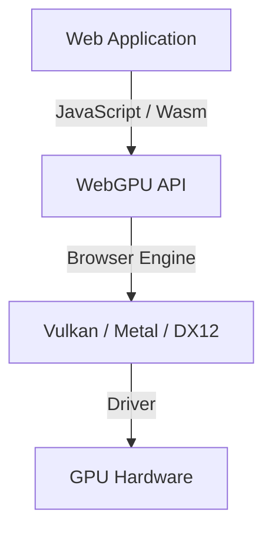
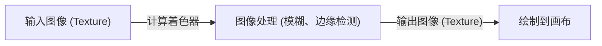

## 1. 前言：什么是 WebGPU？

WebGPU 是在 Web 浏览器中运行的下一代图形与计算 API。与传统主要专注于 3D 图形绘制（渲染）的 WebGL 相比，WebGPU 不仅支持渲染，还全面支持能够直接利用 GPU 强大并行计算能力的“计算着色器”（Compute Shader）。由此，图像处理、物理模拟以及机器学习模型（如 LLM 等）的推理得以在浏览器中高速执行。

W3C 正在推进其规范制定工作，在最近的更新中，访问更高级 GPU 功能的途径正逐步走向标准化。本文将从 WebGPU 的历史背景展开，深入解析它与 WebGL 的架构差异、WGSL（WebGPU Shading Language）的基本语法，以及利用 WebLLM 在浏览器中运行大语言模型推理的实际案例。

## 2. 从 WebGL 到 WebGPU 的演进与历史背景

长期以来，Web 上的 3D 图形一直以 WebGL 为核心主角。WebGL 基于 OpenGL ES，多年来广泛活跃在各类 Web 应用中。然而，随着硬件的不断演进，Vulkan、Metal（Apple）和 DirectX 12 等“现代图形 API”相继问世。这些现代 API 通过大幅减少 CPU 开销并支持多线程构建命令，从而将 GPU 的性能发挥到极致。

WebGL 的架构设计较为陈旧，已无法充分适应现代 GPU 的架构特点。因此，WebGPU 应运而生——它融合了 Vulkan、Metal 和 DirectX 12 的核心理念，在保证 Web 安全性的同时，为开发者提供访问最新 GPU 特性的全新 API。



## 3. WebGPU 的架构及与 WebGL 的区别

WebGPU 与 WebGL 最大的不同在于状态管理和命令执行机制。

*   **消除全局状态**：WebGL 本质上是一个庞大的状态机，状态的变更（如绑定等）会对全局产生影响。这极易引发不可预知的 Bug，同时也是性能瓶颈的来源。而在 WebGPU 中，管线对象（RenderPipeline / ComputePipeline）被预先构建并以不可变状态进行管理，从而大幅降低了运行时代价。
*   **命令缓冲区**：在 WebGPU 中，绘制或计算命令不会被立即执行，而是使用命令编码器（Command Encoder）记录到命令缓冲区中，最后批量提交至队列。这为在其他线程中构建命令的多线程处理开辟了道路。
*   **原生支持计算着色器**：尽管 WebGL2 也支持有限的计算操作（如 Transform Feedback 等），但 WebGPU 从设计之初就直接内置了以通用计算为目标的计算着色器。

## 4. WGSL (WebGPU Shading Language) 基础

WebGPU 采用 WGSL 作为其专用的着色器语言。它拥有类似 GLSL 与 Rust 相结合的现代语法，兼具高安全性与易解析的特点。

### 计算着色器示例

以下是一个将数组中每个元素乘以 2 的简单计算着色器示例：

```wgsl
@group(0) @binding(0) var<storage, read_write> data: array<f32>;

@compute @workgroup_size(64)
fn main(@builtin(global_invocation_id) global_id: vec3<u32>) {
    let index = global_id.x;
    if (index >= arrayLength(&data)) {
        return;
    }
    data[index] = data[index] * 2.0;
}
```

在这段代码中，着色器访问 GPU 的存储缓冲区（Storage Buffer），每个线程计算出对应的数组索引并将值翻倍。`@workgroup_size` 用于定义 GPU 并行执行的单位（工作组）的大小。

## 5. 浏览器中的机器学习与 WebLLM

WebGPU 的计算功能带来的最大变革之一，便是在浏览器中运行机器学习模型。以往，需要大量矩阵运算的 AI 推理大多依赖服务器端 GPU，而得益于 WebGPU，开发者现在可以直接利用客户端（用户设备）的 GPU 算力。

### WebLLM 的工作原理

WebLLM 是一个利用 Apache TVM 等编译器技术，将 Llama、Vicuna 等大语言模型（LLM）编译为 WebGPU（WGSL）并在浏览器中直接运行的开源项目。

1.  **模型量化**：为了在浏览器中承载数 GB 乃至数十 GB 大小的模型，将其量化为 INT4 等格式，从而节省内存带宽。
2.  **生成 WGSL 内核**：将矩阵乘法（GEMM）等计算操作生成为针对目标设备经过优化的 WGSL 计算着色器。
3.  **浏览器端推理**：无需与服务器通信，完全在离线状态下执行文本生成。这既能有效保护用户隐私，也能大幅降低服务器端成本。

## 6. 图像处理与并行计算的应用实践

WebGPU 在实时图像滤波与物理模拟中同样展现出强大的威力。诸如模拟数百万个粒子的运动等 CPU 难以负荷的高密度计算，都可以卸载到 GPU 上执行。



借助计算着色器，即使是需要考虑像素间依赖关系的复杂滤镜（例如多通道高斯模糊），也能够实现极速处理。

## 7. W3C 规范的未来展望

WebGPU 的规范制定由 W3C 的“GPU for the Web”工作组负责推进。在首个正式版本（WebGPU 1.0）登陆各大主流浏览器后，目前社区正在积极探讨引入以下新特性：

*   **Subgroups**：支持在线程组内部各线程之间高速共享数据并执行运算的功能。这将大幅加速机器学习中的规约运算（Reduction）等操作。
*   **Ray Tracing**：提供硬件加速的光线追踪 API 支持，以呈现更为逼真的图形渲染效果。
*   **与机器学习（WebNN）的整合**：通过与 WebNN API 相结合，构建联动操作系统专用 AI 加速芯片（NPU）与 GPU 的最佳推理执行环境。

## 8. 结语

WebGPU 是一项将“现代 GPU 的真正威力”引入 Web 领域的革命性技术。它不仅显著提升了 3D 图形的渲染品质，更通过计算着色器实现的并行计算以及 AI 推理向客户端的迁移，为 Web 应用开拓了无限的潜能与可能性。

尽管开发者需要学习全新的概念（管线、命令缓冲区、WGSL 等），但这一学习成本换来的是前所未有的卓越性能与丰富表现力。持续蓬勃发展的 WebGPU 生态，必将在未来带来更多令人期待的突破。
