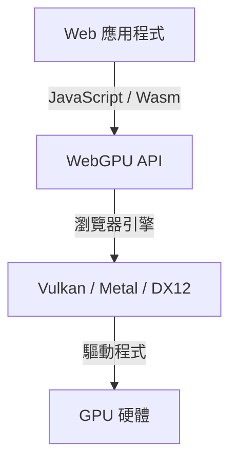
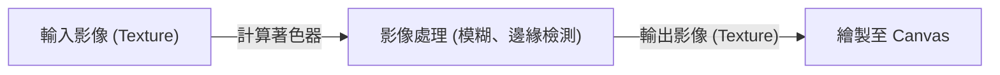

## 1. 前言：什麼是 WebGPU？

WebGPU 是在網頁瀏覽器上運行的次世代圖形與計算 API。相較於傳統 WebGL 主要專注於 3D 圖形渲染，WebGPU 不僅支援繪圖，還全面支援可直接運用 GPU 強大平行計算能力的「計算著色器（Compute Shader）」。這使得影像處理、物理模擬以及機器學習模型（如大型語言模型 LLM）的推論，都能在瀏覽器中高速執行。

目前 W3C 正在積極推動其規範制定，在近期的更新中，存取更高階 GPU 功能的標準化進程也不斷推進。本文將從 WebGPU 的歷史背景、與 WebGL 的架構差異、WGSL（WebGPU Shading Language）的基本語法，到使用 WebLLM 在瀏覽器中進行大型語言模型推論的實例，為您帶來詳盡的解析。

## 2. 從 WebGL 到 WebGPU 的演進與歷史背景

長期以來，WebGL 一直是網頁 3D 圖形領域的主角。WebGL 以 OpenGL ES 為基礎，多年來在眾多 Web 應用程式中大放異彩。然而，隨著硬體架構的演進，Vulkan、Metal（Apple）以及 DirectX 12 等「現代圖形 API」相繼問世。這些現代 API 大幅降低了 CPU 開銷（Overhead），並支援在多執行緒中構建命令，從而將 GPU 的效能發揮到極致。

由於 WebGL 的設計年代較早，已難以充分契合現代 GPU 的架構特性。因此，整合了 Vulkan、Metal 與 DirectX 12 的核心概念，並在確保 Web 安全性的前提下，讓開發者得以存取最新 GPU 功能的新一代 API——WebGPU 便應運而生。



## 3. WebGPU 的架構及其與 WebGL 的差異

WebGPU 與 WebGL 最大的差異在於狀態管理與命令執行的方式。

*   **消除全域狀態**: WebGL 是一個龐大的狀態機（State Machine），狀態的變更（如綁定等）會在全域範圍內造成影響。這不僅容易引發難以預測的錯誤（Bug），也是效能瓶頸的主要根源。而在 WebGPU 中，管線物件（RenderPipeline / ComputePipeline）會被預先建立，並以不可變（Immutable）的狀態進行管理，從而大幅降低開銷。
*   **命令緩衝區（Command Buffer）**: 在 WebGPU 中，繪圖或計算命令並不會立即執行，而是透過命令編碼器（Command Encoder）記錄至命令緩衝區，最後一次性批次送入佇列（Queue）中執行。這為在獨立執行緒中構建命令的多執行緒處理開闢了道路。
*   **原生支援計算著色器**: 雖然在 WebGL2 中也能進行部分有限的計算（例如 Transform Feedback 等），但 WebGPU 從最初的設計階段，就將以通用計算為目標的計算著色器完整納入了架構之中。

## 4. WGSL (WebGPU Shading Language) 基礎

WebGPU 採用 WGSL 作為其著色器語言。它的語法現代化，帶有幾分結合 GLSL 與 Rust 的風格，兼具高安全性與易於解析（Parse）的特性。

### 計算著色器範例

以下是一個將陣列中每個元素數值翻倍的簡易計算著色器範例：

```wgsl
@group(0) @binding(0) var<storage, read_write> data: array<f32>;

@compute @workgroup_size(64)
fn main(@builtin(global_invocation_id) global_id: vec3<u32>) {
    let index = global_id.x;
    if (index >= arrayLength(&data)) {
        return;
    }
    data[index] = data[index] * 2.0;
}
```

在這段程式碼中，程式存取了 GPU 的儲存緩衝區（Storage Buffer），並由各個執行緒分別計算陣列索引，將其數值乘以 2。`@workgroup_size` 則用來定義 GPU 平行執行的基本單位（工作群組，Workgroup）的大小。

## 5. 瀏覽器中的機器學習與 WebLLM

WebGPU 的計算功能所帶來的最大變革之一，就是能夠在瀏覽器中直接運行機器學習模型。以往，需要龐大矩陣運算的 AI 推論高度依賴伺服器端的 GPU；但借助 WebGPU，現在我們可以直接善用客戶端（使用者裝置）本機的 GPU 運算資源。

### WebLLM 的運作機制

WebLLM 是一項利用 Apache TVM 等編譯器技術，將 Llama 或 Vicuna 等大型語言模型（LLM）編譯為 WebGPU（WGSL）並直接在瀏覽器中執行的專案。

1.  **模型量化**: 為了在瀏覽器中處理動輒數 GB 至數十 GB 的模型大小，通常會將其量化為 INT4 等格式，藉此節省記憶體頻寬。
2.  **生成 WGSL 核心（Kernel）**: 將矩陣乘法（GEMM）等運算，編譯生成針對目標裝置最佳化的 WGSL 計算著色器。
3.  **瀏覽器本機推論**: 完全無需與伺服器通訊，即可在離線狀態下進行文字生成。這不僅保護了使用者隱私，同時也大幅降低了伺服器營運成本。

## 6. 影像處理與平行計算的實際應用範例

WebGPU 在即時影像濾鏡處理與物理模擬方面同樣展現出強大威力。例如動輒數百萬個粒子的運動模擬等 CPU 難以負荷的龐大計算，皆可卸載（Offload）至 GPU 進行平行運算。



透過使用計算著色器，即使是需要考量像素間相依性的複雜濾鏡（例如多階段處理的高斯模糊 Multi-pass Gaussian Blur），也能實現極致的高速運算。

## 7. W3C 規範的未來展望

WebGPU 目前由 W3C 的「GPU for the Web」工作小組持續進行規範制定。在初期版本（WebGPU 1.0）於主流瀏覽器陸續發布之後，社群目前正針對以下幾項新功能的導入進行深入探討：

*   **Subgroups（子群組）**: 支援在執行緒群組（Thread Group）內的各執行緒之間高速共享資料與進行運算的功能。這能顯著加速機器學習中的歸約運算（Reduction）等處理。
*   **Ray Tracing（光線追蹤）**: 支援硬體加速的光線追蹤 API，藉此實現更加擬真細緻的圖形視覺效果。
*   **與機器學習（WebNN）整合**: 透過與 WebNN API 協同運作，實現作業系統層級專用 AI 加速晶片（NPU）與 GPU 相互搭配的最佳化推論執行環境。

## 8. 結語

WebGPU 是一項為瀏覽器領域注入「現代 GPU 真正力量」的革命性技術。除了顯著提升 3D 圖形品質之外，透過計算著色器實現的平行計算，以及將 AI 推論遷移至客戶端的革新，更為 Web 應用程式開創了無限可能。

雖然開發者必須學習全新的架構概念（管線、命令緩衝區、WGSL），但這份學習成本所換來的，將是無可比擬的強大效能與豐富表現力。持續蓬勃發展的 WebGPU 生態系，未來的演進絕對值得我們拭目以待。
