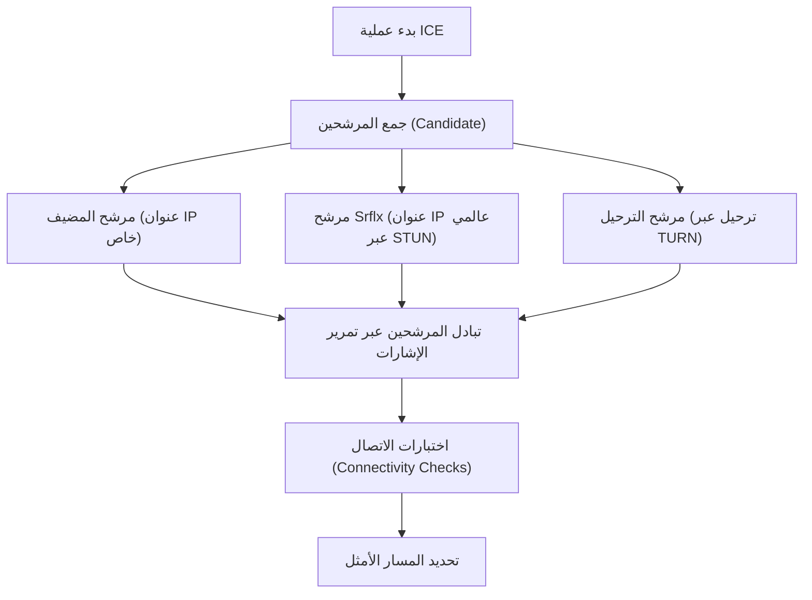

تُعد تقنية WebRTC (اتصال الويب في الوقت الفعلي) تقنية مفتوحة المصدر تتيح تبادل الصوت والفيديو والبيانات العشوائية مباشرةً بين متصفحات الويب دون الحاجة إلى تثبيت إضافات أو برامج إضافية. وهي التكنولوجيا الأساسية التي تدعم منصات مثل Google Meet و Zoom و Discord، وأصبحت عنصراً لا غنى عنه في تطبيقات الويب الحديثة التي تعمل في الوقت الفعلي.

في هذا المقال، سنشرح بتعمق تقنية WebRTC، بدءاً من الخلفية التاريخية التي دعت للحاجة إليها، مروراً بآليات تجاوز تقنية NAT، وتمرير الإشارات (Signaling)، واكتشاف المسار، وصولاً إلى مجموعة البروتوكولات الأساسية التي تعتمد عليها.

## قيود HTTP و WebSocket: لماذا نحتاج إلى WebRTC؟

لفهم آلية عمل WebRTC، من الضروري أولاً معرفة لماذا تعتبر تقنيات الويب الحالية (HTTP و WebSocket) غير مناسبة لاتصالات الوسائط في الوقت الفعلي.

### خصائص وتحديات اتصال HTTP
يعتبر HTTP (بروتوكول نقل النص التشعبي) بروتوكولاً يعتمد على نموذج طلب-استجابة ضمن معمارية العميل والخادم. التدفق الأساسي للبيانات يكون في اتجاه واحد، حيث يرسل العميل طلباً ويرد الخادم باستجابة.
في السنوات الأخيرة، ومع ظهور HTTP/2 و HTTP/3، تحسن الأداء من خلال إضافة ميزات مثل تعدد الإرسال والدفع من الخادم، لكن المعمارية الأساسية المتمثلة في "عدم إمكانية الاتصال دون المرور عبر خادم" لم تتغير. لتبادل بيانات البث الكبيرة الحجم التي تتطلب زمن انتقال منخفض (مثل الفيديو والصوت) في الوقت الفعلي عبر خادم، يصبح حمل الخادم وتأخير الشبكة عقبة كبيرة.

### قيود WebSocket
تُعد تقنية WebSocket بروتوكول اتصال ثنائي الاتجاه تم تطويره للتغلب على قيود HTTP. فبمجرد إنشاء الاتصال، يمكن للعميل والخادم إرسال واستقبال البيانات في أي وقت. وقد أدى ذلك إلى تحسينات هائلة في تطبيقات الدردشة وأنظمة الإشعارات اللحظية.
ومع ذلك، تعتمد WebSocket أيضاً على نموذج العميل والخادم. عند تبادل كميات كبيرة من البيانات في الوقت الفعلي بين المشاركين، كما هو الحال في مكالمات الفيديو، تمر جميع تدفقات البيانات عبر الخادم (نقل الخادم)، مما يؤدي سريعاً إلى استنفاد النطاق الترددي وقدرة المعالجة الخاصة بالخادم. بالإضافة إلى ذلك، نظراً لأنه اتصال يعتمد على بروتوكول TCP، لا يمكن تجنب التأخير الناتج عن آليات التحكم في إعادة الإرسال عند فقدان الحزم (Head-of-Line Blocking)، وهو ما يمثل مشكلة قاتلة تعيق الأداء الفعلي في الوقت الفعلي.

من هذا المنطلق، ظهرت تقنية WebRTC التي تتيح للعملاء الاتصال ببعضهم البعض بشكل مباشر (من نظير إلى نظير، P2P) دون المرور عبر خادم، وتعتمد بشكل أساسي على بروتوكول UDP الذي يتميز بتقليل تأخير إعادة الإرسال.

## الصورة العامة لـ WebRTC ومسار إنشاء الاتصال

لا يُعد إنشاء اتصال P2P في WebRTC أمراً بسيطاً مثل "إرسال البيانات فجأة إلى متصفح الطرف الآخر". في بيئة الإنترنت الحالية، تقع معظم الأجهزة خلف أجهزة التوجيه (NAT) ولا تمتلك عناوين IP عالمية بشكل مباشر.
في WebRTC، يتم اتخاذ الخطوات التالية لبدء الاتصال:

1. **تمرير الإشارات (Signaling)**: التعرف على وجود الطرف الآخر وتبادل متطلبات الاتصال (SDP).
2. **اكتشاف المسار (ICE, STUN/TURN)**: العثور على مسارات الشبكة التي تتيح الاتصال المتبادل.
3. **إنشاء اتصال P2P والتشفير**: تبادل مفاتيح التشفير عبر DTLS، ونقل البيانات عبر SRTP/SCTP.

```mermaid
sequenceDiagram
    participant PeerA as Peer A (المتصفح)
    participant SignalingServer as خادم تمرير الإشارات
    participant PeerB as Peer B (المتصفح)
    participant STUNTURN as خادم STUN/TURN

    PeerA->>STUNTURN: الاستعلام عن عنوان IP العالمي/المنفذ الخاص به
    STUNTURN-->>PeerA: الرد بعنوان IP العالمي/المنفذ
    PeerA->>SignalingServer: إرسال SDP Offer
    SignalingServer->>PeerB: تمرير SDP Offer
    PeerB->>STUNTURN: الاستعلام عن عنوان IP العالمي/المنفذ الخاص به
    STUNTURN-->>PeerB: الرد بعنوان IP العالمي/المنفذ
    PeerB->>SignalingServer: إرسال SDP Answer
    SignalingServer->>PeerA: تمرير SDP Answer
    PeerA->>PeerB: محاولة اتصال P2P (ICE)
    PeerA<-->>PeerB: اتصال مباشر (فيديو، صوت، بيانات)
```

## تمرير الإشارات باستخدام SDP (بروتوكول وصف الجلسة)

لإجراء اتصال P2P، يجب على كلا الطرفين مشاركة المعلومات الأساسية مثل "نوع بيانات الوسائط التي يمكن إرسالها واستقبالها" و"برامج الترميز المدعومة". تُعرف عملية التبادل هذه باسم **تمرير الإشارات (Signaling)**.

من المثير للاهتمام أن مواصفات WebRTC لا تحدد بروتوكولاً معيناً يوضح "كيفية إجراء تمرير الإشارات". يمكن للمطورين إنشاء خوادم تمرير الإشارات باستخدام أي وسيلة مثل WebSocket، أو Server-Sent Events (SSE)، أو SIP لتبادل المعلومات.

يتم وصف المعلومات المتبادلة بتنسيق يُعرف باسم **SDP (بروتوكول وصف الجلسة)**.

### مسار تبادل SDP Offer و Answer
يقوم البادئ بالاتصال (Peer A) بإنشاء "SDP Offer" يحتوي على برامج ترميز الفيديو والصوت المدعومة ومعلومات الشبكة، ويقوم بإرساله إلى المستلم (Peer B) عبر خادم تمرير الإشارات.
عندما يتلقى المستلم (Peer B) العرض (Offer)، فإنه يقارنه ببيئته الخاصة لاختيار "برامج الترميز التي يمكن استخدامها بشكل مشترك"، وينشئ "SDP Answer" (إجابة) ويعيدها إلى Peer A.
من خلال هذه العملية، يتفق الطرفان على تنسيق اتصال الوسائط.

## الجدار الضخم: NAT وجدار الحماية

لا يكفي تبادل SDP وحده لتحقيق اتصال P2P. وذلك لأنه من الضروري معرفة عنوان IP ورقم المنفذ الخاصين بالطرف الآخر. ومع ذلك، تقف تقنية **NAT (ترجمة عنوان الشبكة)** - التي انتشرت كحل لمشكلة استنفاد عناوين IPv4 - كجدار ضخم يعيق اتصالات P2P.

### دور NAT والمشكلات المتعلقة بها
في شبكات المنازل والمكاتب، توفر أجهزة التوجيه وظيفة NAT. يتم تخصيص عنوان IP خاص لكل جهاز داخل الشبكة المحلية (مثل `192.168.1.10`)، ويستخدم جهاز التوجيه عنوان IP عالمي للتواصل مع الإنترنت بالنيابة عنها.
يتم تحويل العناوين والمنافذ تلقائياً بواسطة NAT للاتصالات المتجهة من الداخل إلى الخارج، ولكن **يتم رفض طلبات الاتصال المباشرة القادمة من الخارج إلى الداخل (إلى عنوان IP خاص محدد) بواسطة جهاز التوجيه**. وهذا هو السبب الذي يمنع اتصالات P2P.

## تقنيات تجاوز NAT: STUN و TURN

لحل مشكلة NAT، تستخدم تقنية WebRTC نوعين من الخوادم: **STUN** و **TURN**.

### STUN (أدوات اجتياز الجلسة لـ NAT)
يلعب خادم STUN دوراً في إخبار العميل بـ "عنوان IP العالمي ورقم المنفذ الخاص به كما يبدو من الإنترنت".
يقوم Peer A أولاً بإرسال طلب إلى خادم STUN. يرد خادم STUN بعنوان IP ومصدر الطلب (أي عنوان IP العالمي لجهاز التوجيه والمنفذ بعد التحويل) كاستجابة. ينقل Peer A هذه المعلومات إلى Peer B باعتبارها "معلومات الاتصال الخاصة به (ICE Candidate)".
يعتبر STUN خفيف الوزن ولا يسبب حملاً كبيراً على الخوادم، وتنجح معظم اتصالات P2P (أكثر من 80٪ تقريباً) باستخدام STUN.

### TURN (الاجتياز باستخدام الترحيل حول NAT)
ومع ذلك، في بيئات جدران الحماية الصارمة للشركات أو بيئات NAT القوية المعروفة باسم "Symmetric NAT" (NAT المتماثل)، قد يتم حظر الحصول على العناوين عبر STUN والاتصال المباشر.
الملاذ الأخير المستخدم في مثل هذه الحالات هو خادم TURN.
يقوم خادم TURN **بترحيل جميع بيانات الاتصال** عندما يكون اتصال P2P مستحيلاً. بالمعنى الدقيق للكلمة، لم يعد هذا اتصال P2P، ولكنه ضروري لضمان موثوقية الاتصال. ونظراً لأنه يقوم بترحيل جميع حركة مرور الوسائط، فإن تشغيل خادم TURN يتطلب نطاقاً ترددياً هائلاً وتكاليف خادم باهظة.

## اكتشاف المسار الأمثل باستخدام ICE (الإنشاء التفاعلي للاتصال)

تُعرف "قائمة عناوين IP والمنافذ المرشحة للاتصال" التي يتم جمعها بواسطة STUN و TURN باسم **ICE Candidate** (مرشح ICE).
تقوم WebRTC باختبار جميع المجموعات الممكنة لمرشحي ICE الذين تم جمعهم من كلا الطرفين بشكل شامل لتحديد المسار الأكثر استقراراً والأقل تأخيراً. يُعرف هذا الإطار باسم **ICE (الإنشاء التفاعلي للاتصال)**.

تكون أولوية المسار عادةً على النحو التالي:
1. **مرشح المضيف (Host Candidate)**: اتصال مباشر بين عناوين IP الخاصة داخل نفس الشبكة المحلية (الأسرع).
2. **المرشح المنعكس من الخادم (Server Reflexive Candidate)**: اتصال P2P يتجاوز NAT باستخدام عنوان IP عالمي تم الحصول عليه عبر خادم STUN.
3. **المرشح المرحل (Relay Candidate)**: اتصال مرحل يمر عبر خادم TURN كملاذ أخير (تأخير مرتفع).



## الاتصالات القائمة على UDP ومكدس البروتوكول

لتحقيق زمن انتقال منخفض، تعتمد تقنية WebRTC على بروتوكول **UDP (بروتوكول بيانات المستخدم)** بدلاً من TCP. على الرغم من أن بروتوكول TCP يتمتع بموثوقية عالية، إلا أنه يتسبب في حدوث تأخير بسبب تأكيدات وصول الحزم وعمليات إعادة الإرسال. في مؤتمرات الفيديو، من الأهمية بمكان أن "يصل الفيديو الحالي في الوقت الفعلي، حتى لو كان هناك بعض التشويش في الصورة"، بدلاً من أن "تصل صورة الفيديو الخاصة بالثانية الماضية بجودة مثالية ولكن متأخرة".

ومع ذلك، لا يمكن لـ UDP العادي تشفير الوسائط أو مزامنتها. لذلك، تبني WebRTC مكدس بروتوكول متقدم فوق بروتوكول UDP.

### التشفير بواسطة DTLS
**تُشفر جميع اتصالات WebRTC بشكل إجباري**. لتشفير اتصالات UDP، يتم استخدام **DTLS (أمان طبقة نقل البيانات)**، وهو إصدار البيانات من بروتوكول TLS. نظراً لأنه يتم تبادل المفاتيح مباشرة في P2P، يمكن منع التنصت وهجمات الوسيط.

### SRTP (بروتوكول النقل الآمن في الوقت الفعلي)
لنقل بيانات الوسائط (الفيديو والصوت)، يتم استخدام بروتوكول **SRTP** المشفر باستخدام المفاتيح التي تم تبادلها عبر DTLS. يضيف SRTP الطوابع الزمنية وأرقام التسلسل لتعويض نقاط ضعف UDP المتمثلة في "عدم ضمان الترتيب" و"فقدان الحزم"، مما يتيح تشغيلاً سلساً على جانب المستقبل.

### SCTP (بروتوكول نقل التحكم في التدفق)
تحتوي WebRTC على ميزة "قناة البيانات" (Data Channel) التي تتيح إرسال واستقبال أي بيانات نصية أو ثنائية عشوائية، وليس الوسائط فقط. تُستخدم هذه الميزة لنقل الملفات ومزامنة الألعاب وما إلى ذلك.
للاتصال عبر قناة البيانات، يتم استخدام بروتوكول **SCTP** المبني فوق UDP. نظراً لأن SCTP يسمح بالتكوين المرن لكل تدفق مثل "ضمان الوصول عالي الموثوقية" و"ضمان الترتيب"، فإنه يحقق نقل بيانات يجمع بين مزايا TCP و UDP.

## الخلاصة

لتلبية المتطلب البسيط المتمثل في "مجرد توصيل المتصفحات ببعضها البعض"، تعالج تقنية WebRTC عمليات معقدة ومذهلة خلف الكواليس.

1. حل مشكلة "التأخير عبر الخادم" التي تمثل قيداً في HTTP/WebSocket من خلال P2P المستند إلى UDP.
2. اختراق جدار NAT وجدار الحماية باستخدام **STUN/TURN** و **ICE**.
3. التفاوض على الشروط أثناء تمرير الإشارات باستخدام **SDP** المرن.
4. نقل البيانات بشكل آمن ومناسب للمتطلبات من خلال مجموعة بروتوكولات مثل **DTLS و SRTP و SCTP**.

يُعد توحيد هذه التقنيات في المتصفحات وإمكانية استدعائها ببضعة عشرات من أسطر كود JavaScript طفرة كبيرة في تاريخ تقنيات الويب. إن فهم تقنيات الشبكات القوية التي تقف وراء WebRTC يمثل معرفة أساسية لا غنى عنها لتطوير تطبيقات قابلة للتوسع وعالية الجودة تعمل في الوقت الفعلي.
