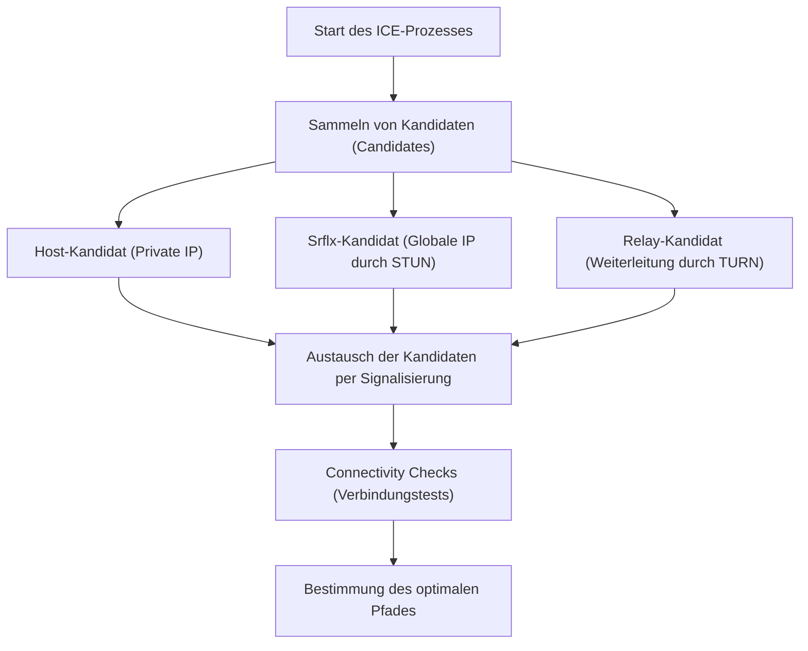

WebRTC (Web Real-Time Communication) ist eine Open-Source-Technologie, die den direkten Austausch von Sprache, Video und beliebigen Daten zwischen Webbrowsern ermöglicht, ohne dass Plugins oder zusätzliche Software installiert werden müssen. Als Kerntechnologie hinter Plattformen wie Google Meet, Zoom und Discord ist sie aus modernen Echtzeit-Webanwendungen nicht mehr wegzudenken.

In diesem Artikel werden wir die Tiefen von WebRTC umfassend erläutern, angefangen beim historischen Hintergrund, warum WebRTC benötigt wurde, über Mechanismen für NAT-Traversal, Signalisierung, Routing bis hin zu den zugrundeliegenden Protokollen.

## Die Grenzen von HTTP und WebSocket: Warum WebRTC notwendig ist

Um zu verstehen, wie WebRTC funktioniert, muss man zunächst wissen, warum bestehende Webtechnologien (HTTP und WebSocket) für die Echtzeit-Medienkommunikation ungeeignet sind.

### Merkmale und Herausforderungen der HTTP-Kommunikation
HTTP (Hypertext Transfer Protocol) ist ein anfrage- und antwortbasiertes Protokoll (Request-Response), das auf dem Client-Server-Modell beruht. Der grundlegende Ablauf ist unidirektional: Der Client sendet eine Anfrage, und der Server gibt eine Antwort zurück.
In den letzten Jahren hat die Einführung von HTTP/2 und HTTP/3 Funktionen wie Multiplexing und Server-Push hinzugefügt und die Leistung verbessert, aber die grundlegende Architektur – "keine Kommunikation ohne Server" – ist unverändert geblieben. Bei der Echtzeitübertragung von großen Datenmengen mit geringer Latenz, wie z. B. Video und Audio, über einen Server, werden die Serverlast und die Netzwerklatenz zu erheblichen Engpässen.

### Die Grenzen von WebSocket
WebSocket ist ein bidirektionales Kommunikationsprotokoll, das entwickelt wurde, um die Einschränkungen von HTTP zu überwinden. Sobald eine Verbindung hergestellt ist, können Client und Server jederzeit Daten senden und empfangen. Dies hat zu drastischen Verbesserungen bei Chat-Apps und Echtzeit-Benachrichtigungssystemen geführt.
Allerdings ist auch WebSocket vom Client-Server-Modell abhängig. Wenn eine große Datenmenge in Echtzeit zwischen den Teilnehmern ausgetauscht wird, wie z. B. bei einem Videoanruf, durchlaufen alle Datenströme den Server (Server-Relay), wodurch die Bandbreite und die Verarbeitungskapazität des Servers schnell an ihre Grenzen stoßen. Da es sich außerdem um eine TCP-basierte Kommunikation handelt, führt die erneute Übertragung bei Paketverlusten unweigerlich zu Verzögerungen (Head-of-Line Blocking), was ein kritisches Problem darstellt, da die Echtzeitfähigkeit beeinträchtigt wird.

Vor diesem Hintergrund entstand WebRTC, das es Clients ermöglicht, direkt miteinander zu kommunizieren (Peer-to-Peer, P2P), ohne über einen Server zu gehen, und das zudem auf UDP basiert, um Verzögerungen durch Neuübertragungen zu minimieren.

## Das Gesamtbild von WebRTC und der Weg zum Verbindungsaufbau

Der Aufbau einer P2P-Verbindung in WebRTC ist nicht so einfach wie "einfach Daten an den Browser der anderen Partei zu senden". In der modernen Internetumgebung befinden sich die meisten Geräte hinter Routern (NAT) und haben keine direkte globale IP-Adresse.
WebRTC durchläuft die folgenden Schritte, um eine Kommunikation zu initiieren:

1. **Signalisierung (Signaling)**: Die gegenseitige Präsenz erkennen und Verbindungsanforderungen (SDP) austauschen.
2. **Routensuche (ICE, STUN/TURN)**: Einen Netzwerkpfad finden, über den beide Seiten kommunizieren können.
3. **Aufbau der P2P-Verbindung und Verschlüsselung**: Austausch von Verschlüsselungsschlüsseln über DTLS und Datenübertragung über SRTP/SCTP.

```mermaid
sequenceDiagram
    participant PeerA as Peer A (Browser)
    participant SignalingServer as Signaling Server
    participant PeerB as Peer B (Browser)
    participant STUNTURN as STUN/TURN Server

    PeerA->>STUNTURN: Abfrage der eigenen globalen IP/Port
    STUNTURN-->>PeerA: Antwort mit globaler IP/Port
    PeerA->>SignalingServer: Senden des SDP Offer
    SignalingServer->>PeerB: Weiterleiten des SDP Offer
    PeerB->>STUNTURN: Abfrage der eigenen globalen IP/Port
    STUNTURN-->>PeerB: Antwort mit globaler IP/Port
    PeerB->>SignalingServer: Senden der SDP Answer
    SignalingServer->>PeerA: Weiterleiten der SDP Answer
    PeerA->>PeerB: Versuch einer P2P-Verbindung (ICE)
    PeerA<-->>PeerB: Direkte Kommunikation (Video, Audio, Daten)
```

## Signalisierung über SDP (Session Description Protocol)

Um P2P-Kommunikation durchzuführen, müssen beide Parteien Voraussetzungen austauschen, z. B. "Welche Art von Mediendaten können gesendet und empfangen werden?" und "Welche Codecs werden unterstützt?". Dieser Austauschprozess wird als **Signalisierung** bezeichnet.

Interessanterweise legt die WebRTC-Spezifikation kein spezifisches Protokoll dafür fest, "wie die Signalisierung durchgeführt werden soll". Entwickler können Signalisierungsserver mit beliebigen Mitteln wie WebSocket, Server-Sent Events (SSE) oder SIP aufbauen und den Informationsaustausch ermöglichen.

Die ausgetauschten Informationen sind in einem Format beschrieben, das als **SDP (Session Description Protocol)** bezeichnet wird.

### Ablauf des Austauschs von SDP Offer und Answer
Der Initiator der Kommunikation (Peer A) erstellt ein "SDP Offer", das die von ihm unterstützten Video- und Audiocodecs sowie Netzwerkinformationen enthält, und sendet es über den Signalisierungsserver an den Empfänger (Peer B).
Wenn der Empfänger (Peer B) das Angebot erhält, gleicht er es mit seiner eigenen Umgebung ab, wählt "gemeinsam nutzbare Codecs" usw. aus, erstellt eine "SDP Answer" und sendet sie an Peer A zurück.
Durch diesen Prozess einigen sich beide Parteien auf das Format für die Medienkommunikation.

## Die riesige Mauer: NAT und Firewalls

Der Austausch von SDP allein reicht nicht aus, um P2P-Kommunikation zu realisieren. Denn man muss die IP-Adresse und die Portnummer des Kommunikationspartners kennen. Jedoch stellt **NAT (Network Address Translation)**, das als Lösung für das Problem der Erschöpfung von IPv4-Adressen weit verbreitet ist, eine riesige Hürde für die P2P-Kommunikation dar.

### Die Rolle und die Probleme von NAT
In Heim- und Büronetzwerken stellen Router die NAT-Funktionalität bereit. Jedem Gerät im LAN wird eine private IP-Adresse (z. B. `192.168.1.10`) zugewiesen, und der Router kommuniziert im Namen der Geräte mit dem Internet unter Verwendung einer globalen IP-Adresse.
Bei der Kommunikation von innen nach außen werden Adresse und Port durch NAT automatisch übersetzt, aber **direkte Verbindungsanfragen von außen nach innen (zu einer bestimmten privaten IP) werden vom Router blockiert**. Dies ist der Grund, warum P2P-Kommunikation verhindert wird.

## Technologien für NAT-Traversal: STUN und TURN

Um dieses NAT-Problem zu lösen, verwendet WebRTC zwei Arten von Servern: **STUN** und **TURN**.

### STUN (Session Traversal Utilities for NAT)
Ein STUN-Server hat die Aufgabe, einem Client seine "eigene globale IP-Adresse und Portnummer aus Sicht des Internets" mitzuteilen.
Peer A sendet zunächst eine Anfrage an den STUN-Server. Der STUN-Server gibt als Antwort die Quell-IP und den Port der Anfrage (d. h. die globale IP des Routers und den übersetzten Port) zurück. Peer A gibt diese Informationen an Peer B als "seine Kontaktinformationen (ICE Candidate)" weiter.
STUN ist leichtgewichtig und belastet den Server kaum, und die meiste P2P-Kommunikation (über 80 %) ist mit STUN erfolgreich.

### TURN (Traversal Using Relays around NAT)
In strengen Unternehmens-Firewalls oder stark gesicherten NAT-Umgebungen, die als "Symmetric NAT" bezeichnet werden, kann es jedoch vorkommen, dass die Adressermittlung durch STUN und die direkte Kommunikation blockiert werden.
Als letzter Ausweg in solchen Fällen wird ein TURN-Server verwendet.
Ein TURN-Server **leitet alle Kommunikationsdaten weiter (Relay)**, wenn eine direkte P2P-Kommunikation nicht möglich ist. Genau genommen handelt es sich dann nicht mehr um eine P2P-Kommunikation, sie ist aber unerlässlich, um die Zuverlässigkeit der Verbindung zu gewährleisten. Da der gesamte Medienverkehr weitergeleitet wird, erfordert der Betrieb eines TURN-Servers eine enorme Bandbreite und verursacht hohe Serverkosten.

## Ermittlung des optimalen Pfades durch ICE (Interactive Connectivity Establishment)

Die durch STUN und TURN gesammelte "Liste der möglichen IP-Adressen und Ports für die Kommunikation" wird als **ICE Candidate** bezeichnet.
WebRTC testet alle möglichen Kombinationen von ICE Candidates, die von beiden Seiten gesammelt wurden, um den stabilsten Pfad mit der geringsten Latenz zu ermitteln. Dieses Framework wird als **ICE (Interactive Connectivity Establishment)** bezeichnet.

Die Priorität der Routen ist im Allgemeinen wie folgt:
1. **Host Candidate**: Direkte Kommunikation zwischen privaten IPs im selben LAN (am schnellsten).
2. **Server Reflexive Candidate**: P2P-Kommunikation über NAT unter Verwendung einer globalen IP, die über einen STUN-Server bezogen wurde.
3. **Relay Candidate**: Weitergeleitete Kommunikation über einen TURN-Server als letzter Ausweg (hohe Latenz).



## UDP-basierte Kommunikation und der Protokoll-Stack

Um eine geringe Latenz zu erreichen, basiert WebRTC auf **UDP (User Datagram Protocol)** anstelle von TCP. TCP ist zwar sehr zuverlässig, führt aber aufgrund der Bestätigung des Paketempfangs und der Neuübertragung zu Verzögerungen. Bei Videokonferenzen ist es wichtiger, dass "das aktuelle Bild in Echtzeit ankommt, auch wenn es ein paar Blockartefakte aufweist", als dass "das Bild von vor einer Sekunde mit perfekter Qualität verspätet ankommt".

Allerdings bietet reines UDP weder Verschlüsselung noch Mediensynchronisation. Daher hat WebRTC einen fortschrittlichen Protokoll-Stack auf UDP aufgebaut.

### Verschlüsselung durch DTLS
Die gesamte WebRTC-Kommunikation ist **zwingend verschlüsselt**. Für die Verschlüsselung der UDP-Kommunikation wird **DTLS (Datagram Transport Layer Security)**, die Datagramm-Version von TLS, verwendet. Da der Schlüsselaustausch direkt per P2P erfolgt, können Abhörversuche und Man-in-the-Middle-Angriffe verhindert werden.

### SRTP (Secure Real-time Transport Protocol)
Für die Übertragung von Mediendaten (Video und Audio) wird **SRTP** verwendet, das mit den über DTLS ausgetauschten Schlüsseln verschlüsselt ist. Durch das Hinzufügen von Zeitstempeln und Sequenznummern kompensiert SRTP die Schwächen von UDP ("fehlende Reihenfolgegarantie" und "Paketverlust") und ermöglicht eine reibungslose Wiedergabe auf der Empfängerseite.

### SCTP (Stream Control Transmission Protocol)
WebRTC verfügt über eine Funktion namens "Data Channel", mit der nicht nur Medien, sondern auch beliebige Binär- oder Textdaten gesendet und empfangen werden können. Sie wird für Dateiübertragungen, Spielsynchronisation und Ähnliches verwendet.
Für die Kommunikation dieses Data Channels wird das **SCTP**-Protokoll verwendet, das auf UDP aufbaut. SCTP ermöglicht eine flexible Konfiguration von "zuverlässiger Zustellung" und "Reihenfolgegarantie" für jeden Stream und kombiniert so die Vorteile von TCP und UDP für die Datenübertragung.

## Zusammenfassung

Um die einfache Anforderung "Browser einfach miteinander zu verbinden" zu erfüllen, verarbeitet WebRTC im Hintergrund erstaunlich komplexe Prozesse.

1. Die Überwindung der Grenzen von HTTP/WebSocket ("Verzögerung durch Server") durch UDP-basiertes P2P.
2. Das Durchbrechen der Barrieren von NAT und Firewalls mittels **STUN/TURN** und **ICE**.
3. Flexible Bedingungsverhandlungen durch Signalisierung mit **SDP**.
4. Sichere und bedarfsgerechte Datenübertragung durch Protokolle wie **DTLS, SRTP, SCTP**.

Die Tatsache, dass diese Technologien nun standardmäßig in Browsern implementiert sind und mit nur wenigen Zeilen JavaScript-Code aufgerufen werden können, ist ein großer Durchbruch in der Geschichte der Webtechnologien. Das Verständnis der robusten Netzwerktechnologien, die WebRTC zugrunde liegen, ist für die Entwicklung skalierbarer und hochwertiger Echtzeit-Anwendungen unerlässlich.