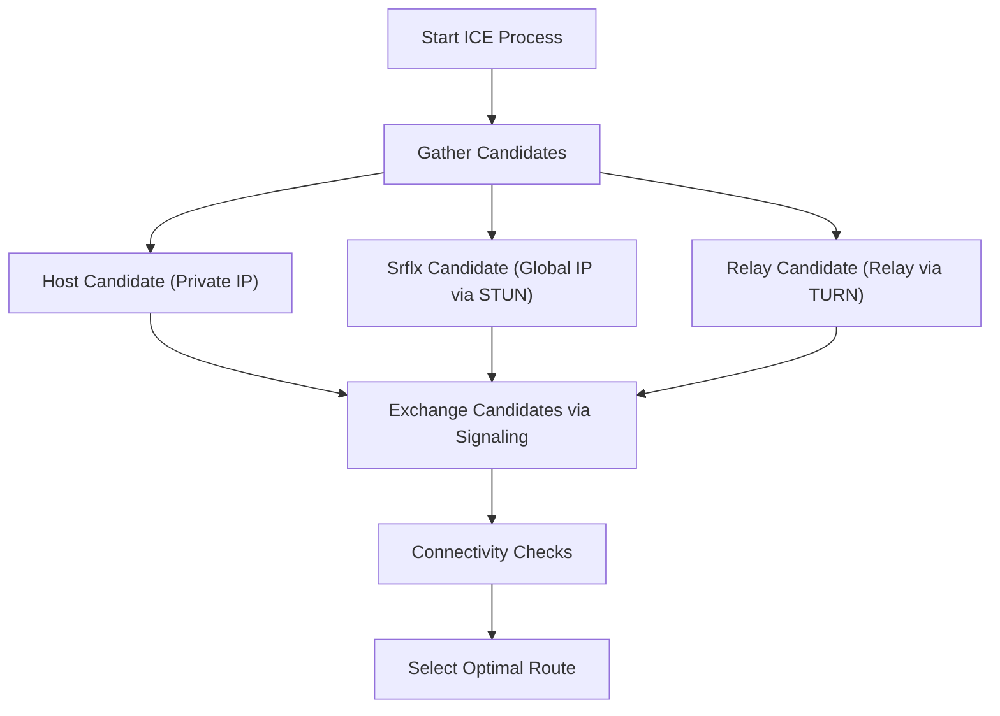

WebRTC (Web Real-Time Communication) is an open-source technology that enables direct exchange of audio, video, and arbitrary data between web browsers without requiring plugins or additional software installations. It is the core technology powering platforms like Google Meet, Zoom, and Discord, making it an indispensable component of modern real-time web applications.

This article provides a thorough explanation of the depths of WebRTC, starting from the historical background of why it was needed, to the mechanisms of NAT traversal, signaling, route discovery, and the underlying protocol suite.

## The Limitations of HTTP and WebSocket: Why WebRTC is Needed

To understand how WebRTC works, it is first necessary to know why existing web technologies (HTTP and WebSocket) are unsuitable for real-time media communication.

### Characteristics and Challenges of HTTP Communication
HTTP (Hypertext Transfer Protocol) is a request-response protocol based on the client-server model. The fundamental flow is unidirectional, where the client sends a request and the server returns a response.
In recent years, the emergence of HTTP/2 and HTTP/3 has improved performance by adding features like multiplexing and server push, but the fundamental architecture of "no communication without going through a server" remains unchanged. When exchanging streaming data like video and audio, which require high capacity and low latency, in real-time via a server, server load and network latency become major bottlenecks.

### The Limitations of WebSocket
WebSocket is a bidirectional communication protocol developed to overcome the constraints of HTTP. Once a connection is established, the client and server can send and receive data at any time. This brought dramatic improvements to chat applications and real-time notification systems.
However, WebSocket also relies on the client-server model. When sending and receiving large amounts of data in real-time between participants, such as in video calls, all data streams go through the server (server relay), quickly exhausting the server's bandwidth and processing capacity. Furthermore, because it is TCP-based communication, delays due to retransmission control when packet loss occurs (Head-of-Line Blocking) are unavoidable, which poses a fatal problem of compromising real-time performance.

Against this background, WebRTC emerged, allowing clients to communicate directly without a server (Peer-to-Peer, P2P), based on UDP, which has fewer retransmission delays.

## The Big Picture of WebRTC and the Path to Establishing Communication

Establishing P2P communication in WebRTC is not as simple as "suddenly sending data to the other party's browser." In today's internet environment, most devices sit behind routers (NAT) and do not directly possess a global IP address.
WebRTC goes through the following steps to initiate communication.

1. **Signaling**: Discovering each other's existence and exchanging connection requirements (SDP).
2. **Route Discovery (ICE, STUN/TURN)**: Discovering a mutually communicative network route.
3. **P2P Connection Establishment and Encryption**: Exchanging encryption keys via DTLS and transferring data via SRTP/SCTP.

```mermaid
sequenceDiagram
    participant PeerA as Peer A (Browser)
    participant SignalingServer as Signaling Server
    participant PeerB as Peer B (Browser)
    participant STUNTURN as STUN/TURN Server

    PeerA->>STUNTURN: Query own global IP/port
    STUNTURN-->>PeerA: Return global IP/port
    PeerA->>SignalingServer: Send SDP Offer
    SignalingServer->>PeerB: Relay SDP Offer
    PeerB->>STUNTURN: Query own global IP/port
    STUNTURN-->>PeerB: Return global IP/port
    PeerB->>SignalingServer: Send SDP Answer
    SignalingServer->>PeerA: Relay SDP Answer
    PeerA->>PeerB: P2P connection attempt (ICE)
    PeerA<-->>PeerB: Direct communication (Video, Audio, Data)
```

## Signaling via SDP (Session Description Protocol)

To perform P2P communication, both parties need to share prerequisite information such as "what kind of media data can be sent and received" and "what codecs are supported". This exchange process is called **Signaling**.

Interestingly, the WebRTC specification does not stipulate a specific protocol for "how to perform signaling." Developers can build a signaling server using any means, such as WebSocket, Server-Sent Events (SSE), or SIP, to exchange information.

The exchanged information is written in a format called **SDP (Session Description Protocol)**.

### SDP Offer and Answer Exchange Flow
The initiator of the communication (Peer A) creates an "SDP Offer" containing the video/audio codecs they support and network information, and sends it to the receiver (Peer B) via the signaling server.
Upon receiving the Offer, the receiver (Peer B) compares it with their own environment, selects "commonly usable codecs," etc., creates an "SDP Answer," and returns it to Peer A.
Through this process, both parties agree on the media communication format.

## The Great Wall: NAT and Firewalls

Exchanging SDP alone does not realize P2P communication because it is necessary to know the communication partner's IP address and port number. However, **NAT (Network Address Translation)**, popularized as a countermeasure to IPv4 exhaustion, stands as a massive wall preventing P2P communication.

### The Role and Problems of NAT
In home and office networks, a router provides the NAT functionality. Each device in the LAN is assigned a private IP address (e.g., `192.168.1.10`), and the router acts as a proxy for communication with the internet using a global IP address.
Communication from inside to outside has its addresses and ports automatically translated by NAT, but **direct connection requests from the outside to the inside (a specific private IP) are rejected by the router**. This is the cause of obstructing P2P communication.

## NAT Traversal Technology: STUN and TURN

To solve this NAT problem, WebRTC utilizes two types of servers: **STUN** and **TURN**.

### STUN (Session Traversal Utilities for NAT)
The STUN server has the role of telling the client "its own global IP address and port number as seen from the internet".
Peer A first sends a request to the STUN server. The STUN server returns the request's source IP and port (i.e., the router's global IP and translated port) as a response. Peer A conveys this information to Peer B as "its own contact address (ICE Candidate)".
STUN is lightweight and has low server load, and most P2P communications (over 80%) succeed by using STUN.

### TURN (Traversal Using Relays around NAT)
However, in strict corporate firewalls or robust NAT environments known as "Symmetric NAT," acquiring an address via STUN and direct communication may be blocked.
The TURN server is used as a last resort in such cases.
When P2P communication is impossible, the TURN server **relays all communication data**. Strictly speaking, this is no longer P2P communication, but it is indispensable for ensuring connection reliability. Because it relays all media traffic, operating a TURN server requires enormous bandwidth and server costs.

## Optimal Route Discovery with ICE (Interactive Connectivity Establishment)

The "candidate list of communicable IP addresses and ports" gathered by STUN or TURN is called an **ICE Candidate**.
WebRTC exhaustively tests all combinations of ICE Candidates gathered from both sides to determine the most stable route with the lowest latency. This framework is called **ICE (Interactive Connectivity Establishment)**.

The priority of routes is generally as follows:
1. **Host Candidate**: Direct communication between private IPs within the same LAN (fastest).
2. **Server Reflexive Candidate**: NAT traversal P2P communication using a global IP acquired via STUN.
3. **Relay Candidate**: Relay communication via a TURN server as a last resort (high latency).



## UDP-Based Communication and Protocol Stack

To achieve low latency, WebRTC is based on **UDP (User Datagram Protocol)** instead of TCP. While TCP is highly reliable, it incurs delays due to packet delivery confirmations and retransmission processing. In a video conference, it is more important that "the current video arrives in real-time, even with some block noise," rather than "the video from one second ago arrives perfectly later."

However, mere UDP cannot handle encryption or media synchronization. Therefore, WebRTC builds an advanced protocol stack on top of UDP.

### Encryption with DTLS
All WebRTC communication is **mandatorily encrypted**. For encrypting UDP communication, **DTLS (Datagram Transport Layer Security)**, which is the datagram version of TLS, is used. Because key exchange is done directly in P2P, eavesdropping and man-in-the-middle attacks can be prevented.

### SRTP (Secure Real-time Transport Protocol)
For transferring media data (video/audio), **SRTP**, which is encrypted using keys exchanged via DTLS, is used. By attaching timestamps and sequence numbers, SRTP compensates for UDP's weaknesses of "unguaranteed order" and "missing packets," enabling smooth playback on the receiving end.

### SCTP (Stream Control Transmission Protocol)
WebRTC has a "Data Channel" feature that can send and receive not only media but also arbitrary binary or text data. It is used for file transfers, game synchronization, etc.
Communication in this Data Channel uses the **SCTP** protocol built on top of UDP. SCTP can flexibly configure settings such as "highly reliable delivery guarantee" and "order guarantee" per stream, realizing data transfer that combines the strengths of both TCP and UDP.

## Conclusion

To satisfy the simple requirement of "just connecting browsers together," WebRTC handles surprisingly complex processes behind the scenes.

1. Solves the HTTP/WebSocket limitation of "server relay latency" with UDP-based P2P.
2. Breaks through NAT and firewall walls with **STUN/TURN** and **ICE**.
3. Negotiates conditions via signaling using flexible **SDP**.
4. Provides secure and requirements-driven data transfer with a suite of protocols such as **DTLS, SRTP, and SCTP**.

The standard implementation of these technologies in browsers, allowing them to be invoked with just a few dozen lines of JavaScript code, is a major breakthrough in the history of web technology. Understanding the robust network technologies behind WebRTC can be considered essential knowledge for developing more scalable and high-quality real-time applications.
