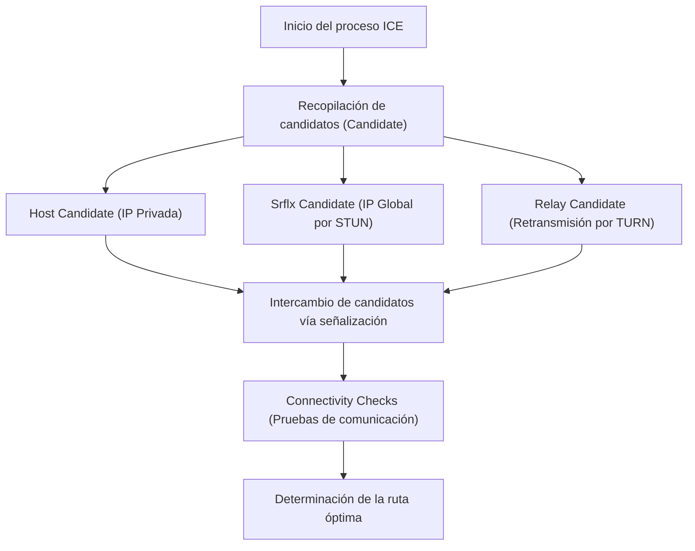

WebRTC (Web Real-Time Communication) es una tecnología de código abierto que permite la transmisión directa de audio, video y datos arbitrarios entre navegadores web sin necesidad de instalar plugins ni software adicional. Es la tecnología central que impulsa plataformas como Google Meet, Zoom y Discord, convirtiéndose en un componente indispensable para las aplicaciones web modernas en tiempo real.

En este artículo, explicaremos exhaustivamente las profundidades de WebRTC, comenzando con los antecedentes históricos de por qué fue necesario, hasta los mecanismos para atravesar NAT, la señalización, el descubrimiento de rutas y el conjunto de protocolos subyacentes.

## Las limitaciones de HTTP y WebSocket: ¿Por qué es necesario WebRTC?

Para comprender cómo funciona WebRTC, primero es necesario saber por qué las tecnologías web existentes (HTTP y WebSocket) no son adecuadas para la comunicación de medios en tiempo real.

### Características y desafíos de la comunicación HTTP
HTTP (Hypertext Transfer Protocol) es un protocolo de tipo solicitud-respuesta basado en un modelo cliente-servidor. El flujo unidireccional, donde el cliente envía una solicitud y el servidor devuelve una respuesta, es su base.
En los últimos años, con la llegada de HTTP/2 y HTTP/3, se han añadido funciones como la multiplexación y el server push (empuje del servidor), mejorando el rendimiento. Sin embargo, la arquitectura fundamental de 'no se puede comunicar sin pasar por un servidor' permanece intacta. Para transmitir y recibir datos de transmisión (streaming) en tiempo real, como video y audio, que requieren gran capacidad y baja latencia a través de un servidor, la carga en este último y el retraso de la red se convierten en cuellos de botella significativos.

### Las limitaciones de WebSocket
WebSocket es un protocolo de comunicación bidireccional desarrollado para superar las restricciones de HTTP. Una vez que se establece una conexión, el cliente y el servidor pueden enviar y recibir datos en cualquier momento. Esto trajo consigo mejoras dramáticas en aplicaciones de chat y sistemas de notificación en tiempo real.
Sin embargo, WebSocket también depende del modelo cliente-servidor. Al transmitir y recibir grandes cantidades de datos en tiempo real entre participantes, como en una videollamada, todos los flujos de datos pasan a través del servidor (retransmisión de servidor), lo que provoca que el ancho de banda y la capacidad de procesamiento del servidor alcancen rápidamente sus límites. Además, dado que es una comunicación basada en TCP, el retraso causado por el control de retransmisión cuando ocurre pérdida de paquetes (Bloqueo de Cabeza de Línea o 'Head-of-Line Blocking') es inevitable, lo cual es un problema fatal que degrada el tiempo real.

Debido a estos antecedentes, surgió WebRTC, que permite a los clientes comunicarse directamente entre sí sin pasar por un servidor (Peer-to-Peer, P2P), y que además se basa en UDP, el cual tiene un menor retraso de retransmisión.

## Visión general de WebRTC y el camino hacia el establecimiento de la comunicación

Establecer la comunicación P2P en WebRTC no es algo tan simple como 'enviar datos de repente al navegador de la otra persona'. En los entornos de internet modernos, la mayoría de los dispositivos se encuentran detrás de un enrutador (NAT) y no poseen una dirección IP global directamente.
WebRTC sigue los siguientes pasos para iniciar la comunicación:

1. **Señalización (Signaling)**: Conocer la existencia del otro e intercambiar los requisitos de conexión (SDP).
2. **Descubrimiento de ruta (ICE, STUN/TURN)**: Descubrir una ruta de red a través de la cual puedan comunicarse entre sí.
3. **Establecimiento de la conexión P2P y encriptación**: Intercambio de claves de encriptación mediante DTLS y transferencia de datos a través de SRTP/SCTP.

```mermaid
sequenceDiagram
    participant PeerA as Peer A (Navegador)
    participant SignalingServer as Servidor de Señalización
    participant PeerB as Peer B (Navegador)
    participant STUNTURN as Servidor STUN/TURN

    PeerA->>STUNTURN: Consulta su propia IP/puerto global
    STUNTURN-->>PeerA: Responde con IP/puerto global
    PeerA->>SignalingServer: Envía SDP Offer
    SignalingServer->>PeerB: Retransmite SDP Offer
    PeerB->>STUNTURN: Consulta su propia IP/puerto global
    STUNTURN-->>PeerB: Responde con IP/puerto global
    PeerB->>SignalingServer: Envía SDP Answer
    SignalingServer->>PeerA: Retransmite SDP Answer
    PeerA->>PeerB: Intento de conexión P2P (ICE)
    PeerA<-->>PeerB: Comunicación directa (Video, Audio, Datos)
```

## Señalización mediante SDP (Session Description Protocol)

Para realizar comunicación P2P, ambas partes deben compartir información previa como 'qué tipo de datos multimedia se pueden enviar y recibir' y 'qué códecs son compatibles'. Este proceso de intercambio se llama **señalización**.

Curiosamente, las especificaciones de WebRTC no definen un protocolo específico sobre 'cómo llevar a cabo la señalización'. Los desarrolladores pueden construir un servidor de señalización utilizando cualquier medio, como WebSocket, Server-Sent Events (SSE) o SIP, para intercambiar la información.

La información intercambiada se describe en un formato llamado **SDP (Session Description Protocol)**.

### Flujo de intercambio de SDP Offer y Answer
El iniciador de la comunicación (Peer A) crea un 'SDP Offer' que incluye información de red y los códecs de video/audio que soporta, y lo envía al receptor (Peer B) a través del servidor de señalización.
Cuando el receptor (Peer B) recibe el Offer, lo compara con su propio entorno para seleccionar 'códecs de uso común' y otras características, crea un 'SDP Answer' y lo devuelve al Peer A.
Mediante este proceso, ambas partes acuerdan el formato de la comunicación multimedia.

## Un gran muro: NAT y los cortafuegos (Firewalls)

La comunicación P2P no se puede lograr solo con el intercambio de SDP. Esto se debe a que es necesario conocer la dirección IP y el número de puerto de la contraparte. Sin embargo, el **NAT (Network Address Translation)**, que se popularizó como una medida contra el agotamiento de direcciones IPv4, se alza como un enorme muro que bloquea la comunicación P2P.

### El papel y los problemas del NAT
En las redes domésticas o de oficina, el enrutador proporciona la función NAT. A cada dispositivo en la LAN se le asigna una dirección IP privada (por ejemplo, `192.168.1.10`), y el enrutador se encarga de la comunicación con internet utilizando una dirección IP global.
Para la comunicación desde el interior hacia el exterior, NAT traduce automáticamente las direcciones y los puertos; sin embargo, **las solicitudes de conexión directa desde el exterior hacia el interior (a una IP privada específica) son rechazadas por el enrutador**. Esta es la causa que obstaculiza la comunicación P2P.

## Tecnologías para atravesar NAT: STUN y TURN

Para resolver este problema con NAT, WebRTC utiliza dos tipos de servidores: **STUN** y **TURN**.

### STUN (Session Traversal Utilities for NAT)
El servidor STUN tiene la función de informarle al cliente 'cuál es su propia dirección IP global y número de puerto desde la perspectiva de internet'.
Peer A primero envía una solicitud al servidor STUN. El servidor STUN devuelve la IP de origen y el puerto de la solicitud (es decir, la IP global del enrutador y el puerto traducido) como respuesta. Peer A comunica esta información a Peer B como su 'información de contacto (ICE Candidate)'.
STUN es ligero y tiene una carga de servidor baja, logrando que la mayoría de las comunicaciones P2P (más del 80%) tengan éxito al usarlo.

### TURN (Traversal Using Relays around NAT)
Sin embargo, en firewalls corporativos estrictos o en entornos NAT robustos conocidos como 'Symmetric NAT', la obtención de direcciones y la comunicación directa a través de STUN pueden verse bloqueadas.
El último recurso que se utiliza en tales casos es el servidor TURN.
Cuando la comunicación P2P no es posible, el servidor TURN **retransmite (relay) todos los datos de comunicación**. Estrictamente hablando, deja de ser una comunicación P2P, pero es indispensable para garantizar la confiabilidad de la conexión. Puesto que retransmite todo el tráfico multimedia, la operación de un servidor TURN consume una cantidad enorme de ancho de banda y costos de servidor.

## Búsqueda de la ruta óptima mediante ICE (Interactive Connectivity Establishment)

A la lista de 'candidatos de direcciones IP y puertos disponibles para la comunicación', recolectada por STUN y TURN, se le denomina **ICE Candidate**.
WebRTC somete a prueba de forma exhaustiva las combinaciones de todos los ICE Candidates recopilados por ambas partes, y determina la ruta más estable y con menor latencia. Este marco de trabajo se conoce como **ICE (Interactive Connectivity Establishment)**.

La prioridad de las rutas generalmente es la siguiente:
1. **Host Candidate**: Comunicación directa entre direcciones IP privadas en la misma LAN (la más rápida).
2. **Server Reflexive Candidate**: Comunicación P2P que atraviesa NAT utilizando la IP global obtenida a través de un servidor STUN.
3. **Relay Candidate**: Comunicación retransmitida a través de un servidor TURN como último recurso (alta latencia).



## Comunicación basada en UDP y la pila de protocolos

Para lograr una baja latencia, WebRTC se basa en **UDP (User Datagram Protocol)** en lugar de TCP. Aunque TCP es muy confiable, introduce demoras debido a la confirmación de llegada de paquetes y al procesamiento de retransmisiones. En una videoconferencia, es más importante que 'el video actual llegue en tiempo real, incluso si hay algo de ruido de bloques (block noise)', en lugar de que 'el video de hace un segundo llegue tarde pero con calidad de imagen perfecta'.

Sin embargo, UDP por sí solo no permite la encriptación ni la sincronización de medios. Por ello, WebRTC construye una avanzada pila de protocolos sobre UDP.

### Encriptación mediante DTLS
Las comunicaciones de WebRTC están **forzosamente encriptadas en su totalidad**. Para encriptar la comunicación UDP, se utiliza **DTLS (Datagram Transport Layer Security)**, que es la versión de datagramas de TLS. Al realizar el intercambio de claves directamente por P2P, se previenen las escuchas clandestinas y los ataques de intermediario (Man-in-the-middle).

### SRTP (Secure Real-time Transport Protocol)
Para la transferencia de datos multimedia (video y audio), se utiliza **SRTP**, el cual está encriptado con la clave intercambiada mediante DTLS. Al añadir marcas de tiempo (timestamps) y números de secuencia, SRTP compensa las debilidades de UDP, como la 'falta de garantía en el orden' y la 'pérdida de paquetes', lo que permite una reproducción fluida en el lado del receptor.

### SCTP (Stream Control Transmission Protocol)
WebRTC incluye una función llamada 'Data Channel' que permite enviar y recibir no solo medios, sino también datos arbitrarios de texto o binarios. Se utiliza para la transferencia de archivos o la sincronización en juegos.
Para la comunicación de este Data Channel, se emplea el protocolo **SCTP** construido sobre UDP. Dado que SCTP permite configurar flexiblemente características por flujo (stream), como 'garantía de entrega de alta confiabilidad' y 'garantía de orden', logra una transferencia de datos que combina las ventajas tanto de TCP como de UDP.

## Conclusión

Para cumplir con el simple requisito de 'conectar navegadores entre sí', WebRTC procesa operaciones sorprendentemente complejas en segundo plano.

1. Resuelve el 'retraso a través de servidores', que es la limitación de HTTP/WebSocket, utilizando P2P basado en UDP.
2. Atraviesa el muro de NAT y cortafuegos mediante **STUN/TURN** e **ICE**.
3. Negocia las condiciones de la comunicación en la señalización utilizando el flexible **SDP**.
4. Realiza una transferencia de datos segura y acorde a los requisitos a través del conjunto de protocolos **DTLS, SRTP y SCTP**.

Que estas tecnologías se hayan implementado como un estándar en los navegadores, y que puedan ser invocadas con solo unas docenas de líneas de código JavaScript, es un gran avance en la historia de la tecnología web. Comprender la sólida tecnología de redes detrás de WebRTC es, sin duda, un conocimiento esencial para desarrollar aplicaciones en tiempo real más escalables y de alta calidad.
