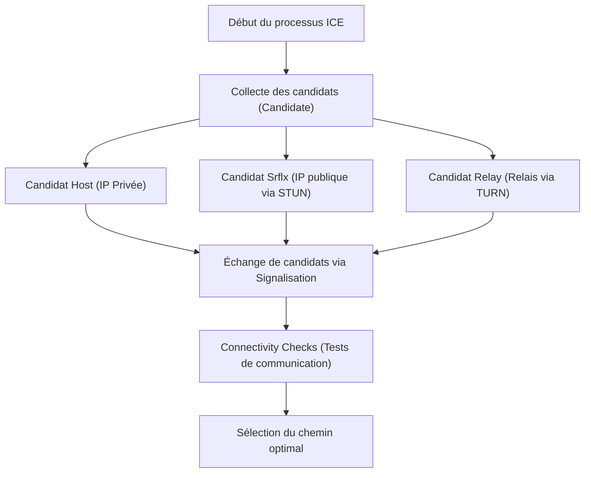

WebRTC (Web Real-Time Communication) est une technologie open source qui permet l'échange direct de voix, de vidéo et de données arbitraires entre les navigateurs web sans nécessiter l'installation de plugins ou de logiciels supplémentaires. C'est la technologie fondamentale qui propulse des plateformes comme Google Meet, Zoom et Discord, la rendant indispensable aux applications web en temps réel d'aujourd'hui.

Dans cet article, nous explorerons en profondeur WebRTC, en commençant par le contexte historique qui a rendu sa création nécessaire, jusqu'aux mécanismes de franchissement de NAT, la signalisation, la découverte de chemin, et la suite de protocoles sous-jacents.

## Les limites de HTTP et WebSocket : Pourquoi WebRTC est-il nécessaire ?

Pour comprendre comment fonctionne WebRTC, il est essentiel de savoir d'abord pourquoi les technologies web existantes (HTTP et WebSocket) sont inadaptées pour les communications multimédias en temps réel.

### Caractéristiques et défis des communications HTTP
HTTP (Hypertext Transfer Protocol) est un protocole de type requête-réponse basé sur le modèle client-serveur. Le flux unidirectionnel de base implique qu'un client envoie une requête et que le serveur renvoie une réponse.
Ces dernières années, avec l'avènement de HTTP/2 et HTTP/3, des fonctionnalités telles que le multiplexage et le server push ont été ajoutées pour améliorer les performances, mais l'architecture fondamentale de 'communication impossible sans passer par un serveur' reste inchangée. Lors de l'échange de données de streaming en temps réel à forte capacité et faible latence, telles que la vidéo et l'audio, via un serveur, la charge du serveur et la latence du réseau deviennent des goulots d'étranglement majeurs.

### Les limites de WebSocket
WebSocket est un protocole de communication bidirectionnelle développé pour surmonter les contraintes de HTTP. Une fois qu'une connexion est établie, les clients et les serveurs peuvent envoyer et recevoir des données à tout moment. Cela a apporté des améliorations drastiques aux applications de chat et aux systèmes de notification en temps réel.
Cependant, WebSocket dépend également du modèle client-serveur. Lors de l'envoi et de la réception d'énormes quantités de données en temps réel entre les participants, comme dans les appels vidéo, tous les flux de données passent par le serveur (relais de serveur), ce qui épuise rapidement la bande passante et la capacité de traitement du serveur. De plus, comme il s'agit d'une communication basée sur TCP, la latence due au contrôle de retransmission (Head-of-Line Blocking) lorsque des pertes de paquets se produisent est inévitable, un problème fatal qui détruit le caractère temps réel.

C'est dans ce contexte qu'est apparu WebRTC, qui permet aux clients de communiquer directement entre eux sans passer par un serveur (Peer-to-Peer, P2P), et est basé sur UDP, qui a moins de latence de retransmission.

## Vue d'ensemble de WebRTC et le chemin vers l'établissement d'une communication

L'établissement de communications P2P dans WebRTC n'est pas aussi simple que de 'envoyer soudainement des données au navigateur de l'autre partie'. Dans les environnements Internet modernes, la plupart des appareils se trouvent derrière des routeurs (NAT) et n'ont pas d'adresses IP publiques directes.
WebRTC suit ces étapes pour initier la communication :

1. **Signalisation (Signaling)** : Connaître l'existence de l'autre et échanger les exigences de connexion (SDP).
2. **Découverte de chemin (ICE, STUN/TURN)** : Découvrir un chemin réseau à travers lequel ils peuvent communiquer.
3. **Établissement de la connexion P2P et chiffrement** : Échange de clés de chiffrement via DTLS et transfert de données via SRTP/SCTP.

```mermaid
sequenceDiagram
    participant PeerA as Peer A (Navigateur)
    participant SignalingServer as Serveur de Signalisation
    participant PeerB as Peer B (Navigateur)
    participant STUNTURN as Serveurs STUN/TURN

    PeerA->>STUNTURN: Demande de son IP/port public
    STUNTURN-->>PeerA: Réponse avec l'IP/port public
    PeerA->>SignalingServer: Envoi de SDP Offer
    SignalingServer->>PeerB: Transfert de SDP Offer
    PeerB->>STUNTURN: Demande de son IP/port public
    STUNTURN-->>PeerB: Réponse avec l'IP/port public
    PeerB->>SignalingServer: Envoi de SDP Answer
    SignalingServer->>PeerA: Transfert de SDP Answer
    PeerA->>PeerB: Tentative de connexion P2P (ICE)
    PeerA<-->>PeerB: Communication directe (Vidéo/Audio/Données)
```

## Signalisation via SDP (Session Description Protocol)

Pour engager une communication P2P, les deux parties doivent partager des informations préalables telles que 'quel type de données multimédias peuvent être envoyées et reçues' et 'quels codecs sont pris en charge'. Ce processus d'échange est appelé **signalisation (Signaling)**.

Fait intéressant, la spécification WebRTC ne dicte pas de protocole spécifique sur 'comment effectuer la signalisation'. Les développeurs peuvent construire des serveurs de signalisation et échanger des informations en utilisant n'importe quelle méthode, comme WebSocket, Server-Sent Events (SSE) ou SIP.

Les informations échangées sont décrites dans un format appelé **SDP (Session Description Protocol)**.

### Le flux d'échange de SDP Offer et Answer
L'initiateur de la communication (Peer A) crée une 'SDP Offer' contenant les codecs vidéo/audio qu'il prend en charge et les informations réseau, et l'envoie au destinataire (Peer B) via le serveur de signalisation.
À la réception de l'offre, le destinataire (Peer B) la compare à son propre environnement, sélectionne les 'codecs pouvant être utilisés en commun', crée une 'SDP Answer', et la renvoie à Peer A.
Grâce à ce processus, les deux parties se mettent d'accord sur le format de communication multimédia.

## Le mur gigantesque : NAT et Pare-feu

L'échange de SDP seul ne permet pas d'atteindre la communication P2P. C'est parce que vous devez connaître l'adresse IP et le numéro de port du partenaire de communication. Cependant, **NAT (Network Address Translation)**, qui s'est répandu comme mesure contre l'épuisement d'IPv4, se dresse comme un mur gigantesque dans la communication P2P.

### Rôle et problèmes du NAT
Dans les réseaux domestiques ou d'entreprise, les routeurs fournissent la fonctionnalité NAT. À chaque appareil du réseau local (LAN) est attribuée une adresse IP privée (par exemple, `192.168.1.10`), et le routeur agit en leur nom pour communiquer avec Internet en utilisant une adresse IP publique.
Les communications de l'intérieur vers l'extérieur voient leurs adresses et ports automatiquement traduits par le NAT, mais **les demandes de connexion directes de l'extérieur vers l'intérieur (une IP privée spécifique) sont rejetées par le routeur**. C'est ce qui empêche les communications P2P.

## Les technologies de franchissement NAT : STUN et TURN

Pour résoudre ce problème NAT, WebRTC utilise deux types de serveurs : **STUN** et **TURN**.

### STUN (Session Traversal Utilities for NAT)
Un serveur STUN a pour rôle d'informer le client de 'sa propre adresse IP publique et numéro de port vus depuis Internet'.
Peer A envoie d'abord une requête au serveur STUN. Le serveur STUN répond avec l'IP source et le port de la requête (c'est-à-dire l'IP publique du routeur et le port traduit). Peer A transmet ces informations à Peer B comme 'ses coordonnées (ICE Candidate)'.
STUN est léger et impose une faible charge au serveur, et la plupart des communications P2P (environ 80% ou plus) réussissent en utilisant STUN.

### TURN (Traversal Using Relays around NAT)
Cependant, dans des pare-feu d'entreprise stricts ou des environnements NAT robustes appelés 'Symmetric NAT', l'acquisition d'adresses et la communication directe via STUN peuvent être bloquées.
Le serveur TURN est utilisé en dernier recours dans de tels cas.
Lorsque la communication P2P est impossible, un serveur TURN **relaie (relays) toutes les données de communication**. Strictement parlant, ce n'est plus de la communication P2P, mais c'est essentiel pour garantir la fiabilité de la connexion. Comme il relaie tout le trafic multimédia, l'exploitation d'un serveur TURN nécessite une bande passante massive et des coûts de serveur élevés.

## ICE (Interactive Connectivity Establishment) pour découvrir le chemin optimal

La liste des adresses IP et ports communicables collectés par STUN ou TURN est appelée un **ICE Candidate**.
WebRTC teste exhaustivement toutes les combinaisons de ICE Candidates collectés des deux côtés et détermine le chemin le plus stable avec la latence la plus faible. Ce framework est appelé **ICE (Interactive Connectivity Establishment)**.

La priorité des chemins est généralement la suivante :
1. **Host Candidate** : Communication directe entre IP privées au sein du même LAN (le plus rapide).
2. **Server Reflexive Candidate** : Communication P2P traversant le NAT en utilisant l'IP publique obtenue via un serveur STUN.
3. **Relay Candidate** : Communication relayée via un serveur TURN en dernier recours (latence élevée).



## Communications basées sur UDP et la pile de protocoles

Pour atteindre une faible latence, WebRTC est basé sur **UDP (User Datagram Protocol)** au lieu de TCP. Bien que TCP soit hautement fiable, il introduit de la latence due à la confirmation d'arrivée des paquets et au traitement des retransmissions. Dans les vidéoconférences, il est plus important que 'la vidéo actuelle arrive en temps réel, même s'il y a un peu de bruit de bloc' plutôt que 'la vidéo d'il y a une seconde arrive en retard avec une qualité d'image parfaite'.

Cependant, un simple UDP ne peut fournir ni chiffrement ni synchronisation des médias. Par conséquent, WebRTC construit une pile de protocoles sophistiquée au-dessus de UDP.

### Chiffrement via DTLS
Les communications WebRTC sont **toutes obligatoirement chiffrées**. La version datagramme de TLS, **DTLS (Datagram Transport Layer Security)**, est utilisée pour chiffrer les communications UDP. En effectuant un échange de clés directement en P2P, elle empêche les écoutes clandestines et les attaques de l'homme du milieu (man-in-the-middle).

### SRTP (Secure Real-time Transport Protocol)
Pour transférer des données multimédias (vidéo et audio), le **SRTP** chiffré utilisant les clés échangées via DTLS est employé. En ajoutant des horodatages et des numéros de séquence, SRTP compense les faiblesses de UDP, à savoir 'l'ordre n'est pas garanti' et 'les paquets sont perdus', permettant une lecture fluide côté récepteur.

### SCTP (Stream Control Transmission Protocol)
WebRTC possède une fonctionnalité appelée 'Data Channel' (canal de données) qui peut envoyer et recevoir non seulement des médias mais aussi des données binaires ou textuelles arbitraires. Elle est utilisée pour les transferts de fichiers, la synchronisation de jeux, etc.
Le protocole **SCTP**, construit sur UDP, est utilisé pour la communication de ce Data Channel. SCTP peut configurer de manière flexible des aspects tels que 'la garantie d'une livraison très fiable' et 'la garantie de l'ordre' pour chaque flux, atteignant ainsi un transfert de données qui combine les forces de TCP et UDP.

## Conclusion

WebRTC gère des processus étonnamment complexes en coulisses pour satisfaire l'exigence simple de 'connecter simplement les navigateurs ensemble'.

1. Résout la limitation de HTTP/WebSocket de 'latence via serveur' en utilisant le P2P basé sur UDP.
2. Franchit les murs des NAT et pare-feu avec **STUN/TURN** et **ICE**.
3. Négociation des conditions dans la signalisation à l'aide de **SDP** flexible.
4. Transfert de données sécurisé et adapté aux exigences grâce à une suite de protocoles tels que **DTLS, SRTP, SCTP**.

Le fait que ces technologies aient été implémentées comme normes dans les navigateurs et puissent être appelées avec seulement quelques dizaines de lignes de code JavaScript est une avancée majeure dans l'histoire des technologies web. Comprendre la technologie réseau robuste derrière WebRTC est sans doute une connaissance indispensable pour développer des applications en temps réel plus évolutives et de meilleure qualité.
