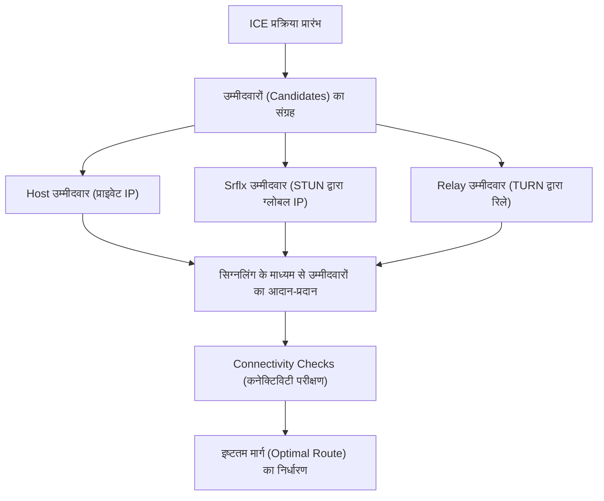

WebRTC (Web Real-Time Communication) एक ओपन-सोर्स तकनीक है जो बिना किसी प्लगइन या अतिरिक्त सॉफ़्टवेयर को इंस्टॉल किए वेब ब्राउज़र के बीच सीधे ऑडियो, वीडियो और मनमाने डेटा (arbitrary data) के आदान-प्रदान को सक्षम बनाती है। यह Google Meet, Zoom और Discord जैसे प्लेटफॉर्म्स को सपोर्ट करने वाली मुख्य तकनीक (core technology) है, और यह आधुनिक रियल-टाइम वेब एप्लिकेशन्स के लिए अपरिहार्य (indispensable) बन गई है।

इस लेख में, हम WebRTC की गहराई से पड़ताल करेंगे, इसकी आवश्यकता क्यों पड़ी इसकी ऐतिहासिक पृष्ठभूमि से लेकर NAT ट्रैवर्सल (NAT traversal) के मैकेनिज़्म, सिग्नलिंग, रूट डिस्कवरी (route discovery), और इसके आधारभूत प्रोटोकॉल सूट तक विस्तृत व्याख्या (comprehensive explanation) करेंगे।

## HTTP और WebSocket की सीमाएँ: WebRTC क्यों आवश्यक है

WebRTC के काम करने के तरीके को समझने के लिए, यह जानना आवश्यक है कि मौजूदा वेब तकनीकें (HTTP और WebSocket) रियल-टाइम मीडिया संचार (real-time media communication) के लिए उपयुक्त क्यों नहीं हैं।

### HTTP कम्यूनिकेशन की विशेषताएँ और चुनौतियाँ
HTTP (Hypertext Transfer Protocol) क्लाइंट-सर्वर मॉडल पर आधारित एक रिक्वेस्ट-रिस्पॉन्स (request-response) प्रोटोकॉल है। इसका मूल एक तरफ़ा प्रवाह (one-way flow) है, जहां क्लाइंट एक रिक्वेस्ट भेजता है और सर्वर एक रिस्पॉन्स लौटाता है।
हाल के वर्षों में HTTP/2 और HTTP/3 के आने से मल्टीप्लेक्सिंग (multiplexing) और सर्वर पुश (server push) जैसी सुविधाएँ जुड़ी हैं जिससे प्रदर्शन में सुधार हुआ है, लेकिन मूल आर्किटेक्चर "सर्वर के बिना संचार नहीं किया जा सकता" नहीं बदला है। वीडियो और ऑडियो जैसे लार्ज-वॉल्यूम (large-volume) और कम लेटेंसी (low-latency) वाले स्ट्रीमिंग डेटा को रियल-टाइम में एक सर्वर के माध्यम से आदान-प्रदान करने में सर्वर का लोड और नेटवर्क लेटेंसी एक बहुत बड़ा बॉटलनेक (bottleneck) बन जाते हैं।

### WebSocket की सीमाएँ
WebSocket एक द्विदिशीय संचार (bidirectional communication) प्रोटोकॉल है जिसे HTTP की सीमाओं को पार करने के लिए विकसित किया गया है। एक बार कनेक्शन स्थापित हो जाने के बाद, क्लाइंट और सर्वर किसी भी समय डेटा भेज और प्राप्त कर सकते हैं। इससे चैट ऐप्स और रियल-टाइम नोटिफिकेशन सिस्टम आदि में भारी सुधार हुआ है।
हालाँकि, WebSocket भी क्लाइंट-सर्वर मॉडल पर ही निर्भर करता है। जब वीडियो कॉल की तरह प्रतिभागियों के बीच बड़ी मात्रा में डेटा रियल-टाइम में भेजा और प्राप्त किया जाता है, तो सभी डेटा स्ट्रीम सर्वर के माध्यम से (सर्वर रिले) गुजरते हैं, जिससे सर्वर की बैंडविड्थ (bandwidth) और प्रोसेसिंग क्षमता जल्दी ही अपनी सीमा तक पहुँच जाती है। इसके अलावा, चूंकि यह TCP-आधारित संचार है, पैकेट लॉस होने पर रीट्रांसमिशन कंट्रोल के कारण होने वाली लेटेंसी (Head-of-Line Blocking) से बचा नहीं जा सकता, जो एक गंभीर समस्या है क्योंकि यह रियल-टाइम क्षमता से समझौता करता है।

इस पृष्ठभूमि के चलते, WebRTC का उदय हुआ, जो क्लाइंट्स को सर्वर के बिना (Peer-to-Peer, P2P) सीधे संवाद करने की अनुमति देता है, और यह UDP पर आधारित है जिसमें रीट्रांसमिशन लेटेंसी कम होती है।

## WebRTC का संपूर्ण चित्र (Overview) और संचार स्थापना (Connection Establishment) का मार्ग

WebRTC में P2P संचार स्थापित करना "अचानक दूसरे पक्ष के ब्राउज़र में डेटा भेजने" जितना आसान नहीं है। आधुनिक इंटरनेट वातावरण में, अधिकांश डिवाइस राउटर (NAT) के पीछे होते हैं और उनके पास सीधे तौर पर एक ग्लोबल IP एड्रेस नहीं होता है।
WebRTC में, संचार शुरू करने के लिए निम्नलिखित कदम उठाए जाते हैं:

1. **सिग्नलिंग (Signaling)**: एक-दूसरे की उपस्थिति को जानना और कनेक्शन आवश्यकताओं (SDP) का आदान-प्रदान करना।
2. **रूट डिस्कवरी (ICE, STUN/TURN)**: एक-दूसरे से संवाद करने के लिए उपलब्ध नेटवर्क मार्गों (network paths) की खोज करना।
3. **P2P कनेक्शन स्थापना और एन्क्रिप्शन**: DTLS के माध्यम से एन्क्रिप्शन कुंजियों का आदान-प्रदान, और SRTP/SCTP के माध्यम से डेटा ट्रांसफर।

```mermaid
sequenceDiagram
    participant PeerA as Peer A (ब्राउज़र)
    participant SignalingServer as सिग्नलिंग सर्वर
    participant PeerB as Peer B (ब्राउज़र)
    participant STUNTURN as STUN/TURN सर्वर

    PeerA->>STUNTURN: अपना ग्लोबल IP/पोर्ट पूछें
    STUNTURN-->>PeerA: ग्लोबल IP/पोर्ट का जवाब दें
    PeerA->>SignalingServer: SDP Offer भेजें
    SignalingServer->>PeerB: SDP Offer को ट्रांसफर करें
    PeerB->>STUNTURN: अपना ग्लोबल IP/पोर्ट पूछें
    STUNTURN-->>PeerB: ग्लोबल IP/पोर्ट का जवाब दें
    PeerB->>SignalingServer: SDP Answer भेजें
    SignalingServer->>PeerA: SDP Answer को ट्रांसफर करें
    PeerA->>PeerB: P2P कनेक्शन का प्रयास (ICE)
    PeerA<-->>PeerB: सीधा संचार (वीडियो, ऑडियो, डेटा)
```

## SDP (Session Description Protocol) द्वारा सिग्नलिंग

P2P संचार के लिए, दोनों पक्षों को बुनियादी जानकारी साझा करने की आवश्यकता होती है, जैसे कि "वे किस प्रकार का मीडिया डेटा भेज और प्राप्त कर सकते हैं" और "वे किन कोडेक्स (codecs) को सपोर्ट करते हैं"। इस आदान-प्रदान प्रक्रिया को **सिग्नलिंग** कहा जाता है।

दिलचस्प बात यह है कि WebRTC के स्पेसिफिकेशन में कोई विशिष्ट प्रोटोकॉल नियम नहीं है कि "सिग्नलिंग कैसे की जाए"। डेवलपर्स WebSocket, Server-Sent Events (SSE), या SIP जैसे किसी भी साधन का उपयोग करके सिग्नलिंग सर्वर बना सकते हैं और जानकारी का आदान-प्रदान कर सकते हैं।

आदान-प्रदान की गई जानकारी को एक फॉर्मेट में लिखा जाता है जिसे **SDP (Session Description Protocol)** कहा जाता है।

### SDP Offer और Answer का एक्सचेंज फ्लो
संचार शुरू करने वाला (Peer A) एक "SDP Offer" बनाता है जिसमें उसके द्वारा सपोर्टेड वीडियो और ऑडियो कोडेक्स और नेटवर्क की जानकारी होती है, और इसे सिग्नलिंग सर्वर के माध्यम से रिसीवर (Peer B) को भेजता है।
जब रिसीवर (Peer B) को Offer मिलता है, तो वह इसे अपने परिवेश से मिलाता है, "आमतौर पर उपयोग किए जा सकने वाले कोडेक्स" आदि का चयन करता है, और एक "SDP Answer" बनाता है और इसे Peer A को वापस भेजता है।
इस प्रक्रिया के माध्यम से, दोनों पक्ष मीडिया संचार (media communication) के फॉर्मेट पर सहमत होते हैं।

## बड़ी दीवार: NAT और फायरवॉल

केवल SDP का आदान-प्रदान करने से P2P संचार का अनुभव नहीं होता है। ऐसा इसलिए है क्योंकि आपको उस पक्ष के IP एड्रेस और पोर्ट नंबर को जानने की आवश्यकता है जिसके साथ आप संवाद कर रहे हैं। हालाँकि, **NAT (Network Address Translation)**, जो IPv4 एड्रेस की कमी की समस्या से निपटने के लिए लोकप्रिय हुआ, P2P संचार में एक बड़ी दीवार की तरह खड़ा है।

### NAT की भूमिका और समस्याएँ
घर या ऑफिस के नेटवर्क में, राउटर NAT की कार्यक्षमता प्रदान करता है। LAN के प्रत्येक डिवाइस को एक प्राइवेट IP एड्रेस (उदा: `192.168.1.10`) सौंपा जाता है, और राउटर इंटरनेट के साथ संचार करने के लिए ग्लोबल IP एड्रेस का उपयोग करके एक प्रॉक्सी के रूप में कार्य करता है।
अंदर से बाहर की ओर संचार (Internal to external communication) स्वचालित रूप से NAT द्वारा एड्रेस और पोर्ट को बदल देता है, लेकिन **बाहर से अंदर (विशिष्ट प्राइवेट IP) की ओर सीधे कनेक्शन के अनुरोध को राउटर द्वारा अस्वीकार कर दिया जाता है**। यही कारण है कि P2P संचार में बाधा आती है।

## NAT ट्रैवर्सल तकनीक: STUN और TURN

### STUN (Session Traversal Utilities for NAT)
STUN सर्वर की यह भूमिका है कि वह क्लाइंट को "इंटरनेट के नज़रिए से उसका अपना ग्लोबल IP एड्रेस और पोर्ट नंबर" बताए।
Peer A सबसे पहले STUN सर्वर को एक रिक्वेस्ट भेजता है। STUN सर्वर रिस्पॉन्स के रूप में रिक्वेस्ट के सोर्स IP और पोर्ट (यानी राउटर का ग्लोबल IP और परिवर्तित पोर्ट) को लौटाता है। Peer A इस जानकारी को Peer B को अपने "संपर्क जानकारी (ICE Candidate)" के रूप में बताता है।
STUN हल्का (lightweight) होता है और इस पर सर्वर का लोड भी कम होता है, और अधिकांश P2P संचार (लगभग 80% से अधिक) STUN का उपयोग करके सफल होते हैं।

### TURN (Traversal Using Relays around NAT)
हालाँकि, कंपनियों के सख्त फायरवॉल और "Symmetric NAT" नामक मजबूत NAT वातावरण में, STUN द्वारा एड्रेस प्राप्त करना और सीधा संचार ब्लॉक किया जा सकता है।
ऐसे मामलों में TURN सर्वर का उपयोग अंतिम उपाय (last resort) के रूप में किया जाता है।
जब P2P संचार संभव नहीं होता নাস通信 (P2P communication) संभव नहीं होता है, तो TURN सर्वर **सभी संचार डेटा को रिले (मध्यस्थता) करता है**। तकनीकी रूप से यह अब P2P संचार नहीं रह जाता है, लेकिन कनेक्शन की विश्वसनीयता (reliability) सुनिश्चित करने के लिए यह अपरिहार्य है। चूंकि यह सभी मीडिया ट्रैफिक को रिले करता है, इसलिए TURN सर्वर को ऑपरेट करने के लिए भारी बैंडविड्थ और सर्वर लागत की आवश्यकता होती है।

## ICE (Interactive Connectivity Establishment) के माध्यम से इष्टतम मार्ग (Optimal Route) की खोज

STUN और TURN द्वारा एकत्रित किए गए "संचार योग्य IP एड्रेस और पोर्ट्स की संभावित सूची (candidate list)" को **ICE Candidate** कहा जाता है।
WebRTC दोनों पक्षों से एकत्रित किए गए सभी ICE Candidate संयोजनों (combinations) का बारी-बारी से परीक्षण (brute-force test) करता है, और सबसे कम लेटेंसी वाले और स्थिर मार्ग का निर्धारण करता है। इस फ्रेमवर्क को **ICE (Interactive Connectivity Establishment)** कहा जाता है।

रूट्स (Routes) की प्राथमिकता आमतौर पर निम्नलिखित क्रम में होती है:
1. **Host Candidate**: समान LAN के भीतर प्राइवेट IPs के बीच सीधा संचार (सबसे तेज़)।
2. **Server Reflexive Candidate**: STUN सर्वर के माध्यम से प्राप्त ग्लोबल IP का उपयोग करते हुए NAT-ट्रैवर्सल P2P संचार।
3. **Relay Candidate**: अंतिम उपाय के रूप में TURN सर्वर के माध्यम से रिले (मध्यस्थता) संचार (उच्च लेटेंसी)।



## UDP-आधारित संचार और प्रोटोकॉल स्टैक

कम लेटेंसी (low latency) प्राप्त करने के लिए, WebRTC TCP के बजाय **UDP (User Datagram Protocol)** पर आधारित है। जबकि TCP अत्यधिक विश्वसनीय (reliable) है, इसमें पैकेट डिलीवरी की पुष्टि (acknowledgment) और रीट्रांसमिशन (पुनः प्रसारण) प्रक्रिया के कारण लेटेंसी उत्पन्न होती है। वीडियो कॉन्फ्रेंसिंग में, "वर्तमान वीडियो का वास्तविक समय (real-time) में पहुंचना, भले ही उसमें कुछ ब्लॉक नॉइज़ (block noise) हो" यह "1 सेकंड पहले के वीडियो का उत्तम गुणवत्ता में देरी से पहुंचने" की तुलना में अधिक महत्वपूर्ण है।

हालाँकि, साधारण UDP के साथ न तो एन्क्रिप्शन और न ही मीडिया सिंक्रोनाइज़ेशन (media synchronization) संभव है। इसलिए WebRTC ने UDP के ऊपर एक उन्नत (advanced) प्रोटोकॉल स्टैक बनाया है।

### DTLS के माध्यम से एन्क्रिप्शन
WebRTC के संचार **को अनिवार्य रूप से एन्क्रिप्ट** किया जाता है। UDP संचार के एन्क्रिप्शन के लिए, **DTLS (Datagram Transport Layer Security)**, जो कि TLS का डेटाग्राम (datagram) संस्करण है, का उपयोग किया जाता है। चूंकि P2P के माध्यम से की-एक्सचेंज (key exchange) सीधे किया जाता है, इसलिए ईव्सड्रॉपिंग (eavesdropping - छिपकर बातें सुनना) और मैन-इन-द-मिडिल (man-in-the-middle) हमलों को रोका जा सकता है।

### SRTP (Secure Real-time Transport Protocol)
मीडिया डेटा (वीडियो/ऑडियो) के ट्रांसफर के लिए, DTLS के साथ एक्सचेंज की गई कुंजी (key) का उपयोग करके एन्क्रिप्टेड **SRTP** का उपयोग किया जाता है। टाइमस्टैम्प (timestamp) और सीक्वेंस नंबर जोड़कर, SRTP UDP की कमजोरियों को पूरा करता है, जैसे "क्रम (order) की कोई गारंटी नहीं है" और "पैकेट ड्रॉप हो सकते हैं", जिससे रिसीवर की ओर स्मूथ प्लेबैक सक्षम होता है।

### SCTP (Stream Control Transmission Protocol)
WebRTC में एक "Data Channel" फ़ीचर है जो न केवल मीडिया बल्कि किसी भी मनमाने (arbitrary) बाइनरी या टेक्स्ट डेटा को भेजने और प्राप्त करने की अनुमति देता है। इसका उपयोग फ़ाइल ट्रांसफर, गेम सिंक्रोनाइज़ेशन आदि के लिए किया जाता है।
इस Data Channel संचार के लिए, UDP के ऊपर बनाए गए **SCTP** प्रोटोकॉल का उपयोग किया जाता है। SCTP "उच्च विश्वसनीयता वाली डिलीवरी गारंटी" और "क्रम गारंटी (order guarantee)" को प्रति स्ट्रीम (per stream) के आधार पर लचीले ढंग से कॉन्फ़िगर करने की अनुमति देता है, इस प्रकार यह एक डेटा ट्रांसफर प्रदान करता है जो TCP और UDP दोनों के लाभों को जोड़ता है।

## निष्कर्ष (Conclusion)

WebRTC, "केवल ब्राउज़रों को एक साथ जोड़ने" की सरल आवश्यकता को पूरा करने के लिए, पृष्ठभूमि (background) में आश्चर्यजनक रूप से जटिल प्रक्रियाओं को संभालता है।

1. HTTP/WebSocket की सीमा, जो "सर्वर के माध्यम से होने वाली लेटेंसी" है, को UDP-आधारित P2P संचार से हल किया जाता है।
2. NAT और फायरवॉल की बाधाओं को **STUN/TURN** और **ICE** का उपयोग करके पार किया जाता है।
3. फ्लेक्सिबल (Flexible) **SDP** का उपयोग करके सिग्नलिंग के दौरान शर्तों पर बातचीत (condition negotiation)।
4. **DTLS, SRTP, और SCTP** जैसे प्रोटोकॉल के माध्यम से सुरक्षित और आवश्यकता-अनुरूप (requirement-specific) डेटा ट्रांसफर।

यह वेब तकनीक के इतिहास में एक बड़ी सफलता (breakthrough) है कि इन तकनीकों को ब्राउज़र में एक मानक के रूप में लागू किया गया है और इसे केवल कुछ दर्जन लाइनों के JavaScript कोड के साथ कॉल किया जा सकता है। WebRTC के पीछे मजबूत नेटवर्क तकनीक को समझना, अधिक स्केलेबल (scalable) और उच्च-गुणवत्ता वाले रियल-टाइम एप्लिकेशन्स विकसित करने के लिए एक आवश्यक ज्ञान (indispensable knowledge) कहा जा सकता है।
