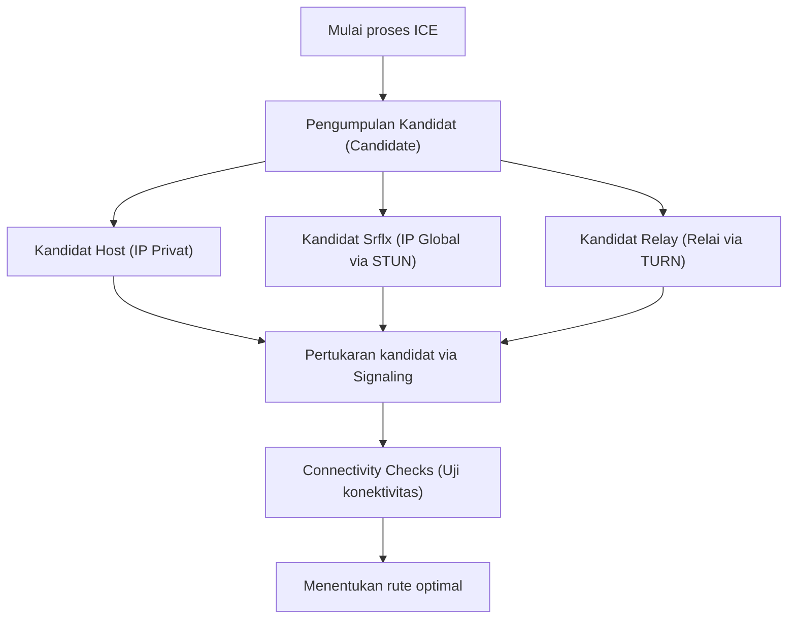

WebRTC (Web Real-Time Communication) adalah teknologi open-source yang memungkinkan pertukaran suara, video, dan data arbitrer secara langsung antar web browser tanpa perlu menginstal plugin atau perangkat lunak tambahan. Ini adalah teknologi inti yang mendukung platform seperti Google Meet, Zoom, dan Discord, dan telah menjadi kehadiran yang sangat penting untuk aplikasi web real-time modern.

Pada artikel ini, kita akan membahas WebRTC secara mendalam, mulai dari latar belakang sejarah mengapa WebRTC dibutuhkan, mekanisme penembusan NAT (NAT traversal), signaling, pencarian rute (routing), hingga kumpulan protokol dasar yang mendukungnya.

## Keterbatasan HTTP dan WebSocket: Mengapa WebRTC Dibutuhkan

Untuk memahami cara kerja WebRTC, pertama-tama kita perlu mengetahui mengapa teknologi web yang ada (HTTP dan WebSocket) tidak cocok untuk komunikasi media real-time.

### Karakteristik dan Tantangan Komunikasi HTTP
HTTP (Hypertext Transfer Protocol) adalah protokol tipe request-response yang didasarkan pada model client-server. Alur satu arah di mana klien mengirimkan permintaan dan server mengembalikan respons adalah dasar dari protokol ini.
Dalam beberapa tahun terakhir, dengan munculnya HTTP/2 dan HTTP/3, fitur-fitur seperti multiplexing dan server push telah ditambahkan untuk meningkatkan performa, tetapi arsitektur fundamental bahwa "komunikasi tidak dapat terjadi tanpa melalui server" tidak berubah. Untuk bertukar data streaming yang membutuhkan kapasitas besar dan latensi rendah seperti video dan audio secara real-time melalui server, beban server dan penundaan jaringan (network delay) menjadi hambatan yang besar.

### Keterbatasan WebSocket
WebSocket adalah protokol komunikasi dua arah yang dikembangkan untuk mengatasi keterbatasan HTTP. Di atas koneksi yang telah terbentuk, klien dan server dapat mengirim dan menerima data kapan saja. Hal ini membawa perbaikan dramatis untuk aplikasi obrolan (chat) dan sistem notifikasi real-time.
Namun, WebSocket juga bergantung pada model client-server. Ketika mengirim dan menerima sejumlah besar data secara real-time antar partisipan seperti dalam panggilan video, karena semua aliran data (data stream) melewati server (server relay), bandwidth dan kapasitas pemrosesan server akan segera mencapai batasnya. Selain itu, karena ini adalah komunikasi berbasis TCP, penundaan akibat kontrol transmisi ulang ketika terjadi kehilangan paket (packet loss) - dikenal sebagai Head-of-Line Blocking - tidak dapat dihindari, yang merupakan masalah fatal yang merusak sifat real-time.

Dari latar belakang ini, muncullah WebRTC, di mana klien berkomunikasi secara langsung satu sama lain (Peer-to-Peer, P2P) tanpa melalui server, dan terlebih lagi berbasis UDP yang memiliki penundaan transmisi ulang yang kecil.

## Gambaran Umum WebRTC dan Proses Pembuatan Koneksi

Pembuatan koneksi P2P dalam WebRTC bukanlah hal sederhana seperti "tiba-tiba mengirim data ke browser lawan". Di lingkungan internet modern, sebagian besar perangkat berada di belakang router (NAT) dan tidak memiliki alamat IP publik global secara langsung.
Dalam WebRTC, langkah-langkah berikut diambil untuk memulai komunikasi.

1. **Signaling**: Saling mengetahui keberadaan satu sama lain dan menukar persyaratan koneksi (SDP).
2. **Pencarian Rute (ICE, STUN/TURN)**: Menemukan rute jaringan yang memungkinkan keduanya berkomunikasi.
3. **Pembentukan Koneksi P2P dan Enkripsi**: Pertukaran kunci enkripsi melalui DTLS dan transfer data melalui SRTP/SCTP.

```mermaid
sequenceDiagram
    participant PeerA as Peer A (Browser)
    participant SignalingServer as Server Signaling
    participant PeerB as Peer B (Browser)
    participant STUNTURN as Server STUN/TURN

    PeerA->>STUNTURN: Meminta IP/Port global sendiri
    STUNTURN-->>PeerA: Membalas IP/Port global
    PeerA->>SignalingServer: Mengirim SDP Offer
    SignalingServer->>PeerB: Meneruskan SDP Offer
    PeerB->>STUNTURN: Meminta IP/Port global sendiri
    STUNTURN-->>PeerB: Membalas IP/Port global
    PeerB->>SignalingServer: Mengirim SDP Answer
    SignalingServer->>PeerA: Meneruskan SDP Answer
    PeerA->>PeerB: Percobaan koneksi P2P (ICE)
    PeerA<-->>PeerB: Komunikasi langsung (Video, Audio, Data)
```

## Signaling melalui SDP (Session Description Protocol)

Untuk melakukan komunikasi P2P, kedua belah pihak perlu berbagi informasi prasyarat seperti "jenis data media apa yang dapat dikirim dan diterima" dan "codec apa yang didukung". Proses pertukaran ini disebut **Signaling**.

Menariknya, spesifikasi WebRTC tidak menentukan protokol konkret tentang "bagaimana signaling harus dilakukan". Pengembang dapat membangun server signaling dan membuat informasi dipertukarkan menggunakan metode apa pun, seperti WebSocket, Server-Sent Events (SSE), atau SIP.

Informasi yang dipertukarkan ditulis dalam format yang disebut **SDP (Session Description Protocol)**.

### Alur Pertukaran SDP Offer dan Answer
Inisiator komunikasi (Peer A) membuat "SDP Offer" yang berisi informasi jaringan dan codec video/audio yang didukungnya, lalu mengirimkannya ke penerima (Peer B) melalui server signaling.
Ketika penerima (Peer B) menerima Offer, ia membandingkannya dengan lingkungannya sendiri, memilih "codec yang dapat digunakan bersama", membuat "SDP Answer", dan mengembalikannya ke Peer A.
Melalui proses ini, kedua belah pihak menyepakati format komunikasi media.

## Dinding Raksasa: NAT dan Firewall

Hanya dengan pertukaran SDP, komunikasi P2P tidak akan terwujud. Hal ini dikarenakan perlunya mengetahui alamat IP dan nomor port pihak lawan. Namun, **NAT (Network Address Translation)** yang dipopulerkan sebagai solusi untuk masalah kehabisan IPv4, berdiri sebagai dinding raksasa yang menghalangi komunikasi P2P.

### Peran dan Masalah NAT
Dalam jaringan rumah tangga atau kantor, router menyediakan fungsi NAT. Setiap perangkat dalam LAN diberi alamat IP privat (misal: `192.168.1.10`), dan router bertindak atas nama mereka untuk berkomunikasi dengan internet menggunakan alamat IP publik global.
Komunikasi dari dalam ke luar diterjemahkan alamat dan portnya secara otomatis oleh NAT, tetapi **permintaan koneksi langsung dari luar ke dalam (IP privat tertentu) ditolak oleh router**. Inilah penyebab yang menghalangi komunikasi P2P.

## Teknologi Penembusan NAT: STUN dan TURN

WebRTC menggunakan dua jenis server, **STUN** dan **TURN**, untuk memecahkan masalah NAT ini.

### STUN (Session Traversal Utilities for NAT)
Server STUN memiliki peran memberi tahu klien mengenai "alamat IP publik global dan nomor port dari klien itu sendiri seperti yang terlihat dari internet".
Pertama, Peer A mengirimkan permintaan ke server STUN. Server STUN mengembalikan IP dan port sumber dari permintaan tersebut (yaitu, IP global router dan port yang telah diterjemahkan) sebagai respons. Peer A menyampaikan informasi ini ke Peer B sebagai "informasi kontaknya sendiri (ICE Candidate)".
STUN ringan dan beban servernya rendah; sebagian besar komunikasi P2P (sekitar 80% lebih) berhasil dengan menggunakan STUN.

### TURN (Traversal Using Relays around NAT)
Namun, di bawah firewall perusahaan yang ketat atau lingkungan NAT yang kuat yang disebut "Symmetric NAT", perolehan alamat melalui STUN dan komunikasi langsung mungkin diblokir.
Pilihan terakhir yang digunakan dalam kasus seperti ini adalah server TURN.
Server TURN **merelai (mengulang/menjembatani) semua data komunikasi** jika komunikasi P2P tidak memungkinkan. Secara ketat, ini bukan lagi komunikasi P2P, tetapi ini sangat penting untuk memastikan kepastian koneksi. Karena server ini me-relay semua lalu lintas media, pengoperasian server TURN membutuhkan bandwidth dan biaya server yang sangat besar.

## Pencarian Rute Optimal melalui ICE (Interactive Connectivity Establishment)

"Daftar kandidat alamat IP dan port yang dapat dikomunikasikan" yang dikumpulkan oleh STUN dan TURN disebut **ICE Candidate**.
WebRTC menguji semua kombinasi ICE Candidate yang dikumpulkan dari kedua belah pihak secara brute-force, dan menentukan rute yang paling stabil dengan latensi terendah. Kerangka kerja ini disebut **ICE (Interactive Connectivity Establishment)**.

Prioritas rute umumnya adalah sebagai berikut:
1. **Host Candidate**: Komunikasi langsung antara IP privat di dalam LAN yang sama (tercepat).
2. **Server Reflexive Candidate**: Komunikasi P2P penembusan NAT menggunakan IP global yang diperoleh melalui server STUN.
3. **Relay Candidate**: Komunikasi relai melalui server TURN sebagai upaya terakhir (latensi tinggi).



## Komunikasi Berbasis UDP dan Tumpukan Protokol (Protocol Stack)

Untuk mencapai latensi rendah, WebRTC berbasis pada **UDP (User Datagram Protocol)**, bukan TCP. Walaupun TCP memiliki keandalan yang tinggi, ia menimbulkan penundaan karena konfirmasi penerimaan paket dan proses transmisi ulang. Dalam konferensi video, "menerima video saat ini secara real-time meskipun ada sedikit block noise" lebih penting daripada "video dari 1 detik yang lalu tiba dengan kualitas gambar sempurna secara tertunda".

Namun, UDP biasa tidak dapat melakukan enkripsi maupun sinkronisasi media. Oleh karena itu, WebRTC membangun tumpukan protokol (protocol stack) tingkat lanjut di atas UDP.

### Enkripsi melalui DTLS
Komunikasi WebRTC **secara paksa dienkripsi seutuhnya**. Untuk mengenkripsi komunikasi UDP, **DTLS (Datagram Transport Layer Security)** yang merupakan versi datagram dari TLS digunakan. Karena pertukaran kunci dilakukan secara langsung melalui P2P, penyadapan dan serangan man-in-the-middle dapat dicegah.

### SRTP (Secure Real-time Transport Protocol)
Untuk transfer data media (video dan audio), digunakan **SRTP** yang dienkripsi menggunakan kunci yang dipertukarkan melalui DTLS. SRTP memberikan stempel waktu (timestamp) dan nomor urut (sequence number) untuk mengkompensasi kelemahan UDP di mana "urutan tidak dijamin" dan "paket dapat hilang", sehingga memungkinkan pemutaran yang mulus di sisi penerima.

### SCTP (Stream Control Transmission Protocol)
WebRTC tidak hanya untuk media, tetapi juga memiliki fitur "Data Channel" yang dapat mengirim dan menerima teks atau data biner arbitrer. Ini digunakan untuk transfer file, sinkronisasi game, dan lainnya.
Untuk komunikasi Data Channel ini, protokol **SCTP** yang dibangun di atas UDP digunakan. SCTP dapat secara fleksibel mengonfigurasi pengaturan per stream seperti "jaminan pengiriman dengan keandalan tinggi" dan "jaminan urutan", sehingga mewujudkan transfer data yang menggabungkan kelebihan TCP dan UDP.

## Kesimpulan

WebRTC menangani proses kompleks yang luar biasa di balik layar hanya untuk memenuhi persyaratan sederhana yaitu "menghubungkan antar browser".

1. Mengatasi keterbatasan HTTP/WebSocket berupa "penundaan via server" dengan P2P berbasis UDP.
2. Menembus dinding NAT dan firewall dengan **STUN/TURN** dan **ICE**.
3. Negosiasi kondisi dengan signaling menggunakan **SDP** yang fleksibel.
4. Transfer data yang aman dan sesuai persyaratan dengan kumpulan protokol seperti **DTLS, SRTP, dan SCTP**.

Fakta bahwa teknologi-teknologi ini diimplementasikan sebagai standar di dalam browser dan dapat dipanggil hanya dengan beberapa puluh baris kode JavaScript merupakan terobosan besar dalam sejarah teknologi web. Pemahaman tentang teknologi jaringan yang kuat di balik WebRTC merupakan pengetahuan yang sangat penting untuk mengembangkan aplikasi real-time yang lebih skalabel dan berkualitas tinggi.
