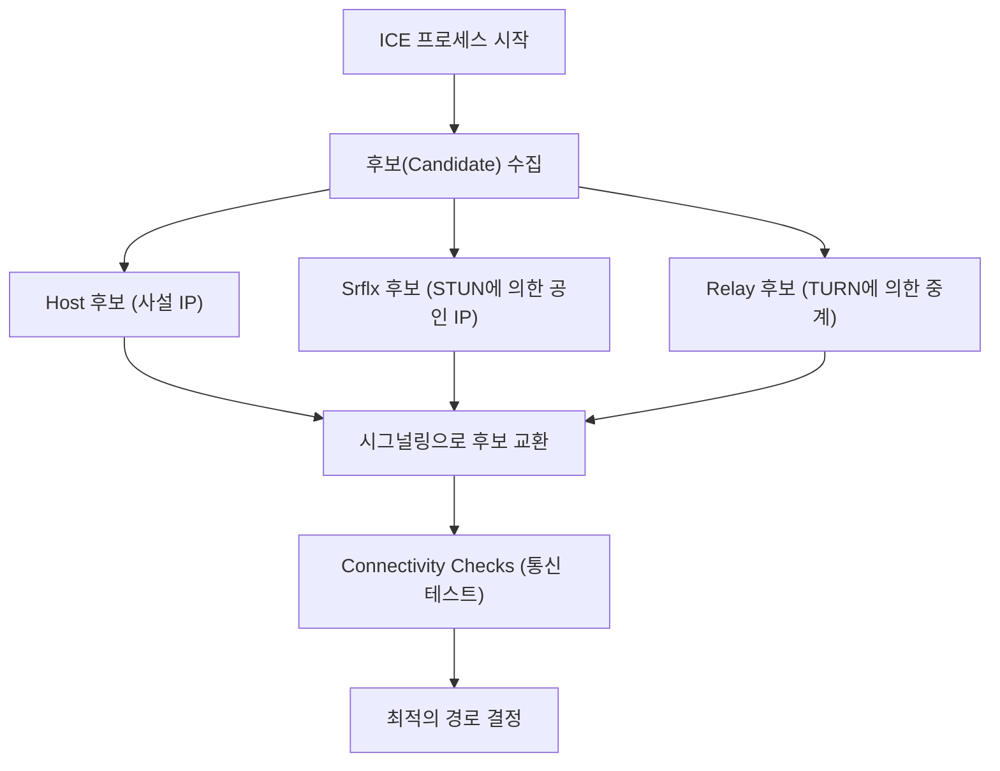

WebRTC(Web Real-Time Communication)는 플러그인이나 추가 소프트웨어를 설치하지 않고도 웹 브라우저 간에 직접 음성, 영상 및 임의의 데이터를 주고받을 수 있게 해주는 오픈 소스 기술입니다. Google Meet, Zoom, Discord와 같은 플랫폼을 지탱하는 핵심 기술이며, 현대의 실시간 웹 애플리케이션에서는 빼놓을 수 없는 존재가 되었습니다.

본 기사에서는 WebRTC가 왜 필요하게 되었는지에 대한 역사적 배경부터 시작하여, NAT 트래버설 구조, 시그널링, 경로 탐색, 그리고 기반이 되는 프로토콜 그룹에 이르기까지 WebRTC의 심층을 철저하게 해설합니다.

## HTTP와 WebSocket의 한계: 왜 WebRTC가 필요한가

WebRTC의 구조를 이해하기 위해서는 먼저 기존의 웹 기술(HTTP 및 WebSocket)이 왜 실시간 미디어 통신에 적합하지 않은지 알아야 합니다.

### HTTP 통신의 특징과 과제
HTTP(Hypertext Transfer Protocol)는 클라이언트-서버 모델에 기반한 요청-응답형 프로토콜입니다. 클라이언트가 요청을 보내면 서버가 응답을 반환하는 단방향 흐름이 기본이 됩니다.
최근에는 HTTP/2나 HTTP/3의 등장으로 멀티플렉싱이나 서버 푸시와 같은 기능이 추가되어 성능이 향상되었지만, "서버를 거치지 않으면 통신할 수 없다"는 근본적인 아키텍처는 변하지 않았습니다. 영상이나 음성과 같이 대용량이면서 짧은 지연 시간(Low Latency)이 요구되는 스트리밍 데이터를 서버를 경유하여 실시간으로 주고받으려면, 서버의 부하나 네트워크 지연이 큰 병목 현상이 됩니다.

### WebSocket의 한계
WebSocket은 HTTP의 제약을 극복하기 위해 개발된 양방향 통신 프로토콜입니다. 한 번 확립된 커넥션 위에서 클라이언트와 서버가 임의의 타이밍에 데이터를 송수신할 수 있습니다. 이로 인해 채팅 앱이나 실시간 알림 시스템 등에서는 극적인 개선을 가져왔습니다.
그러나 WebSocket 또한 클라이언트-서버 모델에 의존하고 있습니다. 화상 통화처럼 참가자 간에 대량의 데이터를 실시간으로 송수신할 경우, 모든 데이터 스트림이 서버를 경유하기 때문에(서버 릴레이), 서버의 대역폭과 처리 능력이 금방 한계에 다다릅니다. 또한, TCP 기반의 통신이므로 패킷 손실이 발생했을 때의 재전송 제어로 인한 지연(Head-of-Line Blocking)을 피할 수 없어 실시간성이 훼손된다는 치명적인 문제가 있습니다.

이러한 배경에서 서버를 거치지 않고 클라이언트끼리 직접 통신(Peer-to-Peer, P2P)하며, 나아가 재전송 지연이 적은 UDP를 기반으로 하는 WebRTC가 등장했습니다.

## WebRTC의 전체 상과 통신 확립까지의 여정

WebRTC에서의 P2P 통신 확립은 "갑자기 상대방의 브라우저에 데이터를 보낸다"와 같이 단순한 것이 아닙니다. 현대의 인터넷 환경에서는 대부분의 단말기가 라우터(NAT) 뒤에 존재하며, 공인 IP 주소를 직접 가지고 있지 않습니다.
WebRTC에서는 통신을 시작하기 위해 다음 단계를 거칩니다.

1. **시그널링(Signaling)**: 서로의 존재를 알고, 접속 요건(SDP)을 교환한다.
2. **경로 탐색(ICE, STUN/TURN)**: 서로 통신 가능한 네트워크 경로를 발견한다.
3. **P2P 연결 확립과 암호화**: DTLS를 통한 암호화 키 교환과 SRTP/SCTP를 통한 데이터 전송.

```mermaid
sequenceDiagram
    participant PeerA as Peer A (브라우저)
    participant SignalingServer as 시그널링 서버
    participant PeerB as Peer B (브라우저)
    participant STUNTURN as STUN/TURN 서버

    PeerA->>STUNTURN: 자신의 공인 IP/포트 문의
    STUNTURN-->>PeerA: 공인 IP/포트 응답
    PeerA->>SignalingServer: SDP Offer 전송
    SignalingServer->>PeerB: SDP Offer 전달
    PeerB->>STUNTURN: 자신의 공인 IP/포트 문의
    STUNTURN-->>PeerB: 공인 IP/포트 응답
    PeerB->>SignalingServer: SDP Answer 전송
    SignalingServer->>PeerA: SDP Answer 전달
    PeerA->>PeerB: P2P 연결 시도 (ICE)
    PeerA<-->>PeerB: 직접 통신 (영상·음성·데이터)
```

## SDP(Session Description Protocol)를 통한 시그널링

P2P 통신을 하려면 양측이 "어떤 미디어 데이터를 송수신할 수 있는가", "어떤 코덱을 지원하는가"와 같은 전제 정보를 공유해야 합니다. 이 교환 프로세스를 **시그널링**이라고 부릅니다.

흥미롭게도 WebRTC 사양에는 "시그널링을 어떻게 수행할 것인가"에 대한 구체적인 프로토콜 규정이 없습니다. 개발자는 WebSocket, Server-Sent Events (SSE), 혹은 SIP 등 임의의 수단을 이용해 시그널링 서버를 구축하고 정보를 교환하게 할 수 있습니다.

교환되는 정보는 **SDP(Session Description Protocol)**라는 포맷으로 작성됩니다.

### SDP Offer와 Answer의 교환 흐름
통신 시작자(Peer A)는 자신이 지원하는 영상·음성 코덱이나 네트워크 정보를 포함한 'SDP Offer'를 생성하여 시그널링 서버를 통해 수신자(Peer B)에게 전송합니다.
수신자(Peer B)는 Offer를 받으면 자신의 환경과 대조하여 '공통으로 사용할 수 있는 코덱' 등을 선정하고, 'SDP Answer'를 생성하여 Peer A에게 반환합니다.
이 프로세스를 통해 양측은 미디어 통신의 포맷에 합의합니다.

## 거대한 장벽: NAT와 방화벽

SDP 교환만으로는 P2P 통신이 실현되지 않습니다. 통신 상대방의 IP 주소와 포트 번호를 알아야 하기 때문입니다. 그러나 IPv4 고갈 문제에 대한 대책으로 보급된 **NAT(Network Address Translation)**가 P2P 통신에서 거대한 장벽으로 가로막고 있습니다.

### NAT의 역할과 문제점
가정이나 사무실의 네트워크에서는 라우터가 NAT 기능을 제공합니다. LAN 내의 각 기기에는 사설 IP 주소(예: `192.168.1.10`)가 할당되고, 라우터가 공인 IP 주소를 사용하여 인터넷과의 통신을 대행합니다.
내부에서 외부로의 통신은 NAT에 의해 자동으로 주소와 포트가 변환되지만, **외부에서 내부(특정 사설 IP)로의 직접적인 연결 요청은 라우터에 의해 거부됩니다**. 이것이 P2P 통신을 방해하는 원인입니다.

## NAT 트래버설 기술: STUN과 TURN

WebRTC는 이 NAT 문제를 해결하기 위해 **STUN**과 **TURN**이라는 두 종류의 서버를 이용합니다.

### STUN(Session Traversal Utilities for NAT)
STUN 서버는 클라이언트에게 "인터넷에서 본 자기 자신의 공인 IP 주소와 포트 번호"를 알려주는 역할을 합니다.
Peer A는 먼저 STUN 서버에 요청을 보냅니다. STUN 서버는 요청의 송신원 IP와 포트(즉, 라우터의 공인 IP와 변환된 포트)를 응답으로 반환합니다. Peer A는 이 정보를 "자신의 연락처(ICE Candidate)"로서 Peer B에게 전달합니다.
STUN은 가볍고 서버의 부하도 낮으며, 대부분의 P2P 통신(약 80% 이상)은 STUN을 사용하는 것만으로 성공합니다.

### TURN(Traversal Using Relays around NAT)
그러나 기업의 엄격한 방화벽이나 'Symmetric NAT'라고 불리는 강력한 NAT 환경에서는 STUN을 통한 주소 획득과 직접 통신이 차단될 수 있습니다.
이러한 경우 최후의 수단으로 이용되는 것이 TURN 서버입니다.
TURN 서버는 P2P 통신이 불가능한 경우에 **통신 데이터를 모두 중계(릴레이)**합니다. 엄밀히 말하면 P2P 통신은 아니게 되지만, 연결의 확실성을 담보하기 위해서는 필수적입니다. 모든 미디어 트래픽을 중계하기 때문에 TURN 서버의 운영에는 막대한 대역폭과 서버 비용이 소요됩니다.

## ICE(Interactive Connectivity Establishment)를 통한 최적 경로 탐색

STUN이나 TURN을 통해 수집된 "통신 가능한 IP 주소와 포트의 후보 목록"을 **ICE Candidate**라고 부릅니다.
WebRTC는 양측에서 수집된 모든 ICE Candidate의 조합을 전수 조사하여 테스트하고, 지연이 가장 적고 안정적인 경로를 결정합니다. 이 프레임워크를 **ICE(Interactive Connectivity Establishment)**라고 부릅니다.

경로의 우선순위는 일반적으로 다음과 같습니다:
1. **Host Candidate**: 동일 LAN 내의 사설 IP 간 직접 통신 (가장 빠름).
2. **Server Reflexive Candidate**: STUN 서버를 경유하여 획득한 공인 IP를 사용한 NAT 트래버설 P2P 통신.
3. **Relay Candidate**: 최후의 수단으로 TURN 서버를 경유한 중계 통신 (지연이 큼).



## UDP 기반 통신과 프로토콜 스택

WebRTC는 짧은 지연 시간을 실현하기 위해 TCP가 아닌 **UDP(User Datagram Protocol)**를 기반으로 합니다. TCP는 신뢰성이 높은 반면, 패킷 도달 확인이나 재전송 처리로 인해 지연이 발생합니다. 화상 회의에서 "1초 전의 영상이 완벽한 화질로 늦게 도착하는" 것보다는, "다소 블록 노이즈가 들어가더라도 현재의 영상이 실시간으로 도착하는" 것이 훨씬 중요합니다.

그러나 단순한 UDP만으로는 암호화도, 미디어의 동기화도 할 수 없습니다. 그래서 WebRTC는 UDP 위에 고도화된 프로토콜 스택을 구축하고 있습니다.

### DTLS를 통한 암호화
WebRTC의 통신은 **모두 강제로 암호화**됩니다. UDP 통신의 암호화에는 TLS의 데이터그램 버전인 **DTLS(Datagram Transport Layer Security)**가 사용됩니다. P2P로 직접 키 교환을 수행하므로, 도청이나 중간자 공격을 방지할 수 있습니다.

### SRTP(Secure Real-time Transport Protocol)
미디어 데이터(영상·음성) 전송에는 DTLS로 교환한 키를 사용하여 암호화된 **SRTP**가 사용됩니다. SRTP는 타임스탬프와 시퀀스 번호를 부여함으로써, UDP의 "순서가 보장되지 않는다", "패킷이 누락된다"는 약점을 보완하고, 수신 측에서의 매끄러운 재생을 가능하게 합니다.

### SCTP(Stream Control Transmission Protocol)
WebRTC에는 미디어뿐만 아니라 임의의 바이너리나 텍스트 데이터를 송수신할 수 있는 'Data Channel'이라는 기능이 있습니다. 파일 전송이나 게임의 동기화 등에 사용됩니다.
이 Data Channel의 통신에는 UDP 위에 구축된 **SCTP** 프로토콜이 사용됩니다. SCTP는 "신뢰성 높은 도달 보장"이나 "순서 보장" 등을 스트림마다 유연하게 설정할 수 있어, TCP의 장점과 UDP의 장점을 겸비한 데이터 전송을 실현합니다.

## 요약

WebRTC는 "단순히 브라우저끼리 연결한다"는 간단한 요건을 충족하기 위해 이면에서 놀라울 정도로 복잡한 프로세스를 처리하고 있습니다.

1. HTTP/WebSocket의 한계인 "서버 경유에 의한 지연"을 UDP 기반의 P2P로 해결.
2. NAT와 방화벽의 장벽을 **STUN/TURN**과 **ICE**로 돌파.
3. 유연한 **SDP**를 사용한 시그널링에서의 조건 협상.
4. **DTLS, SRTP, SCTP**와 같은 프로토콜 그룹을 통한, 안전하고 요건에 맞는 데이터 전송.

이러한 기술이 브라우저에 표준으로 구현되어 단 수십 줄의 JavaScript 코드로 호출할 수 있게 된 것은 웹 기술 역사상 큰 브레이크스루입니다. WebRTC 이면의 견고한 네트워크 기술에 대한 이해는 보다 확장 가능하고 고품질의 실시간 애플리케이션 개발에 필수적인 지식이라고 할 수 있을 것입니다.