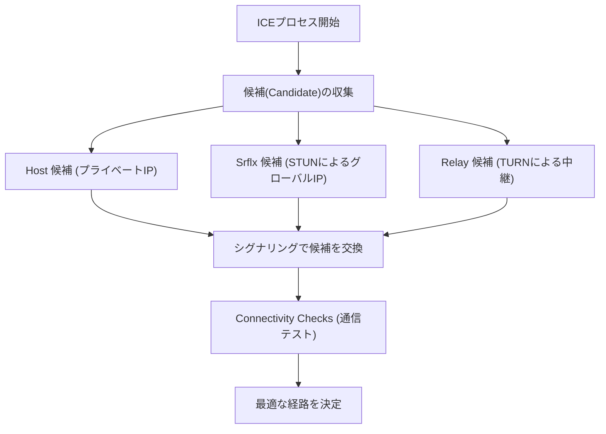

WebRTC（Web Real-Time Communication）は、プラグインや追加ソフトウェアをインストールすることなく、ウェブブラウザ間で直接音声、動画、および任意のデータのやり取りを可能にするオープンソースの技術です。Google MeetやZoom、Discordなどのプラットフォームを支える中核技術であり、現代のリアルタイムウェブアプリケーションには欠かせない存在となっています。

本記事では、WebRTCがなぜ必要とされたのかという歴史的背景から始まり、NAT越えの仕組み、シグナリング、経路探索、そして基盤となるプロトコル群に至るまで、WebRTCの深層を徹底的に解説します。

## HTTPとWebSocketの限界：なぜWebRTCが必要なのか

WebRTCの仕組みを理解するためには、まず既存のウェブ技術（HTTPおよびWebSocket）がなぜリアルタイムメディア通信に不向きなのかを知る必要があります。

### HTTP通信の特徴と課題
HTTP（Hypertext Transfer Protocol）は、クライアント・サーバーモデルに基づいたリクエスト・レスポンス型のプロトコルです。クライアントがリクエストを送信し、サーバーがレスポンスを返すという一方向のフローが基本となります。
近年ではHTTP/2やHTTP/3の登場により、多重化やサーバープッシュといった機能が追加されパフォーマンスは向上しましたが、「サーバーを介さなければ通信できない」という根本的なアーキテクチャは変わりません。映像や音声のような大容量かつ低遅延が求められるストリーミングデータを、サーバーを経由してリアルタイムにやり取りするには、サーバーの負荷やネットワーク遅延が大きなボトルネックとなります。

### WebSocketの限界
WebSocketは、HTTPの制約を克服するために開発された双方向通信プロトコルです。一度確立されたコネクション上で、クライアントとサーバーが任意のタイミングでデータを送受信できます。これにより、チャットアプリやリアルタイムな通知システムなどでは劇的な改善がもたらされました。
しかし、WebSocketもまたクライアント・サーバーモデルに依存しています。ビデオ通話のように参加者間で大量のデータをリアルタイムに送受信する場合、すべてのデータストリームがサーバーを経由するため（サーバーリレー）、サーバーの帯域幅や処理能力がすぐに限界に達します。また、TCPベースの通信であるため、パケットロスが発生した際の再送制御による遅延（Head-of-Line Blocking）が避けられず、リアルタイム性が損なわれるという致命的な問題があります。

こうした背景から、サーバーを介さずにクライアント同士が直接通信（Peer-to-Peer, P2P）し、さらに再送遅延の少ないUDPをベースとするWebRTCが登場しました。

## WebRTCの全体像と通信確立への道のり

WebRTCにおけるP2P通信の確立は、「いきなり相手のブラウザにデータを送りつける」といった単純なものではありません。現代のインターネット環境では、ほとんどの端末がルーター（NAT）の背後にあり、グローバルなIPアドレスを直接持っていません。
WebRTCでは、通信を開始するために以下のステップを踏みます。

1. **シグナリング（Signaling）**: 互いの存在を知り、接続要件（SDP）を交換する。
2. **経路探索（ICE, STUN/TURN）**: 互いに通信可能なネットワーク経路を発見する。
3. **P2P接続確立と暗号化**: DTLSによる暗号化鍵の交換と、SRTP/SCTPによるデータ転送。

```mermaid
sequenceDiagram
    participant PeerA as Peer A (ブラウザ)
    participant SignalingServer as シグナリングサーバー
    participant PeerB as Peer B (ブラウザ)
    participant STUNTURN as STUN/TURNサーバー

    PeerA->>STUNTURN: 自分のグローバルIP/ポートを問い合わせ
    STUNTURN-->>PeerA: グローバルIP/ポートを返答
    PeerA->>SignalingServer: SDP Offer を送信
    SignalingServer->>PeerB: SDP Offer を転送
    PeerB->>STUNTURN: 自分のグローバルIP/ポートを問い合わせ
    STUNTURN-->>PeerB: グローバルIP/ポートを返答
    PeerB->>SignalingServer: SDP Answer を送信
    SignalingServer->>PeerA: SDP Answer を転送
    PeerA->>PeerB: P2P接続の試行 (ICE)
    PeerA<-->>PeerB: 直接通信（映像・音声・データ）
```

## SDP（Session Description Protocol）によるシグナリング

P2P通信を行うには、双方が「どのようなメディアデータを送受信できるか」「どのようなコーデックをサポートしているか」といった前提情報を共有する必要があります。この交換プロセスを**シグナリング**と呼びます。

興味深いことに、WebRTCの仕様には「シグナリングをどのように行うか」という具体的なプロトコルの規定がありません。開発者はWebSocket、Server-Sent Events (SSE)、あるいはSIPなど、任意の手段を用いてシグナリングサーバーを構築し、情報を交換させることができます。

交換される情報は**SDP（Session Description Protocol）**と呼ばれるフォーマットで記述されます。

### SDP OfferとAnswerの交換フロー
通信の開始者（Peer A）は、自分がサポートする映像・音声コーデックやネットワーク情報を含む「SDP Offer」を作成し、シグナリングサーバー経由で受信者（Peer B）に送信します。
受信者（Peer B）はOfferを受け取ると、自身の環境と照らし合わせて「共通して使用できるコーデック」などを選定し、「SDP Answer」を作成してPeer Aに返します。
このプロセスにより、双方はメディア通信のフォーマットに合意します。

## 巨大な壁：NATとファイアウォール

SDPの交換だけではP2P通信は実現しません。通信相手のIPアドレスとポート番号を知る必要があるためです。しかし、IPv4枯渇問題への対策として普及した**NAT（Network Address Translation）**が、P2P通信において巨大な壁として立ちはだかります。

### NATの役割と問題点
家庭やオフィスのネットワークでは、ルーターがNAT機能を提供しています。LAN内の各デバイスにはプライベートIPアドレス（例: `192.168.1.10`）が割り当てられ、ルーターがグローバルIPアドレスを使ってインターネットと通信を代行します。
内部から外部への通信はNATによって自動的にアドレスとポートが変換されますが、**外部から内部（特定のプライベートIP）への直接の接続要求は、ルーターによって拒否されます**。これがP2P通信を阻む原因です。

## NAT越えの技術：STUNとTURN

WebRTCはこのNAT問題を解決するために、**STUN**と**TURN**という2種類のサーバーを利用します。

### STUN（Session Traversal Utilities for NAT）
STUNサーバーは、クライアントに「インターネットから見た自分自身のグローバルIPアドレスとポート番号」を教える役割を持ちます。
Peer Aは、まずSTUNサーバーにリクエストを送ります。STUNサーバーはリクエストの送信元IPとポート（つまりルーターのグローバルIPと変換後のポート）をレスポンスとして返します。Peer Aはこの情報を「自分の連絡先（ICE Candidate）」としてPeer Bに伝えます。
STUNは軽量でサーバーの負荷も低く、ほとんどのP2P通信（約80%以上）はSTUNを用いることで成功します。

### TURN（Traversal Using Relays around NAT）
しかし、企業の厳格なファイアウォールや「Symmetric NAT」と呼ばれる強固なNAT環境では、STUNによるアドレス取得と直接通信がブロックされることがあります。
このような場合の最終手段として利用されるのがTURNサーバーです。
TURNサーバーは、P2P通信が不可能な場合に、**通信データをすべて中継（リレー）**します。厳密にはP2P通信ではなくなりますが、接続の確実性を担保するためには不可欠です。すべてのメディアトラフィックを中継するため、TURNサーバーの運用には莫大な帯域幅とサーバーコストがかかります。

## ICE（Interactive Connectivity Establishment）による最適経路の探索

STUNやTURNによって収集された「通信可能なIPアドレスとポートの候補リスト」を**ICE Candidate**と呼びます。
WebRTCは、双方から集められたすべてのICE Candidateの組み合わせを総当たりでテストし、最も遅延が少なく安定した経路を決定します。このフレームワークを**ICE（Interactive Connectivity Establishment）**と呼びます。

経路の優先順位は一般的に以下の通りです：
1. **Host Candidate**: 同一LAN内のプライベートIP同士での直接通信（最速）。
2. **Server Reflexive Candidate**: STUNサーバー経由で取得したグローバルIPを用いたNAT越えP2P通信。
3. **Relay Candidate**: 最終手段としてのTURNサーバーを経由した中継通信（遅延大）。



## UDPベースの通信とプロトコルスタック

WebRTCは低遅延を実現するために、TCPではなく**UDP（User Datagram Protocol）**をベースとしています。TCPは信頼性が高い一方で、パケットの到達確認や再送処理による遅延が発生します。ビデオ会議において「1秒前の映像が完璧な画質で遅れて届く」ことよりも、「多少ブロックノイズが入っても、現在の映像がリアルタイムに届く」ことの方が重要です。

しかし、単なるUDPでは暗号化もメディアの同期もできません。そこでWebRTCは、UDPの上に高度なプロトコルスタックを構築しています。

### DTLSによる暗号化
WebRTCの通信は**すべて強制的に暗号化**されます。UDP通信の暗号化には、TLSのデータグラム版である**DTLS（Datagram Transport Layer Security）**が使用されます。P2Pで直接鍵交換を行うため、盗聴や中間者攻撃を防ぐことができます。

### SRTP（Secure Real-time Transport Protocol）
メディアデータ（映像・音声）の転送には、DTLSで交換した鍵を用いて暗号化された**SRTP**が使われます。SRTPは、タイムスタンプやシーケンス番号を付与することで、UDPの「順序が保証されない」「パケットが欠落する」という弱点を補い、受信側でのスムーズな再生を可能にします。

### SCTP（Stream Control Transmission Protocol）
WebRTCにはメディアだけでなく、任意のバイナリやテキストデータを送受信できる「Data Channel」という機能があります。ファイル転送やゲームの同期などに使われます。
このData Channelの通信には、UDP上に構築された**SCTP**プロトコルが使用されます。SCTPは、「信頼性の高い到達保証」や「順序の保証」などをストリームごとに柔軟に設定できるため、TCPの長所とUDPの長所を兼ね備えたデータ転送を実現します。

## まとめ

WebRTCは、「単にブラウザ同士を繋ぐ」というシンプルな要件を満たすために、背後で驚くべき複雑なプロセスを処理しています。

1. HTTP/WebSocketの限界である「サーバー経由の遅延」をUDPベースのP2Pで解決。
2. NATやファイアウォールの壁を**STUN/TURN**と**ICE**で突破。
3. 柔軟な**SDP**を用いたシグナリングでの条件交渉。
4. **DTLS, SRTP, SCTP**といったプロトコル群による、セキュアで要件に応じたデータ転送。

これらの技術がブラウザに標準実装され、わずか数十行のJavaScriptコードで呼び出せるようになったことは、ウェブ技術の歴史における大きなブレイクスルーです。WebRTCの背後にある堅牢なネットワーク技術の理解は、よりスケーラブルで高品質なリアルタイムアプリケーションの開発に不可欠な知識と言えるでしょう。
