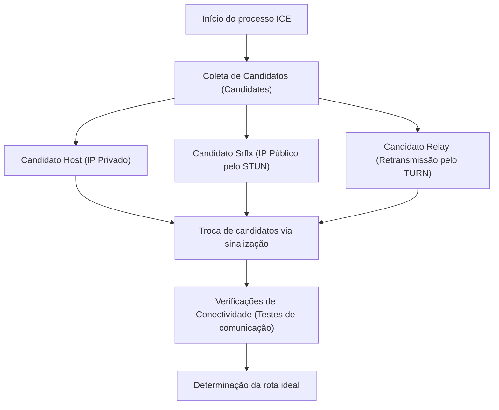

O WebRTC (Web Real-Time Communication) é uma tecnologia de código aberto que permite a troca de áudio, vídeo e dados arbitrários diretamente entre navegadores da web, sem a necessidade de instalar plugins ou softwares adicionais. É a tecnologia central por trás de plataformas como Google Meet, Zoom e Discord, tornando-se indispensável para aplicativos web modernos em tempo real.

Neste artigo, explicaremos o WebRTC em profundidade, começando pelo contexto histórico de por que ele foi necessário, passando pelos mecanismos de travessia de NAT, sinalização, descoberta de rotas e o conjunto de protocolos subjacentes.

## As Limitações do HTTP e do WebSocket: Por Que o WebRTC é Necessário

Para entender como o WebRTC funciona, primeiro precisamos saber por que as tecnologias web existentes (HTTP e WebSocket) não são adequadas para a comunicação de mídia em tempo real.

### Características e Desafios da Comunicação HTTP
O HTTP (Hypertext Transfer Protocol) é um protocolo do tipo requisição-resposta baseado no modelo cliente-servidor. O fluxo unidirecional, onde o cliente envia uma requisição e o servidor retorna uma resposta, é a base desse protocolo.
Nos últimos anos, o surgimento do HTTP/2 e HTTP/3 adicionou recursos como multiplexação e server push, melhorando o desempenho, mas a arquitetura fundamental de "não poder se comunicar sem passar por um servidor" permanece inalterada. Ao trocar dados de streaming de alta capacidade e baixa latência, como vídeo e áudio, em tempo real através de um servidor, a carga no servidor e a latência da rede se tornam grandes gargalos.

### Os Limites do WebSocket
O WebSocket é um protocolo de comunicação bidirecional desenvolvido para superar as limitações do HTTP. Uma vez que a conexão é estabelecida, o cliente e o servidor podem enviar e receber dados a qualquer momento. Isso trouxe melhorias drásticas em aplicativos de chat e sistemas de notificação em tempo real.
No entanto, o WebSocket também depende do modelo cliente-servidor. Ao enviar e receber grandes quantidades de dados em tempo real entre os participantes, como em uma videochamada, todos os fluxos de dados passam pelo servidor (retransmissão no servidor), o que faz com que a largura de banda e o poder de processamento do servidor atinjam rapidamente o seu limite. Além disso, por ser uma comunicação baseada em TCP, o atraso causado pelo controle de retransmissão quando ocorre a perda de pacotes (Head-of-Line Blocking) é inevitável, o que é um problema fatal que compromete a natureza de tempo real.

Nesse contexto, surgiu o WebRTC, que permite aos clientes se comunicarem diretamente entre si sem passar por um servidor (Peer-to-Peer, P2P) e é baseado em UDP, que possui menos atraso de retransmissão.

## A Visão Geral do WebRTC e o Caminho para Estabelecer a Comunicação

Estabelecer a comunicação P2P no WebRTC não é tão simples quanto "enviar dados repentinamente para o navegador da outra pessoa". No ambiente de internet moderno, a maioria dos dispositivos está atrás de um roteador (NAT) e não possui um endereço IP público (global) diretamente.
No WebRTC, os seguintes passos são dados para iniciar a comunicação:

1. **Sinalização (Signaling)**: Descobrir a presença um do outro e trocar os requisitos de conexão (SDP).
2. **Descoberta de Rota (ICE, STUN/TURN)**: Descobrir rotas de rede através das quais seja possível a comunicação mútua.
3. **Estabelecimento da Conexão P2P e Criptografia**: Troca de chaves de criptografia via DTLS e transferência de dados via SRTP/SCTP.

```mermaid
sequenceDiagram
    participant PeerA as Peer A (Navegador)
    participant SignalingServer as Servidor de Sinalização
    participant PeerB as Peer B (Navegador)
    participant STUNTURN as Servidor STUN/TURN

    PeerA->>STUNTURN: Consulta o próprio IP público/porta
    STUNTURN-->>PeerA: Retorna o IP público/porta
    PeerA->>SignalingServer: Envia SDP Offer
    SignalingServer->>PeerB: Encaminha SDP Offer
    PeerB->>STUNTURN: Consulta o próprio IP público/porta
    STUNTURN-->>PeerB: Retorna o IP público/porta
    PeerB->>SignalingServer: Envia SDP Answer
    SignalingServer->>PeerA: Encaminha SDP Answer
    PeerA->>PeerB: Tentativa de conexão P2P (ICE)
    PeerA<-->>PeerB: Comunicação direta (Vídeo/Áudio/Dados)
```

## Sinalização com SDP (Session Description Protocol)

Para realizar a comunicação P2P, ambas as partes precisam compartilhar informações prévias, como "quais dados de mídia podem ser enviados e recebidos" e "quais codecs são suportados". Esse processo de troca é chamado de **sinalização**.

Curiosamente, a especificação do WebRTC não prescreve um protocolo específico sobre "como realizar a sinalização". Os desenvolvedores podem construir um servidor de sinalização usando qualquer meio, como WebSocket, Server-Sent Events (SSE) ou SIP, para permitir a troca de informações.

As informações trocadas são descritas em um formato chamado **SDP (Session Description Protocol)**.

### Fluxo de Troca de SDP Offer e Answer
O iniciador da comunicação (Peer A) cria um "SDP Offer" contendo os codecs de vídeo e áudio que ele suporta, bem como informações de rede, e envia ao destinatário (Peer B) através do servidor de sinalização.
Ao receber o Offer, o destinatário (Peer B) o compara com seu próprio ambiente, seleciona os "codecs que podem ser usados em comum" e cria um "SDP Answer", retornando-o ao Peer A.
Através desse processo, ambas as partes chegam a um acordo sobre o formato da comunicação de mídia.

## A Grande Barreira: NAT e Firewall

Apenas a troca do SDP não permite realizar a comunicação P2P, pois é necessário conhecer o endereço IP e o número da porta do parceiro de comunicação. No entanto, o **NAT (Network Address Translation)**, que se popularizou como contramedida ao problema de esgotamento do IPv4, atua como uma grande barreira na comunicação P2P.

### O Papel e os Problemas do NAT
Em redes domésticas e de escritórios, o roteador fornece a função NAT. Cada dispositivo na LAN recebe um endereço IP privado (ex: `192.168.1.10`), e o roteador se comunica com a internet em nome deles, usando um endereço IP público.
A comunicação do interior para o exterior tem seu endereço e porta automaticamente traduzidos pelo NAT, mas **as solicitações de conexão direta vindas de fora para dentro (para um IP privado específico) são rejeitadas pelo roteador**. Essa é a causa que impede a comunicação P2P.

## Tecnologias de Travessia de NAT: STUN e TURN

Para resolver esse problema do NAT, o WebRTC utiliza dois tipos de servidores: **STUN** e **TURN**.

### STUN (Session Traversal Utilities for NAT)
O servidor STUN tem a função de informar ao cliente o "seu próprio endereço IP público e número da porta vistos a partir da internet".
Primeiro, o Peer A envia uma requisição ao servidor STUN. O servidor STUN responde com o IP e a porta de origem da requisição (ou seja, o IP público do roteador e a porta traduzida). O Peer A então transmite essa informação ao Peer B como seu "endereço de contato (ICE Candidate)".
O STUN é leve e tem baixa carga no servidor, e a maioria das comunicações P2P (mais de 80%) é bem-sucedida usando o STUN.

### TURN (Traversal Using Relays around NAT)
Contudo, em firewalls corporativos rígidos ou em ambientes de NAT robustos chamados "Symmetric NAT", a aquisição do endereço e a comunicação direta via STUN podem ser bloqueadas.
O servidor TURN é usado como último recurso em tais casos.
Quando a comunicação P2P não é possível, o servidor TURN **retransmite (faz o relay de) todos os dados de comunicação**. Estritamente falando, não é mais uma comunicação P2P, mas é essencial para garantir a confiabilidade da conexão. Visto que ele retransmite todo o tráfego de mídia, operar servidores TURN requer largura de banda e custos de servidor massivos.

## Descobrindo a Rota Ideal com ICE (Interactive Connectivity Establishment)

A lista de candidatos contendo endereços IP e portas com os quais a comunicação é possível, coletada pelo STUN e TURN, é chamada de **ICE Candidate**.
O WebRTC testa de forma exaustiva todas as combinações de ICE Candidates coletadas de ambas as partes e determina a rota com menor latência e maior estabilidade. Esse framework é chamado de **ICE (Interactive Connectivity Establishment)**.

A prioridade das rotas é geralmente a seguinte:
1. **Host Candidate**: Comunicação direta entre IPs privados na mesma LAN (Mais rápido).
2. **Server Reflexive Candidate**: Comunicação P2P com travessia de NAT usando o IP público obtido por meio do servidor STUN.
3. **Relay Candidate**: Comunicação de retransmissão passando por um servidor TURN como último recurso (Alta latência).



## Comunicação Baseada em UDP e Pilha de Protocolos

Para obter baixa latência, o WebRTC baseia-se em **UDP (User Datagram Protocol)** em vez de TCP. O TCP é altamente confiável, mas sofre com atrasos devido à confirmação de entrega de pacotes e processamento de retransmissão. Em videoconferências, "receber o vídeo atual em tempo real, mesmo com alguns ruídos de bloco" é mais importante do que "receber o vídeo de 1 segundo atrás atrasado, mas com qualidade de imagem perfeita".

Entretanto, o UDP simples não permite criptografia nem sincronização de mídia. Portanto, o WebRTC constrói uma pilha de protocolos avançada sobre o UDP.

### Criptografia com DTLS
**Toda a comunicação no WebRTC é obrigatoriamente criptografada**. O **DTLS (Datagram Transport Layer Security)**, a versão de datagrama do TLS, é usado para criptografar a comunicação UDP. Uma vez que a troca de chaves é feita diretamente em P2P, interceptações e ataques man-in-the-middle podem ser evitados.

### SRTP (Secure Real-time Transport Protocol)
Para a transferência de dados de mídia (vídeo e áudio), utiliza-se o **SRTP**, que é criptografado usando as chaves trocadas via DTLS. O SRTP compensa as fraquezas do UDP de "ausência de garantia de ordem" e "perda de pacotes" adicionando carimbos de data/hora (timestamps) e números de sequência, o que permite uma reprodução suave no lado do receptor.

### SCTP (Stream Control Transmission Protocol)
O WebRTC possui um recurso chamado "Data Channel" que permite o envio e recebimento de dados arbitrários de texto ou binários, não apenas mídia. Ele é usado para transferência de arquivos e sincronização de jogos, entre outros.
A comunicação no Data Channel usa o protocolo **SCTP** construído sobre o UDP. O SCTP permite que recursos como "garantia de entrega confiável" e "garantia de ordem" sejam configurados de forma flexível para cada stream (fluxo), alcançando assim uma transferência de dados que combina os pontos fortes do TCP e do UDP.

## Conclusão

O WebRTC lida com processos incrivelmente complexos nos bastidores para atender ao requisito simples de "conectar navegadores entre si".

1. Ele resolve a "latência por passar pelo servidor", a limitação do HTTP/WebSocket, usando P2P baseado em UDP.
2. Ultrapassa a barreira de NATs e firewalls com **STUN/TURN** e **ICE**.
3. Negociações de condições com sinalização usando **SDP** flexível.
4. Transferência de dados segura e orientada a requisitos por meio da suíte de protocolos como **DTLS, SRTP, e SCTP**.

O fato de essas tecnologias terem sido implementadas por padrão nos navegadores e poderem ser chamadas com apenas algumas dezenas de linhas de código JavaScript representa um grande avanço na história das tecnologias web. O entendimento das tecnologias robustas de rede por trás do WebRTC é sem dúvida um conhecimento indispensável para o desenvolvimento de aplicativos em tempo real mais escaláveis e de alta qualidade.
