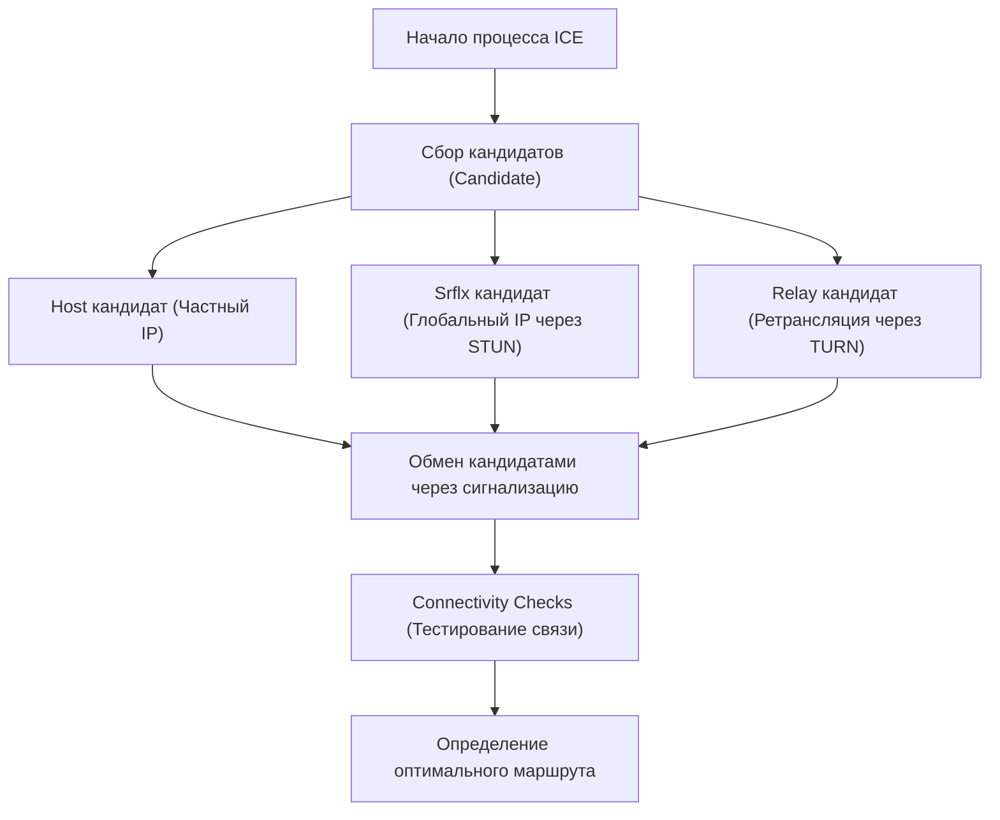

WebRTC (Web Real-Time Communication) — это технология с открытым исходным кодом, которая позволяет обмениваться аудио, видео и произвольными данными напрямую между веб-браузерами без необходимости установки плагинов или дополнительного программного обеспечения. Это ключевая технология, лежащая в основе таких платформ, как Google Meet, Zoom и Discord, и она стала неотъемлемой частью современных веб-приложений реального времени.

В этой статье мы подробно рассмотрим глубины WebRTC, начиная с исторических предпосылок ее возникновения, и заканчивая механизмами обхода NAT, сигнализацией, маршрутизацией (поиском пути) и базовыми протоколами.

## Ограничения HTTP и WebSocket: почему возникла необходимость в WebRTC

Чтобы понять, как работает WebRTC, необходимо сначала узнать, почему существующие веб-технологии (HTTP и WebSocket) не подходя для медиа-коммуникаций в реальном времени.

### Особенности и проблемы HTTP-коммуникаций
HTTP (Hypertext Transfer Protocol) — это протокол типа "запрос-ответ", основанный на модели "клиент-сервер". Базовым является однонаправленный поток: клиент отправляет запрос, а сервер возвращает ответ.
В последние годы, с появлением HTTP/2 и HTTP/3, были добавлены такие функции, как мультиплексирование и server push (отправка данных сервером), что улучшило производительность, но фундаментальная архитектура — "связь невозможна без участия сервера" — осталась неизменной. При обмене потоковыми данными в реальном времени, такими как видео и аудио, которые требуют высокой пропускной способности и низкой задержки, нагрузка на сервер и сетевые задержки становятся серьезным узким местом, если данные проходят через сервер.

### Ограничения WebSocket
WebSocket — это протокол двунаправленной связи, разработанный для преодоления ограничений HTTP. После установления соединения клиент и сервер могут отправлять и получать данные в любой момент. Это привело к кардинальным улучшениям в приложениях для чата и системах уведомлений в реальном времени.
Однако WebSocket также зависит от модели "клиент-сервер". Когда большое количество данных передается и принимается в реальном времени между участниками, как в случае видеозвонков, все потоки данных проходят через сервер (серверная ретрансляция), и пропускная способность и вычислительная мощность сервера быстро достигают своего предела. Кроме того, поскольку это связь на базе TCP, задержки из-за управления повторной передачей (Head-of-Line Blocking) при потере пакетов неизбежны, что является фатальной проблемой, нарушающей работу в реальном времени.

На этом фоне и появился WebRTC, который позволяет клиентам общаться напрямую друг с другом (Peer-to-Peer, P2P) без участия сервера, и основан на протоколе UDP, который минимизирует задержки повторной передачи.

## Общая картина WebRTC и путь к установлению связи

Установление P2P-связи в WebRTC — это не просто "внезапная отправка данных в браузер собеседника". В современной интернет-среде большинство устройств находятся за маршрутизаторами (NAT) и не имеют прямых глобальных IP-адресов.
В WebRTC для инициации связи выполняются следующие шаги:

1. **Сигнализация (Signaling)**: Обнаружение друг друга и обмен требованиями к соединению (SDP).
2. **Маршрутизация/Поиск пути (ICE, STUN/TURN)**: Обнаружение сетевых маршрутов, по которым возможна связь друг с другом.
3. **Установление P2P-соединения и шифрование**: Обмен ключами шифрования с помощью DTLS и передача данных по SRTP/SCTP.

```mermaid
sequenceDiagram
    participant PeerA as Peer A (Браузер)
    participant SignalingServer as Сервер сигнализации
    participant PeerB as Peer B (Браузер)
    participant STUNTURN as Сервер STUN/TURN

    PeerA->>STUNTURN: Запрос собственного глобального IP/порта
    STUNTURN-->>PeerA: Ответ с глобальным IP/портом
    PeerA->>SignalingServer: Отправка SDP Offer
    SignalingServer->>PeerB: Пересылка SDP Offer
    PeerB->>STUNTURN: Запрос собственного глобального IP/порта
    STUNTURN-->>PeerB: Ответ с глобальным IP/портом
    PeerB->>SignalingServer: Отправка SDP Answer
    SignalingServer->>PeerA: Пересылка SDP Answer
    PeerA->>PeerB: Попытка P2P-соединения (ICE)
    PeerA<-->>PeerB: Прямая связь (видео, аудио, данные)
```

## Сигнализация с помощью SDP (Session Description Protocol)

Для осуществления P2P-связи обе стороны должны поделиться предварительной информацией, такой как "какие медиаданные можно отправлять и получать" и "какие кодеки поддерживаются". Этот процесс обмена называется **сигнализацией**.

Интересно, что в спецификациях WebRTC нет конкретных положений о том, "как должна выполняться сигнализация". Разработчики могут использовать любые средства, такие как WebSocket, Server-Sent Events (SSE) или SIP, для создания сервера сигнализации и обмена информацией.

Обмениваемая информация описывается в формате, который называется **SDP (Session Description Protocol)**.

### Процесс обмена SDP Offer и Answer
Инициатор связи (Peer A) создает «SDP Offer», содержащий информацию о поддерживаемых видео- и аудиокодеках и сетевую информацию, и отправляет его получателю (Peer B) через сервер сигнализации.
Получив Offer, получатель (Peer B) сравнивает его со своей собственной средой, выбирает «совместно используемые кодеки» и т. д., создает «SDP Answer» и возвращает его Peer A.
С помощью этого процесса обе стороны приходят к соглашению о формате медиа-коммуникации.

## Огромная стена: NAT и брандмауэры

Один только обмен SDP не позволяет реализовать P2P-связь. Это связано с тем, что необходимо знать IP-адрес и номер порта собеседника. Однако **NAT (Network Address Translation)**, который стал популярным как мера противодействия проблеме исчерпания адресов IPv4, встает как огромная стена на пути P2P-коммуникаций.

### Роль и проблемы NAT
В домашних и офисных сетях маршрутизаторы предоставляют функцию NAT. Каждому устройству в локальной сети (LAN) назначается частный IP-адрес (например, `192.168.1.10`), а маршрутизатор выступает в качестве посредника для связи с Интернетом, используя глобальный IP-адрес.
Связь изнутри наружу автоматически преобразуется NAT (меняются адреса и порты), но **прямые запросы на подключение снаружи внутрь (к определенному частному IP-адресу) отклоняются маршрутизатором**. В этом и заключается причина, препятствующая P2P-связи.

## Технологии обхода NAT: STUN и TURN

WebRTC использует два типа серверов, **STUN** и **TURN**, для решения этой проблемы с NAT.

### STUN (Session Traversal Utilities for NAT)
Сервер STUN выполняет роль информирования клиента о его "собственном глобальном IP-адресе и номере порта, как они видны из Интернета".
Peer A сначала отправляет запрос серверу STUN. Сервер STUN возвращает в качестве ответа IP-адрес и порт отправителя запроса (то есть глобальный IP-адрес маршрутизатора и преобразованный порт). Peer A передает эту информацию Peer B как свою «контактную информацию (ICE Candidate)».
STUN легок, создает низкую нагрузку на сервер, и большинство P2P-соединений (около 80% или более) успешно устанавливаются с использованием STUN.

### TURN (Traversal Using Relays around NAT)
Однако строгие корпоративные брандмауэры и жесткие среды NAT, известные как «Symmetric NAT», могут блокировать получение адресов через STUN и прямую связь.
Сервер TURN используется в качестве крайнего средства в таких случаях.
Сервер TURN **ретранслирует (пересылает) все данные связи**, когда P2P-связь невозможна. Строго говоря, это больше не P2P-связь, но она необходима для обеспечения надежности соединения. Поскольку весь медиатрафик ретранслируется, эксплуатация сервера TURN требует огромной пропускной способности и затрат на серверы.

## Поиск оптимального маршрута с помощью ICE (Interactive Connectivity Establishment)

Собранный с помощью STUN и TURN «список кандидатов на IP-адреса и порты, доступных для связи», называется **ICE Candidate**.
WebRTC тестирует перебором все комбинации ICE Candidates, собранные с обеих сторон, и определяет наиболее стабильный маршрут с наименьшей задержкой. Этот фреймворк называется **ICE (Interactive Connectivity Establishment)**.

Приоритет маршрутов обычно следующий:
1. **Host кандидат (Частный IP)**: Прямая связь между частными IP-адресами в одной локальной сети (самый быстрый).
2. **Srflx кандидат (Глобальный IP через STUN)**: P2P-связь с обходом NAT с использованием глобального IP-адреса, полученного через сервер STUN.
3. **Relay кандидат (Ретрансляция через TURN)**: Ретранслируемая связь через сервер TURN в качестве крайнего средства (высокая задержка).



## Связь на базе UDP и стек протоколов

Для достижения низкой задержки WebRTC использует в качестве основы протокол **UDP (User Datagram Protocol)**, а не TCP. Хотя TCP обладает высокой надежностью, он вносит задержки из-за подтверждения доставки пакетов и процессов повторной передачи. В видеоконференциях гораздо важнее, чтобы «текущее видео доставлялось в реальном времени, даже с некоторыми артефактами сжатия», чем чтобы «видео с задержкой в одну секунду доставлялось с идеальным качеством».

Однако простой UDP не обеспечивает ни шифрования, ни синхронизации мультимедиа. Поэтому WebRTC выстраивает поверх UDP продвинутый стек протоколов.

### Шифрование с помощью DTLS
Связь WebRTC **принудительно шифруется полностью**. Для шифрования связи UDP используется **DTLS (Datagram Transport Layer Security)**, датаграммная версия TLS. Поскольку обмен ключами происходит напрямую в режиме P2P, это позволяет предотвратить подслушивание и атаки "человек посередине" (Man-in-the-Middle).

### SRTP (Secure Real-time Transport Protocol)
Для передачи медиаданных (видео и аудио) используется протокол **SRTP**, зашифрованный с использованием ключей, которыми обменялись через DTLS. SRTP компенсирует слабые стороны UDP — «отсутствие гарантии порядка» и «потерю пакетов» — путем добавления временных меток и порядковых номеров, что обеспечивает плавное воспроизведение на стороне получателя.

### SCTP (Stream Control Transmission Protocol)
В WebRTC есть функция «Data Channel», которая позволяет отправлять и получать не только медиа, но и произвольные двоичные и текстовые данные. Она используется для передачи файлов, синхронизации в играх и т. д.
Для связи через Data Channel используется протокол **SCTP**, построенный поверх UDP. SCTP позволяет гибко настраивать «надежную гарантию доставки» и «гарантию порядка» для каждого потока, обеспечивая передачу данных, сочетающую в себе преимущества как TCP, так и UDP.

## Заключение

WebRTC справляется с удивительно сложными фоновыми процессами, чтобы удовлетворить простое требование — «просто соединить браузеры».

1. Решает проблему «задержек из-за прохождения через сервер» — ограничение HTTP/WebSocket — с помощью P2P на базе UDP.
2. Преодолевает стены NAT и брандмауэров с помощью **STUN/TURN** и **ICE**.
3. Согласовывает условия в процессе сигнализации с помощью гибкого **SDP**.
4. Обеспечивает безопасную передачу данных в соответствии с требованиями с помощью набора протоколов, таких как **DTLS, SRTP и SCTP**.

То, что эти технологии стали стандартом в браузерах и могут быть вызваны всего несколькими десятками строк кода на JavaScript, является огромным прорывом в истории веб-технологий. Понимание надежных сетевых технологий, лежащих в основе WebRTC, является важным знанием для разработки более масштабируемых и высококачественных приложений реального времени.
