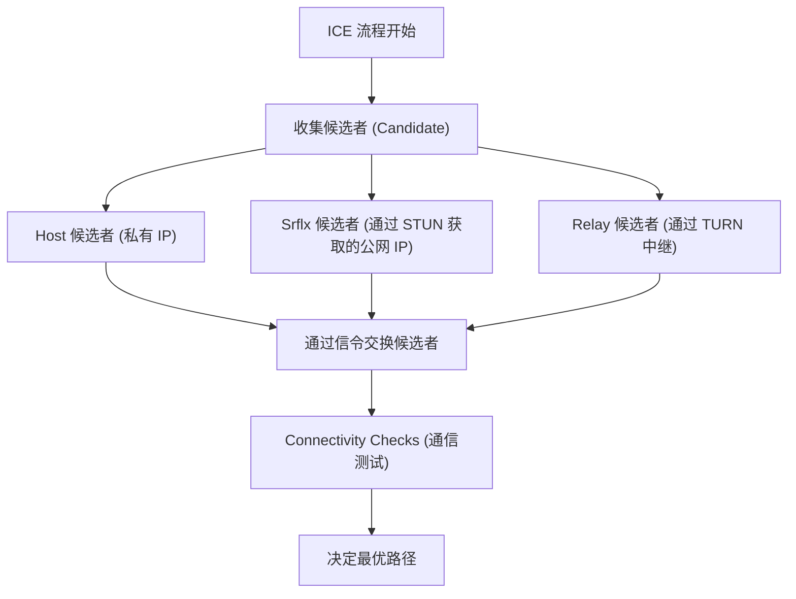

WebRTC（Web Real-Time Communication）是一项开源技术，无需安装任何插件或额外软件，即可在网页浏览器之间直接进行语音、视频和任意数据的交换。作为支撑 Google Meet、Zoom、Discord 等平台的核心技术，它在现代实时 Web 应用中不可或缺。

本文将从 WebRTC 诞生的历史背景出发，深入浅出地全面解析其底层机制，包括 NAT 穿透原理、信令、路由查找以及底层的协议栈。

## HTTP 与 WebSocket 的局限性：为什么需要 WebRTC

要理解 WebRTC 的工作原理，首先需要了解为什么现有的 Web 技术（HTTP 和 WebSocket）不适合用于实时媒体通信。

### HTTP 通信的特点与挑战
HTTP（Hypertext Transfer Protocol，超文本传输协议）是一种基于客户端-服务器模型的请求-响应式协议。其基本流程是单向的：客户端发送请求，服务器返回响应。
近年来，随着 HTTP/2 和 HTTP/3 的出现，新增了多路复用和服务器推送等功能，性能得到了提升，但“不通过服务器就无法通信”的根本架构并没有改变。如果要将视频和音频这样需要大容量、低延迟的流媒体数据通过服务器进行实时交换，服务器的负载和网络延迟将成为巨大的瓶颈。

### WebSocket 的局限性
WebSocket 是为了克服 HTTP 的限制而开发的双向通信协议。一旦建立连接，客户端和服务器就可以在任意时间发送和接收数据。这为聊天应用和实时通知系统等带来了戏剧性的改善。
然而，WebSocket 依然依赖于客户端-服务器模型。当像视频通话这样在参与者之间实时收发大量数据时，所有的数据流都需要经过服务器（服务器中继），这将导致服务器的带宽和处理能力迅速达到极限。此外，由于它是基于 TCP 的通信，一旦发生丢包，重传控制所引发的延迟（队头阻塞，Head-of-Line Blocking）是不可避免的，这将严重破坏实时性，成为致命问题。

在这样的背景下，不经过服务器、由客户端之间直接通信（Peer-to-Peer, P2P），且基于重传延迟较小的 UDP 的 WebRTC 应运而生。

## WebRTC 的全貌与通信建立之路

在 WebRTC 中建立 P2P 通信，绝非“直接把数据发给对方浏览器”那么简单。在现代互联网环境中，大多数设备都位于路由器（NAT）之后，并没有直接拥有公网 IP 地址。
WebRTC 为了开始通信，需要经历以下步骤：

1. **信令（Signaling）**: 发现彼此的存在，并交换连接要求（SDP）。
2. **路由查找（ICE, STUN/TURN）**: 寻找相互之间可以通信的网络路径。
3. **建立 P2P 连接与加密**: 通过 DTLS 交换加密密钥，并通过 SRTP/SCTP 传输数据。

```mermaid
sequenceDiagram
    participant PeerA as Peer A (浏览器)
    participant SignalingServer as 信令服务器
    participant PeerB as Peer B (浏览器)
    participant STUNTURN as STUN/TURN 服务器

    PeerA->>STUNTURN: 查询自身的公网 IP/端口
    STUNTURN-->>PeerA: 返回公网 IP/端口
    PeerA->>SignalingServer: 发送 SDP Offer
    SignalingServer->>PeerB: 转发 SDP Offer
    PeerB->>STUNTURN: 查询自身的公网 IP/端口
    STUNTURN-->>PeerB: 返回公网 IP/端口
    PeerB->>SignalingServer: 发送 SDP Answer
    SignalingServer->>PeerA: 转发 SDP Answer
    PeerA->>PeerB: 尝试 P2P 连接 (ICE)
    PeerA<-->>PeerB: 直接通信（视频・音频・数据）
```

## 基于 SDP（Session Description Protocol）的信令

为了进行 P2P 通信，双方必须共享前提信息，如“可以收发什么样的媒体数据”以及“支持哪些编解码器”。这个交换过程被称为**信令（Signaling）**。

有趣的是，WebRTC 的规范并没有具体规定“如何进行信令”。开发者可以使用 WebSocket、Server-Sent Events (SSE) 甚至是 SIP 等任意手段来构建信令服务器，并让双方交换信息。

交换的信息使用一种称为 **SDP（Session Description Protocol，会话描述协议）** 的格式来描述。

### SDP Offer 与 Answer 的交换流程
通信的发起方（Peer A）会创建一个包含其支持的视频/音频编解码器以及网络信息等内容的“SDP Offer”，并通过信令服务器发送给接收方（Peer B）。
接收方（Peer B）收到 Offer 后，会结合自身的运行环境，筛选出“双方共同支持的编解码器”等，创建一个“SDP Answer”并返回给 Peer A。
通过这个过程，双方就媒体通信的格式达成了一致。

## 巨大的壁垒：NAT 与防火墙

仅仅交换 SDP 无法实现 P2P 通信。因为还需要知道通信对方的 IP 地址和端口号。然而，作为应对 IPv4 地址枯竭问题而普及的 **NAT（Network Address Translation，网络地址转换）**，成为了阻碍 P2P 通信的一道巨大壁垒。

### NAT 的作用与问题
在家庭或办公网络中，路由器提供 NAT 功能。局域网内的各个设备被分配了私有 IP 地址（例如：`192.168.1.10`），路由器则使用公网 IP 地址代表它们与互联网进行通信。
从内部到外部的通信会被 NAT 自动进行地址和端口转换，但**从外部到内部（特定的私有 IP）的直接连接请求，会被路由器拒绝**。这就是阻碍 P2P 通信的原因。

## NAT 穿透技术：STUN 与 TURN

WebRTC 为了解决这个 NAT 问题，使用了 **STUN** 和 **TURN** 这两种类型的服务器。

### STUN（Session Traversal Utilities for NAT）
STUN 服务器的作用是告诉客户端“从互联网的视角来看，你自己的公网 IP 地址和端口号是什么”。
Peer A 首先向 STUN 服务器发送请求。STUN 服务器将请求的源 IP 和端口（即路由器的公网 IP 和转换后的端口）作为响应返回。Peer A 将这些信息作为“自己的联系方式（ICE Candidate）”传递给 Peer B。
STUN 非常轻量级且服务器负载低，绝大多数的 P2P 通信（约 80% 以上）都能通过 STUN 成功建立。

### TURN（Traversal Using Relays around NAT）
然而，在企业严格的防火墙或被称为“对称 NAT（Symmetric NAT）”的强固 NAT 环境下，通过 STUN 获取地址和进行直接通信可能会被阻断。
在这种情况下作为最终手段被使用的就是 TURN 服务器。
TURN 服务器在无法进行 P2P 通信时，**中继（Relay）所有的通信数据**。严格来说这已经不是 P2P 通信了，但为了保证连接的可靠性，这是不可或缺的。由于需要中继所有的媒体流量，运营 TURN 服务器会消耗巨大的带宽和服务器成本。

## 基于 ICE（Interactive Connectivity Establishment）的最优路径查找

通过 STUN 或 TURN 收集到的“可通信的 IP 地址和端口的候选列表”被称为 **ICE Candidate（ICE 候选者）**。
WebRTC 会对从双方收集到的所有 ICE Candidate 组合进行暴力测试，并决定出延迟最低且最稳定的路径。这个框架被称为 **ICE（Interactive Connectivity Establishment，交互式连接建立）**。

路径的优先级通常如下所示：
1. **Host Candidate (主机候选者)**: 同一局域网内的私有 IP 之间直接通信（最快）。
2. **Server Reflexive Candidate (服务器反射候选者)**: 使用通过 STUN 服务器获取的公网 IP 进行 NAT 穿透的 P2P 通信。
3. **Relay Candidate (中继候选者)**: 作为最终手段，经过 TURN 服务器的中继通信（延迟高）。



## 基于 UDP 的通信与协议栈

为了实现低延迟，WebRTC 是基于 **UDP（User Datagram Protocol，用户数据报协议）** 而不是 TCP 的。TCP 虽然可靠性高，但由于需要确认数据包是否到达以及重传处理，会产生延迟。在视频会议中，“1 秒前的画面以完美画质延迟到达”远不如“就算有点马赛克，也要实时传达当前的画面”重要。

然而，单纯的 UDP 既无法进行加密，也无法进行媒体的同步。因此，WebRTC 在 UDP 之上构建了高级的协议栈。

### 基于 DTLS 的加密
WebRTC 的通信被**强制全面加密**。UDP 通信的加密使用了 TLS 的数据报版本——**DTLS（Datagram Transport Layer Security）**。由于是通过 P2P 直接进行密钥交换，因此可以防止窃听和中间人攻击。

### SRTP（Secure Real-time Transport Protocol）
对于媒体数据（视频・音频）的传输，使用的是通过 DTLS 交换的密钥进行加密的 **SRTP**。SRTP 通过附加时间戳和序列号，弥补了 UDP“不保证顺序”和“可能会丢包”的弱点，从而实现了接收端的平滑播放。

### SCTP（Stream Control Transmission Protocol）
WebRTC 除了媒体之外，还有一个可以收发任意二进制或文本数据的“Data Channel（数据通道）”功能。它被用于文件传输、游戏状态同步等场景。
这种 Data Channel 的通信使用了在 UDP 之上构建的 **SCTP** 协议。SCTP 能够为每个数据流灵活配置“高可靠性的到达保证”和“顺序保证”等特性，从而实现了兼具 TCP 优点与 UDP 优点的数据传输。

## 总结

WebRTC 为了满足“单纯将浏览器连接起来”这一简单的需求，在幕后处理着令人惊叹的复杂流程。

1. 用基于 UDP 的 P2P 解决了 HTTP/WebSocket “经过服务器导致延迟”的局限性。
2. 用 **STUN/TURN** 和 **ICE** 突破了 NAT 和防火墙的壁垒。
3. 通过基于灵活的 **SDP** 信令进行条件协商。
4. 依托 **DTLS, SRTP, SCTP** 等协议栈，实现安全且符合要求的数据传输。

这些技术被作为标准实现在浏览器中，只需短短几十行 JavaScript 代码就能调用，这无疑是 Web 技术历史上的巨大突破。深入理解 WebRTC 背后坚固的网络技术，可以说是开发更具扩展性、更高质量的实时应用程序不可或缺的知识。
