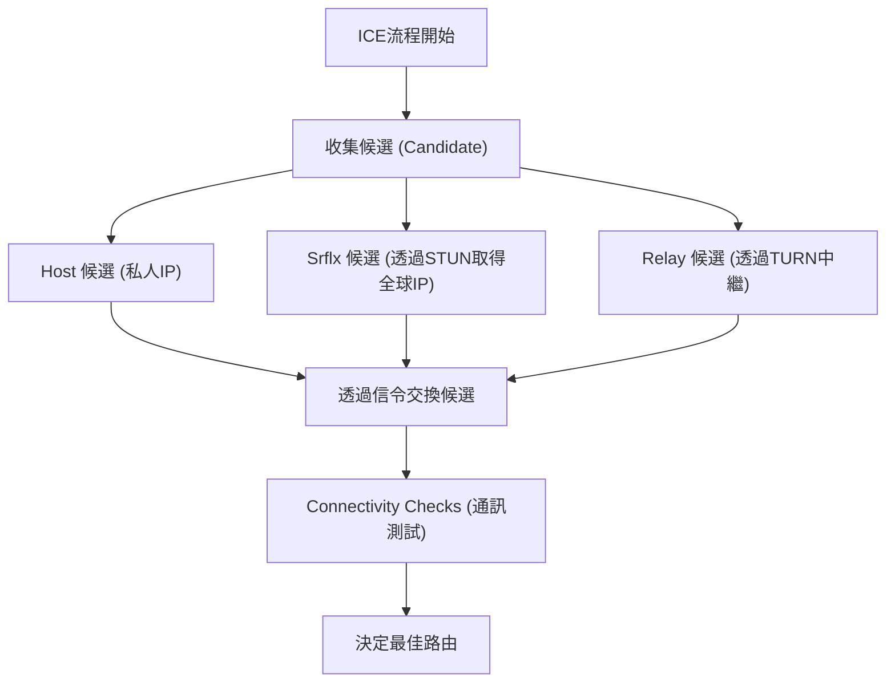

WebRTC（Web Real-Time Communication）是一項開源技術，無需安裝任何外掛程式或額外軟體，即可在網頁瀏覽器之間直接進行語音、影片及任意資料的傳輸。它是支撐Google Meet、Zoom、Discord等平台的核心技術，已成為現代即時網路應用程式不可或缺的存在。

本篇文章將從WebRTC為何被需要的歷史背景開始，徹底解說NAT穿越的機制、信令（Signaling）、路由探索，以及作為基礎的協定群，帶您深入了解WebRTC的底層架構。

## HTTP與WebSocket的限制：為何需要WebRTC

為了解WebRTC的運作原理，我們必須先知道現有的網路技術（HTTP和WebSocket）為何不適合用於即時媒體通訊。

### HTTP通訊的特徵與課題
HTTP（Hypertext Transfer Protocol）是基於主從式架構（Client-Server Model）的請求-回應型協定。基本的資料流向為單向，由客戶端發送請求，伺服器回傳回應。
近年來隨著HTTP/2和HTTP/3的出現，加入了多路復用和伺服器推送等功能，效能雖然有所提升，但「必須透過伺服器才能通訊」的根本架構並沒有改變。若要透過伺服器即時傳輸如影片或語音這類需要大頻寬與低延遲的串流資料，伺服器的負載和網路延遲將會成為巨大的瓶頸。

### WebSocket的限制
WebSocket是為了解決HTTP的限制而開發的雙向通訊協定。一旦建立連線，客戶端和伺服器便可在任何時間點互相傳送資料。這為聊天應用程式和即時通知系統帶來了戲劇性的改善。
然而，WebSocket同樣依賴主從式架構。當參與者之間需要即時傳輸大量資料（例如視訊通話）時，所有的資料流都必須經過伺服器（伺服器中繼），伺服器的頻寬和處理能力很快就會達到極限。此外，因為它是基於TCP的通訊，當發生封包遺失時，重傳控制所造成的延遲（隊頭阻塞，Head-of-Line Blocking）是無法避免的，這對於即時性來說是致命的問題。

在這樣的背景下，不需要透過伺服器、讓客戶端之間直接通訊（Peer-to-Peer, P2P），並且基於重傳延遲較低的UDP的WebRTC應運而生。

## WebRTC的全貌與建立通訊的過程

在WebRTC中建立P2P通訊，並不是「突然就把資料發送到對方的瀏覽器」這麼簡單。在現代的網際網路環境中，大多數的裝置都位在路由器（NAT）後方，並沒有直接擁有全球IP位址。
WebRTC為了開始通訊，會經過以下步驟：

1. **信令（Signaling）**: 認知彼此的存在，並交換連線要件（SDP）。
2. **路由探索（ICE, STUN/TURN）**: 尋找彼此可以通訊的網路路由。
3. **建立P2P連線與加密**: 透過DTLS交換加密金鑰，並透過SRTP/SCTP進行資料傳輸。

```mermaid
sequenceDiagram
    participant PeerA as Peer A (瀏覽器)
    participant SignalingServer as 信令伺服器
    participant PeerB as Peer B (瀏覽器)
    participant STUNTURN as STUN/TURN伺服器

    PeerA->>STUNTURN: 查詢自己的全球IP/Port
    STUNTURN-->>PeerA: 回覆全球IP/Port
    PeerA->>SignalingServer: 傳送 SDP Offer
    SignalingServer->>PeerB: 轉發 SDP Offer
    PeerB->>STUNTURN: 查詢自己的全球IP/Port
    STUNTURN-->>PeerB: 回覆全球IP/Port
    PeerB->>SignalingServer: 傳送 SDP Answer
    SignalingServer->>PeerA: 轉發 SDP Answer
    PeerA->>PeerB: 嘗試建立P2P連線 (ICE)
    PeerA<-->>PeerB: 直接通訊（影片、語音、資料）
```

## 透過SDP（Session Description Protocol）進行信令

為了進行P2P通訊，雙方必須共享一些前提資訊，例如「可以接收和發送什麼樣的媒體資料」或是「支援哪些編解碼器」。這個交換過程稱為**信令（Signaling）**。

有趣的是，WebRTC的規範中並沒有具體規定「該如何進行信令」。開發者可以使用WebSocket、Server-Sent Events (SSE) 或 SIP等任何方式來建構信令伺服器以交換資訊。

交換的資訊是使用稱為**SDP（Session Description Protocol）**的格式來描述。

### SDP Offer與Answer的交換流程
通訊發起者（Peer A）會建立一個包含自己支援的影片、語音編解碼器以及網路資訊的「SDP Offer」，並透過信令伺服器發送給接收者（Peer B）。
接收者（Peer B）收到Offer後，會與自身的環境進行比對，選出「共同可以使用的編解碼器」等，並建立「SDP Answer」回傳給Peer A。
透過這個過程，雙方對媒體通訊的格式達成共識。

## 巨大的高牆：NAT與防火牆

僅僅交換SDP是無法實現P2P通訊的。因為我們還需要知道通訊對象的IP位址和連接埠（Port）。然而，作為應對IPv4枯竭問題而普及的**NAT（Network Address Translation）**，成為了P2P通訊中一道巨大的高牆。

### NAT的角色與問題點
在家庭或辦公室網路中，路由器提供了NAT功能。區域網路內的每個裝置都會被分配一個私人IP位址（例如：`192.168.1.10`），路由器則使用全球IP位址代替它們與網際網路通訊。
從內部到外部的通訊，NAT會自動轉換位址和連接埠；但是，**從外部到內部（特定的私人IP）的直接連線請求，會被路由器拒絕**。這就是阻礙P2P通訊的原因。

## NAT穿越技術：STUN與TURN

WebRTC利用兩種伺服器來解決這個NAT問題：**STUN**與**TURN**。

### STUN（Session Traversal Utilities for NAT）
STUN伺服器的作用是告訴客戶端「從網際網路看過來，你自己的全球IP位址和連接埠號碼是什麼」。
Peer A首先會向STUN伺服器發送請求。STUN伺服器會將請求來源的IP與連接埠（也就是路由器的全球IP與轉換後的連接埠）作為回應傳回。Peer A會將這個資訊作為「自己的聯絡方式（ICE Candidate）」傳送給Peer B。
STUN非常輕量且伺服器負載低，絕大多數的P2P通訊（約80%以上）都能夠透過STUN成功建立。

### TURN（Traversal Using Relays around NAT）
然而，在企業嚴格的防火牆或稱為「Symmetric NAT（對稱型NAT）」這類強固的NAT環境下，透過STUN取得位址並進行直接通訊可能會被阻擋。
在這種情況下作為最終手段被使用的是TURN伺服器。
當無法進行P2P通訊時，TURN伺服器會**中繼（Relay）所有的通訊資料**。嚴格來說這已經不是P2P通訊了，但為了確保連線的可靠性，它是不可或缺的。由於必須中繼所有的媒體流量，營運TURN伺服器需要龐大的頻寬與伺服器成本。

## 透過ICE（Interactive Connectivity Establishment）探索最佳路由

透過STUN和TURN收集到的「可通訊的IP位址與連接埠候選清單」被稱為**ICE Candidate**。
WebRTC會對雙方收集到的所有ICE Candidate組合進行全面測試，並決定出延遲最低且最穩定的路由。這個框架被稱為**ICE（Interactive Connectivity Establishment）**。

路由的優先順序通常如下：
1. **Host Candidate**: 在同一個區域網路內，私人IP之間的直接通訊（最快）。
2. **Server Reflexive Candidate**: 穿越NAT，使用透過STUN伺服器取得的全球IP進行的P2P通訊。
3. **Relay Candidate**: 作為最終手段，透過TURN伺服器進行的中繼通訊（延遲較大）。



## 基於UDP的通訊與協定堆疊

為了實現低延遲，WebRTC不是基於TCP，而是基於**UDP（User Datagram Protocol）**。TCP雖然可靠性高，但會因為確認封包到達與重傳處理而產生延遲。在視訊會議中，「1秒前的畫面以完美的畫質延遲到達」遠不如「雖然有些許馬賽克，但目前的畫面能即時到達」來得重要。

然而，單純的UDP是無法進行加密或媒體同步的。因此，WebRTC在UDP之上建立了一套進階的協定堆疊。

### 透過DTLS進行加密
WebRTC的通訊**全部都會被強制加密**。UDP通訊的加密使用的是TLS的資料報（Datagram）版本——**DTLS（Datagram Transport Layer Security）**。由於是透過P2P直接進行金鑰交換，因此可以防止竊聽和中間人攻擊。

### SRTP（Secure Real-time Transport Protocol）
媒體資料（影片、語音）的傳輸，使用的是透過DTLS交換金鑰並加密後的**SRTP**。SRTP透過附加時間戳和序號，彌補了UDP「不保證順序」、「可能會遺失封包」的缺點，讓接收端能夠順暢地播放。

### SCTP（Stream Control Transmission Protocol）
WebRTC不僅能傳輸媒體，還有一個可以收發任意二進位或文字資料的「Data Channel」功能。這可以用於檔案傳輸或遊戲同步等。
這個Data Channel的通訊使用的是建構在UDP之上的**SCTP**協定。SCTP能夠針對每個串流靈活設定「高可靠性的到達保證」或「順序保證」等，實現了兼具TCP與UDP優點的資料傳輸。

## 總結

WebRTC為了滿足「單純地將瀏覽器互相連接」這個簡單的需求，在背後處理了令人驚訝的複雜流程。

1. 以基於UDP的P2P解決了HTTP/WebSocket「透過伺服器造成的延遲」的限制。
2. 利用**STUN/TURN**和**ICE**突破了NAT與防火牆的高牆。
3. 透過靈活的**SDP**進行信令協商條件。
4. 利用**DTLS, SRTP, SCTP**等協定群，進行安全且符合需求的資料傳輸。

這些技術被標準化實作在瀏覽器中，只需短短數十行JavaScript程式碼就能呼叫，這可以說是網路技術史上的一大突破。理解WebRTC背後堅固的網路技術，可以說是開發更具擴展性、高品質的即時應用程式所不可或缺的知識。