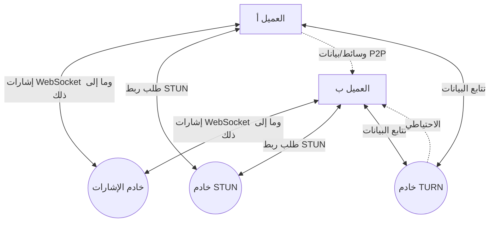
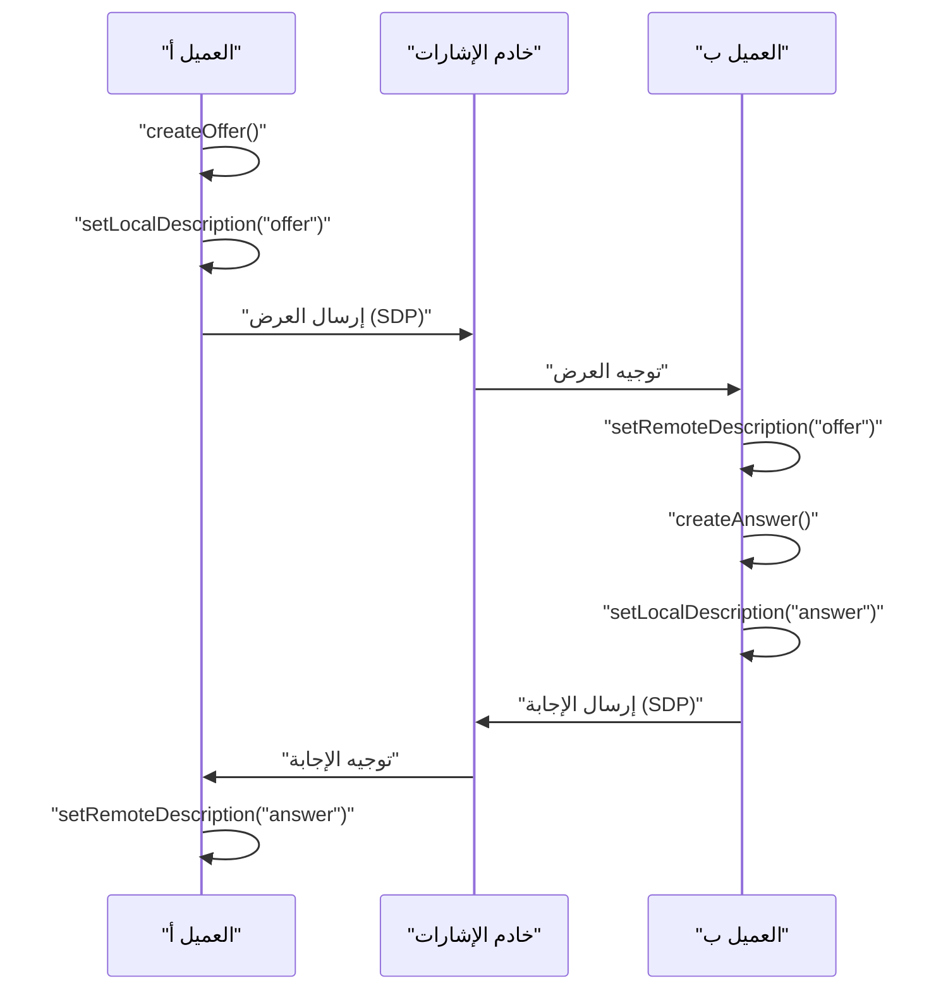
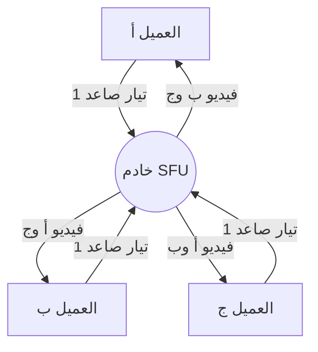

# كواليس WebRTC والاتصال في الوقت الفعلي: P2P، STUN/TURN، والإشارات

في الويب الحديث، أصبحت مكالمات الصوت والفيديو في الوقت الفعلي ونقل البيانات بزمن انتقال منخفض ميزات لا غنى عنها. التقنية التي تتيح ذلك على المتصفح بدون إضافات هي **WebRTC** (اتصالات الويب في الوقت الفعلي).

في هذه المقالة، سنشرح بالتفصيل الشديد مع الرسوم التوضيحية والتعليمات البرمجية كيف يحقق WebRTC اتصال **P2P** (الند للند) بين المتصفحات، والتقنيات الشبكية المعقدة الكامنة وراءه (الإشارات، تجاوز NAT، خوادم STUN/TURN، بروتوكول ICE، وغيرها).

---

## 1. البنية الأساسية لـ WebRTC

WebRTC ليس بروتوكولًا واحدًا، بل هو مجموعة من البروتوكولات وواجهات برمجة التطبيقات (API). يتكون بشكل رئيسي من 3 واجهات رئيسية:

1. **MediaStream** (getUserMedia): جلب تدفقات الصوت والفيديو من الكاميرا والميكروفون.
2. **RTCPeerConnection**: إدارة الاتصال بين الأقران، وإرسال تدفقات الوسائط. كما يتولى التحكم في النطاق الترددي والتشفير.
3. **RTCDataChannel**: إرسال واستقبال أي بيانات ثنائية أو نصية في اتجاهين بزمن انتقال منخفض.

يوضح الشكل التالي الصورة العامة عند إنشاء اتصال WebRTC.



### 1.1 الفرق بين نموذج العميل-الخادم ونموذج P2P

كانت اتصالات الويب التقليدية (مثل HTTP/WebSocket) تتبع دائمًا **نموذج العميل-الخادم** حيث تمر عبر الخادم. في هذه الطريقة، عند إرسال رسالة من العميل أ إلى العميل ب، يجب أن تمر عبر الخادم، مما أدى إلى التحديات التالية:

- **زيادة زمن الانتقال (الكمون)**: نظرًا للمرور عبر الخادم، يحدث تأخير بسبب المسافة الفعلية.
- **حمل الخادم**: تتركز جميع حركات المرور على الخادم.

من ناحية أخرى، في **نموذج P2P**، تتصل الأجهزة العميلة ببعضها البعض مباشرة. يتيح ذلك الاتصال عبر أقصر مسار، مما يحقق زمن انتقال منخفض للغاية.

يتم التعبير عن معادلة حساب زمن الانتقال على النحو التالي:

$ T_{total} = T_{prop} + T_{trans} + T_{queue} + T_{proc} $

حيث $T_{prop}$ هو تأخير الانتشار (يعتمد على المسافة)، $T_{trans}$ هو تأخير النقل، $T_{queue}$ هو تأخير الطابور، و $T_{proc}$ هو تأخير المعالجة. في اتصال P2P، من خلال الاستغناء عن خادم التتابع، يمكن تقليل $T_{prop}$ و $T_{proc}$ بشكل كبير.

---

## 2. ما هو الإشارات (Signaling)؟

لإنشاء اتصال P2P، يجب أن يعرف كل طرف "مكان وجود الآخر (عنوان IP ورقم المنفذ)". ومع ذلك، لا يعرف المتصفح وجود الطرف الآخر في البداية.

هنا يأتي دور **خادم الإشارات**. لا يُستخدم خادم الإشارات لنقل بيانات الوسائط نفسها، بل يُستخدم فقط لتبادل **البيانات الوصفية** (معلومات الاتصال ومواصفات الوسائط) لإنشاء الاتصال.

### 2.1 SDP (بروتوكول وصف الجلسة)

أحد المعلومات المهمة التي يتم تبادلها أثناء الإشارات هو **SDP**. يتضمن SDP المعلومات التالية:

- نوع الوسائط (صوت، فيديو، بيانات)
- برامج الترميز المدعومة (VP8، H.264، Opus، وغيرها)
- أرقام المنافذ وعناوين IP المستخدمة للاتصال

### 2.2 تدفق الإشارات (العرض والإجابة)

يتم إنشاء اتصال WebRTC عندما يقدم أحد الطرفين **عرضًا (Offer)** ويرد الطرف الآخر بـ **إجابة (Answer)**.



### 2.3 مثال تطبيقي لخادم الإشارات (Node.js + WebSocket)

نظرًا لأن مواصفات WebRTC لا تحدد كيفية تنفيذ خادم الإشارات، يمكنك استخدام أي تقنية تفضلها مثل WebSocket أو Socket.io أو Firebase. فيما يلي مثال لخادم إشارات بسيط باستخدام مكتبة `ws`.

```javascript
// server.js
const WebSocket = require('ws');
const wss = new WebSocket.Server({ port: 8080 });

wss.on('connection', (ws) => {
    console.log('اتصل عميل جديد.');

    ws.on('message', (message) => {
        // بث الرسالة المستلمة (Offer/Answer/ICE Candidate)
        // في الاستخدام الفعلي، يجب التحكم في الإرسال إلى طرف محدد (غرفة أو معرف)
        wss.clients.forEach((client) => {
            if (client !== ws && client.readyState === WebSocket.OPEN) {
                client.send(message);
            }
        });
    });
});
```

---

## 3. حاجز تجاوز NAT: STUN و TURN

لقد قمنا بتبادل SDP لبعضنا البعض من خلال الإشارات، ولكن لا يمكننا الاتصال بهذا فقط. والسبب هو أن العديد من الأجهزة تقع خلف **NAT** (ترجمة عنوان الشبكة) ولا تمتلك سوى عناوين IP خاصة. من المستحيل الوصول مباشرة إلى عنوان IP خاص من الإنترنت.

### 3.1 STUN (أدوات اجتياز الجلسة لـ NAT)

يعمل **خادم STUN** كمرآة تخبر العميل بـ "عنوان IP العام ورقم المنفذ" الخاص به.

1. يرسل العميل طلبًا إلى خادم STUN.
2. يرد خادم STUN قائلاً: "من وجهة نظري، عنوان IP العام الخاص بك هو X.X.X.X، والمنفذ هو YYYY".
3. يقوم العميل بتضمين هذه المعلومات العامة التي تم الحصول عليها في SDP أو ICE Candidate وإبلاغ الطرف الآخر.

### 3.2 TURN (الاجتياز باستخدام التتابعات حول NAT)

هناك حالات لا يمكن فيها إنشاء اتصال حتى باستخدام STUN. الحالات النموذجية هي بيئة NAT الصارمة المسماة **Symmetric NAT** أو وجود جدار حماية للشركة.

في مثل هذه الحالات، نستخدم **خادم TURN**. خادم TURN هو خادم يتخلى عن اتصال P2P ويقوم بـ **تتابع** بيانات الوسائط عبر الخادم. في حين أنه يضمن الاتصال، إلا أن له عيوبًا مثل التحميل على الخادم، زيادة زمن الانتقال، والتكلفة الإضافية.

### 3.3 ICE (التأسيس التفاعلي للاتصال)

كيف يقرر WebRTC متى يستخدم STUN أو TURN؟ الإطار الذي يحل ذلك هو **ICE**.

تقوم تقنية ICE بجمع المرشحين ( **ICE Candidate** ) لجميع مسارات الاتصال الممكنة (IP المحلي، IP العام الذي تم الحصول عليه بواسطة STUN، والتتابع بواسطة TURN) وتبادلها مع بعضها البعض. ثم تختار تلقائيًا المسار الأكثر كفاءة (عادةً بالترتيب: IP المحلي > STUN > TURN) وتؤسس الاتصال.

```mermaid
sequenceDiagram
    participant PeerA as "العميل أ"
    participant STUN as "STUN"
    participant PeerB as "العميل ب"

    PeerA->>STUN: "طلب ربط"
    STUN-->>PeerA: "عنوان IP العام والمنفذ"
    PeerA->>PeerA: "إنشاء ICE Candidate"
    PeerA->>PeerB: "إرسال Candidate عبر الإشارات"
    PeerB->>STUN: "طلب ربط"
    STUN-->>PeerB: "عنوان IP العام والمنفذ"
    PeerB->>PeerA: "إرسال Candidate عبر الإشارات"
    PeerA<-->>PeerB: "فحص الاتصال (STUN Ping)"
    PeerA->>PeerB: "اكتمل اتصال P2P بأفضل مسار"
```

---

## 4. الأمان والتشفير (DTLS/SRTP)

يجب دائمًا تشفير تدفقات وسائط WebRTC وقنوات البيانات.

- **DTLS (أمان طبقة النقل لمخطط البيانات)**: بروتوكول يوفر أمانًا مكافئًا لـ TLS عبر [UDP](https://kenji.blog/ar/p/http3-quic-protocol-tcp-udp/). يستخدم لتشفير قناة البيانات وتبادل المفاتيح.
- **SRTP (بروتوكول النقل الآمن في الوقت الفعلي)**: بروتوكول لتشفير ونقل بيانات الوسائط مثل الصوت والفيديو. يتم تشفيره باستخدام المفتاح المتبادل عبر DTLS.

يمنع هذا التنصت والتلاعب على طول المسار، مما يحقق **التشفير الشامل** (E2EE) الآمن بشكل افتراضي.

---

## 5. مثال تطبيقي لـ WebRTC: الواجهة الأمامية

الآن، دعونا نلقي نظرة على رمز واجهة أمامية بسيط يقوم بتهيئة WebRTC فعليًا على المتصفح ويتواصل مع خادم الإشارات.

```javascript
// app.js
const signalingUrl = 'ws://localhost:8080';
const ws = new WebSocket(signalingUrl);
let peerConnection;

const configuration = {
    iceServers: [
        { urls: 'stun:stun.l.google.com:19302' } // استخدام خادم STUN العام الخاص بجوجل
    ]
};

// 1. تهيئة RTCPeerConnection
function initPeerConnection() {
    peerConnection = new RTCPeerConnection(configuration);

    // إرسال إلى الطرف الآخر عند إنشاء ICE Candidate
    peerConnection.onicecandidate = (event) => {
        if (event.candidate) {
            sendMessage({ type: 'candidate', candidate: event.candidate });
        }
    };

    // معالجة عند استلام تيار من الطرف الآخر
    peerConnection.ontrack = (event) => {
        const remoteVideo = document.getElementById('remoteVideo');
        if (remoteVideo.srcObject !== event.streams[0]) {
            remoteVideo.srcObject = event.streams[0];
        }
    };
}

// إرسال واستلام رسائل الإشارات
ws.onmessage = async (message) => {
    const data = JSON.parse(message.data);

    if (data.type === 'offer') {
        initPeerConnection();
        await peerConnection.setRemoteDescription(new RTCSessionDescription(data.offer));
        const answer = await peerConnection.createAnswer();
        await peerConnection.setLocalDescription(answer);
        sendMessage({ type: 'answer', answer: answer });
    } else if (data.type === 'answer') {
        await peerConnection.setRemoteDescription(new RTCSessionDescription(data.answer));
    } else if (data.type === 'candidate') {
        await peerConnection.addIceCandidate(new RTCIceCandidate(data.candidate));
    }
};

function sendMessage(msg) {
    ws.send(JSON.stringify(msg));
}

// بدء الاتصال (إنشاء Offer)
async function startCall() {
    initPeerConnection();

    // الحصول على الوسائط المحلية
    const stream = await navigator.mediaDevices.getUserMedia({ video: true, audio: true });
    document.getElementById('localVideo').srcObject = stream;
    stream.getTracks().forEach(track => peerConnection.addTrack(track, stream));

    // إنشاء وإرسال Offer
    const offer = await peerConnection.createOffer();
    await peerConnection.setLocalDescription(offer);
    sendMessage({ type: 'offer', offer: offer });
}
```

---

## 6. الأداء وقابلية التوسع: SFU و MCU

اتصال P2P مثالي للمكالمات الفردية، لكنه يواجه مشاكل عند زيادة عدد المشاركين (مثل المؤتمرات متعددة المشاركين مثل Zoom أو Google Meet). إذا كان هناك $N$ من المشاركين، يجب على كل عميل إرسال $(N-1)$ من التدفقات الصاعدة، مما يستنفد النطاق الترددي ووحدة المعالجة المركزية بسرعة.

البنى التي تحل هذه المشكلة للاتصالات متعددة المشاركين هي **SFU** و **MCU**.

### 6.1 MCU (وحدة التحكم متعددة النقاط)

يتلقى MCU الفيديو من جميع العملاء، ويمزجه في مقطع فيديو واحد على الخادم، ويوزعه على كل عميل.

- **المزايا**: الحد الأدنى من حمل العميل واستهلاك النطاق الترددي.
- **العيوب**: يتطلب الخادم معالجة لفك التشفير، الترميز، والدمج للفيديو، مما يجعل تكلفة الخادم عالية جدًا.

### 6.2 SFU (وحدة التوجيه الانتقائي)

SFU هو خادم يوجه تدفقات الوسائط المستلمة كما هي إلى العملاء المطلوبين دون دمج الفيديو.



- **المزايا**: يحتاج العميل إلى إرسال تيار صاعد واحد فقط. نظرًا لأن الخادم لا يقوم بعملية الدمج، فإن الحمل أقل مقارنة بـ MCU ويسهل التوسع.
- **العيوب**: يتلقى العميل عدة تدفقات هابطة ويقوم بفك تشفيرها، وبالتالي فإن حمل العميل أعلى من MCU.

تتبنى العديد من أنظمة مؤتمرات الويب الحديثة (مثل Discord و Google Meet) بنية SFU هذه.

---

## 7. الاستفادة من قناة البيانات (RTCDataChannel)

لا يوفر WebRTC إمكانيات الفيديو والصوت فحسب، بل يوفر أيضًا واجهة برمجة تطبيقات `RTCDataChannel` لإرسال أي بيانات. يستخدم هذا بروتوكول **SCTP (بروتوكول نقل التحكم في التدفق)** في الخلفية.

يجمع SCTP بين خصائص كل من موثوقية [TCP](https://kenji.blog/ar/p/http3-quic-protocol-tcp-udp/) والكمون المنخفض لـ [UDP](https://kenji.blog/ar/p/http3-quic-protocol-tcp-udp/).

- **التحكم في الموثوقية**: يمكنك اختيار ما إذا كنت تريد ضمان وصول البيانات (مثل TCP) أم لا (مثل UDP).
- **التحكم في الترتيب**: يمكنك اختيار ما إذا كنت تريد ضمان ترتيب الوصول، أو تجاهل الترتيب ومعالجة البيانات بمجرد وصولها.

يتيح هذا تصميمات مرنة، مثل إرسال البيانات بسرعة مع "عدم وجود موثوقية وعدم ضمان الترتيب" عندما يكون من المهم وصول أحدث البيانات بسرعة حتى في حالة فقدان بعضها (مثل بيانات إحداثيات اللعبة)، أو الإرسال مع "موثوقية" في الحالات التي لا يسمح فيها بفقدان البيانات (مثل نقل الملفات).

---

## 8. الخلاصة

يعد WebRTC تقنية قوية تتيح اتصالات متقدمة في الوقت الفعلي باستخدام المتصفح فقط. تعمل العديد من العناصر التقنية معًا، بدءًا من أساسيات اتصال P2P، إلى الإشارات، تجاوز NAT بواسطة STUN/TURN، اكتشاف المسار بواسطة ICE، وصولًا إلى الأمان.

من خلال الفهم الصحيح لهذه الآليات الخلفية، يصبح من الممكن بناء تطبيقات قوية لبيئات الشبكة المختلفة، وتصميم أنظمة قابلة للتطوير باستخدام SFU/MCU.

تستمر تقنية WebRTC في التطور يومًا بعد يوم، ومن المتوقع أن تلعب دورًا نشطًا في مختلف المجالات مثل الميتافيرس، إنترنت الأشياء (IoT)، والألعاب السحابية في المستقبل.
