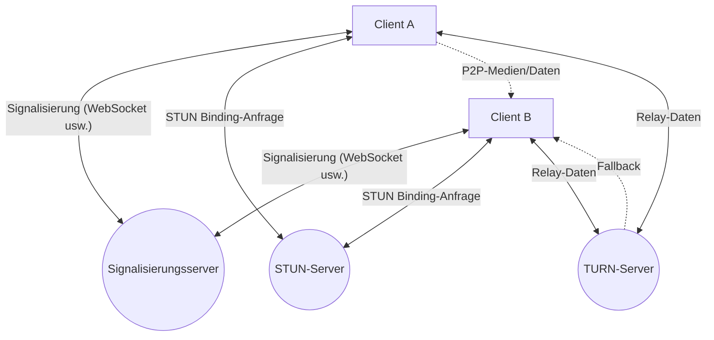
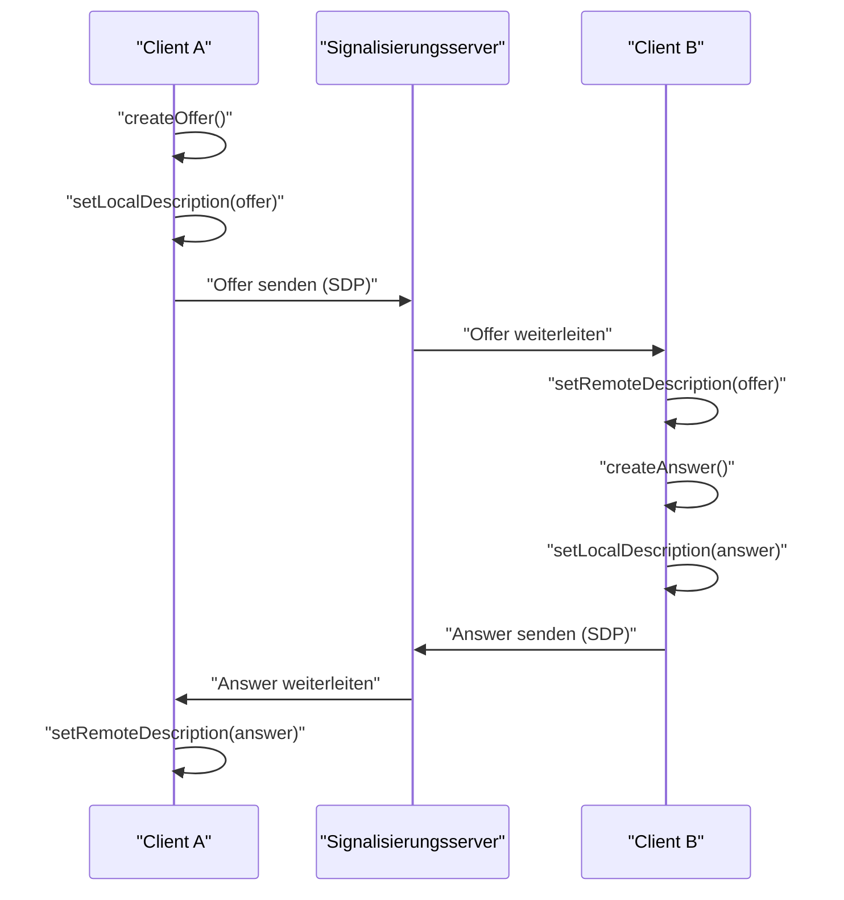
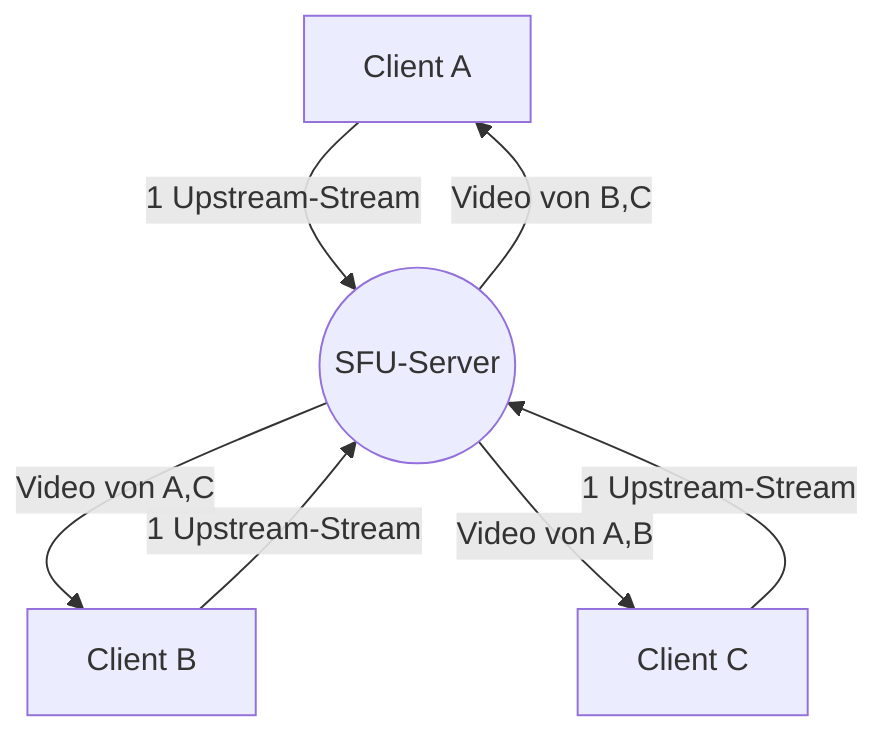

# Die Hintergründe von WebRTC und Echtzeitkommunikation: P2P, STUN/TURN, Signalisierung

Im modernen Web sind Echtzeit-Audio- und Videoanrufe sowie Datenübertragungen mit geringer Latenz zu unverzichtbaren Funktionen geworden. Die Technologie, die dies im Browser ohne Plugins ermöglicht, ist **WebRTC** (Web Real-Time Communication).

In diesem Artikel werden wir anhand von Diagrammen und Code sehr detailliert erklären, wie WebRTC P2P-Kommunikation (Peer-to-Peer) zwischen Browsern realisiert und welche komplexen Netzwerktechnologien (Signalisierung, NAT-Traversal, STUN/TURN, ICE-Protokoll usw.) dahinterstecken.

---

## 1. Die grundlegende Architektur von WebRTC

WebRTC ist kein einzelnes Protokoll, sondern eine Sammlung mehrerer Protokolle und APIs. Es besteht hauptsächlich aus den folgenden drei APIs:

1. **MediaStream** (getUserMedia): Ruft Audio- und Videostreams von Kamera und Mikrofon ab.
2. **RTCPeerConnection**: Verwaltet die Verbindung zwischen Peers und sendet Medienstreams. Übernimmt auch Aufgaben wie Bandbreitensteuerung und Verschlüsselung.
3. **RTCDataChannel**: Sendet und empfängt beliebige Binär- oder Textdaten bidirektional mit geringer Latenz.

Das folgende Diagramm zeigt das Gesamtbild beim Aufbau einer WebRTC-Kommunikation.



### 1.1 Der Unterschied zwischen Client-Server- und P2P-Modellen

Die herkömmliche Webkommunikation (HTTP/WebSocket usw.) war immer ein **Client-Server-Modell**, das über einen Server lief. Wenn bei dieser Methode eine Nachricht von Client A an Client B gesendet werden soll, muss sie immer über einen Server weitergeleitet werden, was folgende Probleme mit sich bringt:

- **Erhöhte Latenz (Verzögerung)**: Da die Daten über einen Server geleitet werden, entsteht eine Verzögerung aufgrund der physischen Entfernung.
- **Serverlast**: Der gesamte Datenverkehr konzentriert sich auf den Server.

Beim **P2P-Modell** hingegen kommunizieren die Clients direkt miteinander. Dies ermöglicht eine Kommunikation über den kürzesten Weg und realisiert eine extrem niedrige Latenz.

Die Berechnungsformel für die Latenzzeit wird wie folgt dargestellt:

$ T_{total} = T_{prop} + T_{trans} + T_{queue} + T_{proc} $

Hierbei ist $T_{prop}$ die Ausbreitungsverzögerung (abhängig von der Entfernung), $T_{trans}$ die Übertragungsverzögerung, $T_{queue}$ die Warteschlangenverzögerung und $T_{proc}$ die Verarbeitungsverzögerung. Durch den Wegfall des Zwischenservers in der P2P-Kommunikation können $T_{prop}$ und $T_{proc}$ erheblich reduziert werden.

---

## 2. Was ist Signalisierung (Signaling)?

Um eine P2P-Kommunikation aufzubauen, müssen beide Seiten wissen, „wo sie sind (IP-Adresse und Portnummer)“. Zunächst kennt der Browser die Existenz des anderen jedoch nicht.

Hier kommt der **Signalisierungsserver** ins Spiel. Der Signalisierungsserver leitet nicht die Mediendaten selbst weiter, sondern wird nur verwendet, um **Metadaten** (Kontaktinformationen und Medienspezifikationen) zum Aufbau der Kommunikation auszutauschen.

### 2.1 SDP (Session Description Protocol)

Eine der wichtigen Informationen, die bei der Signalisierung ausgetauscht werden, ist das **SDP**. SDP enthält Informationen wie die folgenden:

- Art der Medien (Audio, Video, Daten)
- Unterstützte Codecs (VP8, H.264, Opus usw.)
- Für die Kommunikation zu verwendende Portnummern und IP-Adressinformationen

### 2.2 Der Signalisierungsablauf (Offer und Answer)

Der Verbindungsaufbau bei WebRTC erfolgt, indem eine Seite ein **Offer** (Angebot) sendet und die andere Seite ein **Answer** (Antwort) zurückgibt.



### 2.3 Implementierungsbeispiel eines Signalisierungsservers (Node.js + WebSocket)

Da die Implementierung eines Signalisierungsservers nicht in der WebRTC-Spezifikation festgelegt ist, können Sie beliebige Technologien wie WebSocket, Socket.io oder Firebase verwenden. Im Folgenden sehen Sie ein Beispiel für einen einfachen Signalisierungsserver unter Verwendung der Bibliothek `ws`.

```javascript
// server.js
const WebSocket = require('ws');
const wss = new WebSocket.Server({ port: 8080 });

wss.on('connection', (ws) => {
    console.log('Ein neuer Client hat sich verbunden.');

    ws.on('message', (message) => {
        // Empfangene Nachrichten (Offer/Answer/ICE Candidate) an alle senden
        // In der Praxis ist eine Steuerung erforderlich, um nur an bestimmte Partner (Räume oder IDs) zu senden
        wss.clients.forEach((client) => {
            if (client !== ws && client.readyState === WebSocket.OPEN) {
                client.send(message);
            }
        });
    });
});
```

---

## 3. Die Hürde des NAT-Traversals: STUN und TURN

Obwohl die SDPs durch Signalisierung ausgetauscht wurden, reicht dies allein nicht aus, um zu kommunizieren. Der Grund dafür ist, dass sich viele Geräte hinter einem **NAT** (Network Address Translation) befinden und nur eine private IP-Adresse haben. Es ist unmöglich, aus dem Internet direkt auf eine private IP-Adresse zuzugreifen.

### 3.1 STUN (Session Traversal Utilities for NAT)

Ein **STUN-Server** ist wie ein Spiegel, der dem Client seine „öffentliche IP-Adresse und Portnummer“ mitteilt.

1. Der Client sendet eine Anfrage an den STUN-Server.
2. Der STUN-Server antwortet: „Von mir aus gesehen ist deine öffentliche IP-Adresse X.X.X.X und der Port YYYY.“
3. Der Client integriert diese erhaltenen öffentlichen Informationen in SDP oder ICE Candidates und teilt sie dem Partner mit.

### 3.2 TURN (Traversal Using Relays around NAT)

Es gibt Fälle, in denen selbst mit STUN keine Verbindung aufgebaut werden kann. Typisch dafür sind restriktive NAT-Umgebungen namens **Symmetric NAT** oder wenn Unternehmens-Firewalls vorhanden sind.

In solchen Fällen wird ein **TURN-Server** verwendet. Ein TURN-Server ist ein Server, der die P2P-Kommunikation aufgibt und Mediendaten über den Server **weiterleitet (Relay)**. Die Kommunikation kann so zuverlässig durchgeführt werden, hat aber Nachteile wie eine Belastung des Servers, erhöhte Latenz und anfallende Kosten.

### 3.3 ICE (Interactive Connectivity Establishment)

Wie entscheidet WebRTC, ob STUN oder TURN verwendet werden soll? Das Framework, das dies löst, heißt **ICE**.

ICE sammelt Kandidaten ( **ICE Candidate** ) für alle möglichen Kommunikationswege (lokale IP, über STUN erhaltene öffentliche IP, Relay über TURN) und tauscht sie miteinander aus. Dann wählt es automatisch den effizientesten Weg (normalerweise in der Reihenfolge: lokale IP > STUN > TURN) und baut die Verbindung auf.

```mermaid
sequenceDiagram
    participant PeerA as "Peer A"
    participant STUN as "STUN-Server"
    participant PeerB as "Peer B"

    PeerA->>STUN: "Binding-Anfrage"
    STUN-->>PeerA: "Öffentliche IP & Port"
    PeerA->>PeerA: "ICE Candidate generieren"
    PeerA->>PeerB: "Candidate über Signalisierung senden"
    PeerB->>STUN: "Binding-Anfrage"
    STUN-->>PeerB: "Öffentliche IP & Port"
    PeerB->>PeerA: "Candidate über Signalisierung senden"
    PeerA<-->>PeerB: "Konnektivitätsprüfung (STUN Ping)"
    PeerA->>PeerB: "P2P-Verbindung auf optimalem Weg abgeschlossen"
```

---

## 4. Sicherheit und Verschlüsselung (DTLS/SRTP)

Die Medienstreams und Datenkanäle von WebRTC müssen zwingend verschlüsselt werden.

- **DTLS (Datagram Transport Layer Security)**: Ein Protokoll, das Sicherheit auf TLS-Niveau über [UDP](https://kenji.blog/de/p/http3-quic-protocol-tcp-udp/) bietet. Es wird für die Verschlüsselung von Datenkanälen und den Schlüsselaustausch verwendet.
- **SRTP (Secure Real-time Transport Protocol)**: Ein Protokoll zur verschlüsselten Übertragung von Mediendaten wie Audio und Video. Die Verschlüsselung erfolgt mit dem über DTLS ausgetauschten Schlüssel.

Dadurch wird das Abhören und Manipulieren auf dem Übertragungsweg verhindert und eine sichere **End-to-End-Verschlüsselung** (E2EE) standardmäßig realisiert.

---

## 5. Implementierungsbeispiel von WebRTC: Frontend

Lassen Sie uns nun einen Blick auf einfachen Frontend-Code werfen, der WebRTC im Browser initialisiert und mit dem Signalisierungsserver kommuniziert.

```javascript
// app.js
const signalingUrl = 'ws://localhost:8080';
const ws = new WebSocket(signalingUrl);
let peerConnection;

const configuration = {
    iceServers: [
        { urls: 'stun:stun.l.google.com:19302' } // Einen öffentlichen STUN-Server von Google nutzen
    ]
};

// 1. Initialisierung der RTCPeerConnection
function initPeerConnection() {
    peerConnection = new RTCPeerConnection(configuration);

    // Sobald ein ICE Candidate generiert wird, an den Partner senden
    peerConnection.onicecandidate = (event) => {
        if (event.candidate) {
            sendMessage({ type: 'candidate', candidate: event.candidate });
        }
    };

    // Verarbeitung, wenn ein Stream vom Partner empfangen wird
    peerConnection.ontrack = (event) => {
        const remoteVideo = document.getElementById('remoteVideo');
        if (remoteVideo.srcObject !== event.streams[0]) {
            remoteVideo.srcObject = event.streams[0];
        }
    };
}

// Senden und Empfangen von Signalisierungsnachrichten
ws.onmessage = async (message) => {
    const data = JSON.parse(message.data);

    if (data.type === 'offer') {
        initPeerConnection();
        await peerConnection.setRemoteDescription(new RTCSessionDescription(data.offer));
        const answer = await peerConnection.createAnswer();
        await peerConnection.setLocalDescription(answer);
        sendMessage({ type: 'answer', answer: answer });
    } else if (data.type === 'answer') {
        await peerConnection.setRemoteDescription(new RTCSessionDescription(data.answer));
    } else if (data.type === 'candidate') {
        await peerConnection.addIceCandidate(new RTCIceCandidate(data.candidate));
    }
};

function sendMessage(msg) {
    ws.send(JSON.stringify(msg));
}

// Auslöser für den Verbindungsaufbau (Offer erstellen)
async function startCall() {
    initPeerConnection();

    // Lokale Medien abrufen
    const stream = await navigator.mediaDevices.getUserMedia({ video: true, audio: true });
    document.getElementById('localVideo').srcObject = stream;
    stream.getTracks().forEach(track => peerConnection.addTrack(track, stream));

    // Offer erstellen und senden
    const offer = await peerConnection.createOffer();
    await peerConnection.setLocalDescription(offer);
    sendMessage({ type: 'offer', offer: offer });
}
```

---

## 6. Leistung und Skalierbarkeit: SFU und MCU

P2P-Kommunikation ist optimal für 1-zu-1-Gespräche, aber bei vielen Teilnehmern (z. B. Mehrpersonenkonferenzen wie Zoom oder Google Meet) treten Probleme auf. Wenn es $N$ Teilnehmer gibt, muss jeder Client $(N-1)$ Upstream-Streams senden, wodurch Bandbreite und CPU schnell erschöpft sind.

Architekturen zur Lösung dieses Problems der Mehrfachverbindungen sind **SFU** und **MCU**.

### 6.1 MCU (Multipoint Control Unit)

Eine MCU empfängt Videos von allen Clients, mischt diese auf dem Server zu einem einzigen Video zusammen und verteilt es an jeden Client.

- **Vorteile**: Die Belastung des Clients und der Bandbreitenverbrauch sind minimal.
- **Nachteile**: Da auf der Serverseite Dekodierungs-, Kodierungs- und Mischprozesse für die Videos erforderlich sind, sind die Serverkosten sehr hoch.

### 6.2 SFU (Selective Forwarding Unit)

Eine SFU ist ein Server, der die empfangenen Medienstreams nicht mischt, sondern unverändert an die benötigten Clients weiterleitet (Routing).



- **Vorteile**: Clients müssen nur einen Upstream-Stream senden. Da der Server keine Mischprozesse durchführt, ist die Belastung im Vergleich zur MCU geringer und er lässt sich leichter skalieren.
- **Nachteile**: Da Clients mehrere Downstream-Streams empfangen und dekodieren, ist die Belastung auf Client-Seite höher als bei der MCU.

Die meisten modernen Webkonferenzsysteme (Discord, Google Meet usw.) verwenden diese SFU-Architektur.

---

## 7. Nutzung des Datenkanals (RTCDataChannel)

WebRTC bietet die API `RTCDataChannel` zum Senden beliebiger Daten, nicht nur von Video und Audio. Diese verwendet im Hintergrund das Protokoll **SCTP (Stream Control Transmission Protocol)**.

SCTP vereint die Eigenschaften der Zuverlässigkeit von [TCP](https://kenji.blog/de/p/http3-quic-protocol-tcp-udp/) und der geringen Latenz von [UDP](https://kenji.blog/de/p/http3-quic-protocol-tcp-udp/).

- **Zuverlässigkeitskontrolle**: Sie können wählen, ob die Ankunft der Daten garantiert werden soll (wie bei TCP) oder nicht (wie bei UDP).
- **Reihenfolgenkontrolle**: Sie können wählen, ob die Ankunftsreihenfolge garantiert oder ignoriert und in der Reihenfolge des Eintreffens verarbeitet werden soll.

Eine flexible Gestaltung ist möglich, z. B. bei Spieldaten (Koordinaten), bei denen es wichtig ist, dass die neuesten Daten schnell ankommen, auch wenn einige fehlen, durch schnelle Übertragung mit „keine Zuverlässigkeit / keine Reihenfolgengarantie“, und bei Dateiübertragungen, bei denen kein Verlust toleriert wird, durch Übertragung „mit Zuverlässigkeit“.

---

## 8. Fazit

WebRTC ist eine leistungsstarke Technologie, die fortschrittliche Echtzeitkommunikation nur mit dem Browser ermöglicht. Viele technologische Elemente greifen ineinander, von den Grundlagen der P2P-Kommunikation über Signalisierung, NAT-Traversal mittels STUN/TURN, Routenfindung mit ICE bis hin zur Sicherheit.

Ein korrektes Verständnis dieser Mechanismen im Hintergrund ermöglicht die Entwicklung von netzwerkrobusten Anwendungen und das Design skalierbarer Systeme unter Nutzung von SFU/MCU.

Die WebRTC-Technologie entwickelt sich täglich weiter und es wird erwartet, dass sie in Zukunft in verschiedenen Bereichen wie Metaverse, IoT und Cloud-Gaming eine aktive Rolle spielen wird.
