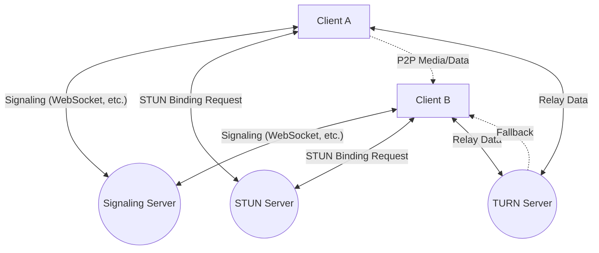
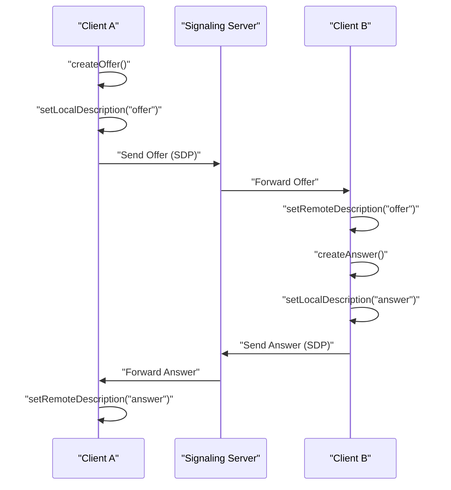
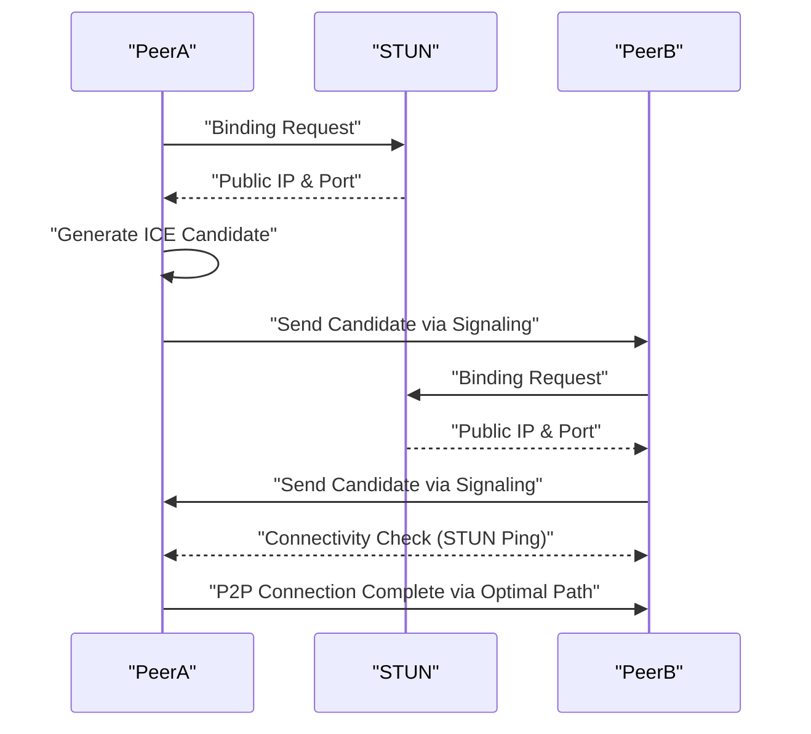
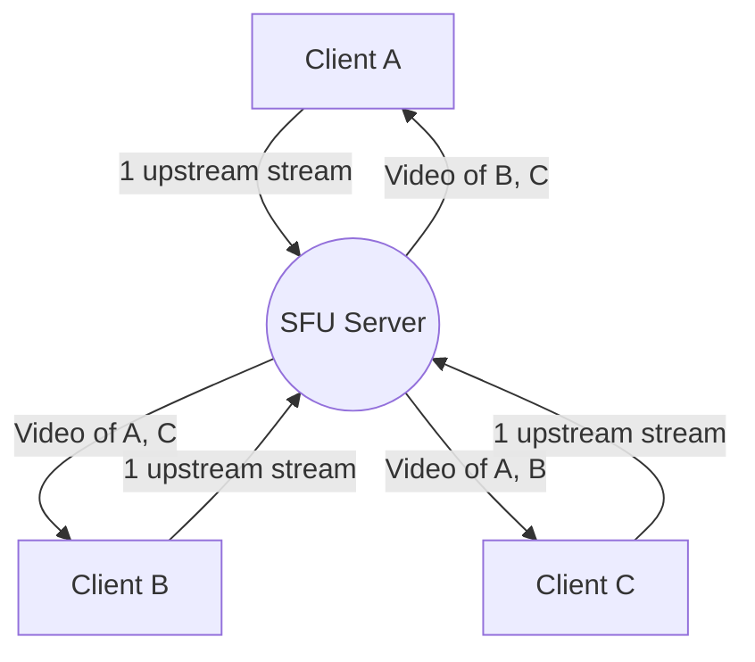

# The Behind the Scenes of WebRTC and Real-Time Communication: P2P, STUN/TURN, Signaling

In the modern web, real-time voice and video calls, as well as low-latency data transfers, have become essential features. **WebRTC** (Web Real-Time Communication) is the technology that makes this possible directly in the browser without any plugins.

In this article, we will explain in great detail, with diagrams and code, how WebRTC achieves P2P (Peer-to-Peer) communication between browsers and the complex networking technologies behind it (signaling, NAT traversal, STUN/TURN, ICE protocol, etc.).

---

## 1. Basic Architecture of WebRTC

WebRTC is not a single protocol, but a collection of multiple protocols and APIs. It is roughly composed of the following three major APIs:

1. **MediaStream** (getUserMedia): Acquires audio and video streams from the camera and microphone.
2. **RTCPeerConnection**: Manages connections between peers and transmits media streams. It also handles bandwidth control and encryption.
3. **RTCDataChannel**: Sends and receives arbitrary binary or text data bidirectionally with low latency.

The following diagram shows the overall picture when establishing a WebRTC communication.



### 1.1 Difference between Client-Server and P2P Models

Traditional web communication (such as HTTP/WebSocket) has always been a **client-server model** that routes through a server. In this method, when Client A sends a message to Client B, it must relay through the server, leading to the following challenges:

- **Increased Latency**: Because it relays through a server, latency occurs due to physical distance.
- **Server Load**: All traffic is concentrated on the server.

On the other hand, in the **P2P model**, clients communicate directly with each other. This enables communication over the shortest path, achieving ultra-low latency.

The formula for calculating latency is expressed as follows:

$ T_{total} = T_{prop} + T_{trans} + T_{queue} + T_{proc} $

Here, $T_{prop}$ is propagation delay (dependent on distance), $T_{trans}$ is transmission delay, $T_{queue}$ is queuing delay, and $T_{proc}$ is processing delay. By omitting the relay server in P2P communication, $T_{prop}$ and $T_{proc}$ can be significantly reduced.

---

## 2. What is Signaling?

To establish P2P communication, both parties need to know "where they are" (IP addresses and port numbers). However, browsers initially do not know about each other's existence.

This is where the **signaling server** comes in. A signaling server is not used to relay the media data itself, but only to exchange **metadata** (contact information and media specifications) for establishing the connection.

### 2.1 SDP (Session Description Protocol)

One of the most important pieces of information exchanged during signaling is **SDP**. SDP includes information such as:

- Media types (audio, video, data)
- Supported codecs (VP8, H.264, Opus, etc.)
- Port numbers and IP address information used for communication

### 2.2 Signaling Flow (Offer and Answer)

Establishing a WebRTC connection is done by one party sending an **Offer** and the other returning an **Answer**.



### 2.3 Signaling Server Implementation Example (Node.js + WebSocket)

Since the implementation of a signaling server is not strictly defined by the WebRTC specifications, you can use any technology you prefer, such as WebSocket, Socket.io, or Firebase. Below is an example of a simple signaling server using the `ws` library.

```javascript
// server.js
const WebSocket = require('ws');
const wss = new WebSocket.Server({ port: 8080 });

wss.on('connection', (ws) => {
    console.log('New client connected.');

    ws.on('message', (message) => {
        // Broadcast the received message (Offer/Answer/ICE Candidate)
        // In actual operation, control is needed to send this only to a specific peer (room or ID)
        wss.clients.forEach((client) => {
            if (client !== ws && client.readyState === WebSocket.OPEN) {
                client.send(message);
            }
        });
    });
});
```

---

## 3. The Wall of NAT Traversal: STUN and TURN

Although SDPs are exchanged through signaling, this alone is not enough to communicate. This is because most devices are behind a **NAT** (Network Address Translation) and only have private IP addresses. It is impossible to access a private IP address directly from the internet.

### 3.1 STUN (Session Traversal Utilities for NAT)

A **STUN server** acts like a mirror that tells the client its own "public IP address and port number".

1. The client sends a request to the STUN server.
2. The STUN server replies, "From my perspective, your public IP address is X.X.X.X and your port is YYYY."
3. The client includes this obtained public information in its SDP or ICE Candidates to pass on to the peer.

### 3.2 TURN (Traversal Using Relays around NAT)

Sometimes communication cannot be established even with STUN. Typical examples include strict NAT environments known as **Symmetric NAT** or corporate firewalls.

In such cases, a **TURN server** is used. A TURN server abandons P2P communication and acts as a server to **relay** the media data. While this ensures communication, it comes with drawbacks such as server load, increased latency, and costs.

### 3.3 ICE (Interactive Connectivity Establishment)

How does WebRTC decide whether to use STUN or TURN? The framework that resolves this is **ICE**.

ICE collects candidates (**ICE Candidates**) for all possible communication paths (local IP, public IP obtained from STUN, relay via TURN) and exchanges them with each other. It then automatically selects the most efficient path (usually in the order of local IP > STUN > TURN) and establishes the connection.



---

## 4. Security and Encryption (DTLS/SRTP)

WebRTC media streams and data channels must always be encrypted.

- **DTLS (Datagram Transport Layer Security)**: A protocol that provides security equivalent to TLS over [UDP](https://kenji.blog/en/p/http3-quic-protocol-tcp-udp/). It is used for data channel encryption and key exchange.
- **SRTP (Secure Real-time Transport Protocol)**: A protocol for transferring encrypted media data such as audio and video. It is encrypted using keys exchanged via DTLS.

This prevents eavesdropping and tampering along the path, making secure **End-to-End Encryption** (E2EE) a standard feature.

---

## 5. WebRTC Implementation Example: Frontend

Now, let's take a look at a simple frontend code snippet that initializes WebRTC in the browser and interacts with the signaling server.

```javascript
// app.js
const signalingUrl = 'ws://localhost:8080';
const ws = new WebSocket(signalingUrl);
let peerConnection;

const configuration = {
    iceServers: [
        { urls: 'stun:stun.l.google.com:19302' } // Use Google's public STUN server
    ]
};

// 1. Initialize RTCPeerConnection
function initPeerConnection() {
    peerConnection = new RTCPeerConnection(configuration);

    // Send ICE Candidate to the peer when it is generated
    peerConnection.onicecandidate = (event) => {
        if (event.candidate) {
            sendMessage({ type: 'candidate', candidate: event.candidate });
        }
    };

    // Handle receiving a stream from the peer
    peerConnection.ontrack = (event) => {
        const remoteVideo = document.getElementById('remoteVideo');
        if (remoteVideo.srcObject !== event.streams[0]) {
            remoteVideo.srcObject = event.streams[0];
        }
    };
}

// Sending and receiving signaling messages
ws.onmessage = async (message) => {
    const data = JSON.parse(message.data);

    if (data.type === 'offer') {
        initPeerConnection();
        await peerConnection.setRemoteDescription(new RTCSessionDescription(data.offer));
        const answer = await peerConnection.createAnswer();
        await peerConnection.setLocalDescription(answer);
        sendMessage({ type: 'answer', answer: answer });
    } else if (data.type === 'answer') {
        await peerConnection.setRemoteDescription(new RTCSessionDescription(data.answer));
    } else if (data.type === 'candidate') {
        await peerConnection.addIceCandidate(new RTCIceCandidate(data.candidate));
    }
};

function sendMessage(msg) {
    ws.send(JSON.stringify(msg));
}

// Trigger to start connection (Create Offer)
async function startCall() {
    initPeerConnection();

    // Get local media
    const stream = await navigator.mediaDevices.getUserMedia({ video: true, audio: true });
    document.getElementById('localVideo').srcObject = stream;
    stream.getTracks().forEach(track => peerConnection.addTrack(track, stream));

    // Create and send Offer
    const offer = await peerConnection.createOffer();
    await peerConnection.setLocalDescription(offer);
    sendMessage({ type: 'offer', offer: offer });
}
```

---

## 6. Performance and Scalability: SFU and MCU

While P2P communication is ideal for 1-to-1 calls, issues arise with multiple participants (e.g., multi-user meetings like Zoom or Google Meet). If there are $N$ participants, each client must send $(N-1)$ upstream streams, quickly exhausting bandwidth and CPU.

The architectures that solve this challenge for multi-user connections are **SFU** and **MCU**.

### 6.1 MCU (Multipoint Control Unit)

An MCU receives video from all clients, mixes them into a single video on the server, and distributes it to each client.

- **Pros**: Minimal load and bandwidth consumption on the client side.
- **Cons**: Because the server must decode, encode, and mix the video, server costs are extremely high.

### 6.2 SFU (Selective Forwarding Unit)

An SFU does not mix video; instead, it is a server that simply routes (forwards) the received media streams to the clients that need them.



- **Pros**: Clients only need to send one upstream stream. Since the server does not mix videos, the load is lower than an MCU, making it easier to scale.
- **Cons**: Because clients receive and decode multiple downstream streams, the load on the client side is higher compared to an MCU.

Many modern web conferencing systems (Discord, Google Meet, etc.) adopt this SFU architecture.

---

## 7. Utilizing the Data Channel (RTCDataChannel)

WebRTC provides the `RTCDataChannel` API not only for video and audio but also for sending arbitrary data. Under the hood, this uses a protocol called **SCTP (Stream Control Transmission Protocol)**.

SCTP combines both the reliability of [TCP](https://kenji.blog/en/p/http3-quic-protocol-tcp-udp/) and the low latency of [UDP](https://kenji.blog/en/p/http3-quic-protocol-tcp-udp/).

- **Reliability Control**: You can choose whether to guarantee data delivery (TCP-like) or not (UDP-like).
- **Order Control**: You can choose whether to guarantee the order of arrival or to ignore order and process data as it arrives.

This allows for flexible designs. For example, if it's important for the latest data to arrive quickly even if some parts are lost, such as game coordinate data, you can transfer it rapidly without reliability and order guarantees. Conversely, if no data loss is acceptable, like in file transfers, you can transfer with reliability enabled.

---

## 8. Conclusion

WebRTC is a powerful technology that enables advanced real-time communication using just a browser. Many technological elements work together behind the scenes, from the basics of P2P communication to signaling, NAT traversal via STUN/TURN, route discovery via ICE, and security.

By correctly understanding how these underlying mechanisms work, you can build applications resilient to various network environments and design scalable systems utilizing SFU/MCU.

WebRTC technology continues to evolve daily and is expected to play an active role in various fields such as the metaverse, IoT, and cloud gaming in the future.
