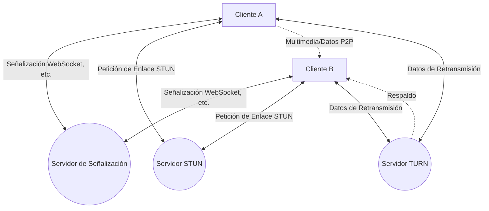
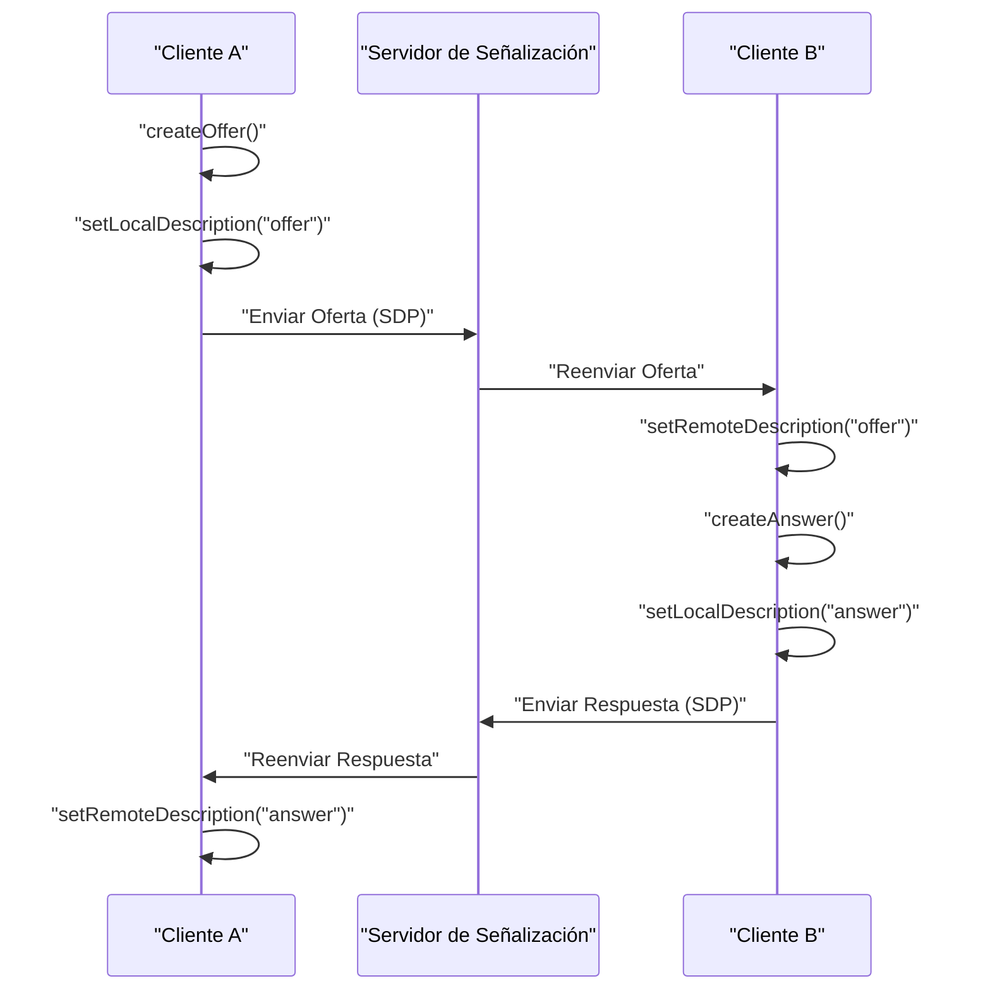
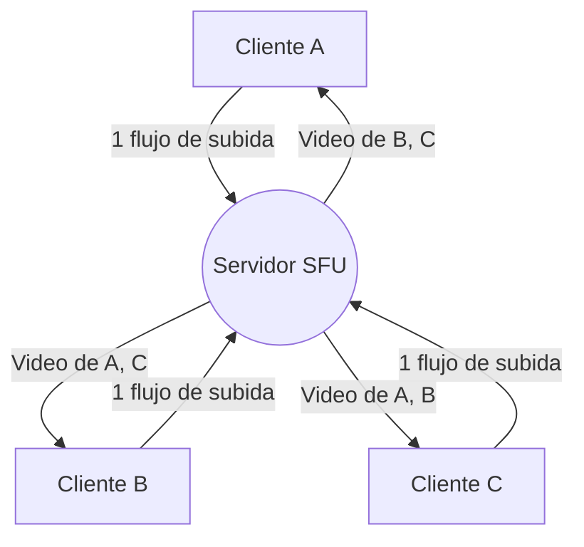

# Los entresijos de WebRTC y la comunicación en tiempo real: P2P, STUN/TURN, señalización

En la web moderna, las llamadas de voz y video en tiempo real, así como la transferencia de datos de baja latencia, se han convertido en funciones indispensables. La tecnología que hace esto posible en el navegador sin usar complementos es **WebRTC** (Web Real-Time Communication).

En este artículo, explicaremos con gran detalle, usando diagramas y código, cómo WebRTC logra la comunicación P2P (Peer-to-Peer) entre navegadores y las complejas tecnologías de red que hay detrás (señalización, cruce de NAT, STUN/TURN, protocolo ICE, etc.).

---

## 1. Arquitectura básica de WebRTC

WebRTC no es un único protocolo, sino un conjunto de múltiples protocolos y API. Se compone principalmente de las siguientes tres API clave:

1. **MediaStream** (getUserMedia): Obtiene los flujos de audio y video desde la cámara y el micrófono.
2. **RTCPeerConnection**: Gestiona la conexión entre pares y transmite flujos multimedia. También se encarga del control de ancho de banda y el cifrado.
3. **RTCDataChannel**: Envía y recibe de forma bidireccional cualquier dato binario o de texto con baja latencia.

El siguiente diagrama muestra el panorama general al establecer una comunicación WebRTC.



### 1.1 Diferencia entre el modelo cliente-servidor y el modelo P2P

Las comunicaciones web tradicionales (HTTP/WebSocket, etc.) siempre han sido un **modelo cliente-servidor** que pasa por un servidor. En este método, cuando el Cliente A envía un mensaje al Cliente B, siempre debe pasar por un servidor intermediario, lo que conlleva los siguientes problemas:

- **Aumento de la latencia**: Dado que pasa a través de un servidor, hay latencia causada por la distancia física.
- **Carga en el servidor**: Todo el tráfico se concentra en el servidor.

Por otro lado, en el **modelo P2P**, los clientes se comunican directamente entre sí. Esto permite la comunicación por la ruta más corta, logrando una latencia ultrabaja.

La fórmula para calcular el tiempo de latencia es la siguiente:

$ T_{total} = T_{prop} + T_{trans} + T_{queue} + T_{proc} $

Donde $T_{prop}$ es el retardo de propagación (depende de la distancia), $T_{trans}$ es el retardo de transmisión, $T_{queue}$ es el retardo de encolamiento y $T_{proc}$ es el retardo de procesamiento. En la comunicación P2P, al omitir el servidor intermediario, $T_{prop}$ y $T_{proc}$ pueden reducirse drásticamente.

---

## 2. ¿Qué es la señalización (Signaling)?

Para establecer una comunicación P2P, ambas partes necesitan saber "dónde están" (dirección IP y número de puerto). Sin embargo, al principio, los navegadores no conocen la existencia del otro.

Aquí es donde entra el **servidor de señalización**. El servidor de señalización no transmite los datos multimedia en sí, sino que se utiliza únicamente para intercambiar los **metadatos** (información de contacto y especificaciones de medios) necesarios para establecer la comunicación.

### 2.1 SDP (Session Description Protocol)

Una parte importante de la información intercambiada en la señalización es el **SDP**. El SDP incluye información como:

- Tipos de medios (audio, video, datos)
- Códecs soportados (VP8, H.264, Opus, etc.)
- Información de puertos y direcciones IP a utilizar para la comunicación

### 2.2 Flujo de señalización (Offer y Answer)

La conexión WebRTC se establece cuando una parte envía una **Oferta (Offer)** y la otra responde con una **Respuesta (Answer)**.



### 2.3 Ejemplo de implementación del servidor de señalización (Node.js + WebSocket)

Dado que la especificación de WebRTC no define la implementación del servidor de señalización, se puede utilizar cualquier tecnología como WebSocket, Socket.io, Firebase, etc. A continuación se muestra un ejemplo de un servidor de señalización simple utilizando la biblioteca `ws`.

```javascript
// server.js
const WebSocket = require('ws');
const wss = new WebSocket.Server({ port: 8080 });

wss.on('connection', (ws) => {
    console.log('Nuevo cliente conectado.');

    ws.on('message', (message) => {
        // Transmite el mensaje recibido (Offer/Answer/ICE Candidate)
        // En un entorno de producción, es necesario controlar el envío solo al destinatario específico (sala o ID)
        wss.clients.forEach((client) => {
            if (client !== ws && client.readyState === WebSocket.OPEN) {
                client.send(message);
            }
        });
    });
});
```

---

## 3. La barrera del cruce de NAT: STUN y TURN

A través de la señalización hemos intercambiado mutuamente el SDP, pero esto por sí solo no es suficiente para comunicarse. La razón es que muchos dispositivos están detrás de un **NAT** (Network Address Translation) y solo tienen direcciones IP privadas. Es imposible acceder directamente a una dirección IP privada desde Internet.

### 3.1 STUN (Session Traversal Utilities for NAT)

Un **servidor STUN** actúa como un espejo que le dice al cliente su propia "dirección IP pública y número de puerto".

1. El cliente envía una solicitud al servidor STUN.
2. El servidor STUN responde: "Desde mi punto de vista, tu dirección IP pública es X.X.X.X y tu puerto es YYYY".
3. El cliente incluye esta información pública obtenida en el SDP o ICE Candidate y se la transmite a la otra parte.

### 3.2 TURN (Traversal Using Relays around NAT)

Hay casos en los que la comunicación no se puede establecer ni siquiera utilizando STUN. Ejemplos típicos de esto son entornos NAT estrictos llamados **Symmetric NAT** o la presencia de cortafuegos corporativos.

En tales casos, se utiliza un **servidor TURN**. Un servidor TURN es un servidor que renuncia a la comunicación P2P y sirve para **retransmitir** datos multimedia a través del servidor. La comunicación está garantizada, pero existen desventajas como la carga del servidor, el aumento de la latencia y la generación de costos.

### 3.3 ICE (Interactive Connectivity Establishment)

¿Cómo diferencia WebRTC cuándo utilizar STUN y cuándo TURN? El marco que resuelve esto es **ICE**.

ICE recopila candidatos ( **ICE Candidate** ) para todas las posibles rutas de comunicación (IP local, IP pública obtenida de STUN y retransmisión mediante TURN) y las intercambian entre sí. Luego, selecciona automáticamente la ruta más eficiente (generalmente en el orden: IP local > STUN > TURN) y establece la conexión.

```mermaid
sequenceDiagram
    participant PeerA
    participant STUN
    participant PeerB

    PeerA->>STUN: "Petición de Enlace"
    STUN-->>PeerA: "IP Pública y Puerto"
    PeerA->>PeerA: "Generar ICE Candidate"
    PeerA->>PeerB: "Enviar Candidate vía señalización"
    PeerB->>STUN: "Petición de Enlace"
    STUN-->>PeerB: "IP Pública y Puerto"
    PeerB->>PeerA: "Enviar Candidate vía señalización"
    PeerA<-->>PeerB: "Comprobación de conectividad (STUN Ping)"
    PeerA->>PeerB: "Conexión P2P completada en la ruta óptima"
```

---

## 4. Seguridad y cifrado (DTLS/SRTP)

Los flujos de medios y canales de datos de WebRTC deben estar siempre encriptados.

- **DTLS (Datagram Transport Layer Security)**: Un protocolo que proporciona seguridad equivalente a TLS sobre [UDP](https://kenji.blog/es/p/http3-quic-protocol-tcp-udp/). Se utiliza para encriptar los canales de datos y el intercambio de claves.
- **SRTP (Secure Real-time Transport Protocol)**: Un protocolo para encriptar y transferir datos multimedia como voz y video. Se cifra utilizando claves intercambiadas mediante DTLS.

Esto previene las escuchas o manipulaciones en la ruta y garantiza como estándar un **cifrado de extremo a extremo** (E2EE) seguro.

---

## 5. Ejemplo de implementación de WebRTC: Frontend

Ahora veamos un código simple en el frontend para inicializar WebRTC y comunicarse con el servidor de señalización en el navegador.

```javascript
// app.js
const signalingUrl = 'ws://localhost:8080';
const ws = new WebSocket(signalingUrl);
let peerConnection;

const configuration = {
    iceServers: [
        { urls: 'stun:stun.l.google.com:19302' } // Usando el servidor STUN público de Google
    ]
};

// 1. Inicialización de RTCPeerConnection
function initPeerConnection() {
    peerConnection = new RTCPeerConnection(configuration);

    // Cuando se genera un ICE Candidate, enviarlo al par
    peerConnection.onicecandidate = (event) => {
        if (event.candidate) {
            sendMessage({ type: 'candidate', candidate: event.candidate });
        }
    };

    // Procesamiento al recibir el flujo de la otra parte
    peerConnection.ontrack = (event) => {
        const remoteVideo = document.getElementById('remoteVideo');
        if (remoteVideo.srcObject !== event.streams[0]) {
            remoteVideo.srcObject = event.streams[0];
        }
    };
}

// Enviar y recibir mensajes de señalización
ws.onmessage = async (message) => {
    const data = JSON.parse(message.data);

    if (data.type === 'offer') {
        initPeerConnection();
        await peerConnection.setRemoteDescription(new RTCSessionDescription(data.offer));
        const answer = await peerConnection.createAnswer();
        await peerConnection.setLocalDescription(answer);
        sendMessage({ type: 'answer', answer: answer });
    } else if (data.type === 'answer') {
        await peerConnection.setRemoteDescription(new RTCSessionDescription(data.answer));
    } else if (data.type === 'candidate') {
        await peerConnection.addIceCandidate(new RTCIceCandidate(data.candidate));
    }
};

function sendMessage(msg) {
    ws.send(JSON.stringify(msg));
}

// Disparador para iniciar la conexión (Creación de Oferta)
async function startCall() {
    initPeerConnection();

    // Obtener los medios locales
    const stream = await navigator.mediaDevices.getUserMedia({ video: true, audio: true });
    document.getElementById('localVideo').srcObject = stream;
    stream.getTracks().forEach(track => peerConnection.addTrack(track, stream));

    // Crear y enviar Oferta
    const offer = await peerConnection.createOffer();
    await peerConnection.setLocalDescription(offer);
    sendMessage({ type: 'offer', offer: offer });
}
```

---

## 6. Rendimiento y escalabilidad: SFU y MCU

La comunicación P2P es ideal para llamadas 1 a 1, pero se presentan problemas cuando hay varios participantes (por ejemplo, en reuniones de varias personas como Zoom o Google Meet). Si hay $N$ participantes, cada cliente debe enviar $(N-1)$ flujos de subida, lo que agota rápidamente el ancho de banda y la CPU.

Las arquitecturas **SFU** y **MCU** son soluciones para resolver este problema de conexión multipunto.

### 6.1 MCU (Multipoint Control Unit)

MCU recibe video de todos los clientes, lo combina (mezcla) en un solo video en el servidor y lo distribuye a cada cliente.

- **Ventajas**: Carga del cliente y consumo de ancho de banda mínimos.
- **Desventajas**: Se requieren procesos de decodificación, codificación y composición de video en el lado del servidor, por lo que los costos del servidor son extremadamente altos.

### 6.2 SFU (Selective Forwarding Unit)

SFU es un servidor que no combina video, sino que distribuye (enruta) el flujo multimedia recibido tal cual a los clientes que lo necesiten.



- **Ventajas**: El cliente solo necesita enviar un flujo de subida. Como el servidor no realiza procesos de composición, la carga es más baja que en un MCU y es más fácil de escalar.
- **Desventajas**: El cliente recibe y decodifica múltiples flujos de bajada, por lo que la carga en el lado del cliente es mayor que con MCU.

La mayoría de los sistemas modernos de videoconferencia web (Discord, Google Meet, etc.) adoptan hoy en día esta arquitectura SFU.

---

## 7. Uso de canales de datos (RTCDataChannel)

WebRTC proporciona la API `RTCDataChannel` para enviar cualquier tipo de datos, no solo audio y video. En segundo plano, utiliza un protocolo llamado **SCTP (Stream Control Transmission Protocol)**.

SCTP combina ambas características: la confiabilidad de [TCP](https://kenji.blog/es/p/http3-quic-protocol-tcp-udp/) y la baja latencia de [UDP](https://kenji.blog/es/p/http3-quic-protocol-tcp-udp/).

- **Control de confiabilidad**: Se puede elegir si se garantiza la entrega de los datos (estilo TCP) o no (estilo UDP).
- **Control de orden**: Se puede seleccionar si se garantiza el orden de llegada, o si se ignora el orden y se procesan a medida que llegan.

Es posible diseñar de manera flexible, por ejemplo, cuando es importante que los últimos datos lleguen rápido incluso si se pierden algunas partes, como en los datos de coordenadas en un juego, se transfieren rápidamente con "sin confiabilidad, sin garantía de orden", pero para transferencias de archivos donde no se permite la pérdida de paquetes, se puede transferir "con confiabilidad".

---

## 8. Conclusión

WebRTC es una tecnología poderosa que logra comunicación avanzada en tiempo real solo usando el navegador. Muchos elementos técnicos trabajan juntos, desde los fundamentos de la comunicación P2P, la señalización, el cruce de NAT con STUN/TURN, la búsqueda de rutas mediante ICE y hasta la seguridad.

Al comprender correctamente cómo funciona en el fondo, es posible crear aplicaciones robustas frente al entorno de red y diseñar sistemas escalables utilizando SFU/MCU.

La tecnología WebRTC sigue evolucionando día a día y se espera que tenga un papel activo en diversos campos, como el metaverso, el IoT y los juegos en la nube en el futuro.
