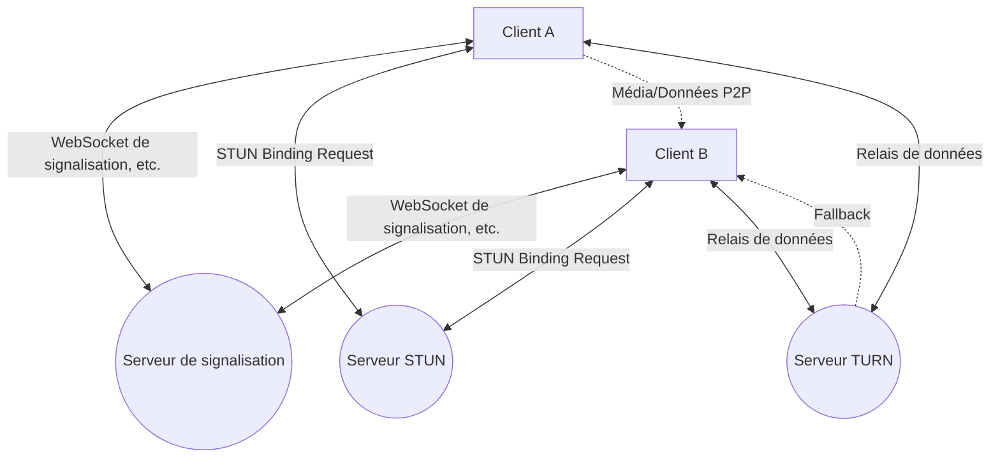
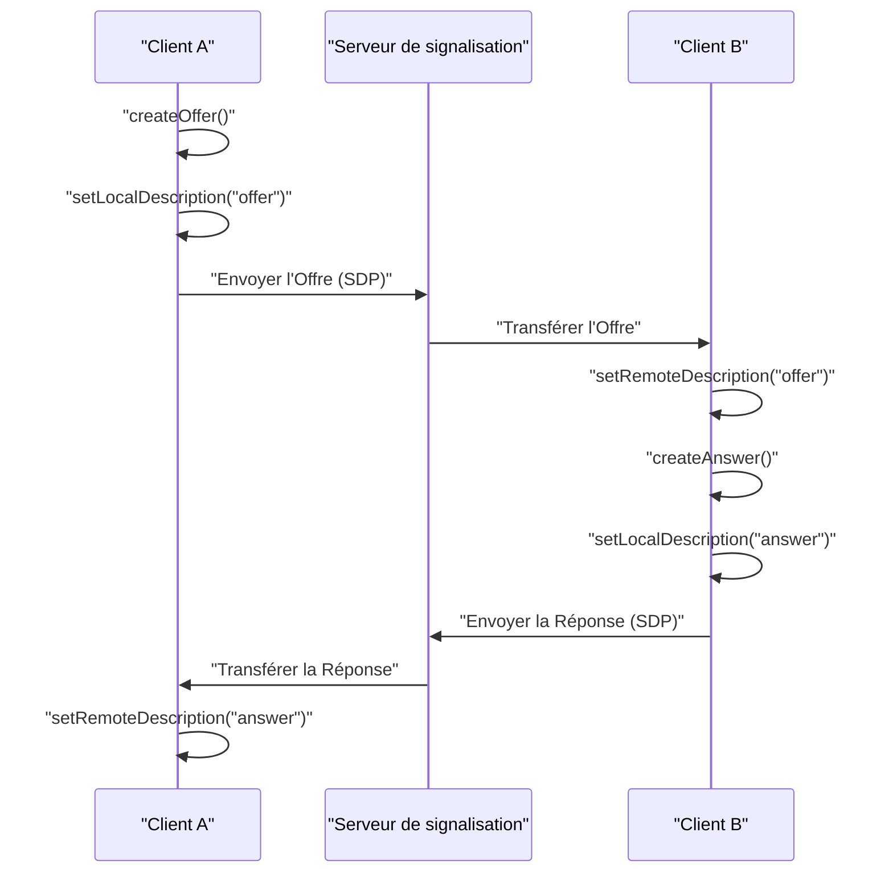
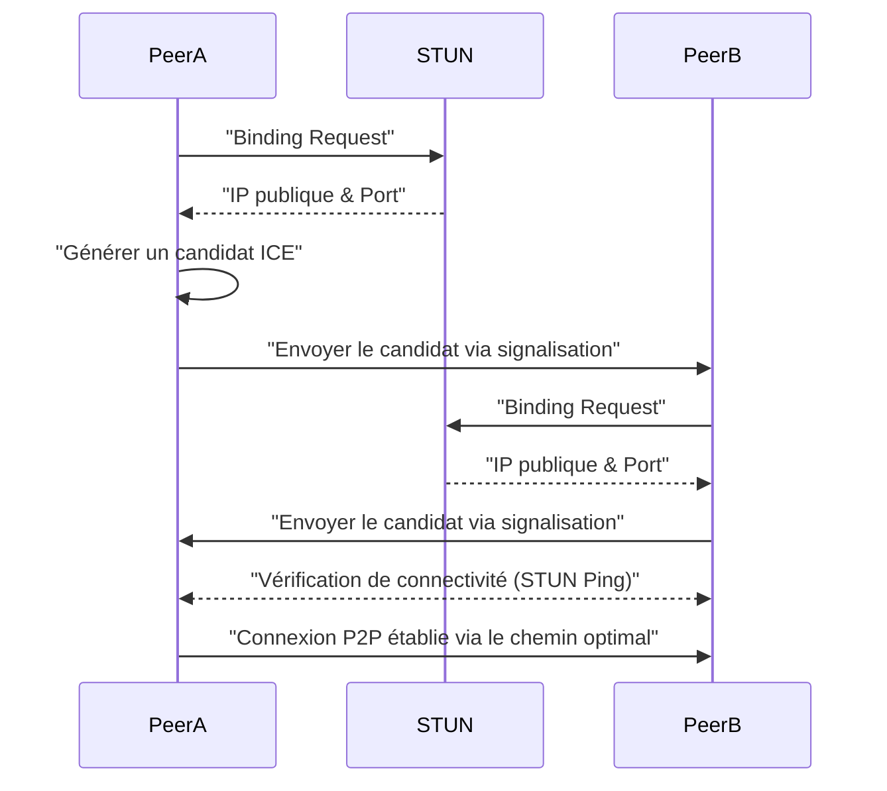
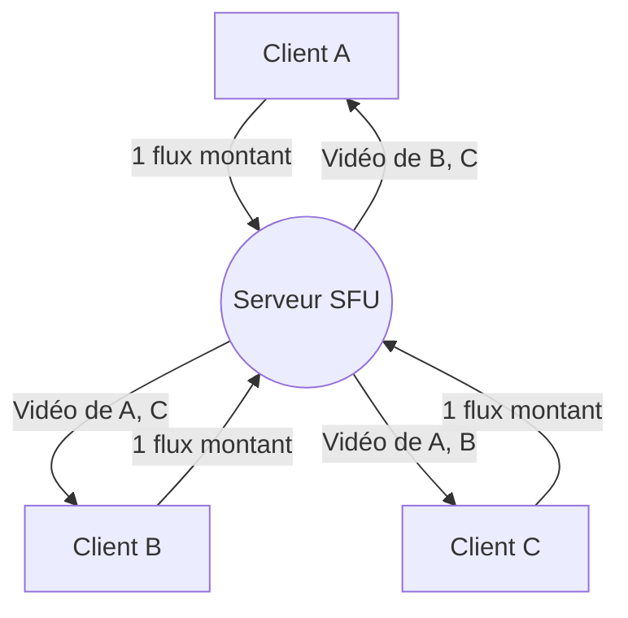

# Les coulisses du WebRTC et de la communication en temps réel : P2P, STUN/TURN, Signalisation

Sur le web moderne, les appels vocaux et vidéo en temps réel ainsi que le transfert de données à faible latence sont devenus des fonctionnalités indispensables. La technologie qui permet de réaliser cela directement dans le navigateur sans aucun plugin est le **WebRTC** (Web Real-Time Communication).

Dans cet article, nous expliquerons très en détail, avec des schémas et du code, comment le WebRTC réalise la communication P2P (Peer-to-Peer) entre navigateurs et les technologies réseau complexes qui se cachent derrière (signalisation, traversée de NAT, STUN/TURN, protocole ICE, etc.).

---

## 1. Architecture de base du WebRTC

Le WebRTC n'est pas un protocole unique, mais un ensemble de plusieurs protocoles et API. Il est principalement composé des trois API majeures suivantes :

1. **MediaStream** (getUserMedia) : Récupère les flux audio et vidéo de la caméra et du microphone.
2. **RTCPeerConnection** : Gère la connexion entre les pairs et transmet les flux multimédias. Il est également responsable du contrôle de la bande passante et du chiffrement.
3. **RTCDataChannel** : Envoie et reçoit des données binaires ou textuelles arbitraires de manière bidirectionnelle avec une faible latence.

Le schéma ci-dessous montre une vue d'ensemble lors de l'établissement d'une communication WebRTC.



### 1.1 Différence entre le modèle client-serveur et le modèle P2P

Les communications web traditionnelles (HTTP/WebSocket, etc.) reposaient toujours sur un **modèle client-serveur** où l'on passait par un serveur. Avec cette méthode, lorsqu'un message était envoyé du Client A au Client B, il devait obligatoirement transiter par le serveur, ce qui posait les problèmes suivants :

- **Augmentation de la latence (délai)** : Le transit par un serveur engendre un délai dû à la distance physique.
- **Charge du serveur** : Tout le trafic est concentré sur le serveur.

D'un autre côté, dans le **modèle P2P**, les clients communiquent directement entre eux. Cela permet une communication par le chemin le plus court, réalisant ainsi une latence ultra-faible.

La formule de calcul du temps de latence s'exprime comme suit :

$ T_{total} = T_{prop} + T_{trans} + T_{queue} + T_{proc} $

Ici, $T_{prop}$ est le délai de propagation (dépendant de la distance), $T_{trans}$ est le délai de transmission, $T_{queue}$ est le délai de mise en file d'attente, et $T_{proc}$ est le délai de traitement. Dans une communication P2P, en omettant le serveur relais, on peut considérablement réduire $T_{prop}$ et $T_{proc}$.

---

## 2. Qu'est-ce que la signalisation (Signaling) ?

Pour établir une communication P2P, les deux parties doivent savoir "où elles se trouvent" (adresse IP et numéro de port). Cependant, au départ, les navigateurs ignorent l'existence de l'autre.

C'est là qu'intervient le **serveur de signalisation**. Le serveur de signalisation n'est pas utilisé pour relayer les données multimédias elles-mêmes, mais uniquement pour échanger des **métadonnées** (informations de contact et spécifications des médias) afin d'établir la communication.

### 2.1 SDP (Session Description Protocol)

L'une des informations importantes échangées lors de la signalisation est le **SDP**. Le SDP contient les informations suivantes :

- Le type de média (audio, vidéo, données)
- Les codecs pris en charge (VP8, H.264, Opus, etc.)
- Les informations sur les numéros de port et les adresses IP à utiliser pour la communication

### 2.2 [Flux](https://kenji.blog/fr/p/state-management-history-redux-context-recoil-zustand/) de signalisation (Offre et Réponse)

L'établissement d'une connexion WebRTC s'effectue par l'envoi d'une **Offre** (proposition) par une partie et le retour d'une **Réponse** (Answer) par l'autre.



### 2.3 Exemple d'implémentation d'un serveur de signalisation (Node.js + WebSocket)

L'implémentation du serveur de signalisation n'étant pas définie par les spécifications WebRTC, vous pouvez utiliser la technologie de votre choix, comme WebSocket, Socket.io ou Firebase. Voici un exemple de serveur de signalisation simple utilisant la bibliothèque `ws`.

```javascript
// server.js
const WebSocket = require('ws');
const wss = new WebSocket.Server({ port: 8080 });

wss.on('connection', (ws) => {
    console.log('Un nouveau client s\'est connecté.');

    ws.on('message', (message) => {
        // Diffuser le message reçu (Offre/Réponse/Candidat ICE)
        // En pratique, il faut contrôler l'envoi vers un destinataire spécifique (salle ou ID)
        wss.clients.forEach((client) => {
            if (client !== ws && client.readyState === WebSocket.OPEN) {
                client.send(message);
            }
        });
    });
});
```

---

## 3. Le mur de la traversée de NAT : STUN et TURN

Bien que nous ayons échangé nos SDP respectifs grâce à la signalisation, cela ne suffit pas pour communiquer. En effet, de nombreux appareils se trouvent derrière un **NAT** (Network Address Translation) et ne possèdent qu'une adresse IP privée. Il est impossible d'accéder directement à une adresse IP privée depuis Internet.

### 3.1 STUN (Session Traversal Utilities for NAT)

Le **serveur STUN** agit comme un miroir qui indique au client sa propre "adresse IP publique et son numéro de port".

1. Le client envoie une requête au serveur STUN.
2. Le serveur STUN répond : "De mon point de vue, votre adresse IP publique est X.X.X.X et le port est YYYY."
3. Le client inclut ces informations publiques obtenues dans le SDP ou les candidats ICE pour les communiquer à l'autre partie.

### 3.2 TURN (Traversal Using Relays around NAT)

Il y a des cas où la communication ne peut pas être établie même en utilisant STUN. C'est typiquement le cas dans des environnements NAT stricts appelés **Symmetric NAT** ou lorsqu'il y a un pare-feu d'entreprise.

Dans de tels cas, on utilise un **serveur TURN**. Un serveur TURN est un serveur qui abandonne la communication P2P et sert à **relayer** les données multimédias. Bien que la communication soit garantie, cela présente des inconvénients tels que la charge sur le serveur, l'augmentation de la latence et des coûts supplémentaires.

### 3.3 ICE (Interactive Connectivity Establishment)

Comment le WebRTC choisit-il d'utiliser STUN ou TURN ? Le framework qui résout ce problème est l'**ICE**.

L'ICE collecte les candidats (**ICE Candidate**) pour toutes les routes de communication possibles (IP locale, IP publique obtenue par STUN, relais par TURN) et les échange entre les parties. Ensuite, il sélectionne automatiquement la route la plus efficace (généralement dans l'ordre : IP locale > STUN > TURN) et établit la connexion.



---

## 4. Sécurité et chiffrement (DTLS/SRTP)

Les flux multimédias et les canaux de données WebRTC doivent obligatoirement être chiffrés.

- **DTLS (Datagram Transport Layer Security)** : Un protocole qui fournit une sécurité équivalente à TLS sur [UDP](https://kenji.blog/fr/p/http3-quic-protocol-tcp-udp/). Il est utilisé pour le chiffrement des canaux de données et l'échange de clés.
- **SRTP (Secure Real-time Transport Protocol)** : Un protocole pour transférer de manière chiffrée des données multimédias telles que l'audio et la vidéo. Les données sont chiffrées à l'aide des clés échangées par DTLS.

Ainsi, l'écoute clandestine et la falsification sur le réseau sont empêchées, et un **chiffrement de bout en bout** (E2EE) sécurisé est fourni en standard.

---

## 5. Exemple d'implémentation de WebRTC : Frontend

Voyons maintenant un code frontend simple qui initialise le WebRTC dans le navigateur et interagit avec le serveur de signalisation.

```javascript
// app.js
const signalingUrl = 'ws://localhost:8080';
const ws = new WebSocket(signalingUrl);
let peerConnection;

const configuration = {
    iceServers: [
        { urls: 'stun:stun.l.google.com:19302' } // Utiliser le serveur STUN public de Google
    ]
};

// 1. Initialisation de RTCPeerConnection
function initPeerConnection() {
    peerConnection = new RTCPeerConnection(configuration);

    // Envoyer au correspondant lorsque le candidat ICE est généré
    peerConnection.onicecandidate = (event) => {
        if (event.candidate) {
            sendMessage({ type: 'candidate', candidate: event.candidate });
        }
    };

    // Traitement lors de la réception du flux du correspondant
    peerConnection.ontrack = (event) => {
        const remoteVideo = document.getElementById('remoteVideo');
        if (remoteVideo.srcObject !== event.streams[0]) {
            remoteVideo.srcObject = event.streams[0];
        }
    };
}

// Envoi et réception des messages de signalisation
ws.onmessage = async (message) => {
    const data = JSON.parse(message.data);

    if (data.type === 'offer') {
        initPeerConnection();
        await peerConnection.setRemoteDescription(new RTCSessionDescription(data.offer));
        const answer = await peerConnection.createAnswer();
        await peerConnection.setLocalDescription(answer);
        sendMessage({ type: 'answer', answer: answer });
    } else if (data.type === 'answer') {
        await peerConnection.setRemoteDescription(new RTCSessionDescription(data.answer));
    } else if (data.type === 'candidate') {
        await peerConnection.addIceCandidate(new RTCIceCandidate(data.candidate));
    }
};

function sendMessage(msg) {
    ws.send(JSON.stringify(msg));
}

// Déclencheur du début de la connexion (Création de l'offre)
async function startCall() {
    initPeerConnection();

    // Obtention du média local
    const stream = await navigator.mediaDevices.getUserMedia({ video: true, audio: true });
    document.getElementById('localVideo').srcObject = stream;
    stream.getTracks().forEach(track => peerConnection.addTrack(track, stream));

    // Création et envoi de l'Offre
    const offer = await peerConnection.createOffer();
    await peerConnection.setLocalDescription(offer);
    sendMessage({ type: 'offer', offer: offer });
}
```

---

## 6. Performance et scalabilité : SFU et MCU

La communication P2P est idéale pour les appels en tête-à-tête, mais pose des problèmes lors de connexions multijoueurs (par exemple, des visioconférences avec de nombreux participants comme Zoom ou Google Meet). S'il y a $N$ participants, chaque client doit envoyer $(N-1)$ flux montants, ce qui épuise rapidement la bande passante et le processeur.

Pour résoudre ce problème de connexion multiple, on utilise les architectures **SFU** et **MCU**.

### 6.1 MCU (Multipoint Control Unit)

Le MCU reçoit la vidéo de tous les clients, la combine (mixe) en une seule vidéo sur le serveur et la distribue à chaque client.

- **Avantages** : La charge et la consommation de bande passante des clients sont minimisées.
- **Inconvénients** : Étant donné que le serveur doit décoder, encoder et combiner la vidéo, les coûts du serveur sont très élevés.

### 6.2 SFU (Selective Forwarding Unit)

Le SFU est un serveur qui ne combine pas la vidéo, mais distribue (route) les flux multimédias reçus tels quels aux clients qui en ont besoin.



- **Avantages** : Les clients n'ont qu'à envoyer un seul flux montant. Le serveur n'effectuant pas de traitement de combinaison, la charge est plus faible et il est plus facile à faire évoluer par rapport au MCU.
- **Inconvénients** : Les clients devant recevoir et décoder plusieurs flux descendants, la charge côté client est plus élevée qu'avec le MCU.

La plupart des systèmes de visioconférence web modernes (Discord, Google Meet, etc.) adoptent cette architecture SFU.

---

## 7. Utilisation du canal de données (RTCDataChannel)

Le WebRTC fournit l'API `RTCDataChannel` pour envoyer non seulement de la vidéo et de l'audio, mais aussi des données arbitraires. En arrière-plan, cela utilise le protocole **SCTP (Stream Control Transmission Protocol)**.

Le SCTP combine les caractéristiques de fiabilité du [TCP](https://kenji.blog/fr/p/http3-quic-protocol-tcp-udp/) et de faible latence de l'[UDP](https://kenji.blog/fr/p/http3-quic-protocol-tcp-udp/).

- **Contrôle de la fiabilité** : Vous pouvez choisir de garantir ou non la livraison des données (comme TCP) ou non (comme UDP).
- **Contrôle de l'ordre** : Vous pouvez choisir de garantir l'ordre d'arrivée ou d'ignorer l'ordre et de traiter les données au fur et à mesure de leur réception.

Cela permet des conceptions flexibles, par exemple pour des données de coordonnées de jeu où il est important que les données les plus récentes arrivent rapidement même s'il y a des pertes, vous pouvez les transférer à haute vitesse avec "sans fiabilité, sans garantie d'ordre". En revanche, pour le transfert de fichiers où aucune perte n'est tolérée, vous pouvez les transférer "avec fiabilité".

---

## 8. Conclusion

Le WebRTC est une technologie puissante qui permet de réaliser des communications en temps réel avancées uniquement avec un navigateur. De nombreux éléments technologiques fonctionnent ensemble, des bases de la communication P2P à la signalisation, la traversée de NAT avec STUN/TURN, la recherche de route avec ICE et la sécurité.

En comprenant correctement ces mécanismes sous-jacents, il est possible de construire des applications robustes face aux environnements réseau et de concevoir des systèmes évolutifs exploitant SFU/MCU.

La technologie WebRTC évolue de jour en jour et devrait continuer à jouer un rôle actif dans divers domaines tels que le métavers, l'IoT et le cloud gaming à l'avenir.
