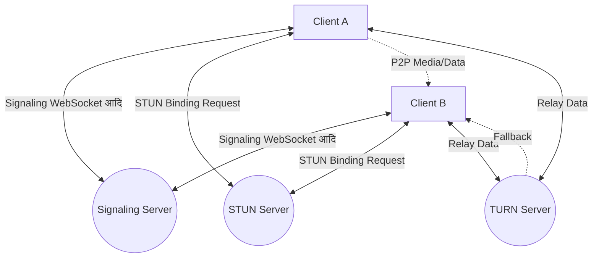
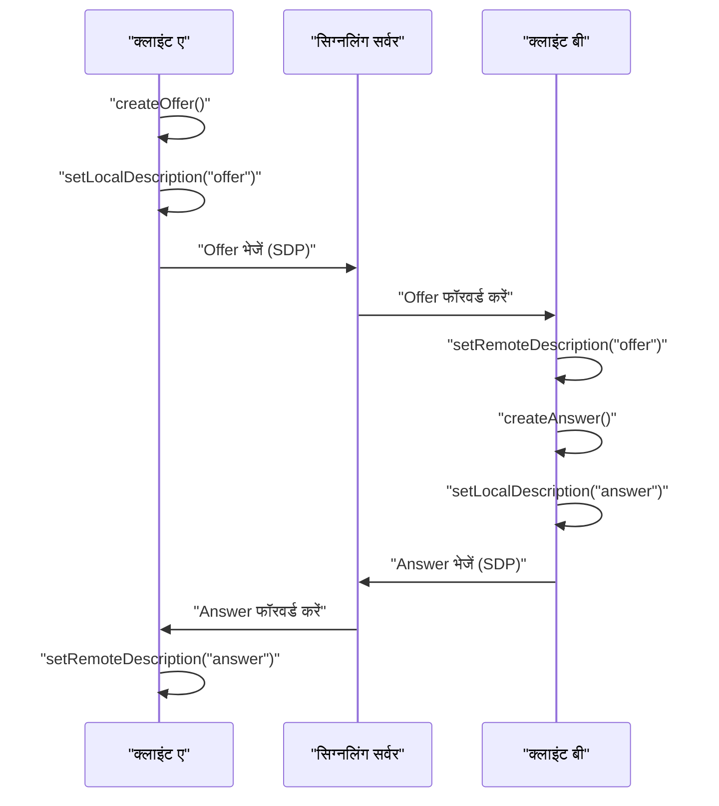
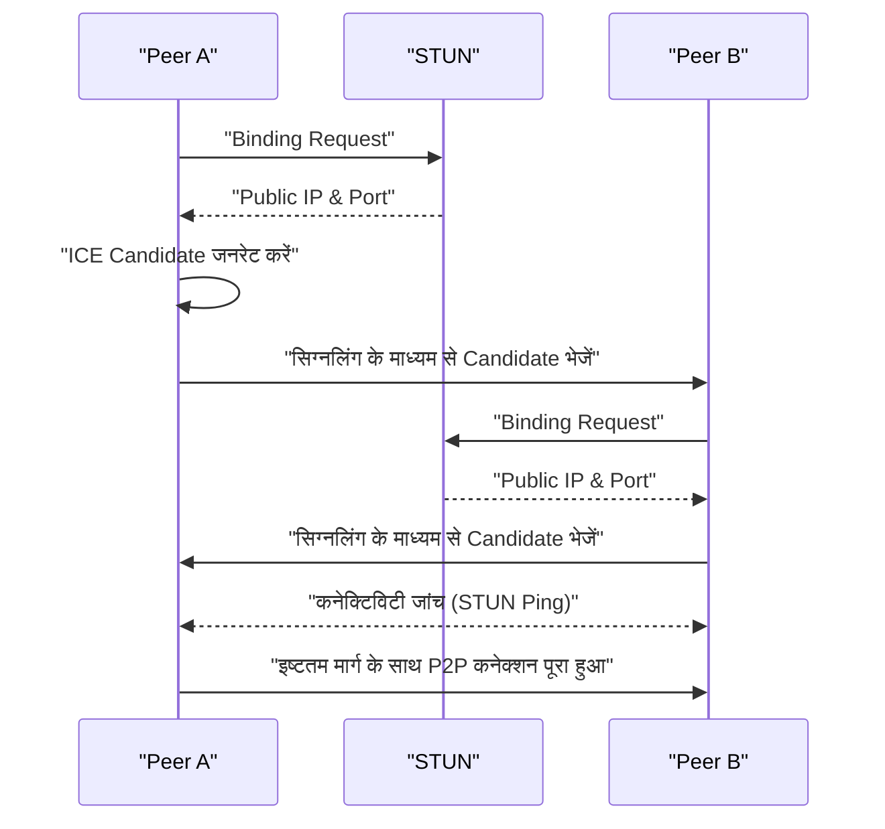
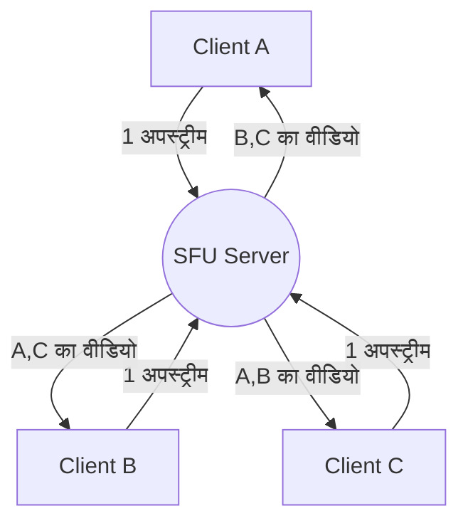

# WebRTC और रियल-टाइम कम्यूनिकेशन के पीछे की कहानी: P2P, STUN/TURN, सिग्नलिंग

आधुनिक वेब में, रियल-टाइम ऑडियो और वीडियो कॉल, और कम लेटेंसी डेटा ट्रांसफर आवश्यक विशेषताएं बन गई हैं। वह तकनीक जो इसे बिना किसी प्लगइन के ब्राउज़र पर संभव बनाती है, वह **WebRTC** (Web Real-Time Communication) है।

इस लेख में, हम विस्तार से आरेख और कोड के साथ समझाएंगे कि कैसे WebRTC ब्राउज़र के बीच P2P (Peer-to-Peer) संचार का एहसास कराता है, और इसके पीछे की जटिल नेटवर्क तकनीकें (सिग्नलिंग, NAT ट्रैवर्सल, STUN/TURN, ICE प्रोटोकॉल, आदि) क्या हैं।

---

## 1. WebRTC का बेसिक आर्किटेक्चर

WebRTC कोई एक प्रोटोकॉल नहीं है, बल्कि कई प्रोटोकॉल और API का एक संग्रह है। इसे मोटे तौर पर निम्नलिखित तीन मुख्य API में विभाजित किया गया है।

1.  **MediaStream** (getUserMedia): कैमरा या माइक्रोफ़ोन से ऑडियो और वीडियो स्ट्रीम प्राप्त करता है।
2.  **RTCPeerConnection**: पीयर्स के बीच कनेक्शन को प्रबंधित करता है और मीडिया स्ट्रीम भेजता है। यह बैंडविड्थ नियंत्रण और एन्क्रिप्शन को भी संभालता है।
3.  **RTCDataChannel**: किसी भी बाइनरी या टेक्स्ट डेटा को कम लेटेंसी के साथ दोनों दिशाओं में भेजता और प्राप्त करता है।

नीचे दिया गया आरेख WebRTC संचार स्थापित करते समय की पूरी तस्वीर दिखाता है।



### 1.1 क्लाइंट-सर्वर मॉडल और P2P मॉडल के बीच अंतर

पारंपरिक वेब संचार (HTTP/WebSocket आदि) हमेशा सर्वर के माध्यम से एक **क्लाइंट-सर्वर मॉडल** रहा है। इस पद्धति में, जब क्लाइंट A से क्लाइंट B को संदेश भेजा जाता है, तो यह हमेशा सर्वर के माध्यम से रिले होता है, जिससे निम्नलिखित समस्याएं आती हैं:

-  **लेटेंसी (देरी) में वृद्धि** : क्योंकि यह सर्वर के माध्यम से रिले होता है, भौतिक दूरी के कारण देरी होती है।
-  **सर्वर पर लोड** : सारा ट्रैफ़िक सर्वर पर केंद्रित होता है।

दूसरी ओर, **P2P मॉडल** में, क्लाइंट सीधे एक दूसरे के साथ संचार करते हैं। यह सबसे छोटे मार्ग से संचार की अनुमति देता है, जिससे अति-कम लेटेंसी प्राप्त होती है।

देरी के समय की गणना का सूत्र इस प्रकार व्यक्त किया गया है:

$ T_{total} = T_{prop} + T_{trans} + T_{queue} + T_{proc} $

यहाँ, $T_{prop}$ प्रसार विलंब (दूरी पर निर्भर) है, $T_{trans}$ संचरण विलंब है, $T_{queue}$ कतार विलंब है, और $T_{proc}$ प्रसंस्करण विलंब है। P2P संचार में, रिले सर्वर को हटाकर $T_{prop}$ और $T_{proc}$ को काफी कम किया जा सकता है।

---

## 2. सिग्नलिंग (Signaling) क्या है?

P2P संचार स्थापित करने के लिए, दोनों पक्षों को यह जानना होगा कि "वे कहाँ हैं (IP एड्रेस और पोर्ट नंबर)"। हालाँकि, ब्राउज़र को शुरू में दूसरे पक्ष के अस्तित्व के बारे में नहीं पता होता है।

यहीं पर **सिग्नलिंग सर्वर** खेल में आता है। सिग्नलिंग सर्वर का उपयोग मीडिया डेटा को रिले करने के लिए नहीं किया जाता है, बल्कि संचार स्थापित करने के लिए केवल **मेटाडेटा** (संपर्क जानकारी और मीडिया विनिर्देशों) का आदान-प्रदान करने के लिए किया जाता है।

### 2.1 SDP (Session Description Protocol)

सिग्नलिंग में आदान-प्रदान की जाने वाली महत्वपूर्ण जानकारी में से एक **SDP** है। SDP में निम्नलिखित जानकारी शामिल होती है:

- मीडिया के प्रकार (ऑडियो, वीडियो, डेटा)
- समर्थित कोडेक्स (VP8, H.264, Opus, आदि)
- संचार के लिए उपयोग किए जाने वाले पोर्ट नंबर और IP एड्रेस की जानकारी

### 2.2 सिग्नलिंग का फ्लो (Offer और Answer)

WebRTC कनेक्शन की स्थापना तब होती है जब एक पक्ष **Offer** (प्रस्ताव) करता है और दूसरा पक्ष **Answer** (उत्तर) देता है।



### 2.3 सिग्नलिंग सर्वर का उदाहरण कार्यान्वयन (Node.js + WebSocket)

चूंकि सिग्नलिंग सर्वर का कार्यान्वयन WebRTC विनिर्देश द्वारा परिभाषित नहीं है, इसलिए आप WebSocket, Socket.io, या Firebase जैसी किसी भी तकनीक का उपयोग कर सकते हैं। नीचे `ws` लाइब्रेरी का उपयोग करके एक साधारण सिग्नलिंग सर्वर का उदाहरण दिया गया है।

```javascript
// server.js
const WebSocket = require('ws');
const wss = new WebSocket.Server({ port: 8080 });

wss.on('connection', (ws) => {
    console.log('नया क्लाइंट कनेक्ट हुआ है।');

    ws.on('message', (message) => {
        // प्राप्त संदेश (Offer/Answer/ICE Candidate) को ब्रॉडकास्ट करें
        // वास्तविक उपयोग में, विशिष्ट पक्ष (कमरा या ID) को ही भेजने के लिए नियंत्रण आवश्यक है
        wss.clients.forEach((client) => {
            if (client !== ws && client.readyState === WebSocket.OPEN) {
                client.send(message);
            }
        });
    });
});
```

---

## 3. NAT ट्रैवर्सल की बाधा: STUN और TURN

यद्यपि हमने सिग्नलिंग के माध्यम से एक-दूसरे के SDP का आदान-प्रदान कर लिया है, लेकिन अकेले यह संचार के लिए पर्याप्त नहीं है। ऐसा इसलिए है क्योंकि कई उपकरण **NAT** (Network Address Translation) के पीछे होते हैं और उनके पास केवल निजी IP एड्रेस होते हैं। इंटरनेट से सीधे किसी निजी IP एड्रेस तक पहुँचना असंभव है।

### 3.1 STUN (Session Traversal Utilities for NAT)

**STUN सर्वर** एक दर्पण की तरह होता है जो क्लाइंट को उसका "सार्वजनिक IP एड्रेस और पोर्ट नंबर" बताता है।

1. क्लाइंट STUN सर्वर को एक अनुरोध भेजता है।
2. STUN सर्वर जवाब देता है, "मेरे दृष्टिकोण से, आपका सार्वजनिक IP एड्रेस X.X.X.X है, और पोर्ट YYYY है।"
3. क्लाइंट इस प्राप्त सार्वजनिक जानकारी को SDP या ICE Candidate में शामिल करता है और इसे दूसरे पक्ष को भेजता है।

### 3.2 TURN (Traversal Using Relays around NAT)

कभी-कभी STUN का उपयोग करके भी कनेक्शन स्थापित नहीं किया जा सकता है। इसके विशिष्ट उदाहरण **Symmetric NAT** नामक सख्त NAT वातावरण या कॉर्पोरेट फ़ायरवॉल की उपस्थिति हैं।

ऐसे मामलों में, **TURN सर्वर** का उपयोग किया जाता है। TURN सर्वर P2P संचार को छोड़ देता है और सर्वर के माध्यम से मीडिया डेटा को **रिले (मध्यस्थता)** करने के लिए कार्य करता है। हालांकि यह सुनिश्चित करता है कि संचार होगा, इसमें सर्वर पर भारी लोड, बढ़ी हुई लेटेंसी और अतिरिक्त लागत जैसे नुकसान हैं।

### 3.3 ICE (Interactive Connectivity Establishment)

WebRTC STUN और TURN का उचित उपयोग कैसे तय करता है? **ICE** वह ढांचा है जो इस समस्या का समाधान करता है।

ICE सभी संभावित संचार मार्गों (स्थानीय IP, STUN से प्राप्त सार्वजनिक IP, TURN रिले) के उम्मीदवारों ( **ICE Candidate** ) को इकट्ठा करता है और उनका एक-दूसरे के साथ आदान-प्रदान करता है। फिर यह स्वचालित रूप से सबसे कुशल मार्ग (आमतौर पर स्थानीय IP > STUN > TURN के क्रम में) का चयन करता है और एक कनेक्शन स्थापित करता है।



---

## 4. सुरक्षा और एन्क्रिप्शन (DTLS/SRTP)

WebRTC के मीडिया स्ट्रीम और डेटा चैनल हमेशा एन्क्रिप्ट किए जाने चाहिए।

-  **DTLS (Datagram Transport Layer Security)** : एक प्रोटोकॉल जो [UDP](https://kenji.blog/hi/p/http3-quic-protocol-tcp-udp/) पर TLS के समान सुरक्षा प्रदान करता है। इसका उपयोग डेटा चैनल एन्क्रिप्शन और कुंजी विनिमय के लिए किया जाता है।
-  **SRTP (Secure Real-time Transport Protocol)** : ऑडियो और वीडियो जैसे मीडिया डेटा को एन्क्रिप्ट और स्थानांतरित करने के लिए एक प्रोटोकॉल। यह DTLS द्वारा आदान-प्रदान की गई कुंजियों का उपयोग करके एन्क्रिप्ट किया जाता है।

यह मार्ग पर ईव्सड्रॉपिंग या छेड़छाड़ को रोकता है, और सुरक्षित **एंड-टू-एंड एन्क्रिप्शन** (E2EE) को डिफ़ॉल्ट रूप से महसूस किया जाता है।

---

## 5. WebRTC का उदाहरण कार्यान्वयन: फ्रंट-एंड

अब, आइए फ्रंट-एंड कोड के एक सरल उदाहरण पर नज़र डालें जो वास्तव में ब्राउज़र में WebRTC को आरंभ करता है और सिग्नलिंग सर्वर के साथ संचार करता है।

```javascript
// app.js
const signalingUrl = 'ws://localhost:8080';
const ws = new WebSocket(signalingUrl);
let peerConnection;

const configuration = {
    iceServers: [
        { urls: 'stun:stun.l.google.com:19302' } // Google के सार्वजनिक STUN सर्वर का उपयोग
    ]
};

// 1. RTCPeerConnection का आरंभीकरण
function initPeerConnection() {
    peerConnection = new RTCPeerConnection(configuration);

    // जब ICE Candidate उत्पन्न होता है, तो इसे दूसरे पक्ष को भेजें
    peerConnection.onicecandidate = (event) => {
        if (event.candidate) {
            sendMessage({ type: 'candidate', candidate: event.candidate });
        }
    };

    // दूसरे पक्ष से स्ट्रीम प्राप्त होने पर प्रक्रिया
    peerConnection.ontrack = (event) => {
        const remoteVideo = document.getElementById('remoteVideo');
        if (remoteVideo.srcObject !== event.streams[0]) {
            remoteVideo.srcObject = event.streams[0];
        }
    };
}

// सिग्नलिंग संदेश भेजना और प्राप्त करना
ws.onmessage = async (message) => {
    const data = JSON.parse(message.data);

    if (data.type === 'offer') {
        initPeerConnection();
        await peerConnection.setRemoteDescription(new RTCSessionDescription(data.offer));
        const answer = await peerConnection.createAnswer();
        await peerConnection.setLocalDescription(answer);
        sendMessage({ type: 'answer', answer: answer });
    } else if (data.type === 'answer') {
        await peerConnection.setRemoteDescription(new RTCSessionDescription(data.answer));
    } else if (data.type === 'candidate') {
        await peerConnection.addIceCandidate(new RTCIceCandidate(data.candidate));
    }
};

function sendMessage(msg) {
    ws.send(JSON.stringify(msg));
}

// कनेक्शन शुरू करने के लिए ट्रिगर (Offer बनाना)
async function startCall() {
    initPeerConnection();

    // स्थानीय मीडिया प्राप्त करना
    const stream = await navigator.mediaDevices.getUserMedia({ video: true, audio: true });
    document.getElementById('localVideo').srcObject = stream;
    stream.getTracks().forEach(track => peerConnection.addTrack(track, stream));

    // Offer बनाना और भेजना
    const offer = await peerConnection.createOffer();
    await peerConnection.setLocalDescription(offer);
    sendMessage({ type: 'offer', offer: offer });
}
```

---

## 6. प्रदर्शन और स्केलेबिलिटी: SFU और MCU

P2P संचार वन-ऑन-वन कॉलिंग के लिए बहुत अच्छा है, लेकिन कई लोगों (जैसे ज़ूम या Google मीट जैसे मल्टी-पार्टी कॉन्फ्रेंस) के शामिल होने पर समस्याएँ उत्पन्न होती हैं। जब $N$ प्रतिभागी होते हैं, तो प्रत्येक क्लाइंट को $(N-1)$ अपस्ट्रीम भेजने होते हैं, जो जल्दी से बैंडविड्थ और CPU को समाप्त कर देते हैं।

मल्टी-पार्टी कनेक्शन के लिए इस चुनौती को हल करने के लिए **SFU** और **MCU** आर्किटेक्चर हैं।

### 6.1 MCU (Multipoint Control Unit)

MCU सभी क्लाइंट से वीडियो प्राप्त करता है, उन्हें सर्वर पर एक वीडियो में जोड़ता (मिक्स करता) है, और उन्हें प्रत्येक क्लाइंट को वितरित करता है।

-  **फायदे** : क्लाइंट का लोड और बैंडविड्थ की खपत न्यूनतम होती है।
-  **नुकसान** : सर्वर की लागत बहुत अधिक है क्योंकि इसे सर्वर साइड पर वीडियो को डिकोड, एन्कोड और संयोजित करने की आवश्यकता होती है।

### 6.2 SFU (Selective Forwarding Unit)

SFU एक सर्वर है जो वीडियो को संयोजित नहीं करता है, बल्कि प्राप्त मीडिया स्ट्रीम को आवश्यक क्लाइंट को निर्देशित (रूट) करता है।



-  **फायदे** : क्लाइंट को केवल 1 अपस्ट्रीम भेजने की आवश्यकता होती है। चूंकि सर्वर सम्मिश्रण (compositing) नहीं करता है, इसलिए लोड कम है और यह MCU की तुलना में स्केल करना आसान है।
-  **नुकसान** : क्लाइंट का लोड MCU की तुलना में अधिक है क्योंकि क्लाइंट कई डाउनस्ट्रीम प्राप्त और डिकोड करता है।

कई वर्तमान आधुनिक वेब कॉन्फ्रेंसिंग सिस्टम (Discord, Google Meet, आदि) इस SFU आर्किटेक्चर का उपयोग करते हैं।

---

## 7. डेटा चैनल (RTCDataChannel) का उपयोग करना

WebRTC न केवल वीडियो और ऑडियो, बल्कि मनमाना डेटा भेजने के लिए `RTCDataChannel` API प्रदान करता है। यह पर्दे के पीछे **SCTP (Stream Control Transmission Protocol)** नामक प्रोटोकॉल का उपयोग करता है।

SCTP में [TCP](https://kenji.blog/hi/p/http3-quic-protocol-tcp-udp/) की विश्वसनीयता और [UDP](https://kenji.blog/hi/p/http3-quic-protocol-tcp-udp/) की कम लेटेंसी दोनों की विशेषताएं हैं।

-  **विश्वसनीयता नियंत्रण** : आप चुन सकते हैं कि डेटा आगमन की गारंटी (TCP-समान) देनी है या नहीं (UDP-समान)।
-  **क्रम नियंत्रण** : आप यह चुन सकते हैं कि आगमन क्रम की गारंटी देनी है या क्रम को अनदेखा करना है और उन्हें उसी क्रम में संसाधित करना है जिस क्रम में वे आते हैं।

आप इसे लचीले ढंग से डिज़ाइन कर सकते हैं, जैसे यदि नवीनतम डेटा का जल्दी से आना महत्वपूर्ण है, भले ही कुछ खो जाए, जैसे गेम समन्वय डेटा, तो आप इसे "कोई विश्वसनीयता नहीं, कोई क्रम गारंटी नहीं" के साथ उच्च गति पर स्थानांतरित कर सकते हैं। और यदि नुकसान अस्वीकार्य है, जैसे फ़ाइल स्थानांतरण, तो आप इसे "विश्वसनीयता के साथ" स्थानांतरित कर सकते हैं।

---

## 8. निष्कर्ष

WebRTC एक शक्तिशाली तकनीक है जो केवल ब्राउज़र के साथ उन्नत रियल-टाइम संचार को सक्षम बनाती है। P2P संचार के मूल सिद्धांतों से लेकर सिग्नलिंग, STUN/TURN के साथ NAT ट्रैवर्सल, ICE के साथ रूट डिस्कवरी और सुरक्षा तक, कई तकनीकी तत्व एक साथ मिलकर काम करते हैं।

इन बैकएंड तंत्रों को सही ढंग से समझकर, आप ऐसे एप्लिकेशन बना सकते हैं जो नेटवर्क के वातावरण के प्रति मजबूत हों और SFU/MCU का लाभ उठाने वाले स्केलेबल सिस्टम डिज़ाइन कर सकें।

WebRTC तकनीक हर दिन विकसित हो रही है, और भविष्य में मेटावर्स, IoT और क्लाउड गेमिंग जैसे विभिन्न क्षेत्रों में इसके सक्रिय होने की उम्मीद है।
