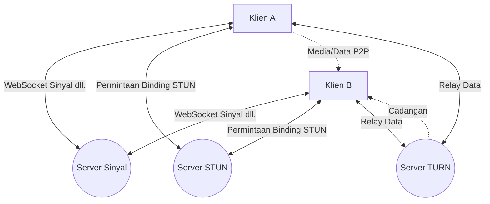
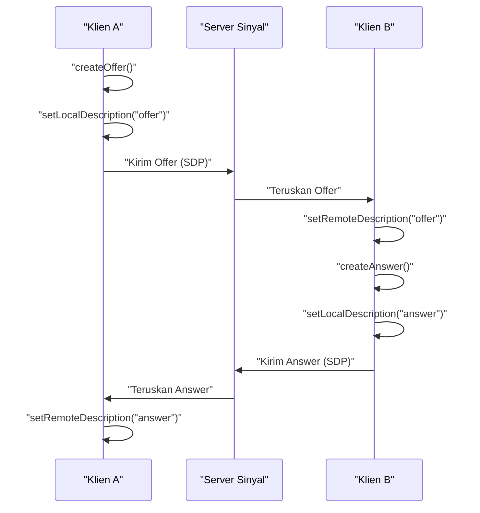
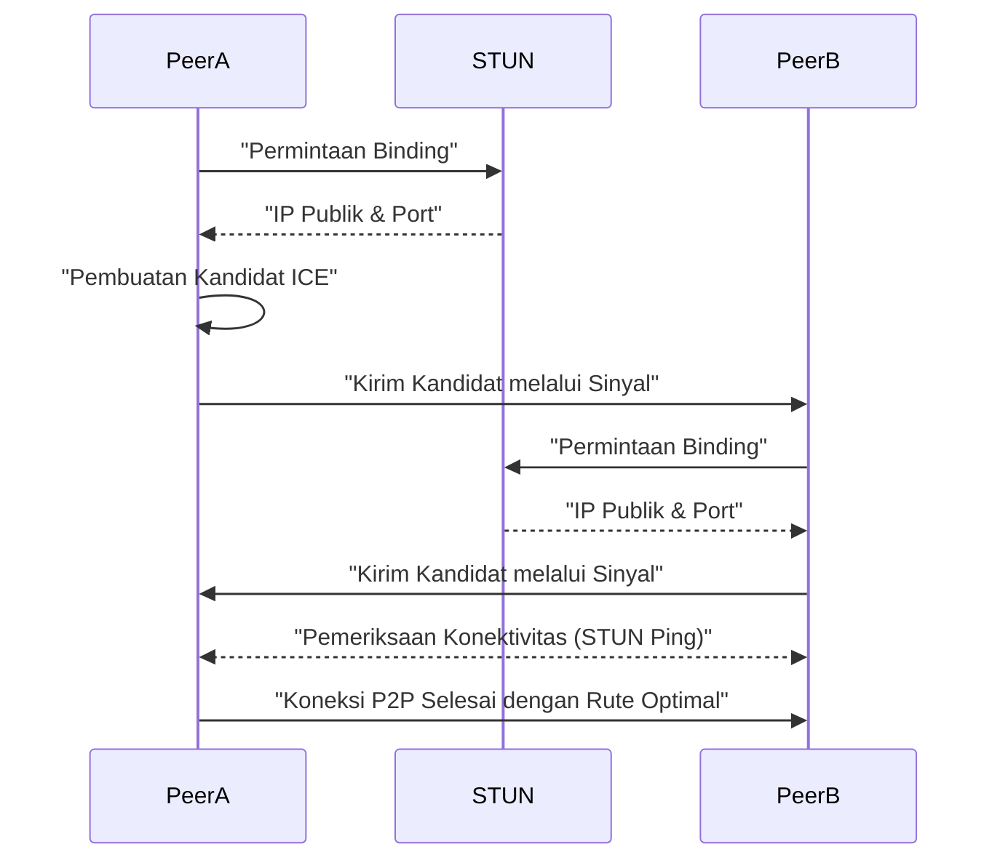
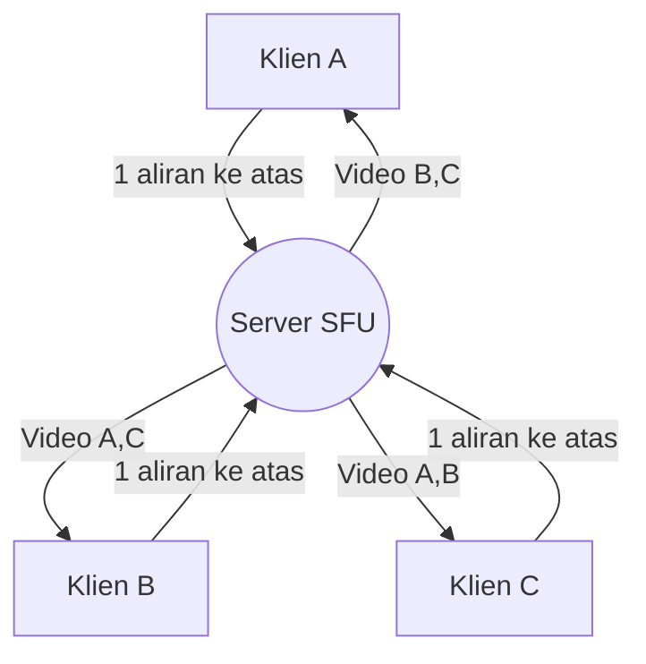

# Di Balik WebRTC dan Komunikasi Waktu Nyata: P2P, STUN/TURN, Sinyal

Di web modern, panggilan suara dan video waktu nyata serta transfer data dengan latensi rendah telah menjadi fitur yang sangat diperlukan. Teknologi yang mewujudkan hal tersebut di peramban tanpa plugin adalah **WebRTC** (Web Real-Time Communication).

Pada artikel ini, kami akan menjelaskan dengan sangat rinci bagaimana WebRTC menyadari komunikasi P2P (Peer-to-Peer) antar peramban, dan teknologi jaringan kompleks di baliknya (sinyal, melintasi NAT, STUN/TURN, protokol ICE, dll.), lengkap dengan diagram dan kode.

---

## 1. Arsitektur Dasar WebRTC

WebRTC bukanlah protokol tunggal, melainkan kumpulan dari beberapa protokol dan API. Secara umum terdiri dari 3 API utama berikut:

1. **MediaStream** (getUserMedia): Mengambil aliran audio dan video dari kamera atau mikrofon.
2. **RTCPeerConnection**: Mengelola koneksi antar rekan dan mengirimkan aliran media. Juga menangani kontrol bandwidth, enkripsi, dll.
3. **RTCDataChannel**: Mengirim dan menerima data biner atau teks arbitrer secara dua arah dengan latensi rendah.

Diagram berikut menunjukkan gambaran keseluruhan saat membuat koneksi WebRTC.



### 1.1 Perbedaan Tipe Klien-Server dan Tipe P2P

Komunikasi web konvensional (seperti HTTP/WebSocket) selalu berupa **model klien-server** yang melewati server. Dalam metode ini, ketika mengirim pesan dari Klien A ke Klien B, server harus direlay, yang menyebabkan masalah berikut:

- **Peningkatan latensi (penundaan)** : Karena melewati server, terjadi penundaan akibat jarak fisik.
- **Beban server** : Seluruh lalu lintas terpusat di server.

Di sisi lain, dalam **model P2P** , klien berkomunikasi langsung satu sama lain. Hal ini memungkinkan komunikasi dengan rute terpendek, menyadari latensi yang sangat rendah.

Rumus perhitungan waktu penundaan dinyatakan sebagai berikut:

$ T_{total} = T_{prop} + T_{trans} + T_{queue} + T_{proc} $

Di mana, $T_{prop}$ adalah penundaan propagasi (bergantung jarak), $T_{trans}$ adalah penundaan transfer, $T_{queue}$ adalah penundaan antrean, dan $T_{proc}$ adalah penundaan pemrosesan. Dengan komunikasi P2P, $T_{prop}$ dan $T_{proc}$ dapat dikurangi secara signifikan dengan menghilangkan server perantara.

---

## 2. Apa itu Sinyal (Signaling)?

Untuk membuat koneksi P2P, masing-masing pihak perlu mengetahui "di mana mereka berada (alamat IP dan nomor port)". Namun, peramban awalnya tidak mengetahui keberadaan pihak lain.

Di sinilah **server sinyal** masuk. Server sinyal tidak merelay data media itu sendiri, melainkan hanya digunakan untuk bertukar **metadata** (informasi kontak dan spesifikasi media) guna membuat koneksi.

### 2.1 SDP (Session Description Protocol)

Salah satu informasi penting yang dipertukarkan dalam sinyal adalah **SDP** . SDP mencakup informasi seperti:

- Jenis media (audio, video, data)
- Codec yang didukung (VP8, H.264, Opus, dll.)
- Informasi nomor port dan alamat IP yang digunakan untuk komunikasi

### 2.2 Alur Sinyal (Offer dan Answer)

Pembuatan koneksi WebRTC dilakukan oleh satu pihak yang mengeluarkan **Offer** (penawaran) dan pihak lain mengembalikan **Answer** (jawaban).



### 2.3 Contoh Implementasi Server Sinyal (Node.js + WebSocket)

Karena implementasi server sinyal tidak ditentukan dalam spesifikasi WebRTC, Anda bebas menggunakan teknologi apa pun seperti WebSocket, Socket.io, atau Firebase. Berikut adalah contoh server sinyal sederhana yang menggunakan pustaka `ws`.

```javascript
// server.js
const WebSocket = require('ws');
const wss = new WebSocket.Server({ port: 8080 });

wss.on('connection', (ws) => {
    console.log('Klien baru telah terhubung.');

    ws.on('message', (message) => {
        // Siarkan pesan yang diterima (Offer/Answer/Kandidat ICE)
        // Dalam operasi nyata, diperlukan kontrol untuk mengirim hanya ke pihak tertentu (ruangan atau ID)
        wss.clients.forEach((client) => {
            if (client !== ws && client.readyState === WebSocket.OPEN) {
                client.send(message);
            }
        });
    });
});
```

---

## 3. Dinding Lintasan NAT: STUN dan TURN

Meskipun SDP masing-masing telah dipertukarkan melalui sinyal, komunikasi belum dapat dilakukan hanya dengan ini. Ini karena banyak perangkat berada di balik **NAT** (Network Address Translation) dan hanya memiliki alamat IP pribadi. Tidak mungkin untuk mengakses alamat IP pribadi secara langsung dari internet.

### 3.1 STUN (Session Traversal Utilities for NAT)

**Server STUN** seperti cermin yang memberi tahu klien "alamat IP publik dan nomor port" miliknya sendiri.

1. Klien mengirimkan permintaan ke server STUN.
2. Server STUN merespons, "Dari sudut pandang saya, alamat IP publik Anda adalah X.X.X.X, dan portnya adalah YYYY."
3. Klien memasukkan informasi publik yang diperoleh ini ke dalam SDP dan Kandidat ICE lalu menyampaikannya ke pihak lain.

### 3.2 TURN (Traversal Using Relays around NAT)

Ada kasus di mana komunikasi tidak dapat dibuat bahkan jika Anda menggunakan STUN. Contoh tipikal adalah di bawah lingkungan NAT ketat yang disebut **Symmetric NAT** atau ketika ada firewall perusahaan.

Dalam kasus seperti itu, **server TURN** digunakan. Server TURN adalah server untuk **merelay (menyampaikan)** data media melalui server, menyerah pada komunikasi P2P. Komunikasi dapat dilakukan dengan pasti, tetapi ada kerugian seperti beban server, peningkatan latensi, dan timbulnya biaya.

### 3.3 ICE (Interactive Connectivity Establishment)

Bagaimana WebRTC membedakan penggunaan STUN dan TURN? Kerangka kerja yang menyelesaikan ini adalah **ICE** .

ICE mengumpulkan kandidat dari semua rute komunikasi yang memungkinkan (IP lokal, IP publik yang diperoleh oleh STUN, relai oleh TURN) ( **Kandidat ICE** ), dan menukarnya satu sama lain. Kemudian secara otomatis memilih rute yang paling efisien (biasanya dalam urutan IP lokal > STUN > TURN) dan membuat koneksi.



---

## 4. Keamanan dan Enkripsi (DTLS/SRTP)

Aliran media dan saluran data WebRTC harus selalu dienkripsi.

- **DTLS (Datagram Transport Layer Security)** : Protokol yang menyediakan keamanan setara TLS melalui [UDP](https://kenji.blog/id/p/http3-quic-protocol-tcp-udp/). Ini digunakan untuk mengenkripsi saluran data dan pertukaran kunci.
- **SRTP (Secure Real-time Transport Protocol)** : Protokol untuk mengenkripsi dan mentransfer data media seperti audio dan video. Ini dienkripsi menggunakan kunci yang dipertukarkan melalui DTLS.

Ini mencegah penyadapan dan gangguan di sepanjang rute, dan menyadari **enkripsi ujung ke ujung** (E2EE) yang aman sebagai standar.

---

## 5. Contoh Implementasi WebRTC: Frontend

Sekarang mari kita lihat kode frontend sederhana yang menginisialisasi WebRTC di peramban dan berkomunikasi dengan server sinyal.

```javascript
// app.js
const signalingUrl = 'ws://localhost:8080';
const ws = new WebSocket(signalingUrl);
let peerConnection;

const configuration = {
    iceServers: [
        { urls: 'stun:stun.l.google.com:19302' } // Menggunakan server STUN publik Google
    ]
};

// 1. Inisialisasi RTCPeerConnection
function initPeerConnection() {
    peerConnection = new RTCPeerConnection(configuration);

    // Jika Kandidat ICE dibuat, kirim ke pihak lain
    peerConnection.onicecandidate = (event) => {
        if (event.candidate) {
            sendMessage({ type: 'candidate', candidate: event.candidate });
        }
    };

    // Proses saat menerima aliran dari pihak lain
    peerConnection.ontrack = (event) => {
        const remoteVideo = document.getElementById('remoteVideo');
        if (remoteVideo.srcObject !== event.streams[0]) {
            remoteVideo.srcObject = event.streams[0];
        }
    };
}

// Kirim dan terima pesan sinyal
ws.onmessage = async (message) => {
    const data = JSON.parse(message.data);

    if (data.type === 'offer') {
        initPeerConnection();
        await peerConnection.setRemoteDescription(new RTCSessionDescription(data.offer));
        const answer = await peerConnection.createAnswer();
        await peerConnection.setLocalDescription(answer);
        sendMessage({ type: 'answer', answer: answer });
    } else if (data.type === 'answer') {
        await peerConnection.setRemoteDescription(new RTCSessionDescription(data.answer));
    } else if (data.type === 'candidate') {
        await peerConnection.addIceCandidate(new RTCIceCandidate(data.candidate));
    }
};

function sendMessage(msg) {
    ws.send(JSON.stringify(msg));
}

// Pemicu untuk memulai koneksi (Buat Offer)
async function startCall() {
    initPeerConnection();

    // Mendapatkan media lokal
    const stream = await navigator.mediaDevices.getUserMedia({ video: true, audio: true });
    document.getElementById('localVideo').srcObject = stream;
    stream.getTracks().forEach(track => peerConnection.addTrack(track, stream));

    // Membuat dan mengirim Offer
    const offer = await peerConnection.createOffer();
    await peerConnection.setLocalDescription(offer);
    sendMessage({ type: 'offer', offer: offer });
}
```

---

## 6. Kinerja dan Skalabilitas: SFU dan MCU

Komunikasi P2P sangat bagus untuk panggilan satu-ke-satu, tetapi menjadi masalah ketika banyak orang terlibat (misalnya konferensi multi-orang seperti Zoom atau Google Meet). Ketika ada $N$ peserta, masing-masing klien harus mengirim $(N-1)$ aliran ke atas, dan bandwidth serta CPU akan cepat habis.

Arsitektur untuk memecahkan masalah koneksi multi-orang ini adalah **SFU** dan **MCU** .

### 6.1 MCU (Multipoint Control Unit)

MCU menerima video dari semua klien, menggabungkan (mencampur) mereka menjadi satu video di server, dan mendistribusikannya ke masing-masing klien.

- **Kelebihan** : Beban klien dan konsumsi bandwidth minimal.
- **Kekurangan** : Biaya server sangat tinggi karena proses dekode, enkode, dan komposisi video diperlukan di sisi server.

### 6.2 SFU (Selective Forwarding Unit)

SFU adalah server yang mendistribusikan (merutekan) aliran media yang diterima ke klien yang membutuhkannya tanpa menggabungkan video.



- **Kelebihan** : Klien hanya perlu mengirim satu aliran ke atas. Karena server tidak melakukan pemrosesan sintesis, bebannya lebih rendah daripada MCU dan mudah diukur.
- **Kekurangan** : Beban di sisi klien lebih tinggi daripada MCU karena klien menerima dan mendekode beberapa aliran ke bawah.

Banyak dari sistem konferensi Web modern saat ini (Discord, Google Meet, dll.) mengadopsi arsitektur SFU ini.

---

## 7. Pemanfaatan Saluran Data (RTCDataChannel)

WebRTC menyediakan API `RTCDataChannel` untuk mengirim data sembarang, tidak hanya video dan audio. Ini menggunakan protokol yang disebut **SCTP (Stream Control Transmission Protocol)** di baliknya.

SCTP menggabungkan keandalan [TCP](https://kenji.blog/id/p/http3-quic-protocol-tcp-udp/) dan latensi rendah dari [UDP](https://kenji.blog/id/p/http3-quic-protocol-tcp-udp/).

- **Kontrol keandalan** : Anda dapat memilih apakah akan menjamin kedatangan data (seperti TCP) atau tidak (seperti UDP).
- **Kontrol urutan** : Anda dapat memilih apakah akan menjamin urutan kedatangan atau memprosesnya sesuai urutan kedatangannya tanpa mengabaikan urutan.

Seperti data koordinat gim, dimungkinkan untuk membuat desain yang fleksibel di mana transfer berkecepatan tinggi dimungkinkan dengan "tanpa keandalan / tanpa jaminan pesanan" ketika penting bahwa data terbaru tiba lebih awal meskipun beberapa di antaranya hilang, atau ketika transfer "dengan keandalan" digunakan saat kehilangan tidak dapat ditoleransi seperti transfer berkas.

---

## 8. Kesimpulan

WebRTC adalah teknologi hebat yang memungkinkan komunikasi waktu nyata yang canggih hanya menggunakan peramban. Banyak elemen teknis bekerja sama, mulai dari dasar-dasar komunikasi P2P, hingga sinyal, melintasi NAT oleh STUN/TURN, penemuan rute oleh ICE, dan keamanan.

Dengan memahami dengan benar mekanisme di baliknya ini, menjadi mungkin untuk membangun aplikasi yang kuat terhadap lingkungan jaringan dan merancang sistem yang dapat diukur menggunakan SFU/MCU.

Teknologi WebRTC terus berkembang dari hari ke hari, dan diharapkan akan terus aktif di berbagai bidang seperti metaverse, IoT, dan cloud gaming di masa depan.
