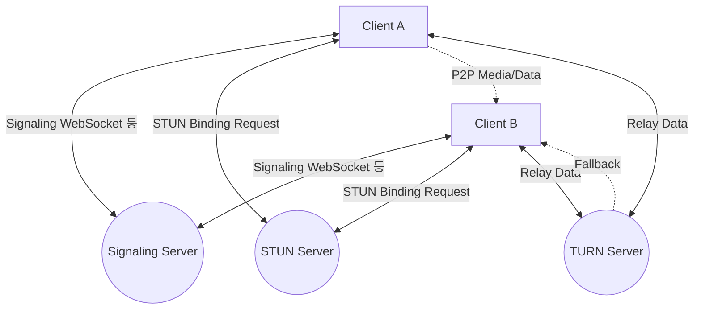
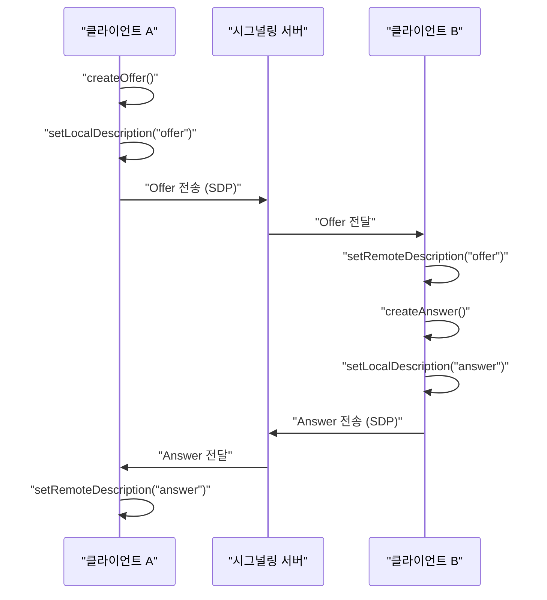
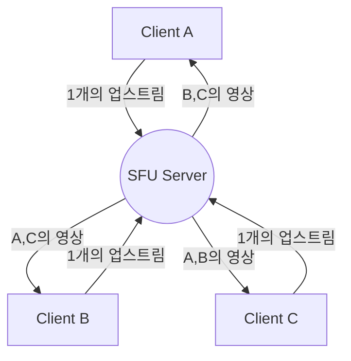

# WebRTC와 실시간 통신의 이면: P2P, STUN/TURN, 시그널링

현대 웹에 있어서, 실시간 음성·화상 통화나 저지연 데이터 전송은 빼놓을 수 없는 기능이 되었습니다. 이를 브라우저상에서 플러그인 없이 구현하는 기술이 **WebRTC** (Web Real-Time Communication)입니다.

본 기사에서는 WebRTC가 어떻게 브라우저 간의 P2P(Peer-to-Peer) 통신을 실현하고 있는지, 그 이면에 있는 복잡한 네트워크 기술(시그널링, NAT 통과, STUN/TURN, ICE 프로토콜 등)에 대해 도해와 코드를 섞어가며 아주 상세하게 해설합니다.

---

## 1. WebRTC의 기본 아키텍처

WebRTC는 단일 프로토콜이 아니라 여러 프로토콜과 API의 집합체입니다. 크게 나누어 다음 3가지 주요 API로 구성되어 있습니다.

1.  **MediaStream** (getUserMedia): 카메라나 마이크로부터 음성·영상 스트림을 취득합니다.
2.  **RTCPeerConnection**: 피어 간의 연결을 관리하고, 미디어 스트림을 전송합니다. 대역폭 제어나 암호화 등도 담당합니다.
3.  **RTCDataChannel**: 임의의 바이너리 데이터나 텍스트 데이터를 저지연으로 양방향 송수신합니다.

아래 그림은 WebRTC 통신을 확립할 때의 전체상을 보여줍니다.



### 1.1 클라이언트·서버형과 P2P형의 차이

기존의 웹 통신(HTTP/WebSocket 등)은 항상 서버를 거치는 **클라이언트·서버 모델** 이었습니다. 이 방식에서는 클라이언트 A에서 클라이언트 B로 메시지를 보낼 경우 반드시 서버를 중계하기 때문에 다음과 같은 과제가 있었습니다.

-  **레이턴시(지연) 증가** : 서버를 중계하므로 물리적인 거리에 따른 지연이 발생합니다.
-  **서버 부하** : 모든 트래픽이 서버에 집중됩니다.

반면, **P2P 모델** 에서는 클라이언트끼리 직접 통신을 수행합니다. 이를 통해 최단 경로로 통신이 가능해져 초저지연이 실현됩니다.

지연 시간 계산식은 다음과 같이 표현됩니다.

$ T_{total} = T_{prop} + T_{trans} + T_{queue} + T_{proc} $

여기서 $T_{prop}$ 은 전파 지연(거리에 의존), $T_{trans}$ 는 전송 지연, $T_{queue}$ 는 큐잉 지연, $T_{proc}$ 은 처리 지연입니다. P2P 통신에서는 중계 서버를 생략함으로써 $T_{prop}$ 과 $T_{proc}$ 을 대폭 줄일 수 있습니다.

---

## 2. 시그널링 (Signaling) 이란 무엇인가

P2P 통신을 확립하기 위해서는 서로가 '어디에 있는지(IP 주소와 포트 번호)'를 알아야 합니다. 하지만 브라우저는 처음에 상대방의 존재를 알지 못합니다.

여기서 등장하는 것이 **시그널링 서버** 입니다. 시그널링 서버는 미디어 데이터 자체를 중계하는 것이 아니라, 통신을 확립하기 위한 **메타데이터** (연락처 정보나 미디어의 사양)를 교환하기 위해서만 사용됩니다.

### 2.1 SDP (Session Description Protocol)

시그널링에서 교환되는 중요한 정보 중 하나가 **SDP** 입니다. SDP에는 다음과 같은 정보가 포함됩니다.

- 미디어 종류(음성, 비디오, 데이터)
- 지원하는 코덱(VP8, H.264, Opus 등)
- 통신에 사용할 포트 번호 및 IP 주소 정보

### 2.2 시그널링 흐름 (Offer와 Answer)

WebRTC의 연결 확립은 한쪽이 **Offer** (제안)를 보내고, 다른 한쪽이 **Answer** (응답)를 반환함으로써 이루어집니다.



### 2.3 시그널링 서버 구현 예 (Node.js + WebSocket)

시그널링 서버의 구현은 WebRTC 사양으로 규정되어 있지 않기 때문에 WebSocket이나 Socket.io, Firebase 등 원하는 기술을 사용할 수 있습니다. 다음은 `ws` 라이브러리를 사용한 간단한 시그널링 서버의 예입니다.

```javascript
// server.js
const WebSocket = require('ws');
const wss = new WebSocket.Server({ port: 8080 });

wss.on('connection', (ws) => {
    console.log('새로운 클라이언트가 연결되었습니다.');

    ws.on('message', (message) => {
        // 수신한 메시지(Offer/Answer/ICE Candidate)를 브로드캐스트한다
        // 실제 운용에서는 특정 상대(방이나 ID)에게만 전송하는 제어가 필요합니다
        wss.clients.forEach((client) => {
            if (client !== ws && client.readyState === WebSocket.OPEN) {
                client.send(message);
            }
        });
    });
});
```

---

## 3. NAT 통과의 장벽: STUN과 TURN

시그널링을 통해 서로의 SDP를 교환했지만, 이것만으로는 통신할 수 없습니다. 왜냐하면 많은 디바이스는 **NAT** (Network Address Translation)의 이면에 있어 사설 IP 주소밖에 가지고 있지 않기 때문입니다. 인터넷상에서 사설 IP 주소로 직접 접근하는 것은 불가능합니다.

### 3.1 STUN (Session Traversal Utilities for NAT)

**STUN 서버** 는 클라이언트에게 자신의 '공인 IP 주소와 포트 번호'를 알려주는 거울과 같은 존재입니다.

1. 클라이언트는 STUN 서버에 요청을 보냅니다.
2. STUN 서버는 "나에게 보이는 당신의 공인 IP 주소는 X.X.X.X 이고, 포트는 YYYY 입니다"라고 응답합니다.
3. 클라이언트는 취득한 이 공개 정보를 SDP나 ICE Candidate에 포함시켜 상대방에게 전달합니다.

### 3.2 TURN (Traversal Using Relays around NAT)

STUN을 사용해도 통신이 확립되지 않는 경우가 있습니다. 대표적인 것이 **Symmetric NAT** 이라고 불리는 엄격한 NAT 환경하에 있거나 기업 내 방화벽이 있는 경우입니다.

이러한 경우에는 **TURN 서버** 를 사용합니다. TURN 서버는 P2P 통신을 포기하고, 서버를 거쳐 미디어 데이터를 **릴레이(중계)** 하기 위한 서버입니다. 통신은 확실하게 이루어지지만, 서버에 대한 부하나 레이턴시 증가, 비용 발생 등의 단점이 있습니다.

### 3.3 ICE (Interactive Connectivity Establishment)

WebRTC는 STUN과 TURN을 어떻게 구분해서 사용할까요. 그것을 해결하는 프레임워크가 **ICE** 입니다.

ICE는 가능한 모든 통신 경로(로컬 IP, STUN에서 얻은 공인 IP, TURN을 통한 릴레이)의 후보( **ICE Candidate** )를 수집하고 서로 교환합니다. 그리고 가장 효율적인 경로(보통 로컬 IP > STUN > TURN 순서)를 자동으로 선택하여 연결을 확립합니다.

```mermaid
sequenceDiagram
    participant PeerA
    participant STUN
    participant PeerB

    PeerA->>STUN: "Binding Request"
    STUN-->>PeerA: "Public IP & Port"
    PeerA->>PeerA: "ICE Candidate 생성"
    PeerA->>PeerB: "시그널링을 통한 Candidate 전송"
    PeerB->>STUN: "Binding Request"
    STUN-->>PeerB: "Public IP & Port"
    PeerB->>PeerA: "시그널링을 통한 Candidate 전송"
    PeerA<-->>PeerB: "연결성 확인 (STUN Ping)"
    PeerA->>PeerB: "최적 경로로 P2P 연결 완료"
```

---

## 4. 보안과 암호화 (DTLS/SRTP)

WebRTC의 미디어 스트림과 데이터 채널은 반드시 암호화되어야 합니다.

-  **DTLS (Datagram Transport Layer Security)** : [UDP](https://kenji.blog/ko/p/http3-quic-protocol-tcp-udp/) 상에서 TLS와 동등한 보안을 제공하는 프로토콜입니다. 데이터 채널의 암호화나 키 교환에 사용됩니다.
-  **SRTP (Secure Real-time Transport Protocol)** : 음성이나 영상 같은 미디어 데이터를 암호화하여 전송하기 위한 프로토콜입니다. DTLS로 교환된 키를 사용하여 암호화됩니다.

이를 통해 경로상의 도청이나 위변조를 방지하고 안전한 **종단 간 암호화** (E2EE)가 표준으로 실현되어 있습니다.

---

## 5. WebRTC 구현 예: 프런트엔드

그러면 실제로 브라우저상에서 WebRTC를 초기화하고 시그널링 서버와 주고받는 간단한 프런트엔드의 코드를 살펴보겠습니다.

```javascript
// app.js
const signalingUrl = 'ws://localhost:8080';
const ws = new WebSocket(signalingUrl);
let peerConnection;

const configuration = {
    iceServers: [
        { urls: 'stun:stun.l.google.com:19302' } // Google의 공개 STUN 서버를 이용
    ]
};

// 1. RTCPeerConnection 초기화
function initPeerConnection() {
    peerConnection = new RTCPeerConnection(configuration);

    // ICE Candidate가 생성되면 상대방에게 전송
    peerConnection.onicecandidate = (event) => {
        if (event.candidate) {
            sendMessage({ type: 'candidate', candidate: event.candidate });
        }
    };

    // 상대방으로부터 스트림을 수신했을 때의 처리
    peerConnection.ontrack = (event) => {
        const remoteVideo = document.getElementById('remoteVideo');
        if (remoteVideo.srcObject !== event.streams[0]) {
            remoteVideo.srcObject = event.streams[0];
        }
    };
}

// 시그널링 메시지 송수신
ws.onmessage = async (message) => {
    const data = JSON.parse(message.data);

    if (data.type === 'offer') {
        initPeerConnection();
        await peerConnection.setRemoteDescription(new RTCSessionDescription(data.offer));
        const answer = await peerConnection.createAnswer();
        await peerConnection.setLocalDescription(answer);
        sendMessage({ type: 'answer', answer: answer });
    } else if (data.type === 'answer') {
        await peerConnection.setRemoteDescription(new RTCSessionDescription(data.answer));
    } else if (data.type === 'candidate') {
        await peerConnection.addIceCandidate(new RTCIceCandidate(data.candidate));
    }
};

function sendMessage(msg) {
    ws.send(JSON.stringify(msg));
}

// 연결 시작 트리거 (Offer 생성)
async function startCall() {
    initPeerConnection();

    // 로컬 미디어 취득
    const stream = await navigator.mediaDevices.getUserMedia({ video: true, audio: true });
    document.getElementById('localVideo').srcObject = stream;
    stream.getTracks().forEach(track => peerConnection.addTrack(track, stream));

    // Offer 생성 및 전송
    const offer = await peerConnection.createOffer();
    await peerConnection.setLocalDescription(offer);
    sendMessage({ type: 'offer', offer: offer });
}
```

---

## 6. 성능과 확장성: SFU와 MCU

P2P 통신은 1대1 통화에는 최적이지만, 다수인원(예: Zoom이나 Google Meet 같은 다인원 회의)이 되면 문제가 발생합니다. 참가자가 $N$ 명인 경우, 각 클라이언트는 $(N-1)$ 개의 업스트림을 전송해야 하므로 대역폭과 CPU가 금방 고갈됩니다.

이러한 다중 접속 과제를 해결하기 위한 아키텍처가 **SFU** 와 **MCU** 입니다.

### 6.1 MCU (Multipoint Control Unit)

MCU는 모든 클라이언트로부터 영상을 받아 서버에서 하나의 영상으로 합성(믹싱)하여 각 클라이언트에 전송(배포)합니다.

-  **장점** : 클라이언트의 부하와 대역폭 소비가 최소화됩니다.
-  **단점** : 서버 측에서 영상의 디코딩·인코딩·합성 처리가 필요하므로 서버 비용이 매우 높습니다.

### 6.2 SFU (Selective Forwarding Unit)

SFU는 영상을 합성하지 않고, 받은 미디어 스트림을 그대로 필요한 클라이언트에 분배(라우팅)하는 서버입니다.



-  **장점** : 클라이언트는 1개의 업스트림만 보내면 됩니다. 서버는 합성 처리를 하지 않기 때문에 MCU에 비해 부하가 낮고 스케일하기 쉽습니다.
-  **단점** : 클라이언트는 여러 개의 다운스트림을 수신·디코드하므로 MCU보다는 클라이언트 측의 부하가 높습니다.

현재의 모던 웹 회의 시스템의 대부분(Discord, Google Meet 등)은 이 SFU 아키텍처를 채택하고 있습니다.

---

## 7. 데이터 채널 (RTCDataChannel) 의 활용

WebRTC는 영상이나 음성뿐만 아니라 임의의 데이터를 보내기 위한 `RTCDataChannel` API를 제공하고 있습니다. 이것은 이면에서 **SCTP (Stream Control Transmission Protocol)** 라는 프로토콜을 사용하고 있습니다.

SCTP는 [TCP](https://kenji.blog/ko/p/http3-quic-protocol-tcp-udp/)의 신뢰성과 [UDP](https://kenji.blog/ko/p/http3-quic-protocol-tcp-udp/)의 저지연이라는 두 가지 특성을 모두 겸비하고 있습니다.

-  **신뢰성 제어** : 데이터의 도달을 보장할 것인지(TCP 방식), 하지 않을 것인지(UDP 방식)를 선택할 수 있습니다.
-  **순서 제어** : 도착 순서를 보장할 것인지, 순서를 무시하고 도착한 순서대로 처리할 것인지를 선택할 수 있습니다.

게임의 좌표 데이터처럼 일부가 손실되더라도 최신 데이터가 빨리 도착하는 것이 중요할 때는 '신뢰성 없음·순서 보장 없음'으로 고속 전송하고, 파일 전송처럼 손실이 허용되지 않는 경우는 '신뢰성 있음'으로 전송하는 등 유연한 설계가 가능합니다.

---

## 8. 정리

WebRTC는 브라우저만으로 고도의 실시간 통신을 실현하는 강력한 기술입니다. P2P 통신의 기본부터 시그널링, STUN/TURN에 의한 NAT 통과, ICE에 의한 경로 탐색, 그리고 보안까지 많은 기술 요소가 결합되어 동작하고 있습니다.

이러한 이면의 구조를 올바르게 이해함으로써 네트워크 환경에 강한 애플리케이션 구축이나 SFU/MCU를 활용한 확장성 있는 시스템의 설계가 가능해집니다.

WebRTC 기술은 날마다 진화하고 있으며, 앞으로도 메타버스, IoT, 클라우드 게임 등 다양한 분야에서의 활약이 기대되고 있습니다.
