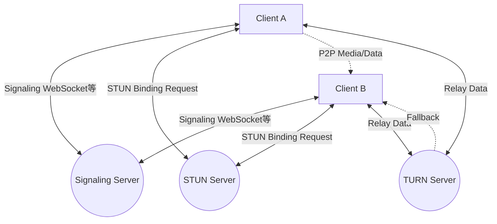
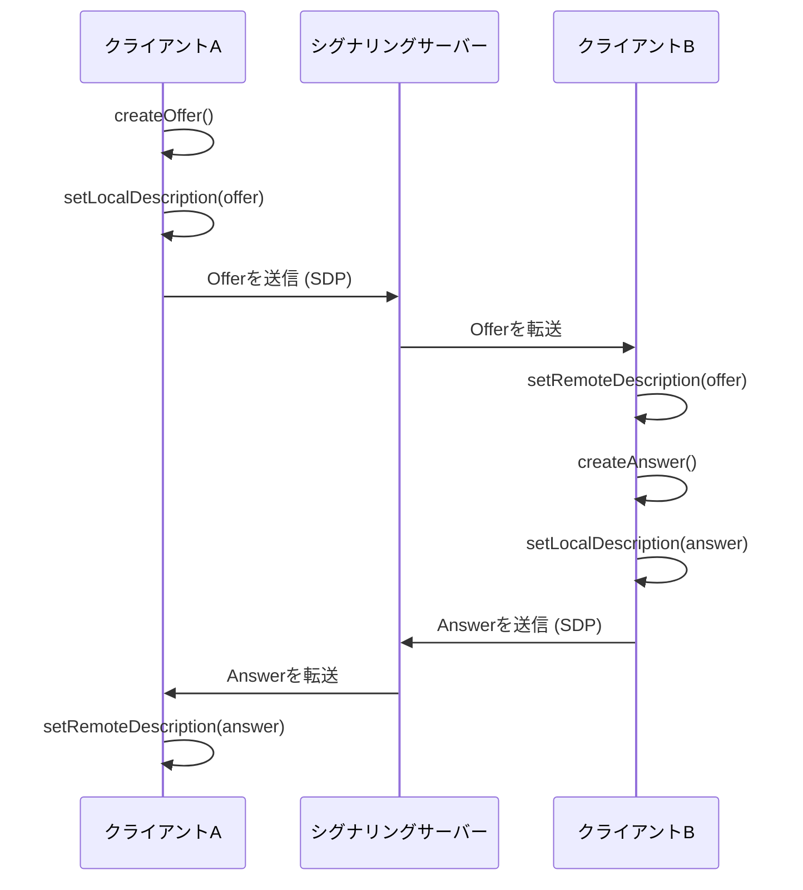
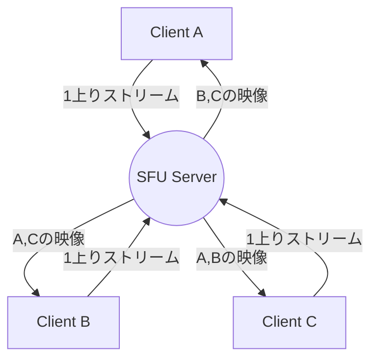

# WebRTCとリアルタイム通信の裏側：P2P, STUN/TURN, シグナリング

現代のウェブにおいて、リアルタイムの音声・ビデオ通話や低遅延のデータ転送は欠かせない機能となりました。それをブラウザ上でプラグインなしに実現する技術が **WebRTC** （Web Real-Time Communication）です。

本記事では、WebRTCがいかにしてブラウザ間のP2P（Peer-to-Peer）通信を実現しているのか、その背後にある複雑なネットワーク技術（シグナリング、NAT越え、STUN/TURN、ICEプロトコルなど）について、図解とコードを交えながら非常に詳細に解説します。

---

## 1. WebRTCの基本アーキテクチャ

WebRTCは単一のプロトコルではなく、複数のプロトコルとAPIの集合体です。大きく分けて以下の3つの主要なAPIで構成されています。

1.  **MediaStream** (getUserMedia): カメラやマイクから音声・映像ストリームを取得します。
2.  **RTCPeerConnection**: ピア同士の接続を管理し、メディアストリームを送信します。帯域制御や[暗号化](https://kenji.blog/p/modern-cryptography-public-key-hash-signature/)なども担います。
3.  **RTCDataChannel**: 任意のバイナリデータやテキストデータを低遅延で双方向に送受信します。

以下の図は、WebRTC通信を確立する際の全体像を示しています。



### 1.1 クライアント・サーバー型とP2P型の違い

従来のウェブ通信（HTTP/WebSocketなど）は、常にサーバーを経由する **クライアント・サーバーモデル** でした。この方式では、クライアントAからクライアントBにメッセージを送る場合、必ずサーバーを中継するため、以下の課題がありました。

-  **レイテンシ（遅延）の増加** : サーバーを中継するため、物理的な距離による遅延が発生します。
-  **サーバーの負荷** : 全トラフィックがサーバーに集中します。

一方、 **P2Pモデル** では、クライアント同士が直接通信を行います。これにより、最短経路での通信が可能となり、超低遅延が実現します。

遅延時間の計算式は以下のように表されます。

$$ T_{total} = T_{prop} + T_{trans} + T_{queue} + T_{proc} $$

ここで、 $T_{prop}$ は伝播遅延（距離に依存）、 $T_{trans}$ は転送遅延、 $T_{queue}$ はキューイング遅延、 $T_{proc}$ は処理遅延です。P2P通信では中継サーバーを省くことで $T_{prop}$ と $T_{proc}$ を大幅に削減できます。

---

## 2. シグナリング (Signaling) とは何か

P2P通信を確立するためには、お互いが「どこにいるのか（IPアドレスとポート番号）」を知る必要があります。しかし、ブラウザは最初、相手の存在を知りません。

そこで登場するのが **シグナリングサーバー** です。シグナリングサーバーは、メディアデータ自体を中継するのではなく、通信を確立するための **メタデータ** （連絡先情報やメディアの仕様）を交換するためだけに使われます。

### 2.1 SDP (Session Description Protocol)

シグナリングで交換される重要な情報の一つが **SDP** です。SDPには以下のような情報が含まれます。

- メディアの種類（音声、ビデオ、データ）
- サポートしているコーデック（VP8, H.264, Opusなど）
- 通信に使用するポート番号やIPアドレス情報

### 2.2 シグナリングのフロー（OfferとAnswer）

WebRTCの接続確立は、一方が **Offer** （提案）を出し、もう一方が **Answer** （応答）を返すことで行われます。



### 2.3 シグナリングサーバーの実装例 (Node.js + WebSocket)

シグナリングサーバーの実装はWebRTCの仕様で規定されていないため、WebSocketやSocket.io、Firebaseなど好きな技術を使えます。以下は、 `ws` ライブラリを用いたシンプルなシグナリングサーバーの例です。

```javascript
// server.js
const WebSocket = require('ws');
const wss = new WebSocket.Server({ port: 8080 });

wss.on('connection', (ws) => {
    console.log('新しいクライアントが接続しました。');

    ws.on('message', (message) => {
        // 受信したメッセージ（Offer/Answer/ICE Candidate）をブロードキャストする
        // 実際の運用では、特定の相手（部屋やID）にのみ送信する制御が必要です
        wss.clients.forEach((client) => {
            if (client !== ws && client.readyState === WebSocket.OPEN) {
                client.send(message);
            }
        });
    });
});
```

---

## 3. NAT越えの壁：STUNとTURN

シグナリングによってお互いのSDPを交換しましたが、これだけでは通信できません。なぜなら、多くのデバイスは **NAT** （Network Address Translation）の背後にあり、プライベートIPアドレスしか持っていないからです。インターネット上からプライベートIPアドレスに直接アクセスすることは不可能です。

### 3.1 STUN (Session Traversal Utilities for NAT)

**STUNサーバー** は、クライアントに自身の「パブリックIPアドレスとポート番号」を教えてくれる鏡のような存在です。

1. クライアントはSTUNサーバーにリクエストを送ります。
2. STUNサーバーは、「私から見ると、あなたのパブリックIPアドレスは X.X.X.X で、ポートは YYYY ですよ」と返答します。
3. クライアントは、取得したこのパブリックな情報をSDPやICE Candidateに含めて相手に伝えます。

### 3.2 TURN (Traversal Using Relays around NAT)

STUNを使っても通信が確立できない場合があります。代表的なのは **Symmetric NAT** と呼ばれる厳しいNAT環境下や、企業内ファイアウォールがある場合です。

このような場合は、 **TURNサーバー** を使います。TURNサーバーは、P2P通信を諦めて、サーバー経由でメディアデータを **リレー（中継）** するためのサーバーです。通信は確実に行えますが、サーバーへの負荷やレイテンシの増加、コストの発生といったデメリットがあります。

### 3.3 ICE (Interactive Connectivity Establishment)

WebRTCは、STUNやTURNをどのように使い分けるのでしょうか。それを解決するフレームワークが **ICE** です。

ICEは、可能なすべての通信経路（ローカルIP、STUNで得たパブリックIP、TURNによるリレー）の候補（ **ICE Candidate** ）を収集し、お互いに交換します。そして、最も効率の良い経路（通常はローカルIP > STUN > TURNの順）を自動的に選択し、接続を確立します。

```mermaid
sequenceDiagram
    participant PeerA
    participant STUN
    participant PeerB

    PeerA->>STUN: Binding Request
    STUN-->>PeerA: Public IP & Port
    PeerA->>PeerA: ICE Candidate生成
    PeerA->>PeerB: シグナリング経由でCandidate送信
    PeerB->>STUN: Binding Request
    STUN-->>PeerB: Public IP & Port
    PeerB->>PeerA: シグナリング経由でCandidate送信
    PeerA<-->>PeerB: 接続性チェック (STUN Ping)
    PeerA->>PeerB: 最適経路でP2P接続完了
```

---

## 4. セキュリティと[暗号化](https://kenji.blog/p/modern-cryptography-public-key-hash-signature/) (DTLS/SRTP)

WebRTCのメディアストリームとデータチャネルは、必ず暗号化されなければなりません。

-  **DTLS (Datagram Transport Layer Security)** : [UDP](https://kenji.blog/p/http3-quic-protocol-tcp-udp/)上でTLSと同等のセキュリティを提供するプロトコルです。データチャネルの[暗号化](https://kenji.blog/p/modern-cryptography-public-key-hash-signature/)や、キー交換に使用されます。
-  **SRTP (Secure Real-time Transport Protocol)** : 音声や映像といったメディアデータを暗号化して転送するためのプロトコルです。DTLSで交換された鍵を用いて暗号化されます。

これにより、経路上の盗聴や改ざんを防止し、安全な **エンドツーエンド暗号化** (E2EE) が標準で実現されています。

---

## 5. WebRTCの実装例：フロントエンド

それでは、実際にブラウザ上でWebRTCを初期化し、シグナリングサーバーとやり取りを行う簡単なフロントエンドのコードを見てみましょう。

```javascript
// app.js
const signalingUrl = 'ws://localhost:8080';
const ws = new WebSocket(signalingUrl);
let peerConnection;

const configuration = {
    iceServers: [
        { urls: 'stun:stun.l.google.com:19302' } // Googleの公開STUNサーバーを利用
    ]
};

// 1. RTCPeerConnectionの初期化
function initPeerConnection() {
    peerConnection = new RTCPeerConnection(configuration);

    // ICE Candidateが生成されたら相手に送信
    peerConnection.onicecandidate = (event) => {
        if (event.candidate) {
            sendMessage({ type: 'candidate', candidate: event.candidate });
        }
    };

    // 相手からのストリームを受信したときの処理
    peerConnection.ontrack = (event) => {
        const remoteVideo = document.getElementById('remoteVideo');
        if (remoteVideo.srcObject !== event.streams[0]) {
            remoteVideo.srcObject = event.streams[0];
        }
    };
}

// シグナリングメッセージの送受信
ws.onmessage = async (message) => {
    const data = JSON.parse(message.data);

    if (data.type === 'offer') {
        initPeerConnection();
        await peerConnection.setRemoteDescription(new RTCSessionDescription(data.offer));
        const answer = await peerConnection.createAnswer();
        await peerConnection.setLocalDescription(answer);
        sendMessage({ type: 'answer', answer: answer });
    } else if (data.type === 'answer') {
        await peerConnection.setRemoteDescription(new RTCSessionDescription(data.answer));
    } else if (data.type === 'candidate') {
        await peerConnection.addIceCandidate(new RTCIceCandidate(data.candidate));
    }
};

function sendMessage(msg) {
    ws.send(JSON.stringify(msg));
}

// 接続開始のトリガー（Offer作成）
async function startCall() {
    initPeerConnection();

    // ローカルメディアの取得
    const stream = await navigator.mediaDevices.getUserMedia({ video: true, audio: true });
    document.getElementById('localVideo').srcObject = stream;
    stream.getTracks().forEach(track => peerConnection.addTrack(track, stream));

    // Offerの作成と送信
    const offer = await peerConnection.createOffer();
    await peerConnection.setLocalDescription(offer);
    sendMessage({ type: 'offer', offer: offer });
}
```

---

## 6. パフォーマンスとスケーラビリティ：SFUとMCU

P2P通信は1対1の通話には最適ですが、多人数（例：ZoomやGoogle Meetのような多人数会議）になると問題が発生します。参加者が $N$ 人いる場合、各クライアントは $(N-1)$ 個の上りストリームを送信しなければならず、帯域幅とCPUがすぐに枯渇します。

この多人数接続の課題を解決するためのアーキテクチャが **SFU** と **MCU** です。

### 6.1 MCU (Multipoint Control Unit)

MCUは、すべてのクライアントから映像を受け取り、サーバー上で1つの映像に合成（ミックス）して各クライアントに配信します。

-  **メリット** : クライアントの負荷と帯域消費が最小限。
-  **デメリット** : サーバー側で映像のデコード・エンコード・合成処理が必要なため、サーバーコストが非常に高い。

### 6.2 SFU (Selective Forwarding Unit)

SFUは、映像を合成せず、受け取ったメディアストリームをそのまま必要なクライアントに分配（ルーティング）するサーバーです。



-  **メリット** : クライアントは1本上りストリームを送るだけで済む。サーバーは合成処理を行わないため、MCUに比べて負荷が低くスケールしやすい。
-  **デメリット** : クライアントは複数本の下りストリームを受信・デコードするため、MCUよりはクライアント側の負荷が高い。

現在のモダンなWeb会議システムの多く（Discord, Google Meetなど）は、このSFUアーキテクチャを採用しています。

---

## 7. データチャネル (RTCDataChannel) の活用

WebRTCは映像や音声だけでなく、任意のデータを送るための `RTCDataChannel` APIを提供しています。これは裏側で **SCTP (Stream Control Transmission Protocol)** というプロトコルを使用しています。

SCTPは、[TCP](https://kenji.blog/p/http3-quic-protocol-tcp-udp/)の信頼性と[UDP](https://kenji.blog/p/http3-quic-protocol-tcp-udp/)の低遅延という両方の特性を兼ね備えています。

-  **信頼性の制御** : データの到達保証をするか（TCPライク）、しないか（UDPライク）を選択できます。
-  **順序の制御** : 到着順序を保証するか、順序を無視して届いた順に処理するかを選択できます。

ゲームの座標データのように、一部欠損しても最新データが早く届くことが重要な場合は「信頼性なし・順序保証なし」で高速に転送し、ファイル転送のように欠損が許されない場合は「信頼性あり」で転送するといった柔軟な設計が可能です。

---

## 8. まとめ

WebRTCは、ブラウザだけで高度なリアルタイム通信を実現する強力な技術です。P2P通信の基本から、シグナリング、STUN/TURNによるNAT越え、ICEによる経路探索、そしてセキュリティまで、多くの技術要素が組み合わさって動いています。

これらの裏側の仕組みを正しく理解することで、ネットワーク環境に強いアプリケーションの構築や、SFU/MCUを活用したスケーラブルなシステムの設計が可能になります。

WebRTCの技術は日々進化しており、今後もメタバース、IoT、クラウドゲームなど、様々な分野での活躍が期待されています。
