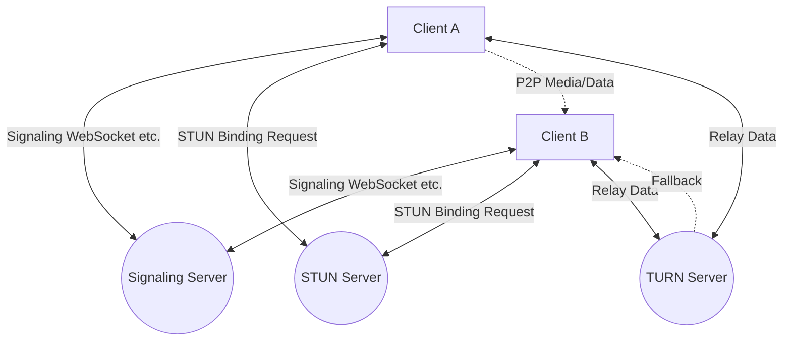
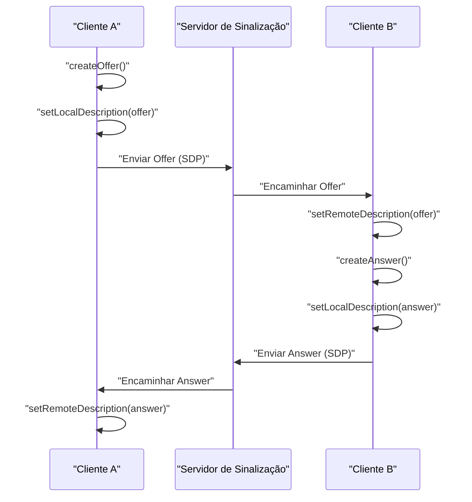
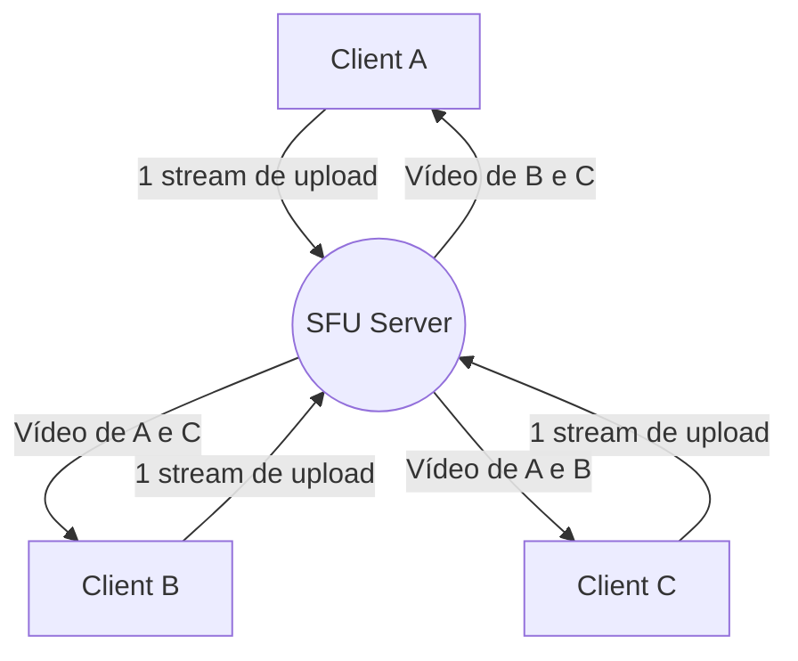

# Os Bastidores do WebRTC e Comunicação em Tempo Real: P2P, STUN/TURN, Sinalização

Na web moderna, chamadas de áudio e vídeo em tempo real e transferência de dados de baixa latência tornaram-se recursos essenciais. A tecnologia que possibilita isso nos navegadores sem o uso de plugins é o **WebRTC** (Web Real-Time Communication).

Neste artigo, explicaremos de forma muito detalhada, com diagramas e código, como o WebRTC possibilita a comunicação P2P (Peer-to-Peer) entre navegadores e as tecnologias de rede complexas por trás disso (sinalização, travessia de NAT, STUN/TURN, protocolo ICE, etc.).

---

## 1. Arquitetura Básica do WebRTC

O WebRTC não é um protocolo único, mas sim um conjunto de vários protocolos e APIs. Ele é composto principalmente por três APIs principais:

1.  **MediaStream** (getUserMedia): Obtém streams de áudio e vídeo da câmera e do microfone.
2.  **RTCPeerConnection**: Gerencia a conexão entre pares e transmite os streams de mídia. Também lida com controle de largura de banda e criptografia.
3.  **RTCDataChannel**: Envia e recebe dados binários ou de texto arbitrários de forma bidirecional e com baixa latência.

O diagrama a seguir mostra a visão geral ao estabelecer uma comunicação WebRTC.



### 1.1 Diferença entre o Modelo Cliente-Servidor e o Modelo P2P

As comunicações tradicionais da web (HTTP/WebSocket, etc.) sempre utilizaram o **modelo cliente-servidor**, passando por um servidor. Neste modelo, ao enviar uma mensagem do Cliente A para o Cliente B, ela deve sempre passar pelo servidor, resultando nos seguintes desafios:

-   **Aumento da latência (atraso)**: Devido ao roteamento pelo servidor, ocorre um atraso dependendo da distância física.
-   **Carga no servidor**: Todo o tráfego é concentrado no servidor.

Por outro lado, no **modelo P2P**, os clientes se comunicam diretamente entre si. Isso permite a comunicação pelo caminho mais curto, alcançando latência ultrabaixa.

A fórmula para calcular o tempo de atraso é expressa da seguinte forma:

$ T_{total} = T_{prop} + T_{trans} + T_{queue} + T_{proc} $

Onde $T_{prop}$ é o atraso de propagação (dependente da distância), $T_{trans}$ é o atraso de transmissão, $T_{queue}$ é o atraso de enfileiramento e $T_{proc}$ é o atraso de processamento. Ao omitir o servidor intermediário na comunicação P2P, podemos reduzir drasticamente o $T_{prop}$ e o $T_{proc}$.

---

## 2. O que é a Sinalização (Signaling)?

Para estabelecer a comunicação P2P, ambas as partes precisam saber "onde a outra está" (endereço IP e número da porta). No entanto, inicialmente, os navegadores não sabem da existência um do outro.

É aqui que entra o **servidor de sinalização**. O servidor de sinalização não retransmite os dados de mídia em si, mas é usado exclusivamente para trocar **metadados** (informações de contato e especificações de mídia) para estabelecer a comunicação.

### 2.1 SDP (Session Description Protocol)

Uma das informações importantes trocadas durante a sinalização é o **SDP**. O SDP inclui as seguintes informações:

-   Tipo de mídia (áudio, vídeo, dados)
-   Codecs suportados (VP8, H.264, Opus, etc.)
-   Números de porta e informações de endereço IP a serem usados para a comunicação

### 2.2 Fluxo de Sinalização (Offer e Answer)

O estabelecimento da conexão no WebRTC é feito com uma das partes enviando uma **Offer** (proposta) e a outra retornando uma **Answer** (resposta).



### 2.3 Exemplo de Implementação do Servidor de Sinalização (Node.js + WebSocket)

Como a implementação do servidor de sinalização não é especificada pelas especificações do WebRTC, você pode usar a tecnologia de sua escolha, como WebSocket, Socket.io ou Firebase. Abaixo está um exemplo de um servidor de sinalização simples usando a biblioteca `ws`.

```javascript
// server.js
const WebSocket = require('ws');
const wss = new WebSocket.Server({ port: 8080 });

wss.on('connection', (ws) => {
    console.log('Um novo cliente se conectou.');

    ws.on('message', (message) => {
        // Transmite a mensagem recebida (Offer/Answer/ICE Candidate)
        // Na operação real, é necessário controle para enviar apenas para um destino específico (sala ou ID)
        wss.clients.forEach((client) => {
            if (client !== ws && client.readyState === WebSocket.OPEN) {
                client.send(message);
            }
        });
    });
});
```

---

## 3. A Barreira da Travessia de NAT: STUN e TURN

Trocamos os SDPs um do outro por meio da sinalização, mas isso por si só não permite a comunicação. Isso ocorre porque muitos dispositivos estão atrás de um **NAT** (Network Address Translation) e possuem apenas endereços IP privados. É impossível acessar um endereço IP privado diretamente da Internet.

### 3.1 STUN (Session Traversal Utilities for NAT)

O **servidor STUN** atua como um espelho que diz ao cliente o seu próprio "endereço IP público e número da porta".

1.  O cliente envia uma solicitação ao servidor STUN.
2.  O servidor STUN responde: "Do meu ponto de vista, o seu endereço IP público é X.X.X.X e a porta é YYYY."
3.  O cliente inclui essa informação pública obtida no SDP ou ICE Candidate e a transmite para a outra parte.

### 3.2 TURN (Traversal Using Relays around NAT)

Existem casos em que a comunicação não pode ser estabelecida mesmo usando o STUN. Um exemplo típico é sob ambientes NAT rigorosos chamados **Symmetric NAT** ou quando há um firewall corporativo.

Nesses casos, usamos um **servidor TURN**. Um servidor TURN é um servidor que desiste da comunicação P2P e atua como um **retransmissor (relay)** para os dados de mídia por meio de um servidor. Embora a comunicação possa ser feita de forma confiável, isso tem desvantagens como o aumento da carga no servidor, maior latência e custos adicionais.

### 3.3 ICE (Interactive Connectivity Establishment)

Como o WebRTC escolhe entre usar STUN ou TURN? A estrutura que resolve isso é o **ICE**.

O ICE coleta candidatos ( **ICE Candidates** ) para todas as rotas de comunicação possíveis (IP local, IP público obtido via STUN e relay via TURN) e os troca mutuamente. Em seguida, ele seleciona automaticamente a rota mais eficiente (geralmente na ordem de IP local > STUN > TURN) e estabelece a conexão.

```mermaid
sequenceDiagram
    participant PeerA as "Peer A"
    participant STUN as "STUN"
    participant PeerB as "Peer B"

    PeerA->>STUN: "Binding Request"
    STUN-->>PeerA: "Public IP & Port"
    PeerA->>PeerA: "Gerar ICE Candidate"
    PeerA->>PeerB: "Enviar Candidate via Sinalização"
    PeerB->>STUN: "Binding Request"
    STUN-->>PeerB: "Public IP & Port"
    PeerB->>PeerA: "Enviar Candidate via Sinalização"
    PeerA<-->>PeerB: "Verificação de conectividade (STUN Ping)"
    PeerA->>PeerB: "Conexão P2P concluída na rota ideal"
```

---

## 4. Segurança e Criptografia (DTLS/SRTP)

Os fluxos de mídia e os canais de dados do WebRTC devem sempre ser criptografados.

-   **DTLS (Datagram Transport Layer Security)**: Um protocolo que fornece segurança equivalente ao TLS sobre [UDP](https://kenji.blog/pt/p/http3-quic-protocol-tcp-udp/). Ele é usado para criptografar canais de dados e para a troca de chaves.
-   **SRTP (Secure Real-time Transport Protocol)**: Um protocolo para criptografar e transferir dados de mídia, como áudio e vídeo. Ele é criptografado usando as chaves trocadas via DTLS.

Isso evita escutas não autorizadas e adulterações ao longo da rota, e a **criptografia de ponta a ponta** (E2EE) segura é implementada como padrão.

---

## 5. Exemplo de Implementação do WebRTC: Frontend

Agora, vamos ver um código frontend simples que inicializa o WebRTC no navegador e interage com o servidor de sinalização.

```javascript
// app.js
const signalingUrl = 'ws://localhost:8080';
const ws = new WebSocket(signalingUrl);
let peerConnection;

const configuration = {
    iceServers: [
        { urls: 'stun:stun.l.google.com:19302' } // Usa o servidor STUN público do Google
    ]
};

// 1. Inicialização da RTCPeerConnection
function initPeerConnection() {
    peerConnection = new RTCPeerConnection(configuration);

    // Quando um ICE Candidate é gerado, envie para a outra parte
    peerConnection.onicecandidate = (event) => {
        if (event.candidate) {
            sendMessage({ type: 'candidate', candidate: event.candidate });
        }
    };

    // Processamento ao receber o stream da outra parte
    peerConnection.ontrack = (event) => {
        const remoteVideo = document.getElementById('remoteVideo');
        if (remoteVideo.srcObject !== event.streams[0]) {
            remoteVideo.srcObject = event.streams[0];
        }
    };
}

// Enviar/Receber mensagens de sinalização
ws.onmessage = async (message) => {
    const data = JSON.parse(message.data);

    if (data.type === 'offer') {
        initPeerConnection();
        await peerConnection.setRemoteDescription(new RTCSessionDescription(data.offer));
        const answer = await peerConnection.createAnswer();
        await peerConnection.setLocalDescription(answer);
        sendMessage({ type: 'answer', answer: answer });
    } else if (data.type === 'answer') {
        await peerConnection.setRemoteDescription(new RTCSessionDescription(data.answer));
    } else if (data.type === 'candidate') {
        await peerConnection.addIceCandidate(new RTCIceCandidate(data.candidate));
    }
};

function sendMessage(msg) {
    ws.send(JSON.stringify(msg));
}

// Gatilho para iniciar a chamada (Criar Offer)
async function startCall() {
    initPeerConnection();

    // Obter mídia local
    const stream = await navigator.mediaDevices.getUserMedia({ video: true, audio: true });
    document.getElementById('localVideo').srcObject = stream;
    stream.getTracks().forEach(track => peerConnection.addTrack(track, stream));

    // Criar e enviar Offer
    const offer = await peerConnection.createOffer();
    await peerConnection.setLocalDescription(offer);
    sendMessage({ type: 'offer', offer: offer });
}
```

---

## 6. Desempenho e Escalabilidade: SFU e MCU

A comunicação P2P é ideal para chamadas 1-para-1, mas quando se trata de várias pessoas (por exemplo, conferências com várias pessoas como Zoom e Google Meet), surgem problemas. Se houver $N$ participantes, cada cliente deverá enviar $(N-1)$ fluxos de upload, o que esgotará rapidamente a largura de banda e a CPU.

As arquiteturas para resolver esse desafio de conexões com várias pessoas são o **SFU** e o **MCU**.

### 6.1 MCU (Multipoint Control Unit)

O MCU recebe vídeo de todos os clientes, os compõe (mistura) em um único vídeo no servidor e os distribui para cada cliente.

-   **Vantagens**: Carga e consumo de largura de banda do cliente são minimizados.
-   **Desvantagens**: Os custos do servidor são extremamente altos devido à necessidade de processamento de decodificação, codificação e composição de vídeo no lado do servidor.

### 6.2 SFU (Selective Forwarding Unit)

O SFU é um servidor que não compõe vídeo, mas distribui (roteia) os streams de mídia recebidos como estão para os clientes que precisam deles.



-   **Vantagens**: Os clientes precisam enviar apenas um stream de upload. Como o servidor não executa processamento de composição, a carga é menor que a do MCU e ele escala mais facilmente.
-   **Desvantagens**: O cliente recebe e decodifica vários streams de download, de modo que a carga no lado do cliente é maior que a do MCU.

Muitos dos sistemas modernos de webconferência atuais (Discord, Google Meet, etc.) adotam essa arquitetura SFU.

---

## 7. Utilizando o Canal de Dados (RTCDataChannel)

O WebRTC não fornece apenas vídeo e áudio, mas também a API `RTCDataChannel` para enviar dados arbitrários. Por trás dos panos, isso usa um protocolo chamado **SCTP (Stream Control Transmission Protocol)**.

O SCTP combina as propriedades da confiabilidade do [TCP](https://kenji.blog/pt/p/http3-quic-protocol-tcp-udp/) e da baixa latência do [UDP](https://kenji.blog/pt/p/http3-quic-protocol-tcp-udp/).

-   **Controle de Confiabilidade**: Você pode escolher garantir a entrega dos dados (semelhante ao TCP) ou não (semelhante ao UDP).
-   **Controle de Ordem**: Você pode escolher garantir a ordem de chegada ou ignorar a ordem e processar à medida que chegam.

Isso permite projetos flexíveis, onde casos em que é importante que os dados mais recentes cheguem rapidamente, mesmo que parte deles seja perdida, como dados de coordenadas em um jogo, podem ser transferidos em alta velocidade com "sem confiabilidade, sem garantia de ordem", enquanto casos onde perdas são inaceitáveis, como transferências de arquivos, podem ser transferidos com "com confiabilidade".

---

## 8. Conclusão

O WebRTC é uma tecnologia poderosa que permite a comunicação avançada em tempo real diretamente no navegador. Muitos componentes tecnológicos trabalham em conjunto, desde os fundamentos da comunicação P2P até a sinalização, a travessia de NAT com STUN/TURN, o roteamento de caminhos via ICE e a segurança.

A compreensão adequada do funcionamento desses mecanismos permite a construção de aplicativos resilientes a ambientes de rede e o projeto de sistemas escaláveis usando SFU/MCU.

A tecnologia WebRTC evolui a cada dia e espera-se que continue desempenhando um papel ativo em vários campos, como metaverso, IoT e jogos em nuvem, no futuro.
