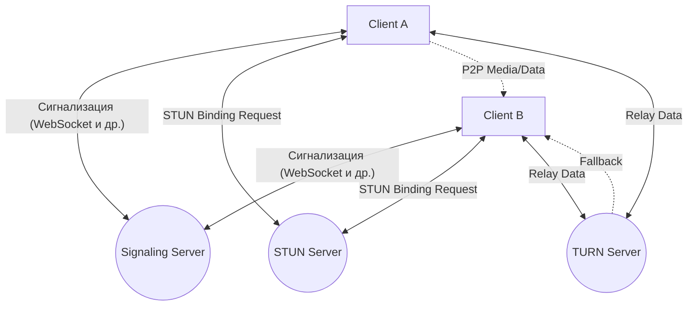
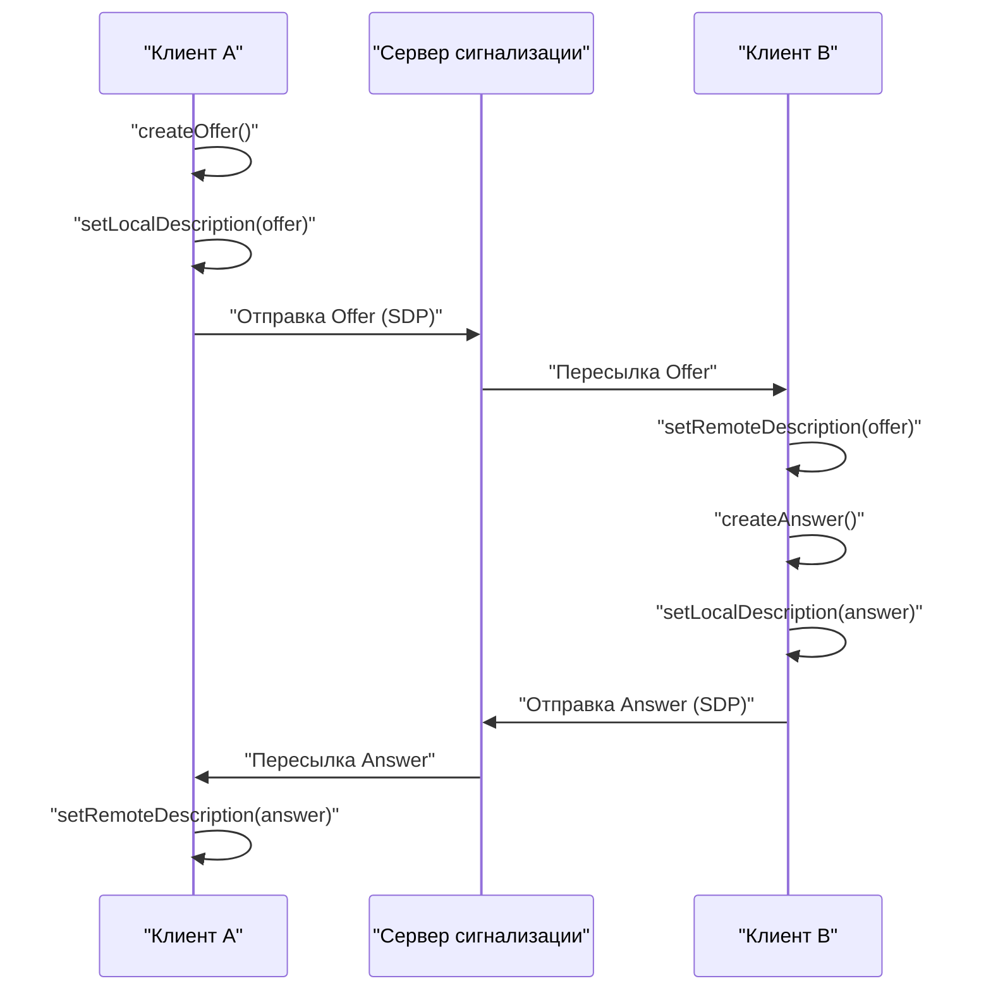
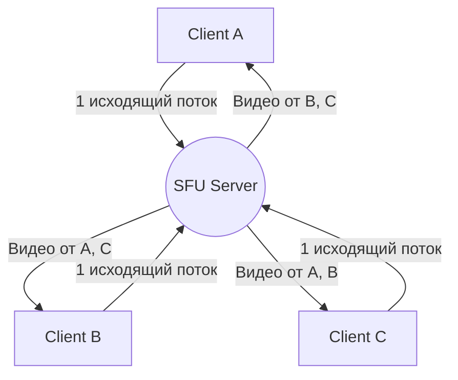

# Изнанка WebRTC и связи в реальном времени: P2P, STUN/TURN, сигнализация

В современном интернете голосовые и видеовызовы в реальном времени, а также передача данных с низкой задержкой, стали неотъемлемыми функциями. Технология, реализующая это прямо в браузере без плагинов, называется **WebRTC** (Web Real-Time Communication).

В этой статье мы очень подробно, с использованием схем и кода, разберем, как WebRTC реализует P2P (Peer-to-Peer) связь между браузерами, и стоящие за этим сложные сетевые технологии (сигнализация, обход NAT, STUN/TURN, протокол ICE и т. д.).

---

## 1. Базовая архитектура WebRTC

WebRTC — это не единый протокол, а набор нескольких протоколов и API. В основном он состоит из следующих трех ключевых API:

1. **MediaStream** (getUserMedia): Получает аудио- и видеопотоки с камеры и микрофона.
2. **RTCPeerConnection**: Управляет соединением между узлами и передает медиапотоки. Также отвечает за контроль пропускной способности и шифрование.
3. **RTCDataChannel**: Отправляет и получает любые бинарные или текстовые данные в обоих направлениях с низкой задержкой.

Ниже на схеме показана общая картина при установке соединения WebRTC.



### 1.1 Разница между клиент-серверной и P2P моделями

Традиционная веб-связь (HTTP/WebSocket и т. д.) всегда работала по **клиент-серверной модели**, где данные проходят через сервер. В этой схеме при отправке сообщения от клиента A к клиенту B оно обязательно ретранслируется сервером, что вызывает следующие проблемы:

- **Увеличение задержки (latency)**: Из-за прохождения через сервер возникает задержка, зависящая от физического расстояния.
- **Нагрузка на сервер**: Весь трафик концентрируется на сервере.

С другой стороны, в **P2P модели** клиенты общаются напрямую друг с другом. Это обеспечивает передачу данных по кратчайшему пути и сверхнизкую задержку.

Формула расчета времени задержки выглядит следующим образом:

$ T_{total} = T_{prop} + T_{trans} + T_{queue} + T_{proc} $

Где $T_{prop}$ — задержка распространения (зависит от расстояния), $T_{trans}$ — задержка передачи, $T_{queue}$ — задержка в очереди, $T_{proc}$ — задержка обработки. В P2P-связи за счет исключения промежуточного сервера можно значительно сократить $T_{prop}$ и $T_{proc}$.

---

## 2. Что такое сигнализация (Signaling)?

Для установления P2P-соединения стороны должны узнать «где они находятся (IP-адрес и порт)» друг друга. Однако изначально браузеры не знают о существовании друг друга.

Здесь вступает в игру **сервер сигнализации** (Signaling Server). Сервер сигнализации используется не для пересылки самих медиаданных, а исключительно для обмена **метаданными** (контактной информацией и спецификациями медиа) для установления связи.

### 2.1 SDP (Session Description Protocol)

Одной из важных частей информации, которой обмениваются при сигнализации, является **SDP**. SDP содержит следующую информацию:

- Тип медиа (аудио, видео, данные)
- Поддерживаемые кодеки (VP8, H.264, Opus и др.)
- Информация о номерах портов и IP-адресах, используемых для связи

### 2.2 Процесс сигнализации (Offer и Answer)

Установление соединения WebRTC происходит, когда одна сторона отправляет **Offer** (предложение), а другая возвращает **Answer** (ответ).



### 2.3 Пример реализации сервера сигнализации (Node.js + WebSocket)

Поскольку реализация сервера сигнализации не регламентирована спецификацией WebRTC, вы можете использовать любую понравившуюся технологию: WebSocket, Socket.io, Firebase и т. д. Ниже приведен пример простого сервера сигнализации с использованием библиотеки `ws`.

```javascript
// server.js
const WebSocket = require('ws');
const wss = new WebSocket.Server({ port: 8080 });

wss.on('connection', (ws) => {
    console.log('Подключился новый клиент.');

    ws.on('message', (message) => {
        // Трансляция полученного сообщения (Offer/Answer/ICE Candidate)
        // В реальном приложении необходим контроль отправки конкретному адресату (комната или ID)
        wss.clients.forEach((client) => {
            if (client !== ws && client.readyState === WebSocket.OPEN) {
                client.send(message);
            }
        });
    });
});
```

---

## 3. Барьер обхода NAT: STUN и TURN

С помощью сигнализации мы обменялись SDP друг друга, но этого недостаточно для связи. Причина в том, что многие устройства находятся за **NAT** (Network Address Translation) и имеют только приватные IP-адреса. Получить прямой доступ к приватному IP-адресу из интернета невозможно.

### 3.1 STUN (Session Traversal Utilities for NAT)

**Сервер STUN** выступает в роли зеркала, которое сообщает клиенту его «публичный IP-адрес и номер порта».

1. Клиент отправляет запрос к STUN-серверу.
2. STUN-сервер отвечает: «С моей точки зрения, ваш публичный IP-адрес — X.X.X.X, а порт — YYYY».
3. Клиент включает эту полученную публичную информацию в SDP и ICE Candidate для передачи собеседнику.

### 3.2 TURN (Traversal Using Relays around NAT)

Даже с использованием STUN связь не всегда удается установить. Типичные примеры — строгие NAT-окружения, называемые **Symmetric NAT**, или наличие корпоративных брандмауэров.

В таких случаях используется **сервер TURN**. Сервер TURN — это сервер для **ретрансляции (пересылки)** медиаданных, когда от P2P-соединения приходится отказаться в пользу связи через сервер. Связь гарантированно устанавливается, но есть недостатки: нагрузка на сервер, увеличение задержки (latency) и дополнительные затраты.

### 3.3 ICE (Interactive Connectivity Establishment)

Как же WebRTC решает, что использовать — STUN или TURN? Для этого существует фреймворк **ICE**.

ICE собирает кандидатов ( **ICE Candidate** ) для всех возможных путей связи (локальный IP, публичный IP, полученный от STUN, и ретрансляция через TURN) и обменивается ими. Затем он автоматически выбирает наиболее эффективный маршрут (обычно в порядке: локальный IP > STUN > TURN) и устанавливает соединение.

```mermaid
sequenceDiagram
    participant PeerA
    participant STUN
    participant PeerB

    PeerA->>STUN: "Binding Request"
    STUN-->>PeerA: "Public IP & Port"
    PeerA->>PeerA: "Генерация ICE Candidate"
    PeerA->>PeerB: "Отправка Candidate через сигнализацию"
    PeerB->>STUN: "Binding Request"
    STUN-->>PeerB: "Public IP & Port"
    PeerB->>PeerA: "Отправка Candidate через сигнализацию"
    PeerA<-->>PeerB: "Проверка связности (STUN Ping)"
    PeerA->>PeerB: "Установка P2P соединения по оптимальному маршруту"
```

---

## 4. Безопасность и шифрование (DTLS/SRTP)

Медиапотоки и каналы данных в WebRTC всегда должны быть зашифрованы.

- **DTLS (Datagram Transport Layer Security)**: Протокол, обеспечивающий уровень безопасности поверх [UDP](https://kenji.blog/ru/p/http3-quic-protocol-tcp-udp/), эквивалентный TLS. Используется для шифрования каналов данных и обмена ключами.
- **SRTP (Secure Real-time Transport Protocol)**: Протокол для шифрования и передачи медиаданных, таких как аудио и видео. Шифрование осуществляется с использованием ключей, обмен которыми произошел по DTLS.

Это предотвращает прослушивание или изменение данных на маршруте, и безопасное **сквозное шифрование** (E2EE) реализуется по умолчанию.

---

## 5. Пример реализации WebRTC: Frontend

Теперь давайте посмотрим на простой код фронтенда, который фактически инициализирует WebRTC в браузере и взаимодействует с сервером сигнализации.

```javascript
// app.js
const signalingUrl = 'ws://localhost:8080';
const ws = new WebSocket(signalingUrl);
let peerConnection;

const configuration = {
    iceServers: [
        { urls: 'stun:stun.l.google.com:19302' } // Использование публичного STUN-сервера Google
    ]
};

// 1. Инициализация RTCPeerConnection
function initPeerConnection() {
    peerConnection = new RTCPeerConnection(configuration);

    // Отправка ICE Candidate собеседнику при генерации
    peerConnection.onicecandidate = (event) => {
        if (event.candidate) {
            sendMessage({ type: 'candidate', candidate: event.candidate });
        }
    };

    // Обработка при получении потока от собеседника
    peerConnection.ontrack = (event) => {
        const remoteVideo = document.getElementById('remoteVideo');
        if (remoteVideo.srcObject !== event.streams[0]) {
            remoteVideo.srcObject = event.streams[0];
        }
    };
}

// Отправка и получение сообщений сигнализации
ws.onmessage = async (message) => {
    const data = JSON.parse(message.data);

    if (data.type === 'offer') {
        initPeerConnection();
        await peerConnection.setRemoteDescription(new RTCSessionDescription(data.offer));
        const answer = await peerConnection.createAnswer();
        await peerConnection.setLocalDescription(answer);
        sendMessage({ type: 'answer', answer: answer });
    } else if (data.type === 'answer') {
        await peerConnection.setRemoteDescription(new RTCSessionDescription(data.answer));
    } else if (data.type === 'candidate') {
        await peerConnection.addIceCandidate(new RTCIceCandidate(data.candidate));
    }
};

function sendMessage(msg) {
    ws.send(JSON.stringify(msg));
}

// Триггер начала соединения (создание Offer)
async function startCall() {
    initPeerConnection();

    // Получение локальных медиаданных
    const stream = await navigator.mediaDevices.getUserMedia({ video: true, audio: true });
    document.getElementById('localVideo').srcObject = stream;
    stream.getTracks().forEach(track => peerConnection.addTrack(track, stream));

    // Создание и отправка Offer
    const offer = await peerConnection.createOffer();
    await peerConnection.setLocalDescription(offer);
    sendMessage({ type: 'offer', offer: offer });
}
```

---

## 6. Производительность и масштабируемость: SFU и MCU

Связь P2P идеально подходит для звонков один на один, но при увеличении числа участников (например, в многопользовательских конференциях, таких как Zoom или Google Meet) возникают проблемы. Если есть $N$ участников, каждый клиент должен отправлять $(N-1)$ исходящих потоков, что быстро исчерпает пропускную способность и ресурсы процессора.

Архитектуры для решения этой проблемы при многопользовательских соединениях — это **SFU** и **MCU**.

### 6.1 MCU (Multipoint Control Unit)

MCU получает видео от всех клиентов, микширует (объединяет) его в одно видео на сервере и распределяет по клиентам.

- **Плюсы**: Нагрузка на клиента и потребление пропускной способности минимальны.
- **Минусы**: Затраты на сервер очень высоки, так как на стороне сервера требуется декодирование, кодирование и обработка смешивания видео.

### 6.2 SFU (Selective Forwarding Unit)

SFU — это сервер, который не объединяет видео, а маршрутизирует (распределяет) полученные медиапотоки напрямую нужным клиентам.



- **Плюсы**: Клиенту нужно отправить только один исходящий поток. Поскольку сервер не выполняет микширование, нагрузка на него ниже по сравнению с MCU, и он легче масштабируется.
- **Минусы**: Нагрузка на стороне клиента выше, чем при использовании MCU, так как клиент получает и декодирует несколько входящих потоков.

Большинство современных систем веб-конференций (Discord, Google Meet и др.) используют архитектуру SFU.

---

## 7. Использование канала данных (RTCDataChannel)

WebRTC предоставляет API `RTCDataChannel` для отправки любых данных помимо видео и аудио. В его основе лежит протокол **SCTP (Stream Control Transmission Protocol)**.

SCTP сочетает в себе обе характеристики: надежность [TCP](https://kenji.blog/ru/p/http3-quic-protocol-tcp-udp/) и низкую задержку [UDP](https://kenji.blog/ru/p/http3-quic-protocol-tcp-udp/).

- **Контроль надежности**: Вы можете выбрать, гарантировать ли доставку данных (как в TCP) или нет (как в UDP).
- **Контроль порядка**: Вы можете выбрать, гарантировать ли порядок доставки или обрабатывать данные по мере их поступления, игнорируя порядок.

Возможен гибкий дизайн: например, если важна быстрая доставка последних данных, даже если часть из них потеряна (как данные о координатах в играх), они передаются быстро «без надежности и гарантии порядка». А если это передача файла, где потери недопустимы, она выполняется «с надежностью».

---

## 8. Заключение

WebRTC — это мощная технология, обеспечивающая высококачественную связь в реальном времени исключительно с помощью браузера. Она работает благодаря сочетанию многих технических элементов, начиная от основ P2P-связи до сигнализации, обхода NAT с помощью STUN/TURN, маршрутизации через ICE и обеспечения безопасности.

Правильное понимание этих внутренних механизмов позволяет создавать приложения, устойчивые к изменениям в сетевом окружении, а также проектировать масштабируемые системы с использованием SFU/MCU.

Технология WebRTC продолжает развиваться и, как ожидается, будет играть важную роль в различных областях, включая метавселенные, IoT, облачный гейминг и многих других, в будущем.
