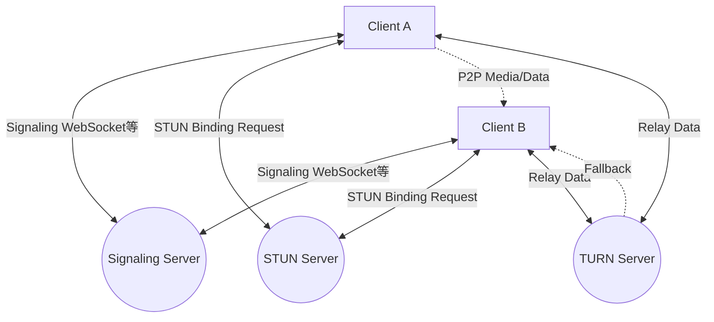
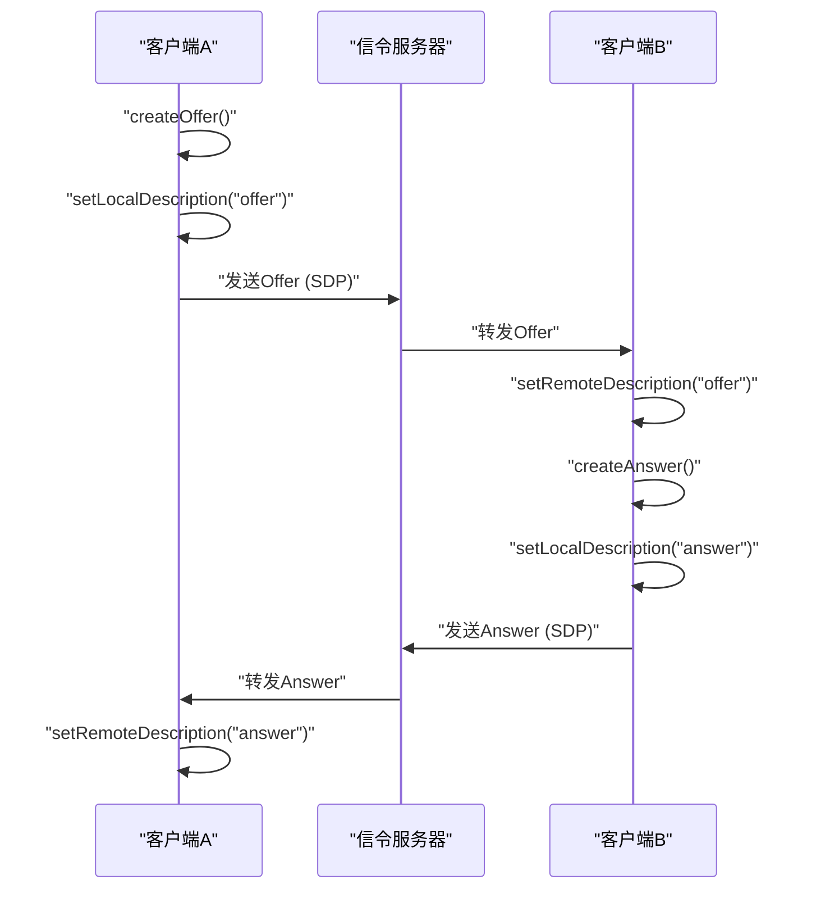
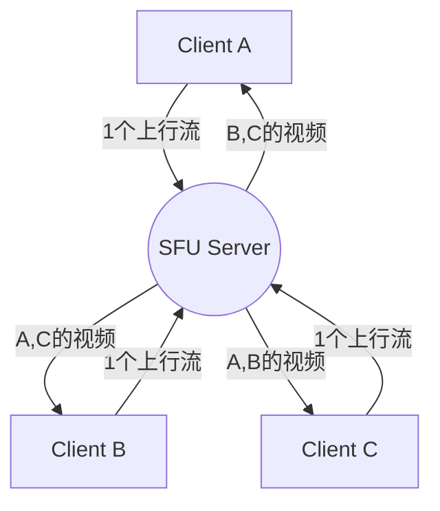

# WebRTC与实时通信的内幕：P2P、STUN/TURN、信令

在现代网络中，实时的音视频通话和低延迟的数据传输已经成为不可或缺的功能。在浏览器上无需插件即可实现这一功能的技术就是 **WebRTC** （Web Real-Time Communication）。

本文将结合图解和代码，非常详细地讲解 WebRTC 是如何实现浏览器之间的 P2P（Peer-to-Peer）通信的，以及其背后复杂的网络技术（信令、NAT 穿透、STUN/TURN、ICE 协议等）。

---

## 1. WebRTC的基本架构

WebRTC 不是单一的协议，而是多个协议和 API 的集合体。大体上可以分为以下 3 个主要 API。

1.  **MediaStream** (getUserMedia)：从摄像头或麦克风获取音视频流。
2.  **RTCPeerConnection**：管理对等端（Peer）之间的连接，并发送媒体流。还负责带宽控制和加密等工作。
3.  **RTCDataChannel**：以低延迟双向收发任意的二进制数据或文本数据。

下图展示了建立 WebRTC 通信时的整体架构。



### 1.1 客户端-服务器模型与P2P模型的区别

传统的网络通信（如 HTTP/WebSocket 等）始终是经过服务器的 **客户端-服务器模型** 。在这种模式下，当客户端 A 向客户端 B 发送消息时，必须经过服务器中继，因此存在以下问题：

-  **延迟（Latency）增加** ：由于需要经过服务器中继，会产生因物理距离引起的延迟。
-  **服务器负载** ：所有流量都会集中在服务器上。

另一方面，在 **P2P 模型** 中，客户端之间直接进行通信。这样可以实现最短路径的通信，从而实现超低延迟。

延迟时间的计算公式可以表示如下：

$ T_{total} = T_{prop} + T_{trans} + T_{queue} + T_{proc} $

其中， $T_{prop}$ 是传播延迟（取决于距离）， $T_{trans}$ 是传输延迟， $T_{queue}$ 是排队延迟， $T_{proc}$ 是处理延迟。在 P2P 通信中，由于省去了中继服务器，可以大幅减少 $T_{prop}$ 和 $T_{proc}$ 。

---

## 2. 什么是信令 (Signaling)

为了建立 P2P 通信，双方需要知道对方“在哪里（IP 地址和端口号）”。然而，浏览器最初并不知道对方的存在。

这时 **信令服务器（Signaling Server）** 就派上用场了。信令服务器并不用于中继媒体数据本身，而仅用于交换建立通信所需的 **元数据** （联系信息和媒体规范）。

### 2.1 SDP (Session Description Protocol)

在信令中交换的重要信息之一是 **SDP** 。SDP 包含以下信息：

- 媒体类型（音频、视频、数据）
- 支持的编解码器（如 VP8、H.264、Opus 等）
- 用于通信的端口号和 IP 地址信息

### 2.2 信令流程（Offer与Answer）

WebRTC 的连接建立是通过一方发出 **Offer** （提议），另一方返回 **Answer** （应答）来完成的。



### 2.3 信令服务器的实现示例 (Node.js + WebSocket)

WebRTC 规范并未规定信令服务器的实现方式，因此你可以使用 WebSocket、Socket.io、Firebase 等任意你喜欢的技术。以下是使用 `ws` 库实现的一个简单的信令服务器示例。

```javascript
// server.js
const WebSocket = require('ws');
const wss = new WebSocket.Server({ port: 8080 });

wss.on('connection', (ws) => {
    console.log('新客户端已连接。');

    ws.on('message', (message) => {
        // 广播接收到的消息（Offer/Answer/ICE Candidate）
        // 在实际应用中，需要控制仅发送给特定的目标（房间或ID）
        wss.clients.forEach((client) => {
            if (client !== ws && client.readyState === WebSocket.OPEN) {
                client.send(message);
            }
        });
    });
});
```

---

## 3. 跨越NAT的障碍：STUN与TURN

虽然通过信令交换了彼此的 SDP，但仅凭这些还无法进行通信。这是因为许多设备都位于 **NAT** （网络地址转换）之后，只有私有 IP 地址。从互联网上直接访问私有 IP 地址是不可能的。

### 3.1 STUN (Session Traversal Utilities for NAT)

**STUN 服务器** 就像一面镜子，它告诉客户端自身的“公网 IP 地址和端口号”。

1. 客户端向 STUN 服务器发送请求。
2. STUN 服务器回答：“从我这里看，你的公网 IP 地址是 X.X.X.X，端口是 YYYY。”
3. 客户端将获取到的这个公网信息包含在 SDP 或 ICE Candidate 中，并传达给对方。

### 3.2 TURN (Traversal Using Relays around NAT)

即使使用 STUN，有时也无法建立通信。典型的情况是在被称为 **Symmetric NAT** （对称 NAT）的严格 NAT 环境下，或存在企业内防火墙时。

在这种情况下，就需要使用 **TURN 服务器** 。TURN 服务器是一个放弃 P2P 通信，转而通过服务器 **中继（Relay）** 媒体数据的服务器。虽然可以确保通信成功，但存在服务器负载大、延迟增加和产生成本等缺点。

### 3.3 ICE (Interactive Connectivity Establishment)

WebRTC 是如何决定何时使用 STUN 或 TURN 的呢？解决这个问题的框架就是 **ICE** 。

ICE 会收集所有可能的通信路径（本地 IP、通过 STUN 获取的公网 IP、通过 TURN 进行中继）的候选者（ **ICE Candidate** ），并在双方之间交换。然后自动选择最高效的路径（通常顺序是 本地 IP > STUN > TURN）并建立连接。

```mermaid
sequenceDiagram
    participant PeerA as "PeerA"
    participant STUN as "STUN"
    participant PeerB as "PeerB"

    PeerA->>STUN: "Binding Request"
    STUN-->>PeerA: "Public IP & Port"
    PeerA->>PeerA: "生成ICE Candidate"
    PeerA->>PeerB: "通过信令发送Candidate"
    PeerB->>STUN: "Binding Request"
    STUN-->>PeerB: "Public IP & Port"
    PeerB->>PeerA: "通过信令发送Candidate"
    PeerA<-->>PeerB: "连接性检查 (STUN Ping)"
    PeerA->>PeerB: "通过最佳路径完成P2P连接"
```

---

## 4. 安全性与加密 (DTLS/SRTP)

WebRTC 的媒体流和数据通道必须经过加密。

-  **DTLS (Datagram Transport Layer Security)** ：在 [UDP](https://kenji.blog/zh-cn/p/http3-quic-protocol-tcp-udp/) 上提供与 TLS 同等安全性的协议。用于数据通道的加密和密钥交换。
-  **SRTP (Secure Real-time Transport Protocol)** ：用于加密并传输音频和视频等媒体数据的协议。使用通过 DTLS 交换的密钥进行加密。

这防止了传输过程中的窃听和篡改，并默认实现了安全的 **端到端加密** (E2EE)。

---

## 5. WebRTC的实现示例：前端

接下来，让我们看一个简单的前端代码示例，演示如何在浏览器上初始化 WebRTC 并与信令服务器进行交互。

```javascript
// app.js
const signalingUrl = 'ws://localhost:8080';
const ws = new WebSocket(signalingUrl);
let peerConnection;

const configuration = {
    iceServers: [
        { urls: 'stun:stun.l.google.com:19302' } // 使用Google的公开STUN服务器
    ]
};

// 1. 初始化RTCPeerConnection
function initPeerConnection() {
    peerConnection = new RTCPeerConnection(configuration);

    // 生成ICE Candidate后发送给对方
    peerConnection.onicecandidate = (event) => {
        if (event.candidate) {
            sendMessage({ type: 'candidate', candidate: event.candidate });
        }
    };

    // 接收到对方流时的处理
    peerConnection.ontrack = (event) => {
        const remoteVideo = document.getElementById('remoteVideo');
        if (remoteVideo.srcObject !== event.streams[0]) {
            remoteVideo.srcObject = event.streams[0];
        }
    };
}

// 收发信令消息
ws.onmessage = async (message) => {
    const data = JSON.parse(message.data);

    if (data.type === 'offer') {
        initPeerConnection();
        await peerConnection.setRemoteDescription(new RTCSessionDescription(data.offer));
        const answer = await peerConnection.createAnswer();
        await peerConnection.setLocalDescription(answer);
        sendMessage({ type: 'answer', answer: answer });
    } else if (data.type === 'answer') {
        await peerConnection.setRemoteDescription(new RTCSessionDescription(data.answer));
    } else if (data.type === 'candidate') {
        await peerConnection.addIceCandidate(new RTCIceCandidate(data.candidate));
    }
};

function sendMessage(msg) {
    ws.send(JSON.stringify(msg));
}

// 开始连接的触发器（创建Offer）
async function startCall() {
    initPeerConnection();

    // 获取本地媒体
    const stream = await navigator.mediaDevices.getUserMedia({ video: true, audio: true });
    document.getElementById('localVideo').srcObject = stream;
    stream.getTracks().forEach(track => peerConnection.addTrack(track, stream));

    // 创建并发送Offer
    const offer = await peerConnection.createOffer();
    await peerConnection.setLocalDescription(offer);
    sendMessage({ type: 'offer', offer: offer });
}
```

---

## 6. 性能与可扩展性：SFU与MCU

P2P 通信非常适合一对一通话，但在多人连接（例如 Zoom 或 Google Meet 等多人会议）时会出现问题。如果有 $N$ 个参与者，每个客户端必须发送 $(N-1)$ 个上行流，这会迅速耗尽带宽和 CPU 资源。

为了解决这个多人连接的问题，出现了 **SFU** 和 **MCU** 架构。

### 6.1 MCU (Multipoint Control Unit)

MCU 接收来自所有客户端的视频，在服务器上将它们合成（混合）成一个视频，然后再分发给每个客户端。

-  **优点** ：客户端的负载和带宽消耗降至最低。
-  **缺点** ：因为需要在服务器端进行视频的解码、编码和合成处理，所以服务器成本非常高。

### 6.2 SFU (Selective Forwarding Unit)

SFU 不会合成视频，而是将接收到的媒体流原封不动地分配（路由）给需要的客户端。



-  **优点** ：客户端只需发送 1 个上行流。由于服务器不进行合成处理，与 MCU 相比，负载较低且易于扩展。
-  **缺点** ：因为客户端需要接收并解码多个下行流，所以客户端的负载比使用 MCU 时要高。

目前许多现代的网络会议系统（如 Discord、Google Meet 等）都采用了这种 SFU 架构。

---

## 7. 数据通道 (RTCDataChannel) 的应用

WebRTC 不仅提供音视频传输，还提供了用于发送任意数据的 `RTCDataChannel` API。它在底层使用的是一种称为 **SCTP (Stream Control Transmission Protocol)** 的协议。

SCTP 兼具了 [TCP](https://kenji.blog/zh-cn/p/http3-quic-protocol-tcp-udp/) 的可靠性和 [UDP](https://kenji.blog/zh-cn/p/http3-quic-protocol-tcp-udp/) 的低延迟特性。

-  **可靠性控制** ：可以选择是否保证数据送达（类似 TCP 的方式，或类似 UDP 的方式）。
-  **顺序控制** ：可以选择是保证到达顺序，还是忽略顺序按到达先后处理。

这种灵活性使得你可以进行灵活的设计，例如：如果像游戏的坐标数据那样，即使丢失一部分也希望最新的数据能尽快到达，就可以选择“无可靠性、无顺序保证”进行高速传输；而对于像文件传输这样不允许丢失的情况，则可以选择“有可靠性”进行传输。

---

## 8. 总结

WebRTC 是一项无需插件、仅靠浏览器就能实现高级实时通信的强大技术。从 P2P 通信的基础，到信令、基于 STUN/TURN 的 NAT 穿透、基于 ICE 的路径探索，再到安全性，许多技术元素结合在一起使其正常运作。

通过正确理解这些背后的机制，你可以构建对网络环境有较强适应性的应用程序，以及利用 SFU/MCU 设计可扩展的系统。

WebRTC 技术每天都在发展，人们期待它未来在元宇宙、物联网 (IoT)、云游戏等各个领域大放异彩。
