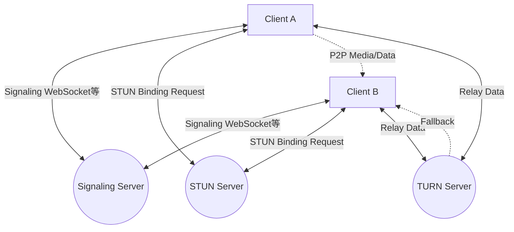
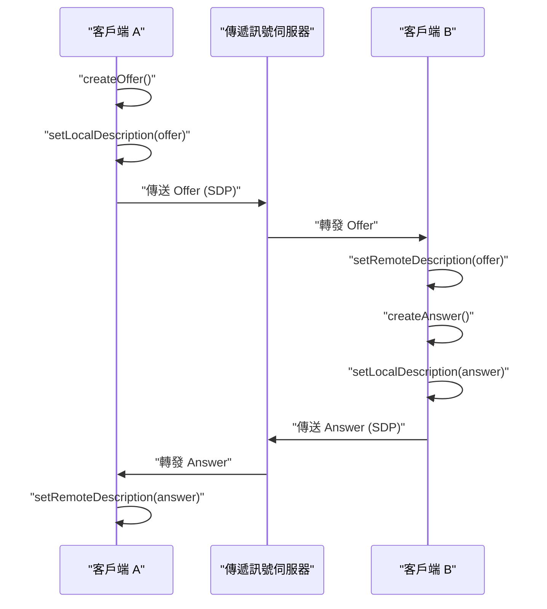
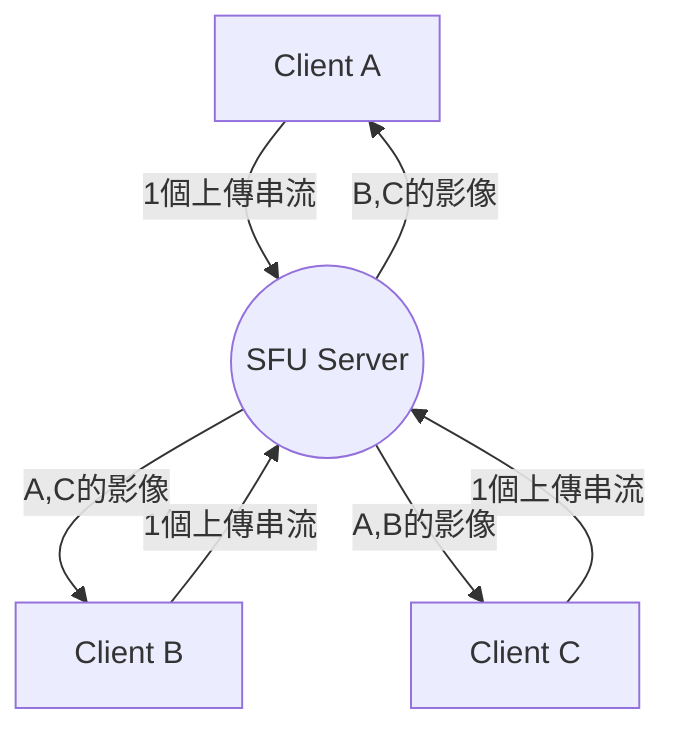

# WebRTC與即時通訊的幕後：P2P, STUN/TURN, 傳遞訊號 (Signaling)

在現代的網頁中，即時的語音與視訊通話以及低延遲的資料傳輸已經成為不可或缺的功能。而能夠在瀏覽器上無需外掛程式就能實現此技術的便是 **WebRTC** (Web Real-Time Communication)。

本文將透過圖解與程式碼，非常詳細地解說 WebRTC 是如何在瀏覽器之間實現 P2P (Peer-to-Peer) 通訊，以及其背後複雜的網路技術（包含傳遞訊號、穿越 NAT、STUN/TURN、ICE 協定等）。

---

## 1. WebRTC 的基本架構

WebRTC 並不是單一的協定，而是多種協定與 API 的集合體。大致可分為以下 3 個主要的 API：

1.  **MediaStream** (getUserMedia): 從攝影機與麥克風取得語音與影像串流。
2.  **RTCPeerConnection**: 管理對等端 (Peer) 之間的連線，並傳送媒體串流。同時也負責頻寬控制與加密等工作。
3.  **RTCDataChannel**: 以低延遲雙向收發任意的二進位資料或文字資料。

下圖展示了建立 WebRTC 通訊時的整體樣貌。



### 1.1 主從式 (Client-Server) 與 P2P 型的差異

傳統的網頁通訊（如 HTTP/WebSocket 等），一直都是必定經過伺服器的 **主從式架構 (Client-Server Model)** 。在這種方式下，當客戶端 A 要傳送訊息給客戶端 B 時，必須透過伺服器中繼，因此會有以下的問題：

-  **延遲 (Latency) 增加** : 由於需要透過伺服器中繼，會產生因實體距離造成的延遲。
-  **伺服器負載** : 所有的流量都會集中在伺服器上。

另一方面， **P2P 架構** 中，客戶端之間會進行直接通訊。如此一來便能以最短路徑進行通訊，實現超低延遲。

延遲時間的計算公式可以表示如下：

$ T_{total} = T_{prop} + T_{trans} + T_{queue} + T_{proc} $

這裡的 $T_{prop}$ 是傳播延遲 (與距離相關)， $T_{trans}$ 是傳輸延遲， $T_{queue}$ 是佇列延遲， $T_{proc}$ 是處理延遲。P2P 通訊藉由省略中繼伺服器，可以大幅減少 $T_{prop}$ 與 $T_{proc}$ 。

---

## 2. 傳遞訊號 (Signaling) 是什麼

為了建立 P2P 通訊，雙方必須知道「對方在哪裡 (IP 位址與通訊埠編號)」。然而，瀏覽器一開始並不知道對方的存在。

這時登場的便是 **傳遞訊號伺服器 (Signaling Server)** 。傳遞訊號伺服器並不是用來中繼媒體資料本身，而是僅用於交換用來建立通訊的 **中介資料 (Metadata)** (聯絡資訊或媒體規格)。

### 2.1 SDP (Session Description Protocol)

在傳遞訊號中交換的重要資訊之一就是 **SDP** 。SDP 包含了以下資訊：

- 媒體種類 (語音、視訊、資料)
- 支援的編解碼器 (如 VP8, H.264, Opus 等)
- 通訊使用的通訊埠編號與 IP 位址資訊

### 2.2 傳遞訊號的流程 (Offer 與 Answer)

WebRTC 的連線建立，是由一方向另一方發出 **Offer** (提議)，而另一方回傳 **Answer** (回應) 來進行。



### 2.3 傳遞訊號伺服器實作範例 (Node.js + WebSocket)

WebRTC 的規格中並沒有規定傳遞訊號伺服器的實作方式，因此可以使用 WebSocket、Socket.io 或 Firebase 等喜歡的技術。以下是使用 `ws` 函式庫實作的簡單傳遞訊號伺服器範例。

```javascript
// server.js
const WebSocket = require('ws');
const wss = new WebSocket.Server({ port: 8080 });

wss.on('connection', (ws) => {
    console.log('有新的客戶端連線了。');

    ws.on('message', (message) => {
        // 將收到的訊息（Offer/Answer/ICE Candidate）進行廣播
        // 在實際運用中，需要控制只傳送給特定的對象（房間或 ID）
        wss.clients.forEach((client) => {
            if (client !== ws && client.readyState === WebSocket.OPEN) {
                client.send(message);
            }
        });
    });
});
```

---

## 3. 穿越 NAT 的高牆：STUN 與 TURN

雖然透過傳遞訊號交換了彼此的 SDP，但僅靠這樣還無法進行通訊。因為許多裝置都在 **NAT** (Network Address Translation) 的後方，只擁有私人 IP 位址。從網際網路上是無法直接存取私人 IP 位址的。

### 3.1 STUN (Session Traversal Utilities for NAT)

**STUN 伺服器** 就像是一面鏡子，能告訴客戶端自身的「公共 IP 位址與通訊埠編號」。

1. 客戶端向 STUN 伺服器傳送請求。
2. STUN 伺服器會回覆：「從我這邊看來，你的公共 IP 位址是 X.X.X.X，通訊埠是 YYYY 喔」。
3. 客戶端會將取得的這些公共資訊包含在 SDP 或 ICE Candidate 中，傳達給對方。

### 3.2 TURN (Traversal Using Relays around NAT)

即使使用 STUN 也可能無法建立通訊。最具代表性的是在被稱為 **對稱式 NAT (Symmetric NAT)** 的嚴格 NAT 環境下，或是存在企業內部防火牆的情況。

在這種情況下，就會使用 **TURN 伺服器** 。TURN 伺服器是為了放棄 P2P 通訊，改由透過伺服器來 **中繼 (Relay)** 媒體資料而存在的伺服器。雖然能夠確實進行通訊，但有著對伺服器負載較高、延遲增加、以及產生成本等缺點。

### 3.3 ICE (Interactive Connectivity Establishment)

WebRTC 該如何根據情況區分使用 STUN 或是 TURN 呢？解決這個問題的框架就是 **ICE** 。

ICE 會收集所有可能的通訊路徑（區域 IP、透過 STUN 取得的公共 IP、透過 TURN 的中繼）的候選者 ( **ICE Candidate** )，並互相交換。接著，會自動選擇最有效率的路徑（通常順序為區域 IP > STUN > TURN）來建立連線。

```mermaid
sequenceDiagram
    participant PeerA
    participant STUN
    participant PeerB

    PeerA->>STUN: "Binding Request"
    STUN-->>PeerA: "Public IP & Port"
    PeerA->>PeerA: "生成 ICE Candidate"
    PeerA->>PeerB: "透過傳遞訊號傳送 Candidate"
    PeerB->>STUN: "Binding Request"
    STUN-->>PeerB: "Public IP & Port"
    PeerB->>PeerA: "透過傳遞訊號傳送 Candidate"
    PeerA<-->>PeerB: "連線能力測試 (STUN Ping)"
    PeerA->>PeerB: "以最佳路徑完成 P2P 連線"
```

---

## 4. 安全性與加密 (DTLS/SRTP)

WebRTC 的媒體串流與資料通道，都必須經過加密。

-  **DTLS (Datagram Transport Layer Security)** : 提供在 [UDP](https://kenji.blog/zh-tw/p/http3-quic-protocol-tcp-udp/) 上具備與 TLS 同等安全性的協定。用於資料通道的加密以及金鑰交換。
-  **SRTP (Secure Real-time Transport Protocol)** : 用於將語音與影像等媒體資料進行加密並傳送的協定。會使用 DTLS 所交換的金鑰來進行加密。

藉此，能防止傳輸路徑上的竊聽與竄改，標準配備了安全的 **端對端加密** (E2EE)。

---

## 5. WebRTC 實作範例：前端

接著，讓我們來看看實際在瀏覽器上初始化 WebRTC，並與傳遞訊號伺服器進行互動的簡單前端程式碼。

```javascript
// app.js
const signalingUrl = 'ws://localhost:8080';
const ws = new WebSocket(signalingUrl);
let peerConnection;

const configuration = {
    iceServers: [
        { urls: 'stun:stun.l.google.com:19302' } // 使用 Google 的公開 STUN 伺服器
    ]
};

// 1. 初始化 RTCPeerConnection
function initPeerConnection() {
    peerConnection = new RTCPeerConnection(configuration);

    // 當生成 ICE Candidate 時傳送給對方
    peerConnection.onicecandidate = (event) => {
        if (event.candidate) {
            sendMessage({ type: 'candidate', candidate: event.candidate });
        }
    };

    // 收到對方串流時的處理
    peerConnection.ontrack = (event) => {
        const remoteVideo = document.getElementById('remoteVideo');
        if (remoteVideo.srcObject !== event.streams[0]) {
            remoteVideo.srcObject = event.streams[0];
        }
    };
}

// 傳遞訊號訊息的收發
ws.onmessage = async (message) => {
    const data = JSON.parse(message.data);

    if (data.type === 'offer') {
        initPeerConnection();
        await peerConnection.setRemoteDescription(new RTCSessionDescription(data.offer));
        const answer = await peerConnection.createAnswer();
        await peerConnection.setLocalDescription(answer);
        sendMessage({ type: 'answer', answer: answer });
    } else if (data.type === 'answer') {
        await peerConnection.setRemoteDescription(new RTCSessionDescription(data.answer));
    } else if (data.type === 'candidate') {
        await peerConnection.addIceCandidate(new RTCIceCandidate(data.candidate));
    }
};

function sendMessage(msg) {
    ws.send(JSON.stringify(msg));
}

// 開始連線的觸發器 (建立 Offer)
async function startCall() {
    initPeerConnection();

    // 取得本地端媒體
    const stream = await navigator.mediaDevices.getUserMedia({ video: true, audio: true });
    document.getElementById('localVideo').srcObject = stream;
    stream.getTracks().forEach(track => peerConnection.addTrack(track, stream));

    // 建立與傳送 Offer
    const offer = await peerConnection.createOffer();
    await peerConnection.setLocalDescription(offer);
    sendMessage({ type: 'offer', offer: offer });
}
```

---

## 6. 效能與擴展性：SFU 與 MCU

P2P 通訊雖然最適合一對一的通話，但在多人數（例如 Zoom 或 Google Meet 等多人會議）時就會發生問題。假設有 $N$ 個參與者，每個客戶端就必須傳送 $(N-1)$ 個上傳串流，頻寬與 CPU 很快就會被耗盡。

為了解決這種多人連線的問題，便出現了 **SFU** 與 **MCU** 架構。

### 6.1 MCU (Multipoint Control Unit)

MCU 會接收所有客戶端的影像，在伺服器上將其合成（混合）成一個影像後再派發給各個客戶端。

-  **優點** : 客戶端的負載與頻寬消耗降至最低。
-  **缺點** : 伺服器端需要進行影像的解碼、編碼與合成處理，因此伺服器成本非常高。

### 6.2 SFU (Selective Forwarding Unit)

SFU 不會進行影像合成，而是將收到的媒體串流原封不動地分配（路由）給需要的客戶端的伺服器。



-  **優點** : 客戶端只需要傳送 1 條上傳串流即可。由於伺服器不進行合成處理，與 MCU 相比負載較低且容易擴展。
-  **缺點** : 客戶端需要接收並解碼多條下載串流，因此相較於 MCU，客戶端的負載較高。

目前多數現代的網頁會議系統（如 Discord, Google Meet 等），都是採用這種 SFU 架構。

---

## 7. 資料通道 (RTCDataChannel) 的應用

WebRTC 不僅限於影像與語音，還提供了用來傳送任意資料的 `RTCDataChannel` API。在幕後，這是使用了名為 **SCTP (Stream Control Transmission Protocol)** 的協定。

SCTP 兼具了 [TCP](https://kenji.blog/zh-tw/p/http3-quic-protocol-tcp-udp/) 的可靠性與 [UDP](https://kenji.blog/zh-tw/p/http3-quic-protocol-tcp-udp/) 的低延遲這兩種特性。

-  **可靠性的控制** : 可以選擇是否保證資料的送達（類似 TCP），或者不保證（類似 UDP）。
-  **順序的控制** : 可以選擇是否保證抵達的順序，或者忽略順序以先抵達先處理的方式進行。

像遊戲的座標資料這樣，即使有部分遺失，但最新資料能盡快抵達更為重要的情況下，可以採用「無可靠性、無順序保證」來進行高速傳輸；而在像是檔案傳輸這種不允許遺失的情況下，則可以使用「有可靠性」來進行傳輸，具備了這樣彈性的設計。

---

## 8. 總結

WebRTC 是一種僅透過瀏覽器就能實現進階即時通訊的強大技術。從 P2P 通訊的基礎開始，到傳遞訊號、透過 STUN/TURN 穿越 NAT、使用 ICE 尋找路徑，再到安全性，是結合了許多技術元素來運作的。

只要正確理解這些幕後的機制，便能打造出能適應不同網路環境的應用程式，或是利用 SFU/MCU 來設計出具備擴展性的系統。

WebRTC 的技術至今仍不斷發展，未來也備受期待能活躍於元宇宙、IoT、雲端遊戲等多樣的領域中。
