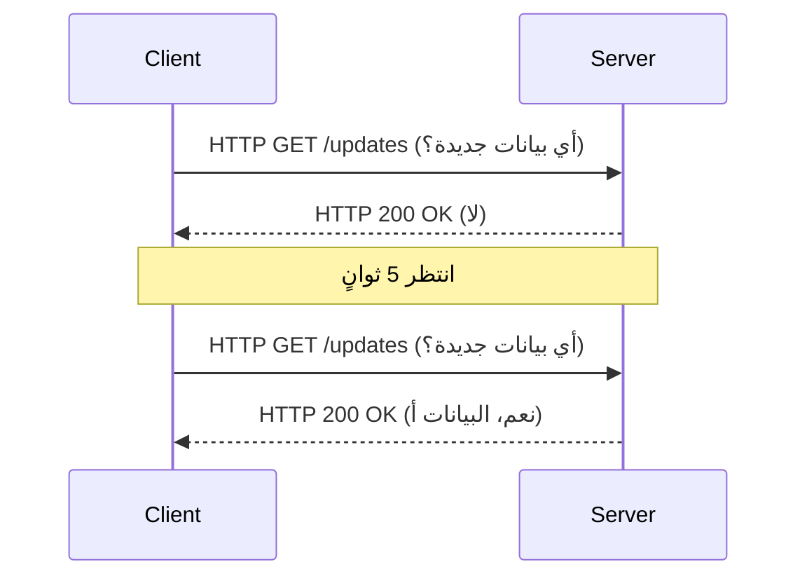
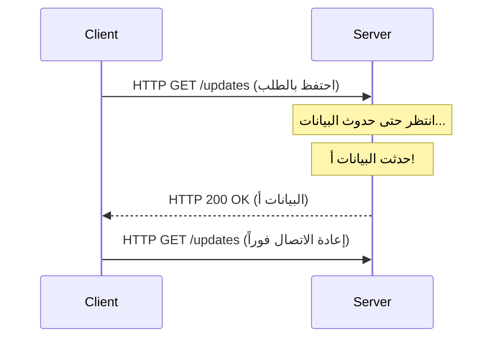
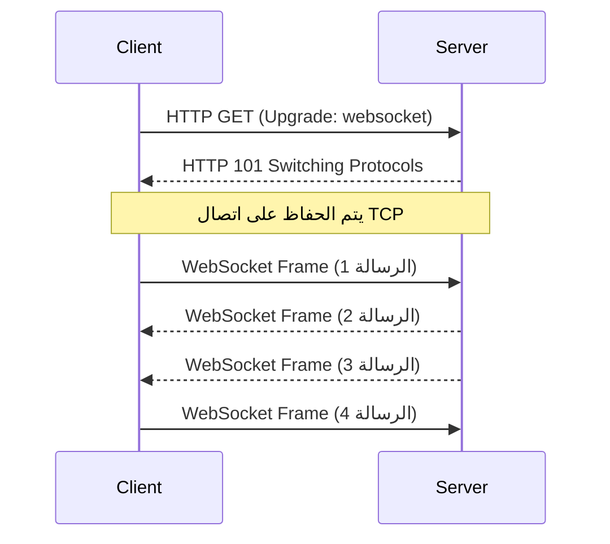
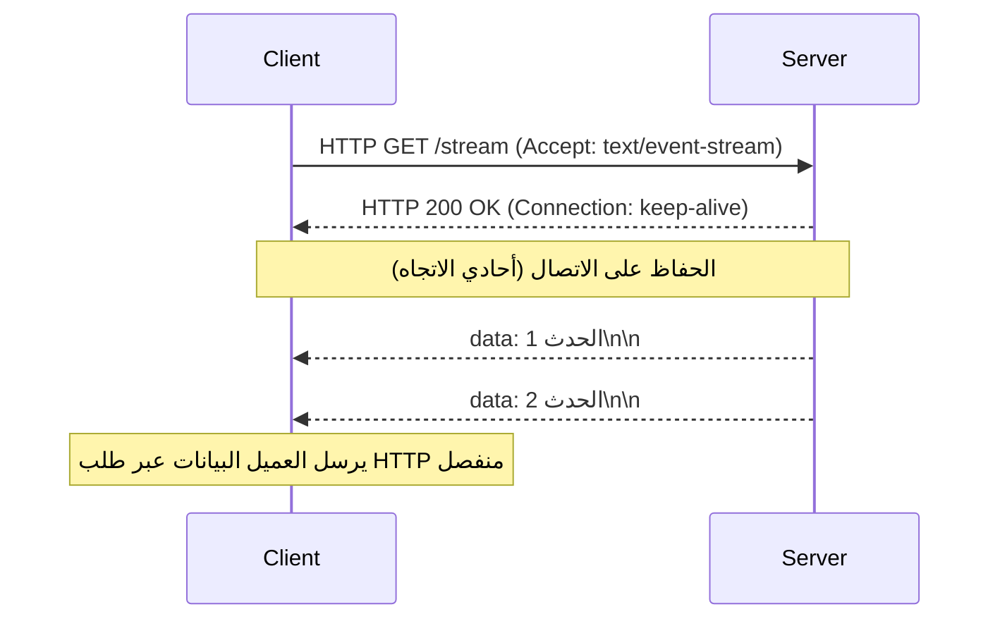

مع تطور تطبيقات الويب من مجموعات بسيطة من المستندات الثابتة إلى منصات تقدم تجارب غنية وتفاعلية، أصبحت "القدرة في الوقت الفعلي" واحدة من أهم المتطلبات. التطبيقات الحديثة التي نستخدمها كل يوم - مثل بيانات الأسهم، وتطبيقات الدردشة، وتحديثات النتائج الرياضية المباشرة، والألعاب متعددة اللاعبين، أو مخرجات السجل في الوقت الفعلي لمسارات CI/CD - تعتمد على آليات تدفع البيانات فوراً من الخادم إلى العميل.

في هذه المقالة، سنشرح بالتفصيل عملاقي الاتصالات في الوقت الفعلي: **WebSocket** و **Server-Sent Events (SSE)**. سنغطي أصولهما، وتفاصيل البروتوكول، وتحديات التوسع، وإرشادات محددة للغاية حول متى يجب استخدام كل منهما.

## حدود HTTP وفجر الاتصالات في الوقت الفعلي

لفهم أهمية WebSocket و SSE حقاً، يجب علينا أولاً التفكير في المشكلة الأساسية التي حاولا حلها: قيود بروتوكول HTTP التقليدي.

### نموذج الطلب والاستجابة عديم الحالة
يعتمد HTTP (بروتوكول نقل النص التشعبي) نموذج "الطلب والاستجابة" الصارم حيث يرسل العميل طلباً إلى الخادم، ويرد الخادم باستجابة. في حين أن هذا كان مثالياً لحالات الاستخدام المبكرة للويب (اتباع الروابط لتصفح الصفحات)، فإنه لا يدعم "دفع الخادم"، حيث يُخطر الخادم العميل بفاعلية بالأحداث التي وقعت في جانب الخادم.

### الملاذ الأخير: الاستقصاء (Polling)
في الحقبة التي سبقت دعم دفع الخادم على مستوى البروتوكول، استخدم المطورون تقنية تسمى "الاستقصاء" لتحقيق قدرات الوقت الفعلي بشكل زائف. هذا نهج يرسل فيه العميل بشكل متكرر طلباً إلى الخادم على فترات منتظمة (على سبيل المثال، كل 5 ثوانٍ) يسأل، "هل توجد أي بيانات جديدة؟"



على الرغم من أن الاستقصاء يتمتع بميزة كونه سهل التنفيذ للغاية، إلا أنه يحتوي على العيوب الشديدة التالية:
1. **زيادة العبء (Overhead)**: نظراً لإرسال الطلبات حتى عندما لا تكون هناك تحديثات للبيانات، يتراكم عبء رؤوس HTTP، مما يهدر النطاق الترددي للشبكة وموارد الخادم.
2. **الكمون (Latency)**: هناك تأخير يصل إلى فاصل الاستقصاء الزمني بين حدوث التحديث واكتشافه من قبل العميل.

### التحسين من خلال الاستقصاء الطويل (Long-Polling)
لتحسين عدم كفاءة الاستقصاء، تم ابتكار "الاستقصاء الطويل". عندما يرسل العميل طلباً، يقوم الخادم بـ "الاحتفاظ بالاستجابة (يُبقي الاتصال مفتوحاً وينتظر)" حتى تحدث بيانات جديدة. في اللحظة التي تحدث فيها البيانات، فإنه يُرجع استجابة، ويقوم العميل، عند تلقيها، بإرسال الطلب التالي على الفور.



على الرغم من أن الاستقصاء الطويل نجح في تحسين الفورية وتقليل الاتصالات غير الضرورية، إلا أنه لا يزال يستخدم إطار عمل HTTP. وبالتالي، فإن عبء الرؤوس أمر لا مفر منه، وتظل تكلفة إعادة إنشاء اتصال في كل مرة يتم فيها إرسال البيانات (خاصة مصافحة TLS في بيئة HTTPS) تحدياً لا يمكن تجاهله.

---

## WebSocket: اتصال ثنائي الاتجاه كامل يطلق العنان لقوة TCP

لحل هذه المشكلات بشكل جذري، ظهر **WebSocket**. هذا البروتوكول، الذي تم توحيده في RFC 6455، يعمل فوق TCP تماماً مثل HTTP، ولكنه يعتمد نهجاً مبتكراً يخترق قيود HTTP.

### كيف يعمل بروتوكول WebSocket
الميزة الأكبر في WebSocket هي أنه بمجرد إنشاء اتصال، فإنه يحقق "اتصالاً ثنائي الاتجاه كامل الازدواج" (Full-Duplex)، حيث يمكن لكل من العميل والخادم إرسال البيانات في أي وقت باستخدام إطارات خفيفة الوزن.

#### 1. ترقية HTTP (المصافحة)
يبدأ اتصال WebSocket في البداية كطلب HTTP قياسي. يستخدم العميل رأس `Upgrade` لطلب الخادم "التبديل إلى بروتوكول WebSocket".

**الطلب من العميل:**
```http
GET /chat HTTP/1.1
Host: server.example.com
Upgrade: websocket
Connection: Upgrade
Sec-WebSocket-Key: dGhlIHNhbXBsZSBub25jZQ==
Sec-WebSocket-Version: 13
```

**الاستجابة من الخادم:**
عندما يقبل الخادم هذا الطلب، فإنه يُرجع رمز الحالة `101 Switching Protocols`، موافقاً على تبديل البروتوكول.
```http
HTTP/1.1 101 Switching Protocols
Upgrade: websocket
Connection: Upgrade
Sec-WebSocket-Accept: s3pPLMBiTxaQ9kYGzzhZRbK+xOo=
```

#### 2. بدء اتصال الإطارات
في اللحظة التي تكتمل فيها هذه المصافحة، ينتهي دور HTTP، ويتحول اتصال TCP المنشأ إلى قناة اتصال ثنائية الاتجاه لإطارات ثنائية/نصية عبر بروتوكول WebSocket. من تلك اللحظة فصاعداً، لا يتم إرفاق رؤوس HTTP الثقيلة، مما يتيح نقل واستقبال البيانات بعبء أدنى يبلغ بضعة بايتات فقط.



### نقاط قوة WebSocket
- **ثنائية الاتجاه الحقيقية**: مثالي لتطبيقات مثل الدردشات والألعاب عبر الإنترنت حيث يرسل العميل أيضاً البيانات بشكل متكرر.
- **عبء أدنى**: تتحسن كفاءة نقل البيانات بشكل كبير بسبب عدم وجود رؤوس HTTP.
- **كمون منخفض**: نظراً لأن الاتصال مفتوح دائماً، فإن الاتصال فوري بدون تأخيرات المصافحة.

### تحديات توسيع نطاق WebSocket
ومع ذلك، ونظراً لأنه بروتوكول قوي، فإن تشغيله وتوسيع نطاقه يتطلب تقنيات متقدمة.

1. **بنية معمارية تحتفظ بالحالة**: نظراً لأن WebSocket يبقي اتصال TCP حياً، يجب على الخادم الاحتفاظ بحالة كل اتصال في الذاكرة. للتعامل مع مشكلات "C10K" و "C100K" - التعامل مع عشرات إلى مئات الآلاف من الاتصالات المتزامنة على خادم واحد - من الضروري اعتماد إدخال/إخراج غير محجوز مدفوع بالأحداث (مثل Node.js، Go، Netty، إلخ).
2. **تكوين موازن الحمل والوكيل**: تحتوي العديد من موازنات الحمل L7 (مثل Nginx، HAProxy، AWS ALB، إلخ) على مهلة خمول مكونة افتراضياً تُسقط الاتصالات بعد فترة معينة (على سبيل المثال، 60 ثانية). لترحيل WebSockets بشكل صحيح، يجب عليك السماح صراحةً بترقيات البروتوكول، أو تعيين قيم مهلة أطول، أو تنفيذ آلية إبقاء الاتصال حياً باستخدام إطارات Ping/Pong على مستوى التطبيق.
3. **مشاركة الحالة (أثناء التوسع الأفقي)**: عند التوسع عبر خوادم متعددة، إذا اتصل المستخدم أ بالخادم 1 والمستخدم ب بالخادم 2، فإن تسليم رسالة دردشة يتطلب إدخال آلية (Redis Pub/Sub، RabbitMQ، Kafka، إلخ) لبث الرسائل بين الخوادم.

---

## Server-Sent Events (SSE): بث خفيف الوزن ضمن إطار عمل HTTP

إذا كان WebSocket هو "السلاح المطلق للاتصالات ثنائية الاتجاه"، فيمكن تسمية **Server-Sent Events (SSE)** بـ "الحل الأمثل الأنيق للبث أحادي الاتجاه". تمت صياغة SSE كجزء من مواصفات HTML5 وهو متخصص في اتصالات الدفع من الخادم إلى العميل (Server-to-Client).

### كيف يعمل بروتوكول SSE
الميزة الكبرى في SSE هي أنه **بدلاً من إدخال بروتوكول جديد ومعقد، فإنه يستخدم إطار عمل HTTP/1.1 أو HTTP/2 الحالي كما هو.**

#### 1. طلب HTTP بسيط
يرسل العميل طلب HTTP GET عادياً، ولكنه يحدد `text/event-stream` في رأس `Accept`.

**الطلب من العميل:**
```http
GET /stream HTTP/1.1
Host: server.example.com
Accept: text/event-stream
Cache-Control: no-cache
```

#### 2. استجابة البث
يُرجع الخادم `Content-Type: text/event-stream` ويستمر في إرسال بيانات الأحداث المستندة إلى النص ككتل دون إغلاق الاتصال.

**الاستجابة من الخادم:**
```http
HTTP/1.1 200 OK
Content-Type: text/event-stream
Cache-Control: no-cache
Connection: keep-alive

data: {"price": 150.25, "symbol": "AAPL"}

event: user_login
data: {"user_id": 12345}

data: مجرد رسالة نصية بسيطة
```



### نقاط قوة SSE
- **البساطة والتوافق مع HTTP**: يمكن الاستفادة من البنية التحتية الحالية (الوكلاء، موازنات الحمل، جدران الحماية) كما هي. التكوينات الخاصة مثل ترقيات البروتوكول غير ضرورية.
- **إعادة الاتصال التلقائي المدمج**: توفر واجهة برمجة تطبيقات `EventSource` الخاصة بالمتصفح بشكل متأصل ميزات لإعادة الاتصال تلقائياً عند انقطاع الاتصال، ولاستئنافه عن طريق إرسال معرّف الحدث الأخير المستلم (`Last-Event-ID`) إلى الخادم. باستخدام WebSocket، يجب تنفيذ ذلك يدوياً.
- **توافق ممتاز مع HTTP/2**: يسمح تعدد إرسال HTTP/2 بمعالجة تدفقات SSE متعددة في وقت واحد على اتصال TCP واحد، مما يحسن الأداء بشكل كبير (مواصفات امتداد WebSocket لـ HTTP/2 لم يتم اعتمادها على نطاق واسع بعد).

### قيود SSE
- **أحادي الاتجاه فقط**: مخصص بشكل صارم للاتصال من الخادم إلى العميل. إذا احتاج العميل إلى إرسال بيانات إلى الخادم، يجب إصدار طلبات HTTP POST/PUT قياسية بشكل منفصل.
- **بيانات نصية فقط**: افتراضياً، يمكن إرسال نص UTF-8 فقط. يتطلب إرسال البيانات الثنائية معالجة مثل ترميز Base64، مما يضيف عبئاً إضافياً.
- **حدود الاتصال المتزامن في HTTP/1.1**: في بيئات HTTP/1.1 القديمة، اقتصرت الاتصالات المتزامنة لنفس النطاق لكل متصفح على 6-8. فتح SSE في علامات تبويب متعددة سيصل إلى هذا الحد، مما يؤدي إلى حظر الطلبات الأخرى (تم حل هذا في HTTP/2).

---

## التصميم المعماري: أيهما يجب أن تختار؟

لا توجد "رصاصة فضية" في تصميم النظام. من الضروري اختيار التقنية المناسبة بناءً على متطلبات المشروع.

### متى تعتمد WebSocket
عندما يكون التفاعل عالي التردد ومنخفض الكمون وثنائي الاتجاه مطلوباً بين العميل والخادم، يكون WebSocket هو الخيار الوحيد.

- **أدوات الدردشة / التعاون في الوقت الفعلي**: تطبيقات التحرير التعاوني مثل Slack أو Discord أو Google Docs.
- **الألعاب متعددة اللاعبين**: مطلوب اتصال ثنائي الاتجاه منخفض الكمون بالمللي ثانية للإحداثيات الموضعية وإجراءات اللاعب.
- **القياس عن بُعد (IoT) عالي التردد**: الأنظمة التي تستوعب البيانات باستمرار من أجهزة متعددة مع دفع الأوامر في الوقت نفسه.

### متى تعتمد SSE
في حالات الاستخدام حيث "يتلقى العميل البيانات فقط (أو يكون تردد إرسال العميل منخفضاً)"، يوصى بـ SSE لأنه يقلل بشكل كبير من تكاليف التنفيذ والتشغيل.

- **لوحات المعلومات / المراقبة في الوقت الفعلي**: مؤشرات أسعار الأسهم، ومراقبة موارد الخادم، وعروض تدفق السجل.
- **خلاصات الأخبار / أنظمة الإشعارات**: تحديثات الجدول الزمني لشبكات التواصل الاجتماعي والإشعارات الفورية من النظام.
- **إنشاء استجابات AI/LLM**: بث النص المتولد بالتسلسل للعميل في تطبيقات LLM مثل ChatGPT (هذا مثال رئيسي على استخدام SSE في العديد من تطبيقات الذكاء الاصطناعي الحالية).

### ملخص المقارنة

| الميزة | WebSocket | Server-Sent Events (SSE) |
| :--- | :--- | :--- |
| **الاتجاه** | مزدوج كامل (ثنائي الاتجاه) | أحادي الاتجاه (الخادم ← العميل) |
| **تنسيق البيانات** | ثنائي / نص | نص (UTF-8) فقط |
| **البروتوكول** | مخصص (فوق TCP، عبر HTTP Upgrade) | HTTP/1.1, HTTP/2 |
| **إعادة الاتصال التلقائي** | لا (يتطلب تنفيذاً يدوياً) | نعم (ميزة قياسية في واجهة EventSource) |
| **التوافق مع البنية التحتية**| منخفض (يتطلب تكوين LB/Proxy خاصاً) | عالي (يُعامل كـ HTTP قياسي) |
| **تكلفة التنفيذ** | عالية (مكتبات اتصال معقدة، إدارة حالة) | منخفضة (امتداد لنقاط نهاية HTTP الحالية) |

## الخاتمة

في تطور الويب في الوقت الفعلي، لا يلغي WebSocket و SSE بعضهما البعض بل يكملان بعضهما البعض بشكل مثالي.

الخيار المهمل بـ "مجرد استخدام WebSocket في الوقت الحالي" يهدد بالتسبب في تعقيد البنية التحتية وزيادة تكاليف الصيانة. إذا كانت حالة الاستخدام تتضمن إرسالاً نادراً للبيانات من العميل إلى الخادم (على سبيل المثال، يتم تنفيذ إجراءات العميل عبر واجهات برمجة تطبيقات REST العادية، ويتم تلقي بث النتائج فقط)، فإن اعتماد SSE يسمح للبنية المعمارية بالبقاء بسيطة مع جني الفوائد الكاملة لنظام HTTP البيئي الحالي.

يُعد التحليل الهادئ لمتطلبات النظام (الاتجاهية، والتردد، وأنواع البيانات، وبيئة البنية التحتية) واعتماد التقنية المناسبة في المكان المناسب المفتاح لبناء تطبيقات حديثة قوية وقابلة للتطوير.
