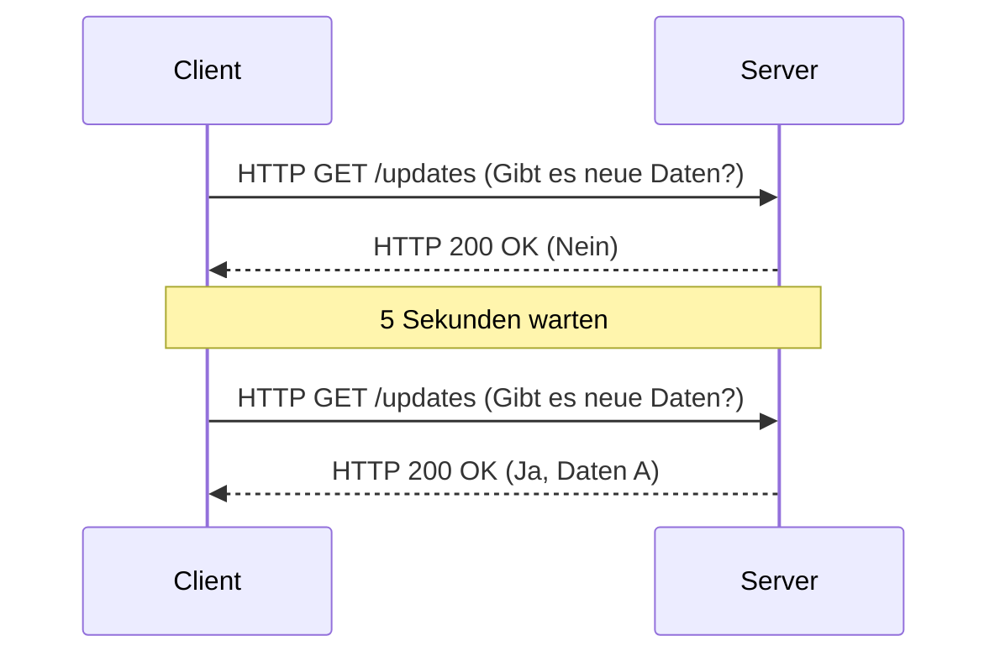
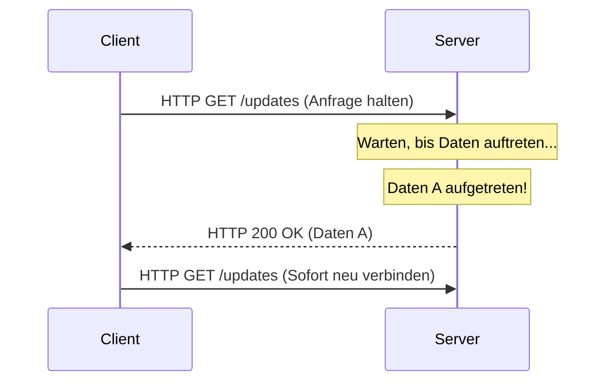
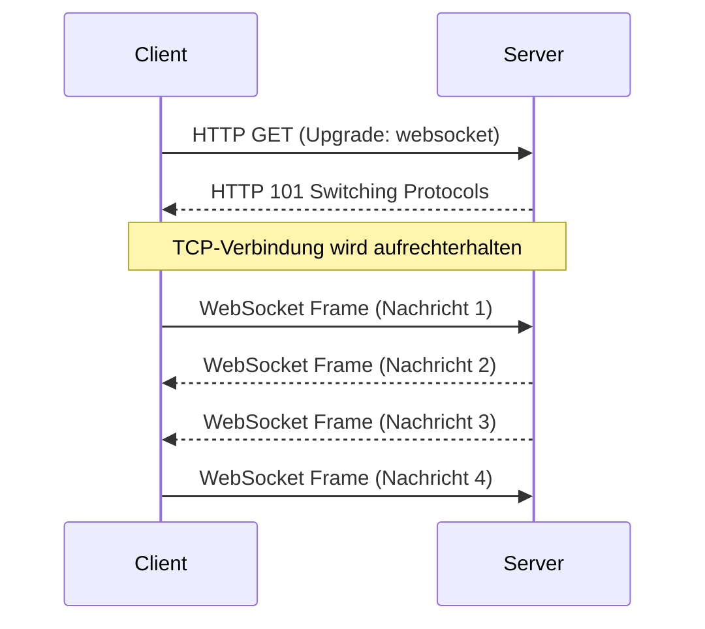
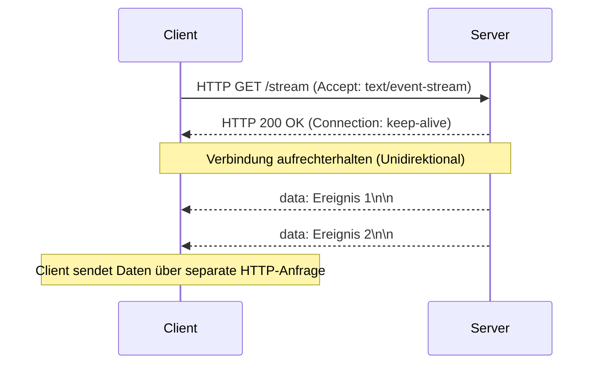

Während Webanwendungen sich von einfachen Sammlungen statischer Dokumente zu Plattformen entwickelt haben, die reiche, interaktive Erlebnisse bieten, ist die "Echtzeitfähigkeit" zu einer der wichtigsten Anforderungen geworden. Moderne Anwendungen, die wir täglich nutzen – wie Aktien-Tickdaten, Chat-Anwendungen, Live-Sportergebnis-Updates, Multiplayer-Spiele oder Echtzeit-Protokollausgaben von CI/CD-Pipelines – sind auf Mechanismen angewiesen, die Daten sofort vom Server an den Client pushen.

In diesem Artikel werden wir die beiden Giganten der Echtzeitkommunikation ausführlich erläutern: **WebSocket** und **Server-Sent Events (SSE)**. Wir werden ihre Ursprünge, Protokolldetails, Skalierungsherausforderungen und sehr spezifische Richtlinien behandeln, wann welches verwendet werden sollte.

## Die Grenzen von HTTP und die Anfänge der Echtzeitkommunikation

Um die Bedeutung von WebSocket und SSE wirklich zu verstehen, müssen wir zunächst auf das grundlegende Problem zurückblicken, das sie zu lösen versuchten: die Einschränkungen des traditionellen HTTP-Protokolls.

### Das zustandslose Request-Response-Modell
HTTP (Hypertext Transfer Protocol) verwendet ein striktes "Request-Response"-Modell, bei dem der Client eine Anfrage an den Server sendet und der Server eine Antwort zurückgibt. Dies war zwar optimal für die frühen Anwendungsfälle des Webs (dem Folgen von Links zum Durchsuchen von Seiten), unterstützt jedoch keinen "Server-Push", bei dem der Server den Client aktiv über serverseitig aufgetretene Ereignisse informiert.

### Der letzte Ausweg: Polling
In der Zeit, bevor Server-Push auf Protokollebene unterstützt wurde, verwendeten Entwickler eine Technik namens "Polling", um pseudo-echtzeitfähige Funktionen zu realisieren. Dies ist ein Ansatz, bei dem der Client in regelmäßigen Abständen (z. B. alle 5 Sekunden) wiederholt eine Anfrage an den Server sendet und fragt: "Gibt es neue Daten?"



Obwohl Polling den Vorteil hat, extrem einfach zu implementieren zu sein, weist es die folgenden schwerwiegenden Nachteile auf:
1. **Erhöhter Overhead**: Da Anfragen auch dann gesendet werden, wenn es keine Datenaktualisierungen gibt, summiert sich der Overhead der HTTP-Header und verschwendet Netzwerkbandbreite sowie Serverressourcen.
2. **Latenz**: Zwischen dem Auftreten einer Aktualisierung und deren Erkennung durch den Client gibt es eine Verzögerung von bis zum Polling-Intervall.

### Verbesserung durch Long-Polling
Um die Ineffizienz des Pollings zu verbessern, wurde "Long-Polling" entwickelt. Wenn der Client eine Anfrage sendet, "hält" der Server die Antwort (lässt die Verbindung offen und wartet), bis neue Daten auftreten. In dem Moment, in dem Daten auftreten, gibt er eine Antwort zurück, und der Client sendet nach Erhalt sofort die nächste Anfrage.



Obwohl Long-Polling die Unmittelbarkeit verbesserte und unnötige Kommunikation reduzierte, nutzt es immer noch das HTTP-Framework. Daher ist Header-Overhead unvermeidlich, und die Kosten für den erneuten Aufbau einer Verbindung bei jeder Datenübertragung (insbesondere der TLS-Handshake in einer HTTPS-Umgebung) bleiben eine nicht zu vernachlässigende Herausforderung.

---

## WebSocket: Vollduplex-bidirektionale Kommunikation, die die Leistungsfähigkeit von TCP freisetzt

Um diese Probleme grundlegend zu lösen, entstand **WebSocket**. Dieses in RFC 6455 standardisierte Protokoll arbeitet genau wie HTTP über TCP, verwendet jedoch einen innovativen Ansatz, der die Einschränkungen von HTTP durchbricht.

### Wie das WebSocket-Protokoll funktioniert
Das größte Merkmal von WebSocket ist, dass es, sobald eine Verbindung hergestellt ist, eine "Full-Duplex-bidirektionale Kommunikation" erreicht, bei der sowohl der Client als auch der Server jederzeit Daten mit leichtgewichtigen Frames senden können.

#### 1. HTTP Upgrade (Handshake)
Eine WebSocket-Verbindung beginnt zunächst als Standard-HTTP-Anfrage. Der Client verwendet den `Upgrade`-Header, um den Server aufzufordern, "auf das WebSocket-Protokoll umzuschalten".

**Anfrage vom Client:**
```http
GET /chat HTTP/1.1
Host: server.example.com
Upgrade: websocket
Connection: Upgrade
Sec-WebSocket-Key: dGhlIHNhbXBsZSBub25jZQ==
Sec-WebSocket-Version: 13
```

**Antwort vom Server:**
Wenn der Server diese Anfrage akzeptiert, gibt er den Statuscode `101 Switching Protocols` zurück und stimmt damit dem Protokollwechsel zu.
```http
HTTP/1.1 101 Switching Protocols
Upgrade: websocket
Connection: Upgrade
Sec-WebSocket-Accept: s3pPLMBiTxaQ9kYGzzhZRbK+xOo=
```

#### 2. Start der Frame-Kommunikation
In dem Moment, in dem dieser Handshake abgeschlossen ist, endet die Rolle von HTTP, und die etablierte TCP-Verbindung verwandelt sich in einen bidirektionalen Kommunikationskanal aus Binär-/Text-Frames über das WebSocket-Protokoll. Von da an werden keine schweren HTTP-Header mehr angehängt, was das Senden und Empfangen von Daten mit einem minimalen Overhead von nur wenigen Bytes ermöglicht.



### Stärken von WebSocket
- **Wahre Bidirektionalität**: Ideal für Anwendungen wie Chats und Online-Spiele, bei denen auch der Client häufig Daten sendet.
- **Minimaler Overhead**: Die Datenübertragungseffizienz wird durch das Fehlen von HTTP-Headern dramatisch verbessert.
- **Niedrige Latenz**: Da die Verbindung immer offen ist, erfolgt die Kommunikation sofort ohne Handshake-Verzögerungen.

### Skalierungsherausforderungen von WebSocket
Da es sich jedoch um ein so leistungsstarkes Protokoll handelt, erfordern sein Betrieb und seine Skalierung fortgeschrittene Techniken.

1. **Zustandsbehaftete Architektur**: Da WebSocket die TCP-Verbindung aufrechterhält, muss der Server den Zustand jeder Verbindung im Arbeitsspeicher halten. Um das "C10K"- und "C100K"-Problem zu lösen – die Verarbeitung von Zehntausenden bis Hunderttausenden gleichzeitiger Verbindungen auf einem einzigen Server –, ist die Einführung von ereignisgesteuerter, nicht blockierender I/O (Node.js, Go, Netty usw.) unerlässlich.
2. **Konfiguration von Load Balancern und Proxys**: Viele L7-Load-Balancer (Nginx, HAProxy, AWS ALB usw.) haben standardmäßig ein Idle-Timeout konfiguriert, das Verbindungen nach einer bestimmten Zeit (z. B. 60 Sekunden) trennt. Um WebSockets korrekt weiterzuleiten, müssen Sie Protokoll-Upgrades explizit zulassen, längere Timeout-Werte festlegen oder einen Keep-Alive-Mechanismus mit Ping/Pong-Frames auf Anwendungsebene implementieren.
3. **Zustandsfreigabe (während der horizontalen Skalierung)**: Wenn beim Scale-out über mehrere Server hinweg Benutzer A mit Server 1 und Benutzer B mit Server 2 verbunden ist, erfordert die Zustellung einer Chat-Nachricht die Einführung eines Mechanismus (Redis Pub/Sub, RabbitMQ, Kafka usw.), um Nachrichten zwischen Servern zu übertragen (Broadcast).

---

## Server-Sent Events (SSE): Leichtgewichtiges Streaming innerhalb des HTTP-Frameworks

Wenn WebSocket die "ultimative Waffe für bidirektionale Kommunikation" ist, kann **Server-Sent Events (SSE)** als die "elegante optimale Lösung für unidirektionales Streaming" bezeichnet werden. SSE wurde als Teil der HTML5-Spezifikation formuliert und ist auf Push-Kommunikation vom Server zum Client (Server-to-Client) spezialisiert.

### Wie das SSE-Protokoll funktioniert
Das größte Merkmal von SSE ist, dass es, **anstatt ein neues, komplexes Protokoll einzuführen, das vorhandene HTTP/1.1- oder HTTP/2-Framework unverändert nutzt.**

#### 1. Einfache HTTP-Anfrage
Der Client sendet eine normale HTTP-GET-Anfrage, gibt jedoch `text/event-stream` im `Accept`-Header an.

**Anfrage vom Client:**
```http
GET /stream HTTP/1.1
Host: server.example.com
Accept: text/event-stream
Cache-Control: no-cache
```

#### 2. Streaming-Antwort
Der Server gibt `Content-Type: text/event-stream` zurück und sendet weiterhin textbasierte Ereignisdaten als Chunks, ohne die Verbindung zu schließen.

**Antwort vom Server:**
```http
HTTP/1.1 200 OK
Content-Type: text/event-stream
Cache-Control: no-cache
Connection: keep-alive

data: {"price": 150.25, "symbol": "AAPL"}

event: user_login
data: {"user_id": 12345}

data: Nur eine einfache Textnachricht
```



### Stärken von SSE
- **Einfachheit und HTTP-Affinität**: Die vorhandene Infrastruktur (Proxys, Load Balancer, Firewalls) kann unverändert genutzt werden. Spezielle Konfigurationen wie Protokoll-Upgrades sind nicht erforderlich.
- **Integrierte automatische Wiederverbindung**: Die `EventSource`-API des Browsers bietet von Haus aus Funktionen zur automatischen Wiederherstellung bei Verbindungsabbrüchen und zur Fortsetzung durch Übertragung der zuletzt empfangenen Ereignis-ID (`Last-Event-ID`) an den Server. Bei WebSocket muss dies manuell implementiert werden.
- **Hervorragende Kompatibilität mit HTTP/2**: HTTP/2-Multiplexing ermöglicht die gleichzeitige Verarbeitung mehrerer SSE-Streams über eine einzige TCP-Verbindung, wodurch die Leistung dramatisch verbessert wird (Erweiterungsspezifikationen für WebSocket über HTTP/2 sind noch nicht weit verbreitet).

### Einschränkungen von SSE
- **Nur unidirektional**: Streng auf die Kommunikation von Server zu Client beschränkt. Wenn der Client Daten an den Server senden muss, müssen Standard-HTTP-POST/PUT-Anfragen separat gesendet werden.
- **Nur Textdaten**: Standardmäßig kann nur UTF-8-Text gesendet werden. Das Senden von Binärdaten erfordert eine Verarbeitung wie die Base64-Codierung, was Overhead verursacht.
- **Grenzen für gleichzeitige Verbindungen in HTTP/1.1**: In älteren HTTP/1.1-Umgebungen waren gleichzeitige Verbindungen zur selben Domain pro Browser auf 6-8 beschränkt. Das Öffnen von SSE in mehreren Tabs würde dieses Limit erreichen und andere Anfragen blockieren (dies ist in HTTP/2 gelöst).

---

## Architekturdesign: Was sollten Sie wählen?

Es gibt keine "Wunderwaffe" im Systemdesign. Es ist wichtig, die geeignete Technologie basierend auf den Anforderungen des Projekts auszuwählen.

### Wann Sie WebSocket verwenden sollten
Wenn eine hochfrequente, bidirektionale Interaktion mit geringer Latenz zwischen Client und Server erforderlich ist, ist WebSocket die einzige Wahl.

- **Echtzeit-Chat / Collaboration-Tools**: Kollaborative Bearbeitungs-Apps wie Slack, Discord oder Google Docs.
- **Multiplayer-Spiele**: Für Positionskoordinaten und Spieleraktionen ist eine bidirektionale Kommunikation mit geringer Latenz im Millisekundenbereich erforderlich.
- **Hochfrequente IoT-Telemetrie**: Systeme, die kontinuierlich Daten von zahlreichen Geräten erfassen und gleichzeitig Befehle senden (Push).

### Wann Sie SSE verwenden sollten
In Anwendungsfällen, in denen "der Client nur Daten empfängt (oder die Sendefrequenz des Clients niedrig ist)", wird SSE empfohlen, da es die Implementierungs- und Betriebskosten drastisch senkt.

- **Echtzeit-Dashboards / Monitoring**: Aktienkursticker, Serverressourcenüberwachung, Protokoll-Streaming-Anzeigen.
- **Newsfeeds / Benachrichtigungssysteme**: Aktualisierungen von SNS-Zeitachsen und Push-Benachrichtigungen vom System.
- **KI/LLM-Antwortgenerierung**: Sequenzielles Streamen von generiertem Text an den Client in LLM-Anwendungen wie ChatGPT (dies ist ein Paradebeispiel dafür, wie SSE derzeit in vielen KI-Apps eingesetzt wird).

### Vergleichszusammenfassung

| Funktion | WebSocket | Server-Sent Events (SSE) |
| :--- | :--- | :--- |
| **Richtung** | Vollduplex (Bidirektional) | Unidirektional (Server → Client) |
| **Datenformat** | Binär / Text | Nur Text (UTF-8) |
| **Protokoll** | Benutzerdefiniert (Über TCP, via HTTP Upgrade) | HTTP/1.1, HTTP/2 |
| **Automatische Wiederverbindung** | Nein (Erfordert manuelle Implementierung) | Ja (EventSource API-Standardfunktion) |
| **Infrastruktur-Affinität**| Niedrig (Erfordert spezielle LB/Proxy-Konfiguration) | Hoch (Wird als Standard-HTTP behandelt) |
| **Implementierungskosten** | Hoch (Komplexe Kommunikationsbibliotheken, Zustandsverwaltung) | Niedrig (Erweiterung vorhandener HTTP-Endpunkte) |

## Fazit

In der Evolution des Echtzeit-Webs schließen sich WebSocket und SSE nicht gegenseitig aus, sondern ergänzen sich perfekt.

Eine leichtfertige Entscheidung wie "verwenden wir vorerst einfach WebSocket" birgt das Risiko von Infrastrukturkomplexität und erhöhten Wartungskosten. Wenn der Anwendungsfall seltene Datenübertragungen vom Client zum Server umfasst (z. B. werden Client-Aktionen über normale REST-APIs ausgeführt und nur die Broadcasts der Ergebnisse empfangen), ermöglicht der Einsatz von SSE, die Architektur einfach zu halten und gleichzeitig die Vorteile des vorhandenen HTTP-Ökosystems voll auszuschöpfen.

Eine ruhige Analyse der Systemanforderungen (Direktionalität, Häufigkeit, Datentypen, Infrastrukturumgebung) und der Einsatz der richtigen Technologie am richtigen Ort sind der Schlüssel zum Aufbau robuster und skalierbarer moderner Anwendungen.
