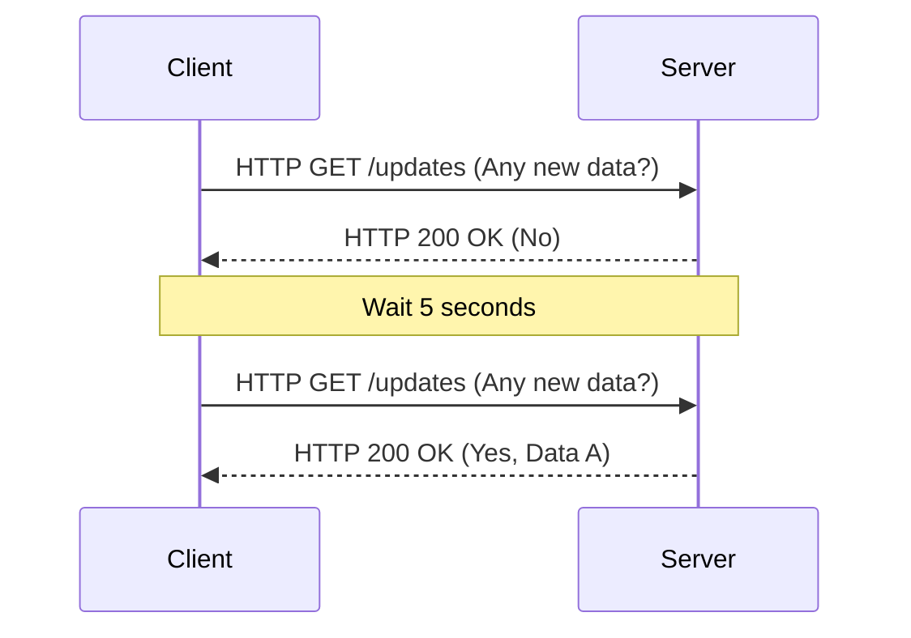
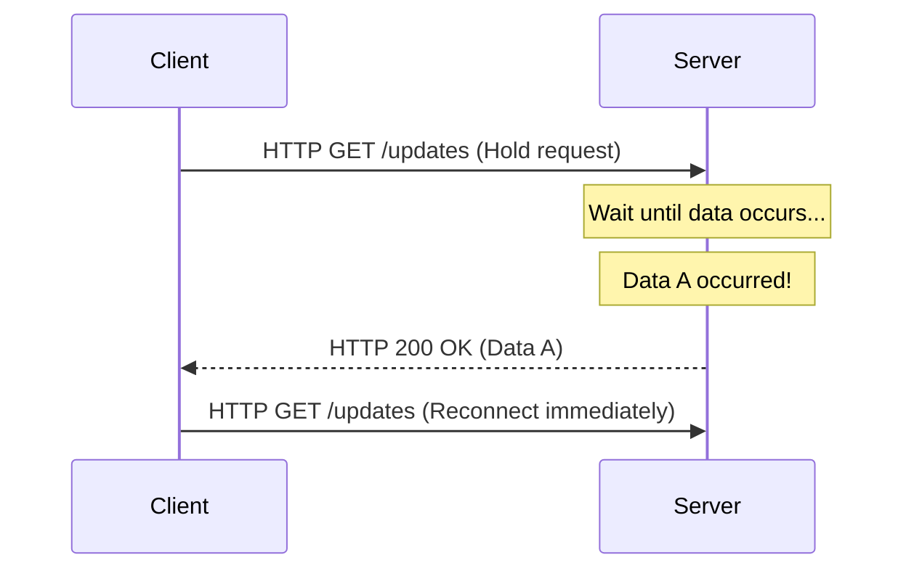
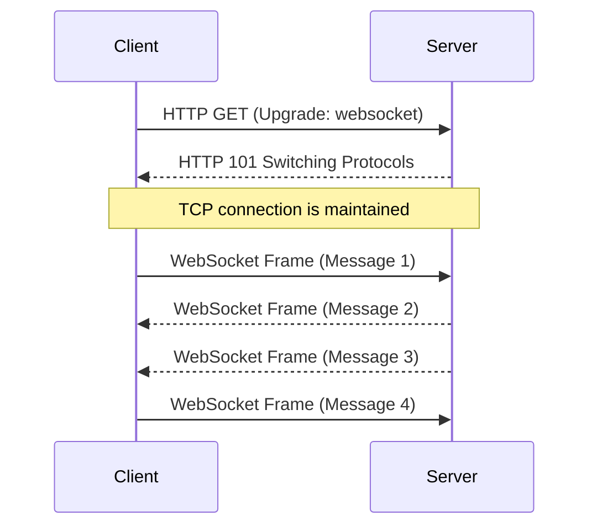
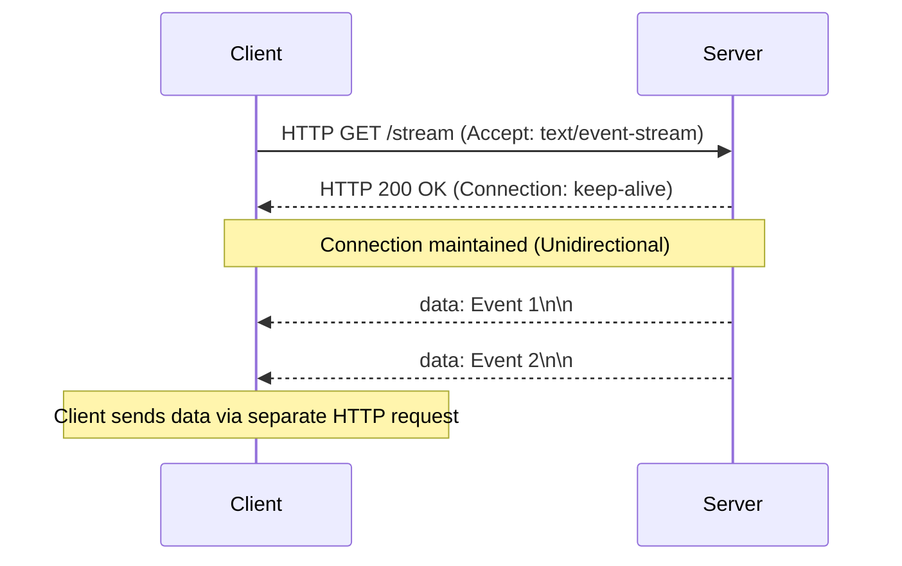

As web applications have evolved from simple collections of static documents to platforms offering rich, interactive experiences, "real-time capability" has become one of the most critical requirements. Modern applications we use every day—such as stock tick data, chat applications, live sports score updates, multiplayer games, or real-time log outputs of CI/CD pipelines—rely on mechanisms that push data instantly from the server to the client.

In this article, we will thoroughly explain the two giants of real-time communication: **WebSocket** and **Server-Sent Events (SSE)**. We will cover their origins, protocol details, scaling challenges, and highly specific guidelines on when to use which.

## The Limits of HTTP and the Dawn of Real-Time Communication

To truly understand the importance of WebSocket and SSE, we must first reflect on the fundamental problem they attempted to solve: the limitations of the traditional HTTP protocol.

### The Stateless Request-Response Model
HTTP (Hypertext Transfer Protocol) adopts a strict "request-response" model where the client sends a request to the server, and the server returns a response. While this was optimal for the early use cases of the web (following links to browse pages), it does not support "server push," where the server actively notifies the client of events that have occurred on the server side.

### The Last Resort: Polling
In the era before server push was supported at the protocol level, developers used a technique called "polling" to pseudo-realize real-time capabilities. This is an approach where the client repeatedly sends a request to the server at regular intervals (e.g., every 5 seconds) asking, "Is there any new data?"



While polling has the advantage of being extremely simple to implement, it has the following severe drawbacks:
1. **Increased Overhead**: Because requests are sent even when there are no data updates, the overhead of HTTP headers accumulates, wasting network bandwidth and server resources.
2. **Latency**: There is a delay of up to the polling interval between an update occurring and the client detecting it.

### Improvement via Long-Polling
To improve the inefficiency of polling, "long-polling" was devised. When the client sends a request, the server "holds the response (keeps the connection open and waits) until new data occurs." The moment data occurs, it returns a response, and the client, upon receiving it, immediately sends the next request.



Although long-polling succeeded in improving immediacy and reducing unnecessary communication, it still uses the HTTP framework. Thus, header overhead is inevitable, and the cost of re-establishing a connection each time data is sent (especially the TLS handshake in an HTTPS environment) remains a non-negligible challenge.

---

## WebSocket: Full Duplex Bidirectional Communication Unleashing the Power of TCP

To fundamentally solve these problems, **WebSocket** emerged. Standardized in RFC 6455, this protocol operates over TCP just like HTTP, but adopts an innovative approach that breaks through HTTP's limitations.

### How the WebSocket Protocol Works
The greatest feature of WebSocket is that once a connection is established, it achieves "Full-Duplex bidirectional communication," where both the client and server can send data at any time using lightweight frames.

#### 1. HTTP Upgrade (Handshake)
A WebSocket connection initially begins as a standard HTTP request. The client uses the `Upgrade` header to request the server to "switch to the WebSocket protocol."

**Request from Client:**
```http
GET /chat HTTP/1.1
Host: server.example.com
Upgrade: websocket
Connection: Upgrade
Sec-WebSocket-Key: dGhlIHNhbXBsZSBub25jZQ==
Sec-WebSocket-Version: 13
```

**Response from Server:**
When the server accepts this request, it returns a status code of `101 Switching Protocols`, agreeing to the protocol switch.
```http
HTTP/1.1 101 Switching Protocols
Upgrade: websocket
Connection: Upgrade
Sec-WebSocket-Accept: s3pPLMBiTxaQ9kYGzzhZRbK+xOo=
```

#### 2. Starting Frame Communication
The moment this handshake is completed, the role of HTTP ends, and the established TCP connection transforms into a bidirectional communication channel of binary/text frames via the WebSocket protocol. From then on, heavy HTTP headers are not attached, enabling data transmission and reception with a minimal overhead of just a few bytes.



### Strengths of WebSocket
- **True Bidirectionality**: Ideal for applications like chats and online games where the client also sends data frequently.
- **Minimal Overhead**: Data transfer efficiency is dramatically improved due to the absence of HTTP headers.
- **Low Latency**: Because the connection is always open, communication is instantaneous without handshake delays.

### Scaling Challenges of WebSocket
However, precisely because it is a powerful protocol, its operation and scaling require advanced techniques.

1. **Stateful Architecture**: Since WebSocket keeps the TCP connection alive, the server must hold the state of each connection in memory. To tackle the "C10K" and "C100K" problems—handling tens to hundreds of thousands of simultaneous connections on a single server—adopting event-driven, non-blocking I/O (Node.js, Go, Netty, etc.) is essential.
2. **Load Balancer and Proxy Configuration**: Many L7 load balancers (Nginx, HAProxy, AWS ALB, etc.) have an idle timeout configured by default that drops connections after a certain period (e.g., 60 seconds). To correctly relay WebSockets, you must explicitly allow protocol upgrades, set longer timeout values, or implement a keep-alive mechanism using Ping/Pong frames at the application level.
3. **State Sharing (During Horizontal Scaling)**: When scaling out across multiple servers, if User A connects to Server 1 and User B connects to Server 2, delivering a chat message requires introducing a mechanism (Redis Pub/Sub, RabbitMQ, Kafka, etc.) to broadcast messages between servers.

---

## Server-Sent Events (SSE): Lightweight Streaming within the HTTP Framework

If WebSocket is the "ultimate weapon for bidirectional communication," then **Server-Sent Events (SSE)** can be called the "elegant optimal solution for unidirectional streaming." SSE was formulated as part of the HTML5 specification and is specialized for push communication from the server to the client (Server-to-Client).

### How the SSE Protocol Works
The greatest feature of SSE is that **instead of introducing a new, complex protocol, it utilizes the existing HTTP/1.1 or HTTP/2 framework as-is.**

#### 1. Simple HTTP Request
The client sends a normal HTTP GET request, but specifies `text/event-stream` in the `Accept` header.

**Request from Client:**
```http
GET /stream HTTP/1.1
Host: server.example.com
Accept: text/event-stream
Cache-Control: no-cache
```

#### 2. Streaming Response
The server returns `Content-Type: text/event-stream` and continues to send text-based event data as chunks without closing the connection.

**Response from Server:**
```http
HTTP/1.1 200 OK
Content-Type: text/event-stream
Cache-Control: no-cache
Connection: keep-alive

data: {"price": 150.25, "symbol": "AAPL"}

event: user_login
data: {"user_id": 12345}

data: Just a simple text message
```



### Strengths of SSE
- **Simplicity and HTTP Affinity**: Existing infrastructure (proxies, load balancers, firewalls) can be utilized as-is. Special configurations like protocol upgrades are unnecessary.
- **Built-in Auto-reconnect**: The browser's `EventSource` API inherently provides features to automatically reconnect when a connection drops, and to resume by transmitting the last received event ID (`Last-Event-ID`) to the server. With WebSocket, this must be implemented manually.
- **Excellent Compatibility with HTTP/2**: HTTP/2 multiplexing allows multiple SSE streams to be handled simultaneously on a single TCP connection, dramatically improving performance (WebSocket extension specifications for HTTP/2 are not yet widely adopted).

### Limitations of SSE
- **Unidirectional Only**: Dedicated strictly to server-to-client communication. If the client needs to send data to the server, standard HTTP POST/PUT requests must be issued separately.
- **Text Data Only**: By default, only UTF-8 text can be sent. Sending binary data requires processing such as Base64 encoding, which introduces overhead.
- **Simultaneous Connection Limits in HTTP/1.1**: In older HTTP/1.1 environments, simultaneous connections to the same domain per browser were limited to 6-8. Opening SSE in multiple tabs would hit this limit, blocking other requests (this is solved in HTTP/2).

---

## Architectural Design: Which Should You Choose?

There is no "silver bullet" in system design. It is essential to select the appropriate technology based on the project's requirements.

### When to Adopt WebSocket
When high-frequency, low-latency, two-way interaction is required between the client and server, WebSocket is the sole choice.

- **Real-time Chat / Collaboration Tools**: Collaborative editing apps like Slack, Discord, or Google Docs.
- **Multiplayer Games**: Low-latency bidirectional communication in milliseconds is required for positional coordinates and player actions.
- **High-frequency IoT Telemetry**: Systems that continuously ingest data from numerous devices while simultaneously pushing commands.

### When to Adopt SSE
In use cases where "the client only receives data (or the client's sending frequency is low)," SSE is recommended as it dramatically lowers implementation and operational costs.

- **Real-time Dashboards / Monitoring**: Stock price tickers, server resource monitoring, log streaming displays.
- **News Feeds / Notification Systems**: SNS timeline updates and push notifications from the system.
- **AI/LLM Response Generation**: Streaming generating text sequentially to the client in LLM applications like ChatGPT (this is a prime example of SSE being utilized in many current AI apps).

### Comparison Summary

| Feature | WebSocket | Server-Sent Events (SSE) |
| :--- | :--- | :--- |
| **Direction** | Full Duplex (Bidirectional) | Unidirectional (Server → Client) |
| **Data Format** | Binary / Text | Text (UTF-8) only |
| **Protocol** | Custom (Over TCP, via HTTP Upgrade) | HTTP/1.1, HTTP/2 |
| **Auto Reconnect** | No (Requires manual implementation) | Yes (EventSource API standard feature) |
| **Infrastructure Affinity**| Low (Requires special LB/Proxy config) | High (Treated as standard HTTP) |
| **Implementation Cost** | High (Complex comm libraries, state mgmt) | Low (Extension of existing HTTP endpoints) |

## Conclusion

In the evolution of the real-time Web, WebSocket and SSE are not mutually exclusive but perfectly complementary.

A careless choice of "just use WebSocket for now" risks causing infrastructure complexity and increased maintenance costs. If the use case involves rare data transmission from the client to the server (for example, client actions are performed via normal REST APIs, and only the broadcast of the results is received), adopting SSE allows the architecture to remain simple while fully reaping the benefits of the existing HTTP ecosystem.

Calmly analyzing system requirements (directionality, frequency, data types, infrastructure environment) and adopting the right technology for the right place will be the key to building robust and scalable modern applications.
