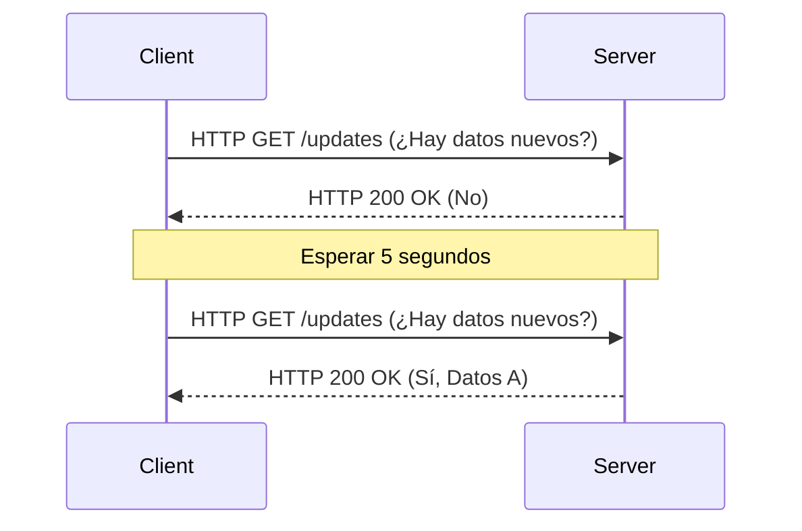
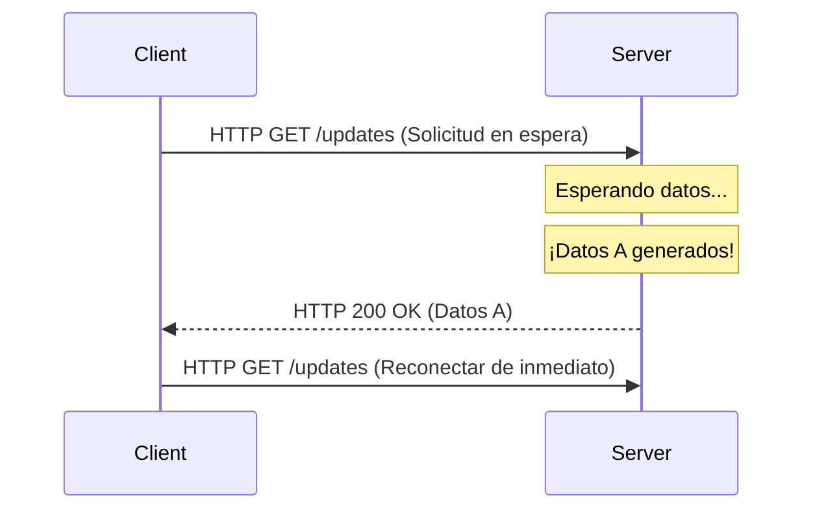
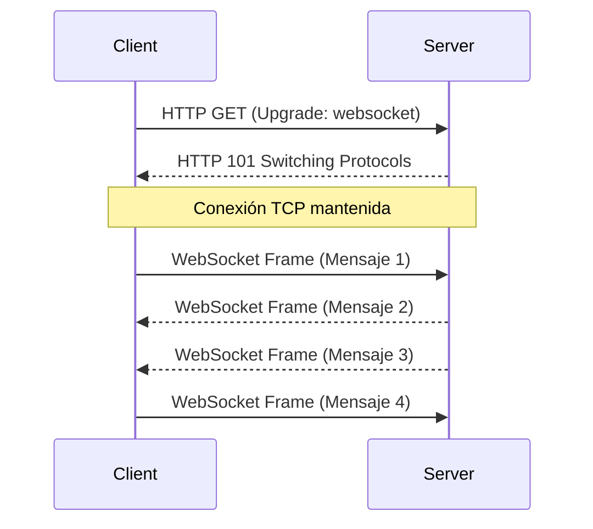
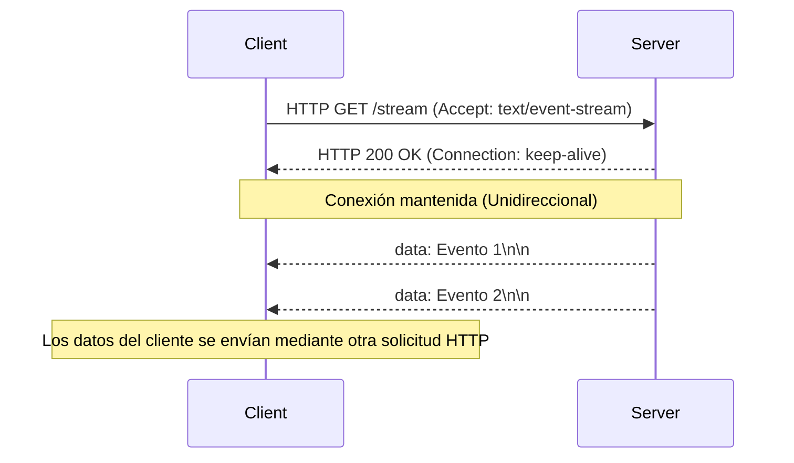

A medida que las aplicaciones web evolucionaron de colecciones de documentos estáticos a plataformas que ofrecen experiencias ricas e interactivas, la "funcionalidad en tiempo real" se convirtió en uno de los requisitos más críticos. Las aplicaciones modernas de las que dependemos diariamente —como datos bursátiles en tiempo real, aplicaciones de chat, actualizaciones de resultados deportivos en vivo, juegos multijugador o logs en tiempo real para pipelines CI/CD— dependen en gran medida de mecanismos que envían datos desde el servidor a los clientes de forma instantánea.

En este artículo, exploraremos en profundidad los dos principales contendientes para lograr esta comunicación en tiempo real: **WebSocket** y **Server-Sent Events (SSE)**. Explicaremos sus orígenes, los detalles del protocolo, los desafíos de escalado y las pautas concretas para decidir cuál usar en cada escenario.

## Los límites de HTTP y los inicios de la comunicación en tiempo real

Para comprender verdaderamente la importancia de WebSocket y SSE, primero debemos revisar los problemas fundamentales que intentaron resolver: las limitaciones del protocolo HTTP tradicional.

### Modelo de solicitud y respuesta sin estado (Stateless)
HTTP (Hypertext Transfer Protocol) emplea un modelo estricto de "solicitud-respuesta", donde el cliente envía una petición al servidor, y este devuelve una respuesta. Esto era ideal para el caso de uso original de la web (seguir enlaces para ver páginas), pero carece de soporte nativo para el "server push" (envío desde el servidor), donde el servidor notifica activamente a los clientes sobre eventos que han ocurrido.

### Sondeo (Polling): Una solución improvisada
Antes de que el envío de datos desde el servidor tuviera soporte a nivel de protocolo, los desarrolladores utilizaban una técnica llamada "Sondeo" (Polling) para simular la interactividad en tiempo real. Este enfoque implica que el cliente envíe solicitudes repetidamente al servidor a intervalos regulares (por ejemplo, cada 5 segundos) preguntando: "¿Hay datos nuevos?".



El sondeo tiene la ventaja de ser extremadamente simple de implementar, pero sufre de desventajas significativas:
1. **Sobrecarga (Overhead) incrementada**: Como se envían solicitudes incluso cuando no hay datos nuevos, la sobrecarga de los encabezados HTTP se acumula, desperdiciando ancho de banda de red y recursos del servidor.
2. **Latencia (Latency)**: Existe un retraso equivalente al intervalo de sondeo como máximo, entre el momento en que ocurre una actualización y el cliente la detecta.

### Mejoras mediante el Sondeo Largo (Long-Polling)
Para mitigar la ineficiencia del sondeo estándar, se introdujo el "Sondeo largo" (Long-Polling). Cuando un cliente envía una solicitud, el servidor "retiene la respuesta (mantiene la conexión abierta)" hasta que haya nuevos datos disponibles. En el momento en que se generan los datos, devuelve la respuesta y el cliente, al recibirla, envía inmediatamente la siguiente solicitud.



Aunque el Long-Polling redujo con éxito las solicitudes innecesarias y mejoró la inmediatez, aún dependía de la estructura de HTTP. La sobrecarga de los encabezados seguía siendo inevitable y el costo de restablecer la conexión para cada transmisión de datos (especialmente el handshake TLS en entornos HTTPS) se mantenía como un problema considerable.

---

## WebSocket: Comunicación bidireccional completa que libera el poder de TCP

Para resolver fundamentalmente estos problemas, surgió **WebSocket**. Estandarizado en RFC 6455, este protocolo opera sobre TCP (al igual que HTTP) pero introduce un enfoque innovador que rompe con las restricciones de HTTP.

### Cómo funciona el protocolo WebSocket
La mayor fortaleza de WebSocket es que, una vez que se establece una conexión, permite una "comunicación bidireccional full-duplex", donde tanto el cliente como el servidor pueden enviar datos en cualquier momento utilizando tramas (frames) ligeras.

#### 1. HTTP Upgrade (Handshake)
Una conexión WebSocket comienza inicialmente como una solicitud HTTP normal. El cliente usa el encabezado `Upgrade` para solicitar al servidor que "cambie al protocolo WebSocket".

**Solicitud del cliente:**
```http
GET /chat HTTP/1.1
Host: server.example.com
Upgrade: websocket
Connection: Upgrade
Sec-WebSocket-Key: dGhlIHNhbXBsZSBub25jZQ==
Sec-WebSocket-Version: 13
```

**Respuesta del servidor:**
Si el servidor acepta esta solicitud, devuelve un código de estado `101 Switching Protocols`, aceptando el cambio de protocolo.
```http
HTTP/1.1 101 Switching Protocols
Upgrade: websocket
Connection: Upgrade
Sec-WebSocket-Accept: s3pPLMBiTxaQ9kYGzzhZRbK+xOo=
```

#### 2. Inicio de la comunicación por tramas (Frames)
En el momento en que se completa este handshake, el rol de HTTP termina. La conexión TCP establecida se transforma en un canal bidireccional que utiliza tramas binarias o de texto basadas en el protocolo WebSocket. A partir de entonces, no se adjuntan encabezados HTTP pesados y los datos se pueden transmitir con una sobrecarga mínima de unos pocos bytes.



### Fortalezas de WebSocket
- **Bidireccionalidad completa**: Ideal para casos de uso como el chat y los juegos en línea, donde los clientes también envían datos con alta frecuencia.
- **Sobrecarga mínima**: Al no haber encabezados HTTP, la eficiencia de transferencia de datos mejora drásticamente.
- **Baja latencia**: Al mantener una conexión persistente, la comunicación puede ocurrir de forma instantánea sin retrasos por handshake.

### Desafíos de escalado de WebSocket
Sin embargo, debido a que es un protocolo tan poderoso, operarlo y escalarlo requiere técnicas avanzadas.

1. **Arquitectura con estado (Stateful)**: Dado que WebSocket mantiene conexiones TCP, el servidor debe conservar el estado de cada conexión en la memoria. Para manejar decenas o cientos de miles de conexiones concurrentes en un solo servidor (el problema C10K/C100K), es esencial utilizar un modelo de E/S no bloqueante impulsado por eventos (por ejemplo, Node.js, Go, Netty).
2. **Configuración de balanceadores de carga y proxies**: Muchos balanceadores de carga L7 (Nginx, HAProxy, AWS ALB, etc.) tienen un tiempo de espera de inactividad (idle timeout) predeterminado que cierra las conexiones después de cierto tiempo (por ejemplo, 60 segundos). Para enrutar WebSocket correctamente, debes permitir explícitamente la actualización del protocolo, aumentar el tiempo de espera o implementar un mecanismo keep-alive usando tramas Ping/Pong a nivel de aplicación.
3. **Compartir estado (Escalado horizontal)**: Al escalar horizontalmente a través de múltiples servidores, si el Usuario A está conectado al Servidor 1 y el Usuario B al Servidor 2, enviar un mensaje de chat requiere implementar un mecanismo de transmisión (broadcasting) de mensajes entre servidores (usando Redis Pub/Sub, RabbitMQ, Kafka, etc.).

---

## Server-Sent Events (SSE): Streaming ligero dentro del marco de trabajo HTTP

Si WebSocket es el "arma definitiva de la comunicación bidireccional", entonces **Server-Sent Events (SSE)** puede considerarse "la solución óptima y elegante para el streaming unidireccional". SSE se estandarizó como parte de la especificación HTML5 y está diseñado específicamente para el envío de información del servidor al cliente (Server-to-Client push).

### Cómo funciona el protocolo SSE
La mayor ventaja de SSE es que **no introduce un protocolo nuevo y complejo, sino que aprovecha la infraestructura existente de HTTP/1.1 y HTTP/2 tal cual**.

#### 1. Solicitud HTTP simple
El cliente envía una solicitud HTTP GET regular pero especifica `text/event-stream` en el encabezado `Accept`.

**Solicitud del cliente:**
```http
GET /stream HTTP/1.1
Host: server.example.com
Accept: text/event-stream
Cache-Control: no-cache
```

#### 2. Respuesta en streaming
El servidor responde con `Content-Type: text/event-stream` y continúa enviando datos de eventos basados en texto en fragmentos (chunks) sin cerrar la conexión.

**Respuesta del servidor:**
```http
HTTP/1.1 200 OK
Content-Type: text/event-stream
Cache-Control: no-cache
Connection: keep-alive

data: {"price": 150.25, "symbol": "AAPL"}

event: user_login
data: {"user_id": 12345}

data: Solo un mensaje de texto plano
```



### Fortalezas de SSE
- **Simplicidad y compatibilidad con HTTP**: Puede aprovechar tu infraestructura actual (proxies, balanceadores de carga, firewalls) sin modificaciones. No requiere configuraciones especiales como actualizaciones de protocolo.
- **Reconexión automática integrada**: La API `EventSource` proporcionada por los navegadores incluye de forma nativa la reconexión automática si la conexión se interrumpe y la capacidad de reanudar la transmisión enviando el último ID de evento recibido (`Last-Event-ID`) al servidor. Lograr esto con WebSocket requiere una implementación personalizada.
- **Excelente compatibilidad con HTTP/2**: Las capacidades de multiplexación de HTTP/2 permiten manejar múltiples transmisiones SSE simultáneamente en una sola conexión TCP, mejorando drásticamente el rendimiento (la extensión para ejecutar WebSocket sobre HTTP/2 aún no está ampliamente adoptada).

### Limitaciones de SSE
- **Solo unidireccional**: Es estrictamente para la comunicación del servidor al cliente. Si el cliente necesita enviar datos al servidor, debe emitir solicitudes HTTP POST/PUT estándar por separado.
- **Solo texto**: Por defecto, solo puede enviar texto UTF-8. Para enviar datos binarios, debes usar codificación Base64, lo que introduce sobrecarga.
- **Límites de conexión concurrente en HTTP/1.1**: En entornos antiguos de HTTP/1.1, los navegadores limitent el número de conexiones simultáneas al mismo dominio a 6-8. Si abres conexiones SSE en múltiples pestañas, puedes alcanzar este límite y bloquear otras solicitudes (este problema se resuelve en HTTP/2).

---

## Diseño de arquitectura: ¿Cuál deberías elegir?

En el diseño de sistemas no existe una "bala de plata". Es crucial elegir la tecnología adecuada basada en los requerimientos del proyecto.

### Cuándo elegir WebSocket
Si se requiere una interacción bidireccional de alta frecuencia y baja latencia entre el cliente y el servidor, WebSocket es la elección indiscutible.

- **Herramientas de colaboración/chat en tiempo real**: Aplicaciones de edición colaborativa como Slack, Discord o Google Docs.
- **Juegos multijugador**: Requiere comunicación bidireccional de baja latencia a nivel de milisegundos para sincronizar coordenadas de posición, acciones de los jugadores, etc.
- **Telemetría IoT de alta frecuencia**: Sistemas que recopilan continuamente datos de numerosos dispositivos mientras envían comandos simultáneamente.

### Cuándo elegir SSE
En casos de uso donde "el cliente principalmente recibe datos (o la frecuencia de envío de datos por parte del cliente es baja)", SSE es muy recomendable, ya que reduce drásticamente los costos de implementación y operación.

- **Paneles de control (Dashboards)/Monitoreo en tiempo real**: Tickers de cotizaciones bursátiles, monitoreo de recursos de servidores, visualización de logs en streaming.
- **Notificaciones/Feeds de noticias**: Actualizaciones de línea de tiempo de redes sociales o notificaciones push del sistema.
- **Generación de respuestas AI/LLM**: Streaming de texto generado carácter por carácter al cliente en aplicaciones LLM como ChatGPT (este es un ejemplo perfecto de dónde se utiliza ampliamente SSE hoy en día).

### Resumen de comparación

| Característica | WebSocket | Server-Sent Events (SSE) |
| :--- | :--- | :--- |
| **Dirección de comunicación** | Full-duplex (Bidireccional) | Unidireccional (Servidor → Cliente) |
| **Formato de datos** | Binario / Texto | Solo Texto (UTF-8) |
| **Protocolo** | Personalizado (sobre TCP, vía HTTP Upgrade) | HTTP/1.1, HTTP/2 |
| **Reconexión automática** | No (Requiere implementación personalizada) | Sí (Función estándar de API EventSource) |
| **Afinidad de infraestructura** | Baja (Requiere configuración especial en LB/Proxy) | Alta (Se maneja como HTTP estándar) |
| **Costo de implementación** | Alto (Librerías de comunicación complejas, manejo de estado) | Bajo (Extensión de endpoints HTTP existentes) |

## Conclusión

En la evolución de la web en tiempo real, WebSocket y SSE no compiten para reemplazarse mutuamente, sino que forman una relación maravillosamente complementaria.

Adoptar la mentalidad de "simplemente usa WebSocket para todo" conlleva el riesgo de complicar la infraestructura y aumentar los costos de mantenimiento. Si tu caso de uso involucra un envío de datos del cliente al servidor poco frecuente (por ejemplo, las acciones del cliente se manejan a través de REST APIs regulares y solo se reciben los broadcasts resultantes), adoptar SSE te permite mantener tu arquitectura simple mientras maximizas los beneficios del ecosistema HTTP existente.

Analizar objetivamente los requerimientos de tu sistema (dirección, frecuencia, formato de datos, entorno de infraestructura) y seleccionar la tecnología adecuada para el trabajo adecuado será la clave para construir aplicaciones modernas sólidas y escalables.
