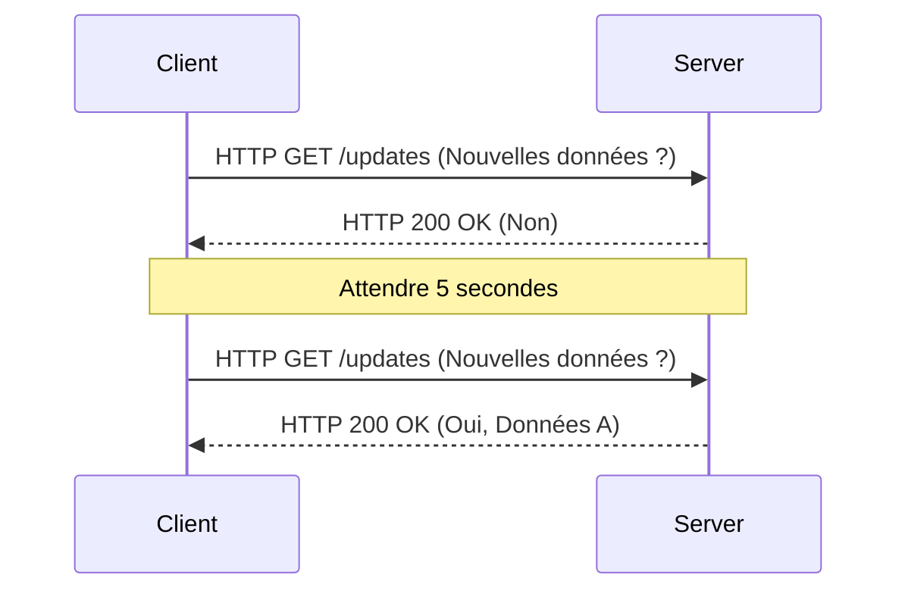
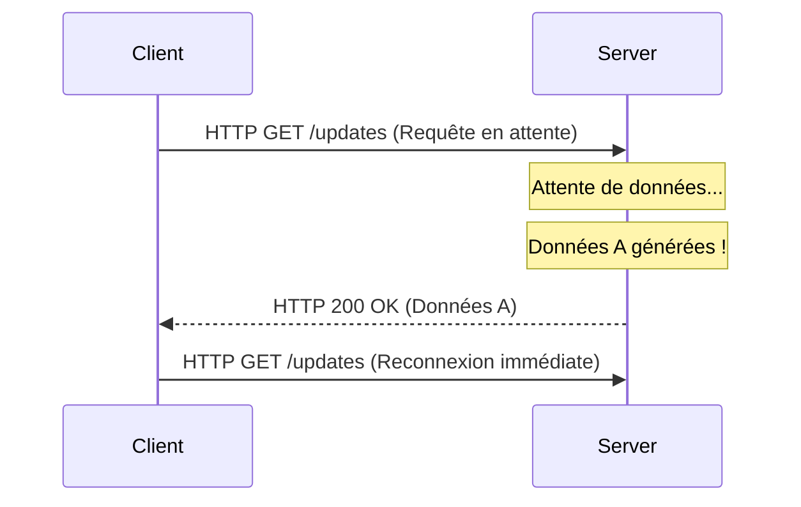
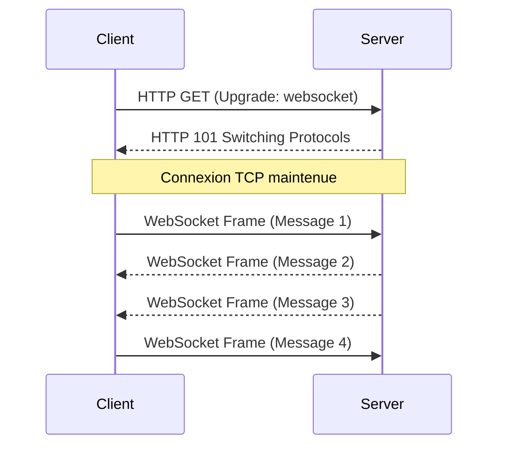
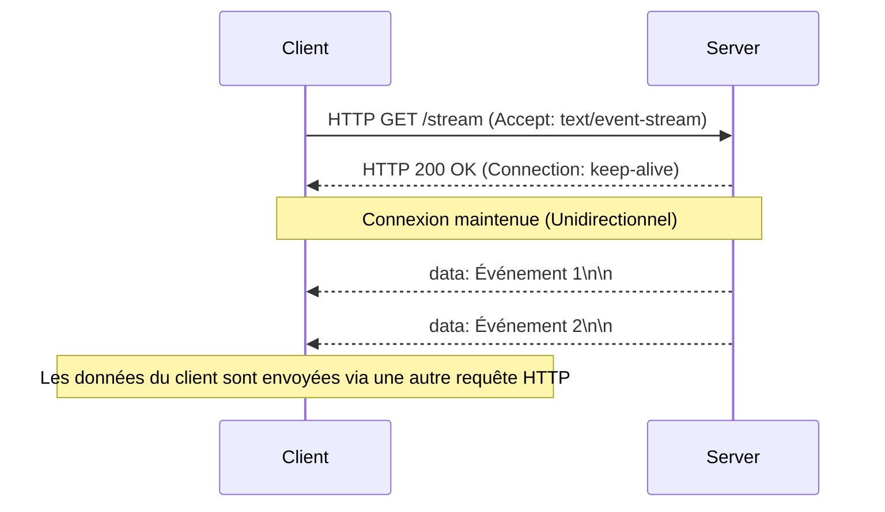

Alors que les applications Web sont passées de simples collections de documents statiques à des plateformes offrant des expériences riches et interactives, le "temps réel" est devenu l'une des exigences les plus importantes. Les applications modernes que nous utilisons quotidiennement — telles que les données boursières, les applications de messagerie, les mises à jour des scores sportifs en direct, les jeux multijoueurs ou les logs en temps réel des pipelines CI/CD — dépendent de mécanismes permettant de pousser instantanément les données du serveur vers le client.

Dans cet article, nous explorerons en détail les deux principaux piliers permettant de réaliser cette communication en temps réel : **WebSocket** et **Server-Sent Events (SSE)**. Nous analyserons leurs origines, les détails des protocoles, les défis de mise à l'échelle (scaling) et les directives précises pour les utiliser à bon escient.

## Les limites de HTTP et les débuts du temps réel

Pour comprendre véritablement l'importance de WebSocket et SSE, nous devons d'abord revenir sur les problèmes fondamentaux qu'ils ont tenté de résoudre, à savoir les limites du protocole HTTP traditionnel.

### Modèle requête-réponse sans état (Stateless)
HTTP (Hypertext Transfer Protocol) utilise un modèle strict de type "requête-réponse", où le client envoie une requête au serveur et le serveur renvoie une réponse. Cela était idéal pour le cas d'utilisation initial du Web (suivre des liens pour naviguer sur des pages), mais ce modèle ne prend pas en charge le "server push" (poussée depuis le serveur), par lequel le serveur informe activement les clients des événements qui se produisent.

### Le Polling (Sondage) : une solution de contournement
À l'époque où le "push" du serveur n'était pas pris en charge au niveau du protocole, les développeurs utilisaient une technique appelée "Polling" pour simuler le temps réel. Cette approche consiste pour le client à envoyer de manière répétée des requêtes au serveur à des intervalles réguliers (par exemple, toutes les 5 secondes) pour demander : "Y a-t-il de nouvelles données ?".



Le polling présente l'avantage d'être extrêmement simple à implémenter, mais il souffre d'inconvénients majeurs :
1. **Surcharge accrue (Overhead)** : Les requêtes étant envoyées même en l'absence de nouvelles données, la surcharge des en-têtes HTTP s'accumule, gaspillant ainsi la bande passante réseau et les ressources du serveur.
2. **Latence** : Il existe un délai, pouvant aller jusqu'à l'intervalle de polling, entre le moment où une mise à jour se produit et le moment où le client la détecte.

### Amélioration grâce au Long-Polling
Pour pallier l'inefficacité du polling, le "Long-Polling" (sondage long) a été inventé. Lorsqu'un client envoie une requête, le serveur "met la réponse en attente (garde la connexion ouverte)" jusqu'à ce que de nouvelles données soient disponibles. Dès que les données apparaissent, le serveur renvoie la réponse et le client, dès réception, envoie immédiatement la requête suivante.



Bien que le Long-Polling ait réussi à améliorer l'immédiateté et à réduire les communications inutiles, il utilisait toujours le cadre HTTP. La surcharge des en-têtes restait inévitable, et le coût de rétablissement de la connexion pour chaque transmission de données (notamment le handshake TLS en environnement HTTPS) constituait un problème non négligeable.

---

## WebSocket : Libérer la puissance de TCP pour une communication bidirectionnelle complète

Pour résoudre fondamentalement ces problèmes, **WebSocket** a fait son apparition. Standardisé dans la RFC 6455, ce protocole fonctionne sur TCP (tout comme HTTP), mais adopte une approche novatrice qui brise les restrictions de HTTP.

### Fonctionnement du protocole WebSocket
La plus grande force de WebSocket est qu'une fois la connexion établie, il permet une communication "full-duplex" (bidirectionnelle), où le client et le serveur peuvent envoyer des données à tout moment en utilisant des trames (frames) légères.

#### 1. HTTP Upgrade (Handshake)
La connexion WebSocket commence comme une requête HTTP classique. Le client utilise l'en-tête `Upgrade` pour demander au serveur de "passer au protocole WebSocket".

**Requête du client :**
```http
GET /chat HTTP/1.1
Host: server.example.com
Upgrade: websocket
Connection: Upgrade
Sec-WebSocket-Key: dGhlIHNhbXBsZSBub25jZQ==
Sec-WebSocket-Version: 13
```

**Réponse du serveur :**
Si le serveur accepte cette demande, il renvoie un code de statut `101 Switching Protocols`, acceptant le changement de protocole.
```http
HTTP/1.1 101 Switching Protocols
Upgrade: websocket
Connection: Upgrade
Sec-WebSocket-Accept: s3pPLMBiTxaQ9kYGzzhZRbK+xOo=
```

#### 2. Début de la communication par trames
Dès que ce handshake est terminé, le rôle de HTTP s'achève. La connexion TCP établie se transforme en un canal de communication bidirectionnel pour les trames binaires ou textuelles du protocole WebSocket. Par la suite, les lourds en-têtes HTTP ne sont plus attachés, et les données peuvent être transmises avec une surcharge minimale de quelques octets.



### Avantages de WebSocket
- **Bidirectionnalité totale** : Idéal pour les cas d'utilisation comme les chats ou les jeux en ligne, où le client envoie également des données très fréquemment.
- **Surcharge minimale** : En l'absence d'en-têtes HTTP, l'efficacité du transfert de données est considérablement améliorée.
- **Faible latence** : La connexion étant maintenue en permanence, la communication peut s'effectuer instantanément sans le délai d'un handshake.

### Défis liés à la mise à l'échelle (Scaling) de WebSocket
Cependant, étant un protocole puissant, sa gestion et sa mise à l'échelle nécessitent une expertise technique avancée.

1. **Architecture Stateful (avec état)** : Puisque WebSocket maintient la connexion TCP, le serveur doit conserver l'état de chaque connexion en mémoire. Pour gérer des dizaines voire des centaines de milliers de connexions simultanées sur un seul serveur (problème C10K/C100K), l'utilisation d'une architecture d'E/S non bloquante orientée événements (Node.js, Go, Netty, etc.) est indispensable.
2. **Configuration des Load Balancers et Proxys** : De nombreux équilibreurs de charge L7 (Nginx, HAProxy, AWS ALB, etc.) ont un délai d'inactivité (idle timeout) par défaut qui coupe la connexion après un certain temps (ex. 60 secondes). Pour relayer correctement WebSocket, il faut autoriser explicitement la mise à niveau du protocole, allonger le délai d'expiration, ou implémenter un mécanisme de keep-alive au niveau applicatif en utilisant des trames Ping/Pong.
3. **Partage de l'état (Scaling horizontal)** : Lors de l'ajout de plusieurs serveurs, si l'Utilisateur A est connecté au Serveur 1 et l'Utilisateur B au Serveur 2, pour délivrer un message de chat, il faut introduire un mécanisme de diffusion (broadcast) entre les serveurs (Redis Pub/Sub, RabbitMQ, Kafka, etc.).

---

## Server-Sent Events (SSE) : Streaming léger grâce au cadre HTTP

Si WebSocket est l'"arme ultime pour la communication bidirectionnelle", alors **Server-Sent Events (SSE)** peut être considéré comme "la solution élégante pour le streaming unidirectionnel". SSE a été standardisé dans les spécifications HTML5 et est spécifiquement conçu pour pousser les données du serveur vers le client (Server-to-Client).

### Fonctionnement du protocole SSE
La grande force de SSE est qu'**il n'introduit pas un nouveau protocole complexe, mais utilise simplement le cadre HTTP/1.1 ou HTTP/2 existant**.

#### 1. Requête HTTP simple
Le client envoie une requête HTTP GET normale, mais spécifie `text/event-stream` dans l'en-tête `Accept`.

**Requête du client :**
```http
GET /stream HTTP/1.1
Host: server.example.com
Accept: text/event-stream
Cache-Control: no-cache
```

#### 2. Réponse en streaming
Le serveur renvoie un `Content-Type: text/event-stream` et continue d'envoyer des données d'événement basées sur du texte par morceaux (chunks) sans fermer la connexion.

**Réponse du serveur :**
```http
HTTP/1.1 200 OK
Content-Type: text/event-stream
Cache-Control: no-cache
Connection: keep-alive

data: {"price": 150.25, "symbol": "AAPL"}

event: user_login
data: {"user_id": 12345}

data: Un simple message texte
```



### Avantages de SSE
- **Simplicité et affinité avec HTTP** : Permet d'utiliser l'infrastructure existante (proxys, load balancers, pare-feux) sans modification. Il ne nécessite aucun paramètre spécial comme la mise à niveau du protocole.
- **Reconnexion automatique intégrée** : L'API `EventSource` fournie par les navigateurs inclut par défaut une fonction de reconnexion automatique en cas de coupure de la connexion, ainsi que la capacité de reprendre le flux en transmettant le dernier identifiant d'événement reçu (`Last-Event-ID`). Avec WebSocket, cela doit être implémenté manuellement.
- **Excellente synergie avec HTTP/2** : La fonction de multiplexage de HTTP/2 permet de gérer simultanément plusieurs flux SSE sur une seule connexion TCP, ce qui améliore considérablement les performances (l'extension pour faire fonctionner WebSocket sur HTTP/2 n'est pas encore très répandue).

### Limites de SSE
- **Unidirectionnel uniquement** : Strictement réservé à la communication serveur vers client. Pour envoyer des données du client vers le serveur, des requêtes HTTP POST/PUT distinctes doivent être émises.
- **Texte uniquement** : Par défaut, il ne peut envoyer que du texte UTF-8. Pour transmettre des données binaires, un encodage Base64 (ou autre) est requis, ce qui crée une surcharge.
- **Limites de connexions simultanées sous HTTP/1.1** : Dans les anciens environnements HTTP/1.1, les navigateurs limitent les connexions simultanées au même domaine à 6-8. L'ouverture de SSE dans de multiples onglets peut saturer cette limite et bloquer d'autres requêtes (ce problème est résolu avec HTTP/2).

---

## Conception de l'architecture : Lequel choisir ?

Dans la conception d'un système, il n'y a pas de "solution miracle" universelle. Il est crucial de choisir la technologie appropriée en fonction des exigences du projet.

### Quand adopter WebSocket
Si une interaction à haute fréquence et à faible latence est nécessaire entre le client et le serveur, WebSocket est le choix évident.

- **Outils de chat/collaboration en temps réel** : Applications de coédition telles que Slack, Discord ou Google Docs.
- **Jeux multijoueurs** : La communication bidirectionnelle avec une latence de l'ordre de la milliseconde est requise pour la synchronisation des coordonnées de position, les actions des joueurs, etc.
- **Télémétrie IoT à haute fréquence** : Systèmes qui recueillent en continu des données de nombreux appareils tout en poussant des commandes simultanément.

### Quand adopter SSE
Dans les cas d'utilisation où "le client reçoit principalement des données (ou la fréquence d'envoi de données par le client est faible)", SSE est fortement recommandé pour réduire drastiquement les coûts d'implémentation et de gestion.

- **Tableaux de bord (Dashboards)/Monitoring en temps réel** : Tickers d'actions, surveillance des ressources serveur, affichage en continu de logs.
- **Flux d'actualités/Systèmes de notifications** : Mises à jour du fil d'actualité sur les réseaux sociaux ou notifications push système.
- **Génération de réponses de l'IA (LLM)** : Le streaming du texte généré au fur et à mesure vers le client dans des applications LLM comme ChatGPT (c'est un excellent exemple de l'utilisation actuelle très répandue de SSE).

### Résumé comparatif

| Caractéristique | WebSocket | Server-Sent Events (SSE) |
| :--- | :--- | :--- |
| **Direction de communication** | Full-duplex (Bidirectionnel) | Unidirectionnel (Serveur → Client) |
| **Format des données** | Binaire / Texte | Texte (UTF-8) uniquement |
| **Protocole** | Spécifique (sur TCP, via HTTP Upgrade) | HTTP/1.1, HTTP/2 |
| **Reconnexion automatique** | Non (Implémentation manuelle requise) | Oui (Fonction standard de l'API EventSource) |
| **Affinité Infrastructure** | Faible (Configuration spéciale LB/Proxy requise) | Élevée (Traité comme du HTTP standard) |
| **Coût d'implémentation** | Élevé (Bibliothèques complexes, gestion d'état) | Faible (Extension d'endpoints HTTP existants) |

## Conclusion

Dans l'évolution du Web en temps réel, WebSocket et SSE ne s'excluent pas mutuellement, mais entretiennent plutôt une merveilleuse relation de complémentarité.

Faire le choix de "simplement utiliser WebSocket pour tout" comporte le risque de compliquer l'infrastructure et d'augmenter les coûts de maintenance. Si votre cas d'utilisation implique de rares transmissions de données du client vers le serveur (par exemple, les actions du client sont effectuées via une API REST classique, et vous ne recevez que le broadcast des résultats), l'adoption de SSE vous permet de garder une architecture simple tout en tirant pleinement parti de l'écosystème HTTP existant.

Analyser objectivement les exigences de votre système (direction, fréquence, type de données, infrastructure environnementale) et sélectionner la technologie appropriée à la situation sera la clé pour construire des applications modernes robustes et scalables.
