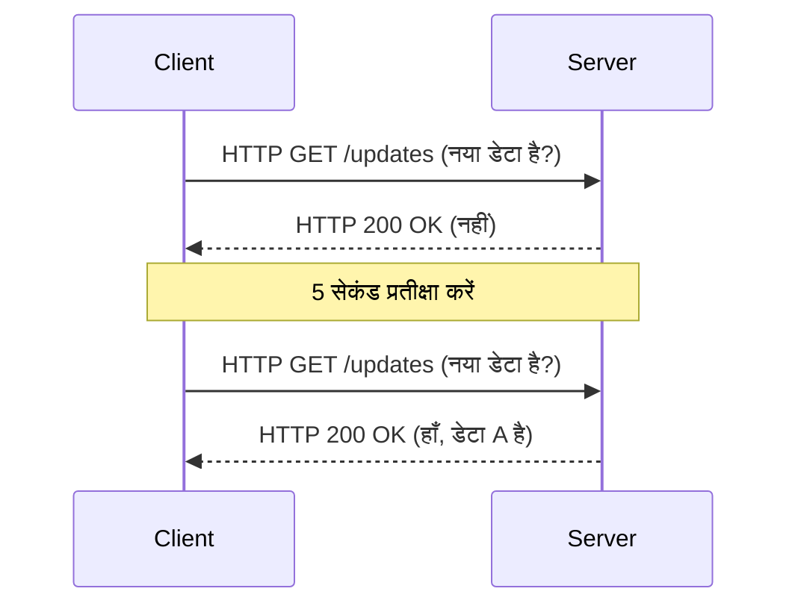
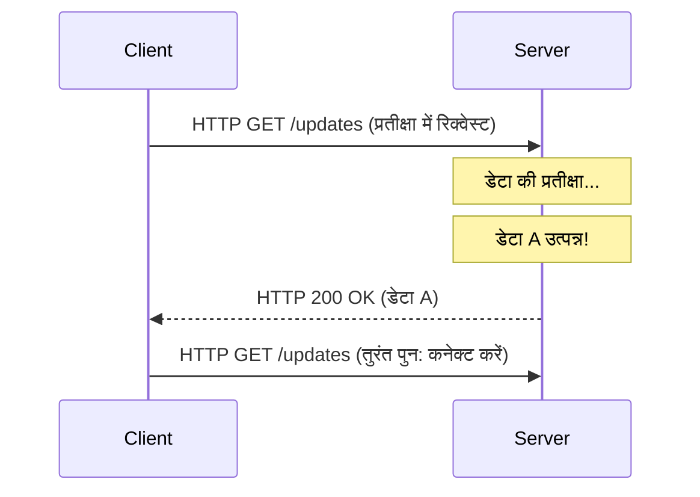
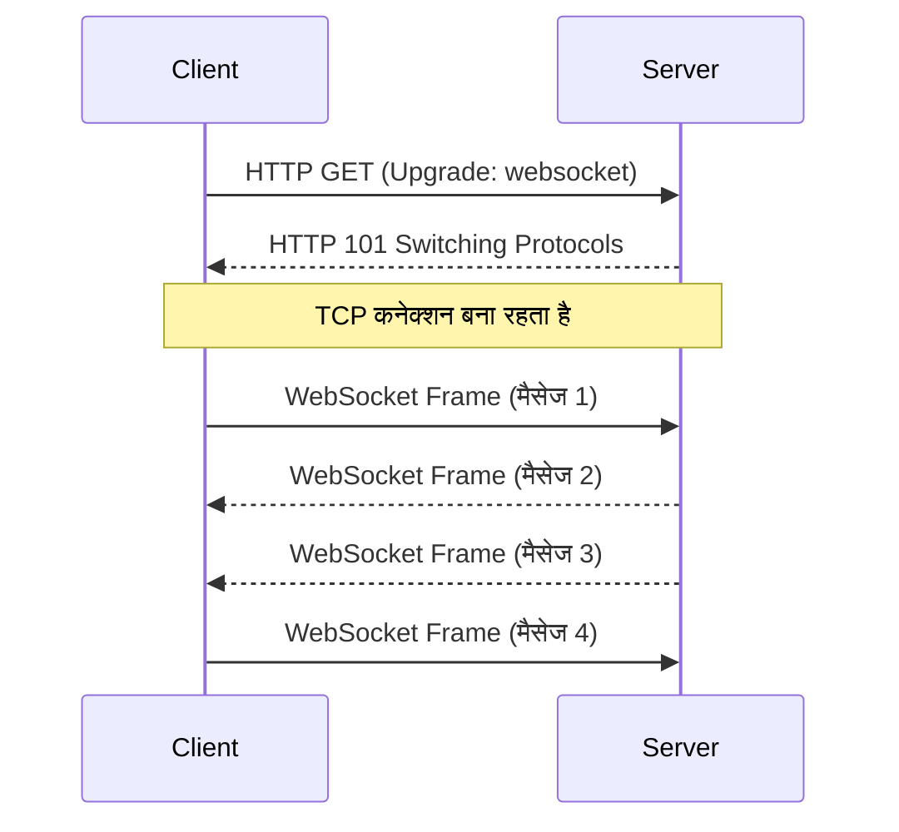
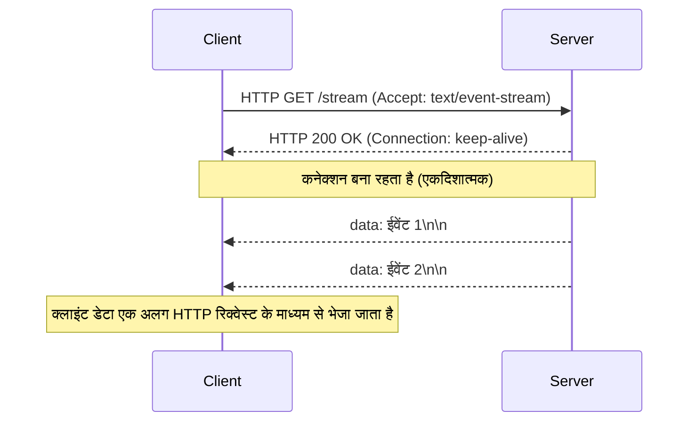

जैसे-जैसे वेब एप्लिकेशन केवल स्थिर दस्तावेज़ों के संग्रह से एक ऐसे प्लेटफॉर्म में विकसित हुए हैं जो समृद्ध और इंटरैक्टिव अनुभव प्रदान करते हैं, "रियल-टाइम" कार्यक्षमता सबसे महत्वपूर्ण आवश्यकताओं में से एक बन गई है। आधुनिक एप्लिकेशन जिनका हम प्रतिदिन उपयोग करते हैं—जैसे स्टॉक टिक डेटा, चैट एप्लिकेशन, लाइव स्पोर्ट्स स्कोर अपडेट, मल्टीप्लेयर गेम, या CI/CD पाइपलाइन के लिए रियल-टाइम लॉग आउटपुट—सर्वर से क्लाइंट तक तुरंत डेटा पुश करने वाले तंत्र पर बहुत अधिक निर्भर करते हैं।

इस लेख में, हम इस रियल-टाइम संचार को प्राप्त करने वाले दो प्रमुख दिग्गजों: **WebSocket** और **Server-Sent Events (SSE)** के बारे में विस्तार से जानेंगे। हम उनके मूल, प्रोटोकॉल विवरण, स्केलिंग चुनौतियों और उन्हें कब उपयोग करना है, इसके बारे में सटीक दिशानिर्देशों पर चर्चा करेंगे।

## HTTP की सीमाएँ और रियल-टाइम संचार की शुरुआत

WebSocket और SSE के महत्व को सही मायने में समझने के लिए, हमें पहले उन मूलभूत समस्याओं को देखना होगा जिन्हें उन्होंने हल करने का प्रयास किया: पारंपरिक HTTP प्रोटोकॉल की सीमाएँ।

### स्टेटलेस (Stateless) रिक्वेस्ट-रिस्पॉन्स मॉडल
HTTP (Hypertext Transfer Protocol) एक सख्त "रिक्वेस्ट-रिस्पॉन्स" मॉडल का उपयोग करता है, जहां क्लाइंट सर्वर को एक रिक्वेस्ट भेजता है, और सर्वर एक रिस्पॉन्स देता है। यह वेब के शुरुआती उपयोग (पेज देखने के लिए लिंक पर क्लिक करना) के लिए एकदम सही था, लेकिन इसमें "सर्वर पुश" (server push) के लिए कोई नेटिव सपोर्ट नहीं है, जहां सर्वर सक्रिय रूप से क्लाइंट को ईवेंट्स के बारे में सूचित करता है।

### पोलिंग (Polling): एक कामचलाऊ समाधान
उस समय में जब प्रोटोकॉल स्तर पर सर्वर पुश का समर्थन नहीं किया गया था, डेवलपर्स ने रियल-टाइम अनुभव का अनुकरण करने के लिए "पोलिंग" नामक तकनीक का उपयोग किया। इस दृष्टिकोण में क्लाइंट नियमित अंतराल पर (जैसे हर 5 सेकंड में) सर्वर को बार-बार रिक्वेस्ट भेजकर पूछता है: "क्या कोई नया डेटा है?"।



पोलिंग को लागू करना बहुत आसान है, लेकिन इसकी बड़ी कमियां हैं:
1. **ओवरहेड में वृद्धि**: चूंकि डेटा अपडेट न होने पर भी रिक्वेस्ट भेजी जाती हैं, HTTP हेडर ओवरहेड जमा हो जाता है, जिससे नेटवर्क बैंडविड्थ और सर्वर संसाधनों की बर्बादी होती है।
2. **लेटेंसी (Latency)**: अपडेट होने और क्लाइंट द्वारा इसका पता लगाने के बीच अधिकतम पोलिंग अंतराल के बराबर देरी होती है।

### लॉन्ग-पोलिंग (Long-Polling) द्वारा सुधार
मानक पोलिंग की अक्षमता को कम करने के लिए, "लॉन्ग-पोलिंग" का आविष्कार किया गया। जब कोई क्लाइंट रिक्वेस्ट भेजता है, तो सर्वर "रिस्पॉन्स को होल्ड करता है (कनेक्शन को खुला रखता है)" जब तक कि नया डेटा उपलब्ध न हो जाए। जैसे ही डेटा उत्पन्न होता है, यह रिस्पॉन्स देता है, और क्लाइंट इसे प्राप्त करते ही तुरंत अगली रिक्वेस्ट भेजता है।



हालांकि लॉन्ग-पोलिंग ने तुरंत डेटा प्राप्त करने में सुधार किया और व्यर्थ रिक्वेस्ट्स को कम किया, फिर भी इसने HTTP ढांचे का ही उपयोग किया। हेडर ओवरहेड अभी भी अपरिहार्य था, और प्रत्येक डेटा ट्रांसमिशन के लिए कनेक्शन को फिर से स्थापित करने की लागत (विशेषकर HTTPS वातावरण में TLS हैंडशेक) एक बड़ी समस्या बनी रही।

---

## WebSocket: TCP की शक्ति को मुक्त करने वाला पूर्ण द्विदिशात्मक संचार (Bidirectional Communication)

इन समस्याओं को मौलिक रूप से हल करने के लिए **WebSocket** का उदय हुआ। RFC 6455 में मानकीकृत यह प्रोटोकॉल HTTP की तरह TCP पर चलता है, लेकिन यह एक अभिनव दृष्टिकोण अपनाता है जो HTTP के प्रतिबंधों को तोड़ता है।

### WebSocket प्रोटोकॉल कैसे काम करता है
WebSocket की सबसे बड़ी विशेषता यह है कि, एक बार कनेक्शन स्थापित हो जाने पर, यह "पूर्ण-डुप्लेक्स (full-duplex) द्विदिशात्मक संचार" को सक्षम करता है, जहां क्लाइंट और सर्वर दोनों लाइटवेट फ्रेम का उपयोग करके किसी भी समय डेटा भेज सकते हैं।

#### 1. HTTP अपग्रेड (Handshake)
WebSocket कनेक्शन शुरू में एक सामान्य HTTP रिक्वेस्ट के रूप में शुरू होता है। क्लाइंट सर्वर से "WebSocket प्रोटोकॉल पर स्विच करने" का अनुरोध करने के लिए `Upgrade` हेडर का उपयोग करता है।

**क्लाइंट से रिक्वेस्ट:**
```http
GET /chat HTTP/1.1
Host: server.example.com
Upgrade: websocket
Connection: Upgrade
Sec-WebSocket-Key: dGhlIHNhbXBsZSBub25jZQ==
Sec-WebSocket-Version: 13
```

**सर्वर से रिस्पॉन्स:**
यदि सर्वर इस रिक्वेस्ट को स्वीकार करता है, तो वह प्रोटोकॉल स्विचिंग पर सहमति जताते हुए `101 Switching Protocols` स्टेटस कोड देता है।
```http
HTTP/1.1 101 Switching Protocols
Upgrade: websocket
Connection: Upgrade
Sec-WebSocket-Accept: s3pPLMBiTxaQ9kYGzzhZRbK+xOo=
```

#### 2. फ्रेम संचार का आरंभ
जैसे ही यह हैंडशेक पूरा होता है, HTTP की भूमिका समाप्त हो जाती है। स्थापित TCP कनेक्शन WebSocket प्रोटोकॉल का उपयोग करके बाइनरी/टेक्स्ट फ्रेम के लिए दो-तरफ़ा संचार चैनल में बदल जाता है। इसके बाद, कोई भारी HTTP हेडर नहीं जोड़ा जाता है, और डेटा को कुछ बाइट्स के न्यूनतम ओवरहेड के साथ भेजा जा सकता है।



### WebSocket की ताकत
- **पूर्ण द्विदिशात्मकता (Full Bidirectionality)**: चैट और ऑनलाइन गेम जैसे उपयोग के मामलों के लिए आदर्श, जहां क्लाइंट भी उच्च आवृत्ति पर डेटा भेजता है।
- **न्यूनतम ओवरहेड**: HTTP हेडर की अनुपस्थिति के कारण, डेटा स्थानांतरण दक्षता में काफी सुधार होता है।
- **कम लेटेंसी (Low Latency)**: चूंकि यह हमेशा कनेक्टेड रहता है, इसलिए हैंडशेक देरी के बिना तुरंत संचार हो सकता है।

### WebSocket स्केलिंग चुनौतियां
हालाँकि, क्योंकि यह एक शक्तिशाली प्रोटोकॉल है, इसके संचालन और स्केलिंग के लिए उन्नत तकनीकी ज्ञान की आवश्यकता होती है।

1. **स्टेटफुल आर्किटेक्चर (Stateful Architecture)**: चूंकि WebSocket TCP कनेक्शन बनाए रखता है, सर्वर को मेमोरी में प्रत्येक कनेक्शन की स्थिति (state) रखनी होती है। एक ही सर्वर पर हज़ारों कनेक्शन (C10K/C100K समस्या) को संभालने के लिए, इवेंट-ड्रिवन नॉन-ब्लॉकिंग I/O (जैसे Node.js, Go, Netty) का उपयोग करना आवश्यक है।
2. **लोड बैलेंसर और प्रॉक्सी सेटिंग्स**: कई L7 लोड बैलेंसर (Nginx, HAProxy, AWS ALB, आदि) में डिफ़ॉल्ट आइडल टाइमआउट होता है जो एक निश्चित समय (जैसे 60 सेकंड) के बाद कनेक्शन को बंद कर देता है। WebSocket को सही ढंग से रूट करने के लिए, आपको प्रोटोकॉल अपग्रेड को स्पष्ट रूप से अनुमति देनी होगी, टाइमआउट बढ़ाना होगा, या एप्लिकेशन स्तर पर Ping/Pong फ्रेम का उपयोग करके कीप-अलाइव (keep-alive) तंत्र लागू करना होगा।
3. **स्थिति साझाकरण (क्षैतिज स्केलिंग/Horizontal Scaling)**: जब कई सर्वरों में स्केल किया जाता है, यदि उपयोगकर्ता A सर्वर 1 से जुड़ा है और उपयोगकर्ता B सर्वर 2 से, तो चैट संदेश भेजने के लिए सर्वरों के बीच संदेशों को ब्रॉडकास्ट करने के लिए एक तंत्र (Redis Pub/Sub, RabbitMQ, Kafka, आदि) लागू करना होगा।

---

## Server-Sent Events (SSE): HTTP ढांचे के भीतर लाइटवेट स्ट्रीमिंग

यदि WebSocket "द्विदिशात्मक संचार का अंतिम हथियार" है, तो **Server-Sent Events (SSE)** को "एकदिशात्मक (unidirectional) स्ट्रीमिंग के लिए सुरुचिपूर्ण इष्टतम समाधान" कहा जा सकता है। SSE को HTML5 विनिर्देश के भाग के रूप में मानकीकृत किया गया है और इसे विशेष रूप से सर्वर से क्लाइंट (Server-to-Client) तक डेटा पुश करने के लिए डिज़ाइन किया गया है।

### SSE प्रोटोकॉल कैसे काम करता है
SSE की सबसे बड़ी विशेषता यह है कि **यह एक नया जटिल प्रोटोकॉल पेश नहीं करता है, बल्कि मौजूदा HTTP/1.1 या HTTP/2 ढांचे का ही उपयोग करता है**।

#### 1. सरल HTTP रिक्वेस्ट
क्लाइंट एक सामान्य HTTP GET रिक्वेस्ट भेजता है लेकिन `Accept` हेडर में `text/event-stream` निर्दिष्ट करता है।

**क्लाइंट से रिक्वेस्ट:**
```http
GET /stream HTTP/1.1
Host: server.example.com
Accept: text/event-stream
Cache-Control: no-cache
```

#### 2. स्ट्रीमिंग रिस्पॉन्स
सर्वर `Content-Type: text/event-stream` देता है और कनेक्शन को बंद किए बिना टेक्स्ट-आधारित ईवेंट डेटा को चंक्स (chunks) में भेजना जारी रखता है।

**सर्वर से रिस्पॉन्स:**
```http
HTTP/1.1 200 OK
Content-Type: text/event-stream
Cache-Control: no-cache
Connection: keep-alive

data: {"price": 150.25, "symbol": "AAPL"}

event: user_login
data: {"user_id": 12345}

data: केवल एक सादा टेक्स्ट मैसेज
```



### SSE की ताकत
- **सरलता और HTTP संगतता (Compatibility)**: आप बिना किसी संशोधन के अपने मौजूदा बुनियादी ढांचे (प्रॉक्सी, लोड बैलेंसर, फ़ायरवॉल) का उपयोग कर सकते हैं। प्रोटोकॉल अपग्रेड जैसी कोई विशेष सेटिंग आवश्यक नहीं है।
- **अंतर्निहित ऑटो-रिकनेक्ट (Built-in Auto-reconnect)**: ब्राउज़रों द्वारा प्रदान किया जाने वाला `EventSource` API मानक रूप से कनेक्शन टूटने पर स्वचालित रूप से पुन: कनेक्ट करने की क्षमता रखता है और सर्वर को अंतिम प्राप्त ईवेंट ID (`Last-Event-ID`) भेजकर स्ट्रीम को फिर से शुरू कर सकता है। WebSocket में इसे खुद लागू करना पड़ता है।
- **HTTP/2 के साथ उत्कृष्ट तालमेल**: HTTP/2 की मल्टीप्लेक्सिंग क्षमता एक ही TCP कनेक्शन पर कई SSE स्ट्रीम को एक साथ संभालने की अनुमति देती है, जिससे प्रदर्शन में भारी सुधार होता है (HTTP/2 पर WebSocket को चलाने वाला विस्तार अभी तक व्यापक रूप से अपनाया नहीं गया है)।

### SSE की सीमाएँ
- **केवल एकदिशात्मक (Unidirectional only)**: यह पूरी तरह से सर्वर-टू-क्लाइंट संचार के लिए है। यदि क्लाइंट को सर्वर पर डेटा भेजने की आवश्यकता है, तो उसे अलग से मानक HTTP POST/PUT रिक्वेस्ट जारी करनी होगी।
- **केवल टेक्स्ट (Text only)**: डिफ़ॉल्ट रूप से, यह केवल UTF-8 टेक्स्ट भेज सकता है। बाइनरी डेटा भेजने के लिए, आपको Base64 एन्कोडिंग आदि का उपयोग करना होगा, जो ओवरहेड लाता है।
- **HTTP/1.1 में समवर्ती कनेक्शन की सीमा**: पुराने HTTP/1.1 वातावरण में, ब्राउज़र एक ही डोमेन के लिए समवर्ती (concurrent) कनेक्शन को 6-8 तक सीमित करते हैं। यदि आप कई टैब में SSE खोलते हैं, तो आप इस सीमा तक पहुंच सकते हैं और अन्य रिक्वेस्ट ब्लॉक हो सकती हैं (इसे HTTP/2 में हल कर दिया गया है)।

---

## आर्किटेक्चर डिज़ाइन: आपको कौन सा चुनना चाहिए?

सिस्टम डिज़ाइन में कोई "सिल्वर बुलेट (silver bullet)" नहीं है। प्रोजेक्ट की आवश्यकताओं के आधार पर उपयुक्त तकनीक का चयन करना महत्वपूर्ण है।

### WebSocket कब चुनें
यदि क्लाइंट और सर्वर के बीच उच्च-आवृत्ति और कम-लेटेंसी वाले टू-वे इंटरेक्शन की आवश्यकता है, तो WebSocket निर्विवाद विकल्प है।

- **रियल-टाइम चैट/सहयोग टूल (Collaboration Tools)**: Slack, Discord, या Google Docs जैसे को-एडिटिंग ऐप्स।
- **मल्टीप्लेयर गेम्स**: स्थिति निर्देशांक, खिलाड़ी की कार्रवाई आदि को सिंक्रनाइज़ करने के लिए मिलीसेकंड स्तर पर कम-लेटेंसी द्विदिशात्मक संचार की आवश्यकता होती है।
- **उच्च-आवृत्ति IoT टेलीमेट्री**: वे सिस्टम जो कई उपकरणों से लगातार डेटा एकत्र करते हैं और एक साथ कमांड पुश करते हैं।

### SSE कब चुनें
ऐसे मामलों में जहां "क्लाइंट मुख्य रूप से डेटा प्राप्त करता है (या क्लाइंट से डेटा भेजने की आवृत्ति कम है)", SSE की अत्यधिक अनुशंसा की जाती है क्योंकि यह कार्यान्वयन और परिचालन लागत को काफी कम कर देता है।

- **रियल-टाइम डैशबोर्ड/मॉनिटरिंग**: स्टॉक टिकर, सर्वर रिसोर्स मॉनिटरिंग, लॉग स्ट्रीमिंग डिस्प्ले।
- **न्यूज़ फीड/नोटिफिकेशन सिस्टम**: सोशल मीडिया टाइमलाइन अपडेट या सिस्टम से पुश नोटिफिकेशन।
- **AI/LLM रिस्पॉन्स जनरेशन**: ChatGPT जैसे LLM एप्लिकेशन में क्लाइंट को कैरेक्टर-बाय-कैरेक्टर जेनरेट किए गए टेक्स्ट को स्ट्रीम करना (यह एक आदर्श उदाहरण है जहां आज SSE का व्यापक रूप से उपयोग किया जाता है)।

### तुलना सारांश

| विशेषता | WebSocket | Server-Sent Events (SSE) |
| :--- | :--- | :--- |
| **संचार की दिशा** | फुल-डुप्लेक्स (द्विदिशात्मक) | एकदिशात्मक (सर्वर → क्लाइंट) |
| **डेटा प्रारूप** | बाइनरी / टेक्स्ट | केवल टेक्स्ट (UTF-8) |
| **प्रोटोकॉल** | कस्टम (TCP पर, HTTP Upgrade के माध्यम से) | HTTP/1.1, HTTP/2 |
| **ऑटो-रिकनेक्ट** | नहीं (कस्टम कार्यान्वयन आवश्यक) | हाँ (EventSource API मानक सुविधा) |
| **इन्फ्रास्ट्रक्चर संगतता** | कम (LB/Proxy में विशेष सेटिंग आवश्यक) | उच्च (मानक HTTP के रूप में माना जाता है) |
| **कार्यान्वयन लागत** | उच्च (जटिल संचार पुस्तकालय, राज्य प्रबंधन) | कम (मौजूदा HTTP एंडपॉइंट्स का विस्तार) |

## निष्कर्ष

रियल-टाइम वेब के विकास में, WebSocket और SSE एक-दूसरे को प्रतिस्थापित करने के लिए नहीं हैं, बल्कि वे एक अद्भुत पूरक संबंध बनाते हैं।

"हर चीज़ के लिए बस WebSocket का उपयोग करें" की मानसिकता अपनाने से इन्फ्रास्ट्रक्चर जटिल हो सकता है और रखरखाव लागत बढ़ सकती है। यदि आपके उपयोग के मामले में क्लाइंट से सर्वर पर दुर्लभ डेटा ट्रांसमिशन शामिल है (उदाहरण के लिए, क्लाइंट की कार्रवाई नियमित REST API के माध्यम से की जाती है, और आप केवल परिणामी ब्रॉडकास्ट प्राप्त करते हैं), तो SSE को अपनाने से आप मौजूदा HTTP पारिस्थितिकी तंत्र (ecosystem) का पूरा लाभ उठाते हुए अपने आर्किटेक्चर को सरल रख सकते हैं।

अपने सिस्टम की आवश्यकताओं (दिशा, आवृत्ति, डेटा प्रकार, इन्फ्रास्ट्रक्चर वातावरण) का निष्पक्ष रूप से विश्लेषण करना और सही काम के लिए सही तकनीक का चयन करना मजबूत और स्केलेबल आधुनिक एप्लिकेशन बनाने की कुंजी होगी।
