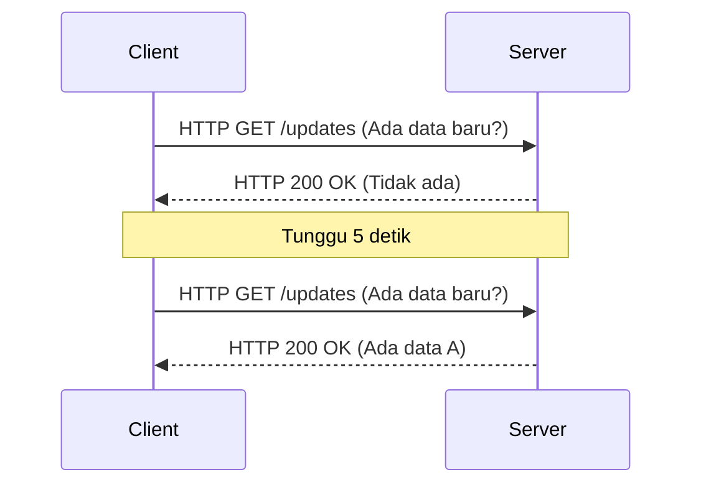
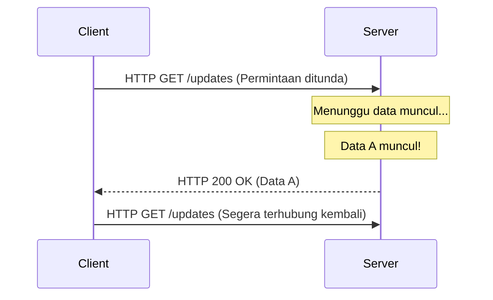
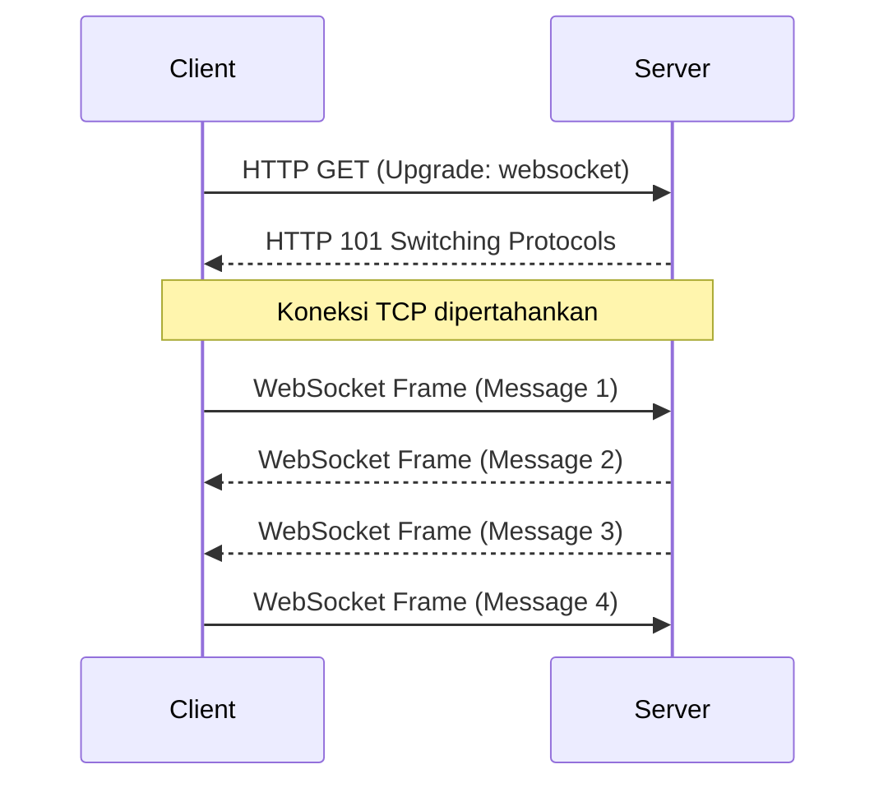
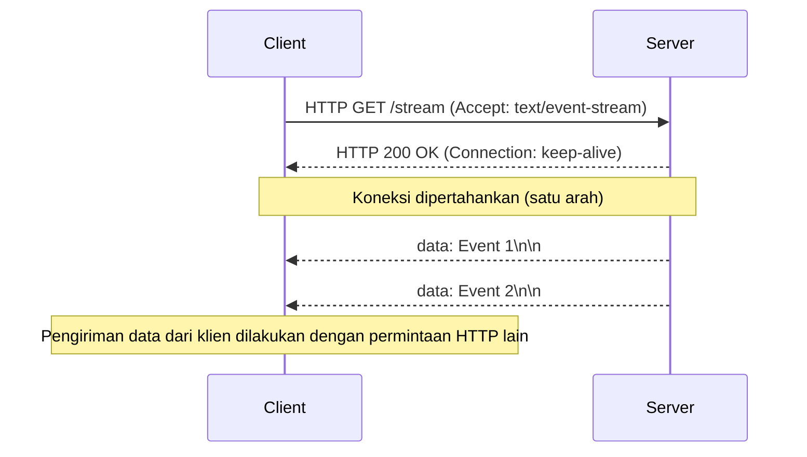

Seiring dengan evolusi aplikasi web dari sekadar kumpulan dokumen statis menjadi platform yang menawarkan pengalaman kaya dan interaktif, "real-time" telah menjadi salah satu persyaratan paling penting. Aplikasi modern yang kita gunakan setiap hari, seperti data tick saham, aplikasi obrolan, pembaruan skor olahraga langsung, game multipemain, atau output log real-time dari jalur CI/CD, bergantung pada mekanisme yang mendorong data dari server ke klien secara instan.

Dalam artikel ini, kita akan membahas secara rinci dua raksasa yang mewujudkan komunikasi real-time ini: **WebSocket** dan **Server-Sent Events (SSE)**. Kita akan mengeksplorasi asal-usulnya, detail protokol, tantangan dalam penskalaan, dan panduan spesifik tentang kapan harus menggunakan masing-masing.

## Keterbatasan HTTP dan Awal Mula Komunikasi Real-time

Untuk benar-benar memahami pentingnya WebSocket dan SSE, pertama-tama kita perlu melihat kembali masalah mendasar yang coba mereka selesaikan, yaitu keterbatasan protokol HTTP tradisional.

### Model Permintaan-Respons Stateless
HTTP (Hypertext Transfer Protocol) mengadopsi model "permintaan-respons" yang ketat, di mana klien mengirimkan permintaan ke server dan server mengembalikan respons. Ini sangat ideal untuk kasus penggunaan awal Web (mengikuti tautan untuk melihat halaman), tetapi tidak mendukung "dorongan server" (server push), di mana server secara aktif memberi tahu klien tentang peristiwa yang terjadi di sisi server.

### Solusi Sementara: Polling
Di era ketika dorongan dari sisi server tidak didukung di tingkat protokol, pengembang menggunakan teknik yang disebut "Polling" untuk menyimulasikan real-time. Ini adalah pendekatan di mana klien berulang kali mengirimkan permintaan ke server pada interval reguler (misalnya setiap 5 detik) untuk bertanya, "Apakah ada data baru?".



Polling memiliki keuntungan karena sangat sederhana untuk diimplementasikan, tetapi memiliki kelemahan yang signifikan:
1. **Peningkatan Overhead**: Karena permintaan dikirim bahkan saat tidak ada pembaruan data, overhead header HTTP menumpuk, membuang bandwidth jaringan dan sumber daya server.
2. **Latensi**: Mungkin ada penundaan hingga interval polling antara saat pembaruan terjadi dan klien mendeteksinya.

### Peningkatan dengan Long-Polling
"Long-polling" dirancang untuk memperbaiki inefisiensi polling. Saat klien mengirimkan permintaan, server "menunda respons (menunggu dengan koneksi terbuka) hingga data baru dibuat". Saat data dihasilkan, respons dikembalikan secara instan, dan klien segera mengirimkan permintaan berikutnya setelah menerima respons.



Meskipun Long-polling berhasil meningkatkan kesegeraan dan mengurangi komunikasi yang tidak perlu, karena ia masih menggunakan kerangka kerja HTTP, overhead header tidak dapat dihindari, dan biaya membangun kembali koneksi setiap kali data dikirim (terutama TLS handshake di lingkungan HTTPS) tetap menjadi masalah yang tidak dapat diabaikan.

---

## WebSocket: Komunikasi Dua Arah Penuh yang Melepaskan Kekuatan TCP

**WebSocket** muncul untuk menyelesaikan masalah ini dari akarnya. Protokol ini, yang distandarisasi dalam RFC 6455, beroperasi di atas TCP seperti HTTP, tetapi mengadopsi pendekatan inovatif yang menembus batasan HTTP.

### Bagaimana Protokol WebSocket Bekerja
Fitur terbesar WebSocket adalah bahwa setelah koneksi dibuat, baik klien maupun server dapat mewujudkan "komunikasi dua arah dupleks penuh" (Full-Duplex) yang memungkinkan mereka untuk mengirim data kapan saja menggunakan frame ringan.

#### 1. HTTP Upgrade (Handshake)
Koneksi WebSocket awalnya dimulai sebagai permintaan HTTP biasa. Klien meminta server untuk "beralih ke protokol WebSocket" menggunakan header `Upgrade`.

**Permintaan dari klien:**
```http
GET /chat HTTP/1.1
Host: server.example.com
Upgrade: websocket
Connection: Upgrade
Sec-WebSocket-Key: dGhlIHNhbXBsZSBub25jZQ==
Sec-WebSocket-Version: 13
```

**Respons dari server:**
Jika server menerima permintaan ini, ia mengembalikan kode status `101 Switching Protocols` dan menyetujui peralihan protokol.
```http
HTTP/1.1 101 Switching Protocols
Upgrade: websocket
Connection: Upgrade
Sec-WebSocket-Accept: s3pPLMBiTxaQ9kYGzzhZRbK+xOo=
```

#### 2. Mulai Komunikasi Frame
Saat handshake ini selesai, perannya sebagai HTTP berakhir, dan koneksi TCP yang mapan berubah menjadi saluran komunikasi dua arah dari frame biner/teks berdasarkan protokol WebSocket. Setelah itu, header HTTP yang berat tidak ditambahkan, dan dimungkinkan untuk mengirim dan menerima data dengan overhead minimal beberapa byte.



### Keunggulan WebSocket
- **Dua Arah Penuh**: Ideal untuk aplikasi di mana klien mengirim data dengan frekuensi tinggi, seperti obrolan dan game online.
- **Overhead Minimal**: Karena tidak ada header HTTP, efisiensi transfer data meningkat secara dramatis.
- **Latensi Rendah**: Karena koneksi selalu terbuka, komunikasi instan dapat terjadi tanpa penundaan handshake.

### Tantangan Penskalaan WebSocket
Namun, karena ini adalah protokol yang kuat, teknik tingkat lanjut diperlukan untuk operasi dan penskalaannya.

1. **Arsitektur Stateful**: Karena WebSocket menjaga koneksi TCP tetap terbuka, server harus menyimpan status setiap koneksi di memori. Untuk menangani "Masalah C10K" dan "Masalah C100K", di mana satu server memproses puluhan ribu hingga ratusan ribu koneksi bersamaan, penggunaan I/O non-blocking berbasis peristiwa (Node.js, Go, Netty, dll.) sangat penting.
2. **Pengaturan Load Balancer dan Proxy**: Banyak load balancer L7 (Nginx, HAProxy, AWS ALB, dll.) memiliki batas waktu siaga (idle timeout) yang secara default memutuskan koneksi setelah waktu tertentu (misalnya, 60 detik). Untuk meneruskan WebSocket dengan benar, Anda harus secara eksplisit mengizinkan peningkatan protokol dan mengatur nilai batas waktu yang panjang, atau mengimplementasikan mekanisme keep-alive menggunakan frame Ping/Pong pada tingkat aplikasi.
3. **Berbagi Status (saat penskalaan horizontal)**: Jika server diskalakan (scale out) ke beberapa mesin, untuk menyampaikan pesan obrolan dalam situasi di mana pengguna A terhubung ke server 1 dan pengguna B terhubung ke server 2, mekanisme untuk menyiarkan pesan antar server (Redis Pub/Sub, RabbitMQ, Kafka, dll.) harus diperkenalkan.

---

## Server-Sent Events (SSE): Streaming Ringan dalam Kerangka HTTP

Jika WebSocket adalah "senjata pamungkas komunikasi dua arah", maka **Server-Sent Events (SSE)** dapat disebut "solusi optimal elegan untuk streaming satu arah". SSE dirumuskan sebagai bagian dari spesifikasi HTML5 dan mengkhususkan diri dalam komunikasi dorong (push communication) dari server ke klien (Server-to-Client).

### Bagaimana Protokol SSE Bekerja
Fitur terbesar dari SSE adalah **ia tidak memperkenalkan protokol baru dan kompleks, melainkan menggunakan kerangka HTTP/1.1 atau HTTP/2 yang ada**.

#### 1. Permintaan HTTP Sederhana
Klien mengirimkan permintaan HTTP GET biasa, tetapi menentukan `text/event-stream` di header `Accept`.

**Permintaan dari klien:**
```http
GET /stream HTTP/1.1
Host: server.example.com
Accept: text/event-stream
Cache-Control: no-cache
```

#### 2. Respons Streaming
Server merespons dengan `Content-Type: text/event-stream` dan terus mengirimkan data peristiwa berbasis teks sebagai chunk tanpa menutup koneksi.

**Respons dari server:**
```http
HTTP/1.1 200 OK
Content-Type: text/event-stream
Cache-Control: no-cache
Connection: keep-alive

data: {"price": 150.25, "symbol": "AAPL"}

event: user_login
data: {"user_id": 12345}

data: Pesan teks biasa
```



### Keunggulan SSE
- **Kesederhanaan dan Kompatibilitas dengan HTTP**: Anda dapat memanfaatkan infrastruktur yang ada (proxy, load balancer, firewall) sebagaimana adanya. Tidak diperlukan pengaturan khusus seperti peningkatan protokol.
- **Koneksi Ulang Otomatis Bawaan**: API `EventSource` yang disediakan oleh browser memiliki fungsionalitas bawaan untuk terhubung kembali secara otomatis ketika koneksi terputus dan untuk melanjutkan dengan memberi tahu server ID peristiwa terakhir yang diterima (`Last-Event-ID`). Untuk mencapai ini di WebSocket, Anda perlu mengimplementasikannya sendiri.
- **Kompatibilitas Baik dengan HTTP/2**: Berkat fitur multiplexing HTTP/2, beberapa streaming SSE dapat ditangani secara bersamaan pada satu koneksi TCP, yang secara drastis meningkatkan kinerja (spesifikasi ekstensi untuk menjalankan WebSocket melalui HTTP/2 belum diadopsi secara luas).

### Keterbatasan SSE
- **Hanya Satu Arah**: Ini khusus untuk komunikasi dari server ke klien. Jika klien ingin mengirim data ke server, permintaan HTTP POST/PUT reguler harus dikeluarkan secara terpisah.
- **Hanya Data Teks**: Secara default, hanya teks UTF-8 yang dapat dikirim. Jika Anda ingin mengirim data biner, Anda perlu memprosesnya dengan pengodean Base64, dll., yang menyebabkan overhead.
- **Batas Koneksi Bersamaan di HTTP/1.1**: Di lingkungan HTTP/1.1 lama, jumlah koneksi bersamaan ke domain yang sama per browser dibatasi hingga 6-8. Membuka SSE di beberapa tab akan mencapai batas ini dan memblokir permintaan lainnya (telah diselesaikan di HTTP/2).

---

## Desain Arsitektur: Mana yang Harus Dipilih?

Tidak ada "peluru perak" dalam desain sistem. Sangat penting untuk memilih teknologi yang tepat sesuai dengan kebutuhan proyek Anda.

### Kapan Menggunakan WebSocket
Jika komunikasi dua arah latensi rendah dan frekuensi tinggi antara klien dan server diperlukan, WebSocket adalah satu-satunya pilihan.

- **Alat Obrolan/Kolaborasi Real-time**: Aplikasi pengeditan kolaboratif seperti Slack, Discord, Google Docs.
- **Game Multipemain**: Membutuhkan komunikasi dua arah latensi rendah tingkat milidetik, seperti koordinat posisi dan tindakan pemain.
- **Telemetri IoT Frekuensi Tinggi**: Sistem yang terus-menerus mengambil data dari banyak perangkat dan mendorong perintah pada saat yang bersamaan.

### Kapan Menggunakan SSE
Dalam kasus penggunaan di mana "klien hanya menerima data (atau klien jarang mengirim data)", SSE direkomendasikan karena secara dramatis mengurangi biaya implementasi dan operasi.

- **Dasbor/Pemantauan Real-time**: Ticker saham, pemantauan sumber daya server, tampilan log streaming.
- **Umpan Berita/Sistem Notifikasi**: Pembaruan timeline SNS dan notifikasi push dari sistem.
- **Pembuatan Respons AI/LLM**: Dalam aplikasi LLM seperti ChatGPT, teks yang dihasilkan disiarkan (streaming) ke klien secara berurutan (ini adalah contoh bagus tentang bagaimana SSE saat ini digunakan di banyak aplikasi AI).

### Ringkasan Perbandingan

| Fitur | WebSocket | Server-Sent Events (SSE) |
| :--- | :--- | :--- |
| **Arah Komunikasi** | Full-Duplex (Dua arah) | Satu arah (Server → Klien) |
| **Format Data** | Biner / Teks | Hanya Teks (UTF-8) |
| **Protokol** | Kustom (melalui TCP, via HTTP Upgrade) | HTTP/1.1, HTTP/2 |
| **Koneksi Ulang Otomatis** | Tidak ada (butuh implementasi sendiri) | Ada (Fitur standar EventSource API) |
| **Kompatibilitas Infrastruktur** | Rendah (butuh konfigurasi khusus LB/Proxy) | Tinggi (diperlakukan sebagai HTTP standar) |
| **Biaya Implementasi** | Tinggi (pustaka komunikasi, manajemen status kompleks) | Rendah (perluasan titik akhir HTTP yang ada) |

## Kesimpulan

Dalam evolusi web real-time, WebSocket dan SSE bukanlah saling menyingkirkan, melainkan hubungan pelengkap yang sangat baik.

Pilihan mudah "pokoknya pakai WebSocket" memiliki risiko membuat infrastruktur menjadi kompleks dan meningkatkan biaya pemeliharaan. Jika kasus penggunaannya adalah klien jarang mengirim data ke server (misalnya, tindakan klien dilakukan melalui REST API biasa dan hanya menerima siaran hasilnya), maka mengadopsi SSE dapat menjaga arsitektur tetap sederhana dan memaksimalkan manfaat ekosistem HTTP yang ada.

Menganalisis persyaratan sistem (arah, frekuensi, tipe data, lingkungan infrastruktur) dengan tenang dan memilih teknologi yang tepat di tempat yang tepat akan menjadi kunci untuk membangun aplikasi modern yang kuat dan terukur.
