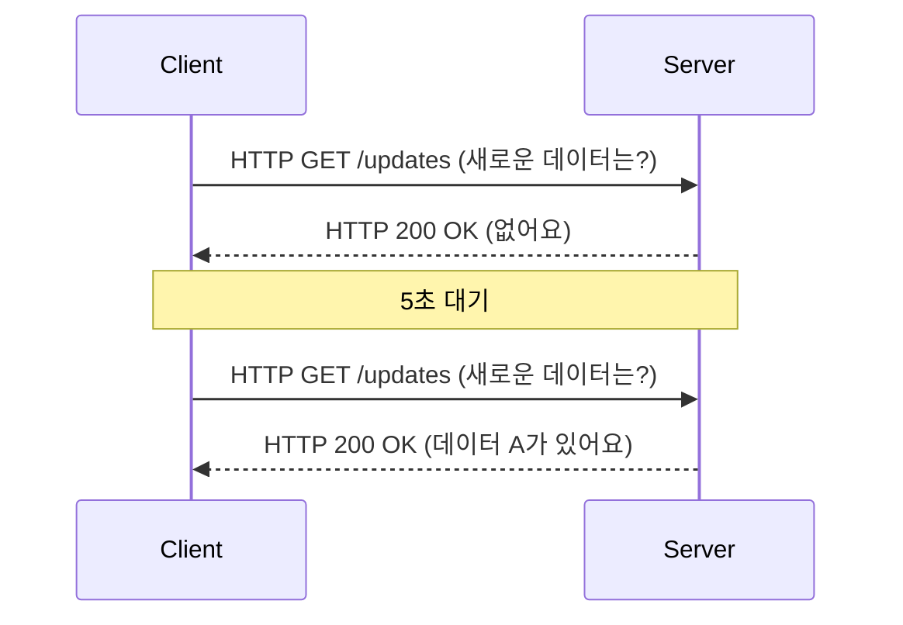
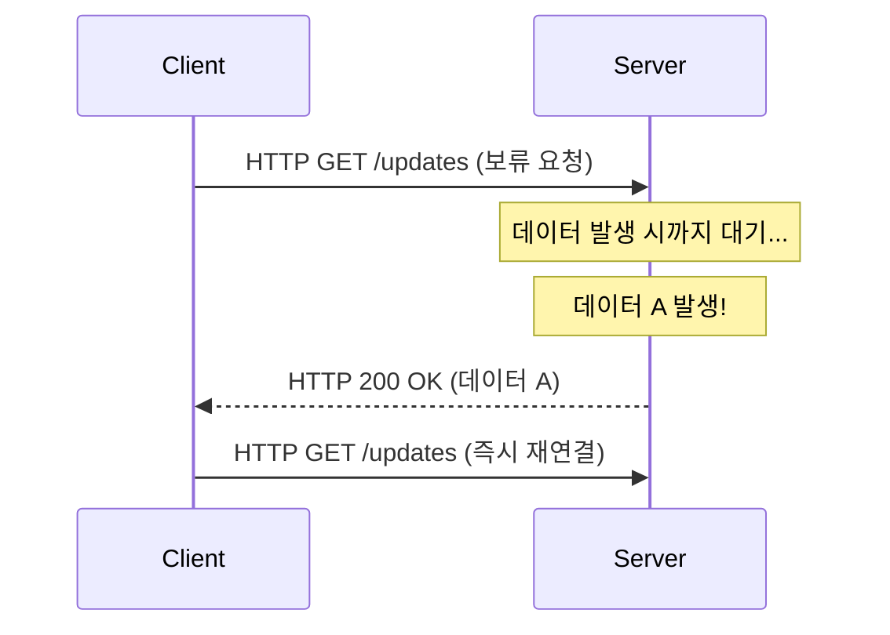
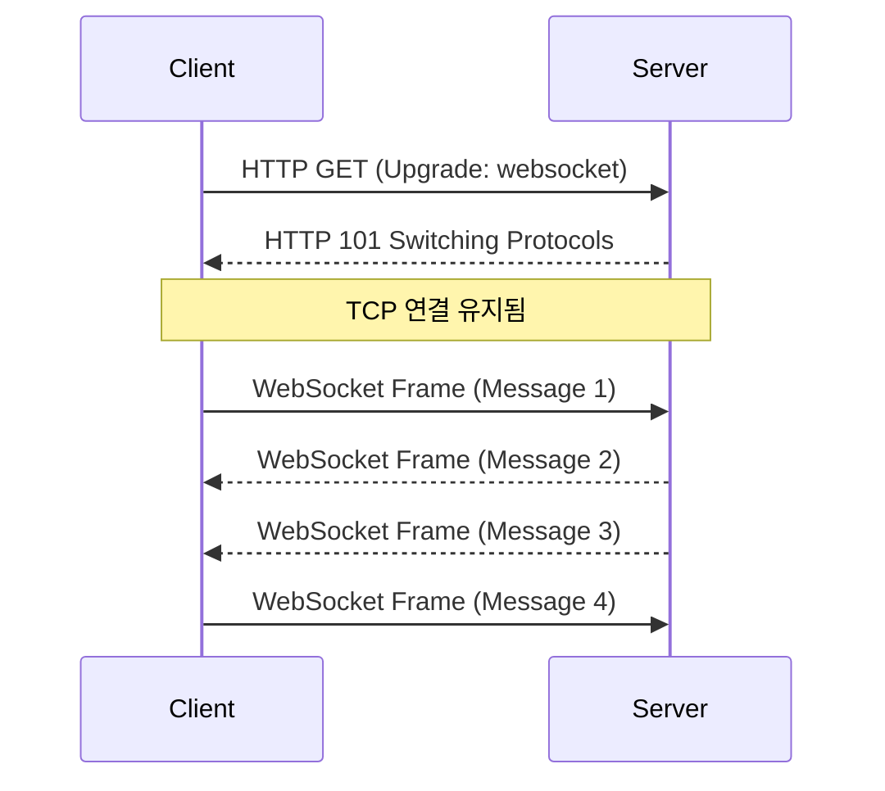
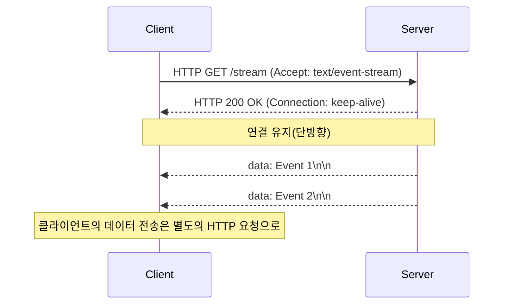

웹 애플리케이션이 단순한 정적 문서의 집합이었던 시대에서 풍부하고 인터랙티브한 경험을 제공하는 플랫폼으로 진화하면서, "실시간성"은 가장 중요한 요구 사항 중 하나가 되었습니다. 주식 틱 데이터, 채팅 애플리케이션, 실시간 스포츠 점수 업데이트, 멀티플레이어 게임 또는 CI/CD 파이프라인의 실시간 로그 출력 등 우리가 매일 사용하는 모던 애플리케이션은 서버에서 클라이언트로 즉시 데이터를 푸시하는 메커니즘에 의존합니다.

본 기사에서는 이러한 실시간 통신을 구현하는 두 거장인 **WebSocket**과 **Server-Sent Events (SSE)**에 대해 그 기원, 프로토콜의 세부 사항, 스케일링 과제, 그리고 구체적인 사용 기준을 매우 상세히 설명합니다.

## HTTP의 한계와 실시간 통신의 여명기

WebSocket이나 SSE의 중요성을 진정으로 이해하기 위해서는, 먼저 그것들이 해결하고자 했던 근본적인 문제, 즉 기존 HTTP 프로토콜의 한계에 대해 되돌아볼 필요가 있습니다.

### 상태 비저장(Stateless) 요청-응답 모델
HTTP(Hypertext Transfer Protocol)는 클라이언트가 서버에 요청을 보내고 서버가 응답을 반환하는 엄격한 "요청-응답형" 모델을 채택하고 있습니다. 이는 웹의 초기 사용 사례(링크를 따라 페이지를 탐색하는 것)에는 최적이었지만, 서버 측에서 발생한 이벤트를 능동적으로 클라이언트에게 알리는 "서버 푸시"에는 대응하지 않습니다.

### 폴링(Polling)이라는 고육지책
서버 측에서의 푸시가 프로토콜 수준에서 지원되지 않던 시대에 개발자들은 "폴링(Polling)"이라는 기법을 사용하여 실시간성을 유사하게 구현했습니다. 이는 클라이언트가 일정 간격(예: 5초마다)으로 서버에 "새로운 데이터가 있습니까?"라는 요청을 반복해서 보내는 접근 방식입니다.



폴링은 구현이 매우 간단하다는 장점이 있지만 다음과 같은 중대한 단점을 안고 있습니다.
1. **오버헤드 증가**: 데이터 업데이트가 없는 경우에도 요청이 전송되기 때문에 HTTP 헤더의 오버헤드가 축적되어 네트워크 대역폭과 서버 리소스를 낭비합니다.
2. **지연 시간(Latency)**: 업데이트가 발생한 후 클라이언트가 이를 감지하기까지 최대 폴링 간격만큼의 지연이 발생합니다.

### 롱 폴링(Long-Polling)을 통한 개선
폴링의 비효율성을 개선하기 위해 고안된 것이 "롱 폴링"입니다. 클라이언트가 요청을 보내면 서버는 "새로운 데이터가 발생할 때까지 응답을 보류(연결을 열어둔 채로 대기)"합니다. 데이터가 발생한 순간에 응답을 반환하고, 클라이언트는 응답을 받으면 즉시 다음 요청을 보냅니다.



롱 폴링은 즉시성 향상과 불필요한 통신 절감에 성공했지만, 여전히 HTTP의 틀을 사용하고 있기 때문에 헤더의 오버헤드는 피할 수 없으며 데이터 전송마다 연결을 다시 설정하는 비용(특히 HTTPS 환경 하의 TLS 핸드셰이크)이 무시할 수 없는 과제로 남았습니다.

---

## WebSocket: TCP의 힘을 해방하는 완전 양방향 통신

이러한 문제들을 근본적으로 해결하기 위해 등장한 것이 **WebSocket**입니다. RFC 6455로 표준화된 이 프로토콜은 HTTP와 마찬가지로 TCP 위에서 동작하지만, HTTP의 한계를 돌파하는 혁신적인 접근 방식을 채택하고 있습니다.

### WebSocket 프로토콜의 원리
WebSocket의 가장 큰 특징은, 일단 연결을 설정하면 클라이언트와 서버 양측이 임의의 타이밍에 경량 프레임을 사용하여 데이터를 전송할 수 있는 "전이중(Full-Duplex) 양방향 통신"을 구현하고 있다는 점입니다.

#### 1. HTTP Upgrade (핸드셰이크)
WebSocket의 연결은 처음에는 일반적인 HTTP 요청으로 시작됩니다. 클라이언트는 `Upgrade` 헤더를 사용하여 서버에게 "WebSocket 프로토콜로의 전환"을 요청합니다.

**클라이언트의 요청:**
```http
GET /chat HTTP/1.1
Host: server.example.com
Upgrade: websocket
Connection: Upgrade
Sec-WebSocket-Key: dGhlIHNhbXBsZSBub25jZQ==
Sec-WebSocket-Version: 13
```

**서버의 응답:**
서버가 이 요청을 수락하면 `101 Switching Protocols`라는 상태 코드를 반환하고 프로토콜 전환에 동의합니다.
```http
HTTP/1.1 101 Switching Protocols
Upgrade: websocket
Connection: Upgrade
Sec-WebSocket-Accept: s3pPLMBiTxaQ9kYGzzhZRbK+xOo=
```

#### 2. 프레임 통신의 시작
이 핸드셰이크가 완료되는 순간 HTTP로서의 역할은 끝나고, 확립된 TCP 연결은 WebSocket 프로토콜에 의한 바이너리/텍스트 프레임의 양방향 통신 채널로 변모합니다. 이후에는 무거운 HTTP 헤더가 추가되지 않으며, 몇 바이트의 최소 오버헤드로 데이터 송수신이 가능해집니다.



### WebSocket의 강점
- **완전한 양방향성**: 채팅이나 온라인 게임 등 클라이언트에서도 고빈도로 데이터를 전송하는 용도에 최적입니다.
- **극소의 오버헤드**: HTTP 헤더가 없기 때문에 데이터 전송 효율이 극적으로 향상됩니다.
- **낮은 지연 시간**: 상시 연결되어 있기 때문에 핸드셰이크의 지연 없이 즉시 통신할 수 있습니다.

### WebSocket의 스케일링 과제
그러나 강력한 프로토콜이기 때문에 운영 및 스케일링에는 고도의 기술이 요구됩니다.

1. **상태 저장(Stateful) 아키텍처**: WebSocket은 TCP 연결을 계속 유지하기 때문에 서버는 각 연결의 상태를 메모리에 유지해야 합니다. 1대의 서버에서 수만~수십만 개의 동시 연결을 처리하는 "C10K 문제", "C100K 문제"에 대처하기 위해 이벤트 기반 논블로킹 I/O(Node.js, Go, Netty 등)의 채택이 필수적입니다.
2. **로드 밸런서 및 프록시 설정**: 많은 L7 로드 밸런서(Nginx, HAProxy, AWS ALB 등)는 기본적으로 연결을 일정 시간(예: 60초) 내에 끊는 유휴 시간 초과가 설정되어 있습니다. WebSocket을 올바르게 중계하려면 프로토콜 업그레이드를 명시적으로 허용하고 시간 초과 값을 길게 설정하거나, 애플리케이션 수준에서 Ping/Pong 프레임을 사용한 Keep-Alive 메커니즘을 구현해야 합니다.
3. **상태 공유(수평 스케일 아웃 시)**: 서버를 여러 대로 스케일 아웃한 경우 사용자 A가 서버 1에, 사용자 B가 서버 2에 연결되어 있는 상황에서 채팅 메시지를 전달하려면, 서버 간에 메시지를 브로드캐스트하는 메커니즘(Redis Pub/Sub, RabbitMQ, Kafka 등)을 도입해야 합니다.

---

## Server-Sent Events (SSE): HTTP의 틀로 구현하는 경량 스트리밍

WebSocket이 "양방향 통신의 최종 병기"라면, **Server-Sent Events (SSE)**는 "단방향 스트리밍의 우아한 최적해"라고 할 수 있습니다. SSE는 HTML5 사양의 일부로 제정되었으며, 서버에서 클라이언트로의 푸시 통신(Server-to-Client)에 특화되어 있습니다.

### SSE 프로토콜의 원리
SSE의 가장 큰 특징은 **새롭고 복잡한 프로토콜을 도입하는 것이 아니라 기존 HTTP/1.1이나 HTTP/2의 틀을 그대로 이용하고 있다는 점**입니다.

#### 1. 단순한 HTTP 요청
클라이언트는 일반적인 HTTP GET 요청을 보내지만, `Accept` 헤더에 `text/event-stream`을 지정합니다.

**클라이언트의 요청:**
```http
GET /stream HTTP/1.1
Host: server.example.com
Accept: text/event-stream
Cache-Control: no-cache
```

#### 2. 스트리밍 응답
서버는 `Content-Type: text/event-stream`을 반환하고 연결을 닫지 않은 채 텍스트 기반 이벤트 데이터를 청크로 계속 전송합니다.

**서버의 응답:**
```http
HTTP/1.1 200 OK
Content-Type: text/event-stream
Cache-Control: no-cache
Connection: keep-alive

data: {"price": 150.25, "symbol": "AAPL"}

event: user_login
data: {"user_id": 12345}

data: 단순한 텍스트 메시지
```



### SSE의 강점
- **단순성과 HTTP와의 친화성**: 기존 인프라(프록시, 로드 밸런서, 방화벽)를 그대로 활용할 수 있습니다. 프로토콜 업그레이드 등의 특수한 설정이 불필요합니다.
- **자동 재연결 내장**: 브라우저가 제공하는 `EventSource` API에는 연결이 끊어졌을 때의 자동 재연결 기능이나, 마지막으로 받은 이벤트 ID(`Last-Event-ID`)를 서버에 전달하여 재개하는 메커니즘이 표준으로 갖추어져 있습니다. WebSocket으로 이를 구현하려면 자체적인 구현이 필요합니다.
- **HTTP/2와의 우수한 호환성**: HTTP/2의 멀티플렉스 기능으로 1개의 TCP 연결 상에서 여러 SSE 스트림을 동시에 처리할 수 있어 성능이 극적으로 향상됩니다(WebSocket은 HTTP/2 위에서 동작하기 위한 확장 사양이 아직 널리 보급되지 않았습니다).

### SSE의 제약
- **단방향만 가능**: 서버에서 클라이언트로의 통신 전용입니다. 클라이언트에서 서버로 데이터를 보낼 경우에는 별도의 일반적인 HTTP POST/PUT 요청을 발생시켜야 합니다.
- **텍스트 데이터만 가능**: 기본적으로 UTF-8 텍스트만 보낼 수 있습니다. 바이너리 데이터를 보낼 경우에는 Base64 인코딩 등의 처리가 필요해져 오버헤드가 발생합니다.
- **HTTP/1.1에서의 동시 연결 수 제한**: 오래된 HTTP/1.1 환경에서는 브라우저별로 동일 도메인에 대한 동시 연결 수가 6~8개로 제한되어 있기 때문에 여러 탭에서 SSE를 열면 한도에 도달하여 다른 요청이 차단되는 문제가 있었습니다(HTTP/2에서 해결됨).

---

## 아키텍처 설계: 어느 것을 선택해야 할까?

시스템 설계에 있어 "은탄환(Silver Bullet)"은 존재하지 않습니다. 프로젝트의 요구 사항에 따라 적절한 기술을 선택하는 것이 중요합니다.

### WebSocket을 도입해야 하는 경우
클라이언트·서버 간에 고빈도 및 저지연의 상호 작용이 요구되는 경우에는 WebSocket이 유일한 선택이 됩니다.

- **실시간 채팅 / 협업 툴**: Slack, Discord, Google Docs와 같은 공동 편집 앱.
- **멀티플레이어 게임**: 위치 좌표나 플레이어의 액션 등 밀리초 단위의 저지연 양방향 통신이 필요.
- **고빈도 IoT 원격 측정**: 다수의 장치로부터 연속적으로 데이터를 흡수하고 동시에 명령을 푸시하는 시스템.

### SSE를 도입해야 하는 경우
"클라이언트는 데이터를 받기만 한다(또는 클라이언트로부터의 전송 빈도가 낮다)"라는 사용 사례에서는 구현 및 운영 비용을 극적으로 낮추는 SSE가 권장됩니다.

- **실시간 대시보드 / 모니터링**: 주가의 티커, 서버의 리소스 모니터링, 로그의 스트리밍 표시.
- **뉴스 피드 / 알림 시스템**: SNS의 타임라인 업데이트나 시스템에서의 푸시 알림.
- **AI/LLM의 응답 생성**: ChatGPT와 같은 LLM 애플리케이션에서 생성 중인 텍스트를 순차적으로 클라이언트에 스트리밍(이것은 바로 현재 많은 AI 앱에서 SSE가 활용되고 있는 좋은 예입니다).

### 비교 요약

| 특징 | WebSocket | Server-Sent Events (SSE) |
| :--- | :--- | :--- |
| **통신 방향** | 전이중 (양방향) | 단방향 (서버 → 클라이언트) |
| **데이터 포맷** | 바이너리 / 텍스트 | 텍스트 (UTF-8)만 가능 |
| **프로토콜** | 독자적 (TCP 위, HTTP Upgrade 경유) | HTTP/1.1, HTTP/2 |
| **자동 재연결** | 없음 (자체 구현 필요) | 있음 (EventSource API 표준 기능) |
| **인프라 친화성** | 낮음 (LB/Proxy의 특별한 설정 필요) | 높음 (표준적인 HTTP로 취급됨) |
| **구현 비용** | 높음 (통신 라이브러리, 상태 관리가 복잡) | 낮음 (기존 HTTP 엔드포인트의 연장) |

## 결론

실시간 웹의 진화에 있어 WebSocket과 SSE는 어느 한쪽이 다른 한쪽을 구축하는 것이 아니라, 훌륭한 보완 관계에 있습니다.

"일단 WebSocket"이라는 안일한 선택은 인프라의 복잡화와 유지 보수 비용의 증대를 초래할 위험성이 있습니다. 클라이언트에서 서버로의 데이터 전송이 드문 사용 사례(예를 들어, 클라이언트에서의 액션은 일반적인 REST API로 수행하고 그 결과의 브로드캐스트만 받는 경우)라면, SSE를 채택함으로써 아키텍처를 단순하게 유지하고 기존 HTTP 생태계의 혜택을 최대한 누릴 수 있습니다.

시스템의 요구 사항(방향성, 빈도, 데이터 형식, 인프라 환경)을 냉정하게 분석하고 적재적소에서 기술을 선택하는 것이 견고하고 확장 가능한 모던 애플리케이션을 구축하는 열쇠가 될 것입니다.
