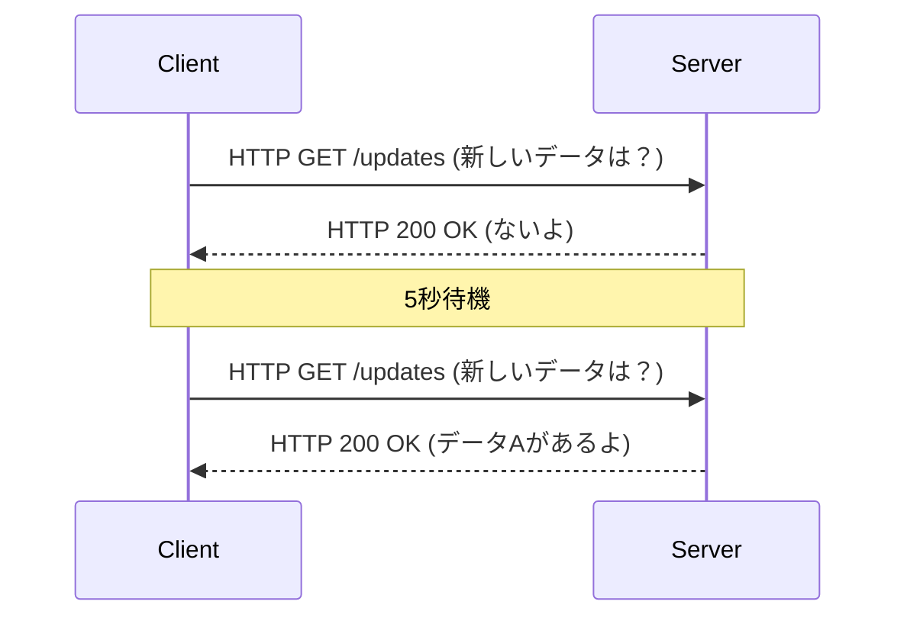
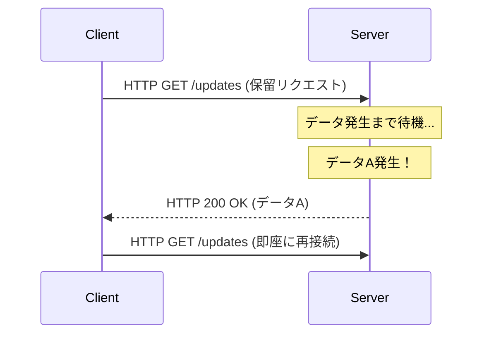
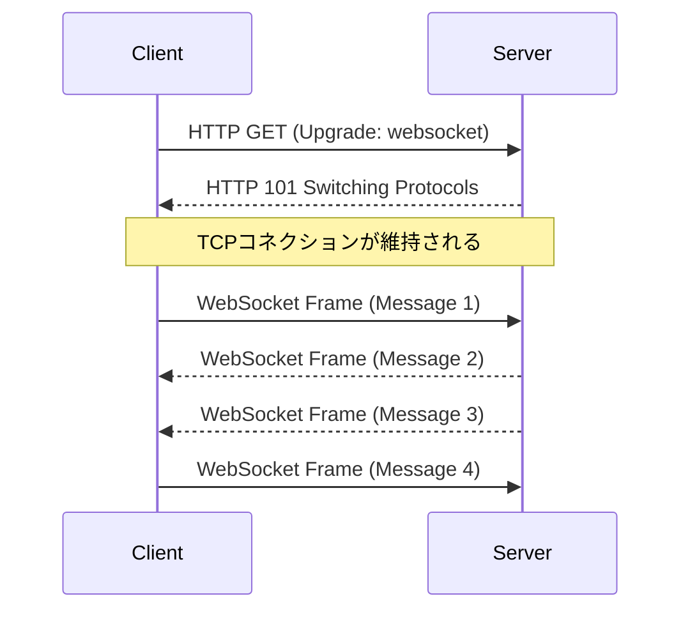
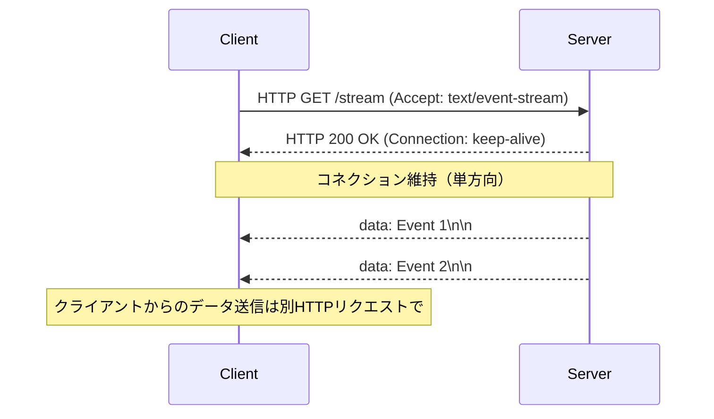

ウェブアプリケーションが単なる静的なドキュメントの集まりであった時代から、リッチでインタラクティブな体験を提供するプラットフォームへと進化を遂げる中で、「リアルタイム性」は最も重要な要件の一つとなりました。株式のティックデータ、チャットアプリケーション、ライブスポーツのスコア更新、マルチプレイヤーゲーム、あるいはCI/CDパイプラインのリアルタイムログ出力など、私たちが日々利用するモダンなアプリケーションは、サーバーからクライアントへ瞬時にデータをプッシュする仕組みに依存しています。

本記事では、このリアルタイム通信を実現するための二大巨頭である **WebSocket** と **Server-Sent Events (SSE)** について、その成り立ち、プロトコルの詳細、スケーリングにおける課題、そして具体的な使い分けの指針を極めて詳細に解説します。

## HTTPの限界とリアルタイム通信の黎明期

WebSocketやSSEの重要性を真に理解するためには、まずそれらが解決しようとした根本的な問題、すなわち従来のHTTPプロトコルの限界について振り返る必要があります。

### ステートレスなリクエスト・レスポンスモデル
HTTP（Hypertext Transfer Protocol）は、クライアントがサーバーにリクエストを送信し、サーバーがレスポンスを返すという、厳密な「リクエスト・レスポンス型」のモデルを採用しています。これはWebの初期のユースケース（リンクを辿ってページを閲覧する）には最適でしたが、サーバー側で発生したイベントを能動的にクライアントへ知らせる「サーバープッシュ」には対応していません。

### ポーリング（Polling）の苦肉の策
サーバー側からのプッシュがプロトコルレベルでサポートされていない時代、開発者は「ポーリング（Polling）」と呼ばれる手法を用いてリアルタイム性を擬似的に実現していました。これは、クライアントが一定間隔（例：5秒ごと）でサーバーに「新しいデータはありますか？」とリクエストを繰り返し送信するアプローチです。



ポーリングは実装が極めてシンプルであるという利点がありますが、以下のような重大な欠点を抱えています。
1. **オーバーヘッドの増大**: データ更新がない場合でもリクエストが送信されるため、HTTPヘッダーのオーバーヘッドが蓄積し、ネットワーク帯域とサーバーのリソースを無駄に消費します。
2. **レイテンシ**: 更新が発生してからクライアントがそれを検知するまでに、最大でポーリング間隔分の遅延が生じます。

### ロングポーリング（Long-Polling）による改善
ポーリングの非効率性を改善するために考案されたのが「ロングポーリング」です。クライアントがリクエストを送信すると、サーバーは「新しいデータが発生するまで、レスポンスを保留（コネクションを開いたまま待機）」します。データが発生した瞬間にレスポンスを返し、クライアントはレスポンスを受け取ると即座に次のリクエストを送信します。



ロングポーリングは即時性の向上と無駄な通信の削減に成功しましたが、依然としてHTTPの枠組みを使用しているため、ヘッダーのオーバーヘッドは避けられず、データ送信のたびにコネクションを確立し直すコスト（特にHTTPS環境下のTLSハンドシェイク）が無視できない課題として残りました。

---

## WebSocket：TCPの力を解放する完全双方向通信

これらの問題を根本から解決するために登場したのが **WebSocket** です。RFC 6455で標準化されたこのプロトコルは、HTTPと同じくTCP上で動作しますが、HTTPの制限を打ち破る革新的なアプローチを採用しています。

### WebSocketプロトコルの仕組み
WebSocketの最大の特徴は、一度コネクションを確立すれば、クライアントとサーバーの双方が、任意のタイミングで、軽量なフレームを用いてデータを送信できる「全二重（Full-Duplex）双方向通信」を実現している点です。

#### 1. HTTP Upgrade（ハンドシェイク）
WebSocketの接続は、最初は通常のHTTPリクエストとして始まります。クライアントは、`Upgrade` ヘッダーを用いてサーバーに対し「WebSocketプロトコルへの切り替え」を要求します。

**クライアントからのリクエスト:**
```http
GET /chat HTTP/1.1
Host: server.example.com
Upgrade: websocket
Connection: Upgrade
Sec-WebSocket-Key: dGhlIHNhbXBsZSBub25jZQ==
Sec-WebSocket-Version: 13
```

**サーバーからのレスポンス:**
サーバーがこの要求を受け入れると、`101 Switching Protocols` というステータスコードを返し、プロトコルの切り替えに合意します。
```http
HTTP/1.1 101 Switching Protocols
Upgrade: websocket
Connection: Upgrade
Sec-WebSocket-Accept: s3pPLMBiTxaQ9kYGzzhZRbK+xOo=
```

#### 2. フレーム通信の開始
このハンドシェイクが完了した瞬間、HTTPとしての役割は終わりを告げ、確立されたTCPコネクションはWebSocketプロトコルによるバイナリ/テキストフレームの双方向通信チャネルへと変貌します。以降は重いHTTPヘッダーは付加されず、数バイトの最小限のオーバーヘッドでデータの送受信が可能になります。



### WebSocketの強み
- **完全な双方向性**: チャットやオンラインゲームなど、クライアントからも高頻度でデータを送信する用途に最適です。
- **極小のオーバーヘッド**: HTTPヘッダーがないため、データ転送効率が劇的に向上します。
- **低レイテンシ**: 常時接続されているため、ハンドシェイクの遅延なしに即座に通信できます。

### WebSocketのスケーリング課題
しかし、強力なプロトコルであるゆえに、運用やスケーリングには高度な技術が要求されます。

1. **ステートフルなアーキテクチャ**: WebSocketはTCPコネクションを維持し続けるため、サーバーは各コネクションの状態をメモリ上に保持する必要があります。1台のサーバーで数万〜数十万の同時接続を処理する「C10K問題」「C100K問題」に対処するため、イベント駆動型ノンブロッキングI/O（Node.js, Go, Nettyなど）の採用が不可欠です。
2. **ロードバランサーとプロキシの設定**: 多くのL7ロードバランサー（Nginx, HAProxy, AWS ALB等）は、デフォルトでコネクションを一定時間（例：60秒）で切断するアイドルタイムアウトが設定されています。WebSocketを正しく中継するには、プロトコルのアップグレードを明示的に許可し、タイムアウト値を長く設定するか、アプリケーションレベルでのPing/Pongフレームを用いたキープアライブ機構を実装する必要があります。
3. **ステートの共有（水平スケール時）**: サーバーを複数台にスケールアウトした場合、ユーザーAがサーバー1に、ユーザーBがサーバー2に接続している状況でチャットメッセージを届けるには、サーバー間でメッセージをブロードキャストする仕組み（Redis Pub/Sub, RabbitMQ, Kafkaなど）を導入しなければなりません。

---

## Server-Sent Events (SSE)：HTTPの枠組みで実現する軽量ストリーミング

WebSocketが「双方向通信の最終兵器」であるとすれば、**Server-Sent Events (SSE)** は「単方向ストリーミングのエレガントな最適解」と言えます。SSEはHTML5の仕様の一部として策定され、サーバーからクライアントへのプッシュ通信（Server-to-Client）に特化しています。

### SSEプロトコルの仕組み
SSEの最大の特徴は、**新しく複雑なプロトコルを導入するのではなく、既存のHTTP/1.1やHTTP/2の枠組みをそのまま利用している点**です。

#### 1. 単純なHTTPリクエスト
クライアントは通常のHTTP GETリクエストを送信しますが、`Accept` ヘッダーに `text/event-stream` を指定します。

**クライアントからのリクエスト:**
```http
GET /stream HTTP/1.1
Host: server.example.com
Accept: text/event-stream
Cache-Control: no-cache
```

#### 2. ストリーミングレスポンス
サーバーは `Content-Type: text/event-stream` を返し、コネクションを閉じることなく、テキストベースのイベントデータをチャンクとして送信し続けます。

**サーバーからのレスポンス:**
```http
HTTP/1.1 200 OK
Content-Type: text/event-stream
Cache-Control: no-cache
Connection: keep-alive

data: {"price": 150.25, "symbol": "AAPL"}

event: user_login
data: {"user_id": 12345}

data: 単なるテキストメッセージ
```



### SSEの強み
- **シンプルさとHTTPとの親和性**: 既存のインフラ（プロキシ、ロードバランサー、ファイアウォール）をそのまま活用できます。プロトコルのアップグレード等の特殊な設定が不要です。
- **自動再接続の組み込み**: ブラウザが提供する `EventSource` APIには、接続が切れた際の自動再接続機能や、最後に受け取ったイベントID（`Last-Event-ID`）をサーバーに伝えてレジュームする仕組みが標準で備わっています。WebSocketでこれを実現するには自前での実装が必要です。
- **HTTP/2との相性の良さ**: HTTP/2のマルチプレックス機能により、1つのTCPコネクション上で複数のSSEストリームを同時に扱うことができ、パフォーマンスが劇的に向上します（WebSocketはHTTP/2上で動かすための拡張仕様がまだ広く普及していません）。

### SSEの制約
- **単方向のみ**: サーバーからクライアントへの通信専用です。クライアントからサーバーへデータを送る場合は、別途通常のHTTP POST/PUTリクエストを発行する必要があります。
- **テキストデータのみ**: デフォルトではUTF-8のテキストしか送れません。バイナリデータを送る場合はBase64エンコード等の処理が必要になり、オーバーヘッドが生じます。
- **HTTP/1.1における同時接続数の制限**: 古いHTTP/1.1環境では、ブラウザごとの同一ドメインに対する同時接続数が6〜8に制限されているため、複数タブでSSEを開くと上限に達し、他のリクエストがブロックされる問題がありました（HTTP/2で解決済み）。

---

## アーキテクチャ設計：どちらを選択すべきか？

システム設計において「銀の弾丸」は存在しません。プロジェクトの要件に応じて、適切な技術を選択することが重要です。

### WebSocketを採用すべきケース
クライアント・サーバー間で高頻度かつ低遅延な相互やり取りが求められる場合は、WebSocket一択となります。

- **リアルタイムチャット/コラボレーションツール**: Slack、Discord、Google Docsのような共同編集アプリ。
- **マルチプレイヤーゲーム**: 位置座標やプレイヤーのアクションなど、ミリ秒単位での低遅延な双方向通信が必要。
- **高頻度なIoTテレメトリ**: 多数のデバイスから連続的にデータを吸い上げ、同時にコマンドをプッシュするシステム。

### SSEを採用すべきケース
「クライアントはデータを受け取るだけ（あるいはクライアントからの送信頻度が低い）」というユースケースでは、実装と運用のコストを劇的に下げるSSEが推奨されます。

- **リアルタイムダッシュボード/モニタリング**: 株価のティッカー、サーバーのリソース監視、ログのストリーミング表示。
- **ニュースフィード/通知システム**: SNSのタイムライン更新や、システムからのプッシュ通知。
- **AI/LLMのレスポンス生成**: ChatGPTのようなLLMアプリケーションにおいて、生成中のテキストを逐次クライアントにストリーミングする（これはまさに現在多くのAIアプリでSSEが活用されている好例です）。

### 比較まとめ

| 特徴 | WebSocket | Server-Sent Events (SSE) |
| :--- | :--- | :--- |
| **通信方向** | 全二重（双方向） | 単方向（サーバー → クライアント） |
| **データフォーマット** | バイナリ / テキスト | テキスト（UTF-8）のみ |
| **プロトコル** | 独自（TCP上, HTTP Upgrade経由） | HTTP/1.1, HTTP/2 |
| **自動再接続** | なし（自前実装が必要） | あり（EventSource API標準機能） |
| **インフラ親和性** | 低（LB/Proxyの特別な設定が必要） | 高（標準的なHTTPとして扱われる） |
| **実装コスト** | 高（通信ライブラリ、状態管理が複雑） | 低（既存のHTTPエンドポイントの延長） |

## 結論

リアルタイムWebの進化において、WebSocketとSSEはどちらかがどちらかを駆逐するものではなく、見事な補完関係にあります。

「とりあえずWebSocket」という安易な選択は、インフラの複雑化と保守コストの増大を招く危険性があります。クライアントからサーバーへのデータ送信が稀なユースケース（例えば、クライアントからのアクションは通常のREST APIで行い、その結果のブロードキャストだけを受け取る）であれば、SSEを採用することで、アーキテクチャをシンプルに保ち、既存のHTTPエコシステムの恩恵を最大限に受けることができます。

システムの要件（方向性、頻度、データ型、インフラ環境）を冷静に分析し、適材適所で技術を選択することが、堅牢でスケーラブルなモダンアプリケーションを構築する鍵となるでしょう。
